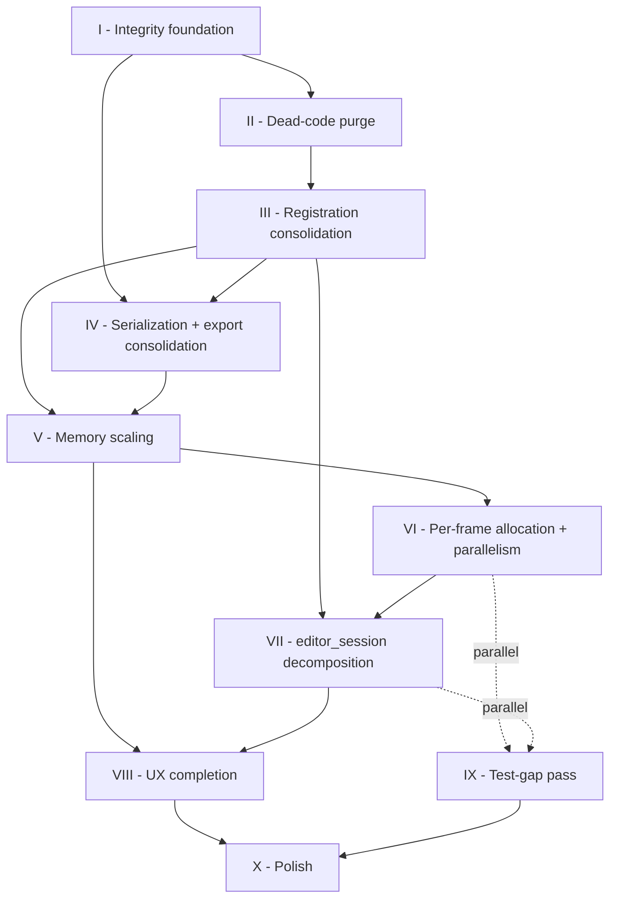

# Implementation Plan

A sequenced plan for working through [`IMPROVEMENTS.md`](IMPROVEMENTS.md). The register lists what needs fixing; this plan sequences *when* and *how to verify*, with items sorted inside each phase by importance (most-harmful / highest-leverage first).

## Current state

**Phase I: ✅ COMPLETE.** All 11 items landed. **Phase II: ✅ COMPLETE.** All 7 items landed (II.6 absorbed by I.6). **Full repo test suite: 665/665 green.** Ready to begin **Phase III — Registration consolidation** when signalled.

| Item | Status | Summary |
|---|---|---|
| II.1 Delete `SuperResolutionService` scaffold | ✅ done | Deleted `lib/ai/services/super_resolution/super_resolution_service.dart` + `test/ai/super_resolution_service_test.dart` (−4 tests). No live code imported the scaffold. Guide ch 21 cleaned up. |
| I.1 Atomic write | ✅ done | `lib/core/io/atomic_file.dart` + 14 tests; `ProjectStore` + `ScanRepository` route through it. |
| I.2 Schema versioning | ✅ done | `SchemaMigrator` helper applied to all 4 stores; `PresetRepository` has `onUpgrade` stub. +10 helper tests, +8 store-migration tests. |
| I.3 Collage persistence | ✅ done | `CollageRepository` + `CollageState.toJson`/`fromJson`; debounced auto-save + hydrate on page open. 13 tests. |
| I.4 `setTemplate` preservation | ✅ done | `CollageState.imageHistory` is the new source of truth; dropped cells survive template switches. 13 notifier tests. |
| I.5 sha256 pinning (LaMa + RMBG) | ✅ done | Real hashes + exact byte sizes pinned in `manifest.json` (via HF `X-Linked-ETag`). 8 `ModelDownloader` integrity tests including a tampered-payload case. |
| I.6 Remove/wire `colorization_siggraph` | ✅ done | `EditOpType.aiColorize` + manifest entry deleted. Legacy pipelines containing `'ai.colorize'` round-trip cleanly (1 new test). |
| I.7 Drop NLM denoise from `shaderPassRequired` | ✅ done | `denoiseNlm` constant + `presetReplaceable` membership deleted. `shader_pass_required_consistency_test.dart` (5 tests) pins the classifier vs `_passesFor()` invariant and surfaces 4 other phantoms (`clarity`, `gaussianBlur`, `radialBlur`, `perspective`) as tracked improvements. |
| I.8 PDF password UX honesty | ✅ done | `ExportOptions.password` field + the exporter's silent "log and ignore" branch deleted; honest NOTE comments in both files audit the decision. 2 tests pin the contract — runtime assertion that exported bytes contain no `/Encrypt` trailer. |
| I.9 `AdjustmentLayer.cutoutImage` persistence | ✅ done | New `CutoutStore` (disk-backed PNG cache, 200 MB budget, oldest-mtime eviction, per-project buckets). `EditorSession._cacheCutoutImage` persists fire-and-forget; `EditorSession.start` hydrates on open. 15 store-level tests. Full editor-level integration test deferred to Phase IX `[test-gap]` "AI op → memento → undo round-trip" which has the mocking infra for the AI services. |
| I.10 Bootstrap visible-degradation banner | ✅ done | `BootstrapDegradation` + `detectManifestDegradation` pure helper in `bootstrap.dart`; `manifestDegradationProvider` in `providers.dart`; `_DegradationBanner` in the Model Manager sheet. 4 pure-function tests + 2 widget tests. |
| I.11 `IsolateInterpreterHost` decision | ✅ done | **Delete path chosen.** 6 AI services all held `LiteRtSession`/`OrtV2Session` directly — the host was never adopted. `flutter_litert` / `onnxruntime_v2` ship off-main-thread inference by default, so the scaffold's original reason-to-exist (pre-factor for an isolate move) is moot. Deleted `isolate_interpreter_host.dart` + `test/ai/isolate_host_test.dart` (-5 tests); updated `ml_runtime.dart` doc comment + Chapter 20 guide section. Phase V #8 is the right seam for persistent-worker work if it surfaces. |

**Tests**: 663/663 green across the whole repo after Phase I. `flutter analyze` clean on every changed file.

**Test-harness investments shipped by Phase I** (pay back across every later phase):
- `atomic_file.dart` with `debugHookBeforeRename` — enables "crash between flush and rename" assertions for every persistence layer
- `schema_migration.dart` with `SchemaMigrator` — declarative migration chains applied across 4 stores
- `rootOverride` constructor param on `ProjectStore`, `ScanRepository`, `CollageRepository`, `CutoutStore` — tests drive all four without `path_provider`
- `buildFakeBootstrap({manifest, degradation})` helper in `test/test_support/` — widget tests configure the AI bootstrap surface in one line
- `shader_pass_required_consistency_test.dart` template — any future op-type additions land under the invariant automatically

**Follow-ups surfaced during Phase I** (tracked in `IMPROVEMENTS.md`, most likely resolved in Phase VI or Phase IX):
- `clarity` op has `ClarityShader` + 7 built-in preset emits but no `_passesFor()` dispatch (critical — reachable through presets today)
- `gaussianBlur` op classified but no shader class at all
- `radialBlur` op has `RadialBlurShader` but no dispatch
- `perspective` op has `PerspectiveWarpShader`; geometry-path audit needed

**Follow-ups surfaced by Item 7** (tracked in `IMPROVEMENTS.md` under P0 "does nothing" states):
- `clarity` op has a shader class but no `_passesFor()` dispatch — silent bug reachable through 7 built-in presets today.
- `gaussianBlur` op has no shader class at all; classified but dead.
- `radialBlur` op has a shader class but no dispatch.
- `perspective` op's shader exists; may live behind a geometry pre-transform path — needs audit.

Each is a `knownGaps` entry in the new consistency test; they'll drain out as individual PRs, most likely in Phase VI (render-path consolidation).

**Test harness installed in Phase I** (reusable across later phases):
- `lib/core/io/atomic_file.dart` + `debugHookBeforeRename` hook for "crash between flush and rename" tests
- `lib/core/io/schema_migration.dart` for declarative migration chains
- `Directory? rootOverride` constructor param on `ProjectStore`, `ScanRepository`, `CollageRepository` so `flutter_test` can drive them without `path_provider`

## How this plan was built

Three constraints drove the ordering:

1. **Data-integrity gates go first.** If we change a schema in a later phase and the migration seam is untested, we lose work. Everything hard to retrofit comes before anything easy to retrofit.
2. **Dead-code purge comes before refactors.** A refactor that has to reason about phantom code paths (duplicate super-res, `IsolateInterpreterHost` scaffolding, `aiColorize` with no service) takes longer and is easier to get wrong.
3. **User-facing work comes after foundations are stable.** Shipping a "Save to Files" action on top of a persistence layer that's about to be rewritten means doing it twice.

Within each phase, items are ordered by impact first — the most destructive-if-ignored thing is always at the top.

## Phase dependency graph



Solid arrows are hard dependencies. Dotted arrows mean the phase *can* start in parallel if a second track is available.

## Totals

| Phase | Scope | Items | Estimate (eng-days) | Parallelizable? |
|---|---|---|---|---|
| I | Integrity foundation | 11 | 4–6 | No |
| II | Dead-code purge | 7 | 1–2 | No |
| III | Registration consolidation | 6 | 3–5 | No |
| IV | Serialization + export | 9 | 2–3 | With III |
| V | Memory scaling | 10 | 3–4 | With IV |
| VI | Per-frame + parallelism | 14 | 4–6 | With V |
| VII | Session decomposition | 4 | 5–7 | With VI |
| VIII | UX completion | 20 | 4–6 | After V |
| IX | Test-gap pass | 21 | 3–4 | Anytime after III |
| X | Polish & residuals | 50+ | 2–3 | Last |
| **Total** | | **~152** | **31–46** | |

Sequential single-track: ≈ 35 days. Two tracks with IX running alongside: ≈ 25 days.

---

# Phase I — Integrity foundation

**Goal**: stop the bleeding on data loss and security before anything else is touched. Fixing these later would mean a second migration pass and a second support incident.

**Entry criteria**: none. This is the starting gate.

**Exit criteria**:
- Schema-versioned persistence across all 4 stores, with a migration test harness.
- No downloadable model ships without a real sha256.
- No op type / service / URL is a stub that user action can reach.
- Atomic write for any pipeline JSON.

## Items (ordered by blast radius)

### 1. ✅ Atomic write for all pipeline JSON — [ch 05](guide/05-persistence-and-memory.md)
**What**: `ProjectStore.save` → write to `<file>.tmp`, `flush`, rename over the target. Same pattern for `ScanRepository.save`.
**Why first**: every other persistence fix is irrelevant if a kill during write still produces a truncated JSON. This is the primitive everything else leans on.
**Test**: inject an `IOException` mid-write (custom `Directory` wrapper) and assert the target file either contains the old content or the new content, never a truncated mix.

### 2. ✅ Schema versioning across all 4 stores — [ch 02](guide/02-parametric-pipeline.md), [ch 05](guide/05-persistence-and-memory.md), [ch 12](guide/12-presets-and-luts.md), [ch 32](guide/32-scanner-export.md)
**What**: unify on a single pattern. `PipelineSerializer._migrate` is the template. Apply to `ProjectStore`, `ScanRepository`, `PresetRepository` (add sqflite `onUpgrade`). Silent-drop stops; migrate-or-preserve-with-warning starts.
**Why**: a future schema bump in Phase III–VII will destroy user data without this. Parallel to #1 because both are persistence-layer prereqs.
**Test**:
- Round-trip test per store at current schema (already exist for some).
- Golden fixture: v0 → v1 migration test. Even a synthetic v0 works for now — the point is the seam is exercised before it has to carry a real migration.
- Malformed-file test per store: garbage JSON → fallback, no throw, no silent drop without log.

### 3. ✅ Collage persistence — [ch 40](guide/40-other-surfaces.md)
**What**: new `CollageRepository` mirroring `ScanRepository`. Auto-save debounced; hydrate on page open. Covers both the "lost on back-tap" and the "no re-open past collages" issues in one file.
**Why here**: user data loss; needs the atomic-write + schema pattern from #1 + #2.
**Test**: round-trip a 9-image collage, verify paths + aspect + borders reload. Missing-source handling (deleted source file) doesn't crash.

### 4. ✅ `setTemplate` image-preservation — [ch 40](guide/40-other-surfaces.md)
**What**: when switching to a smaller template, either (a) keep the dropped paths in state for the session so switching back restores, or (b) show a confirm dialog.
**Why**: today's behaviour silently destroys user selections with no undo.
**Test**: 3×3 with 9 images → setTemplate(2×2) → setTemplate(3×3) asserts images 5-9 restored (option a), OR setTemplate returns `bool` / dispatches confirm event (option b).

### 5. ✅ Pin sha256 for at least the 2 biggest models — [ch 20](guide/20-ai-runtime-and-models.md)
**What**: fill `PLACEHOLDER_FILL_WHEN_PINNED` for LaMa (208 MB) + RMBG (44 MB). Verify against host URLs. Optional: pin all 6 downloadables in one sitting.
**Why**: MITM / CDN corruption goes undetected today. High impact, one-hour fix per model.
**Test**: add a "corrupted-download" test case that injects a tampered file and asserts `ModelDownloader` rejects with `DownloadFailureStage.sha256Mismatch`. Run the `ModelDownloader.sha256Bytes` against known-good fixtures.

*Landed* as `test/ai/model_downloader_test.dart` (8 tests). Real SHA-256 pulled from HuggingFace's `X-Linked-ETag` header without downloading 250 MB of bytes; actual byte sizes now match the pinned manifest too (LaMa 208,044,816; RMBG 44,403,226). The test spins up a loopback `HttpServer` so the full dio adapter stack is exercised end-to-end. Remaining 4 downloadables (Magenta transfer, Real-ESRGAN, MODNet, colorization) stay as `PLACEHOLDER_` until Phase IV #9 or Phase I #6 respectively.

### 6. ✅ Remove or wire `colorization_siggraph` — [ch 20](guide/20-ai-runtime-and-models.md), [ch 21](guide/21-ai-services.md)
**What**: either ship a real URL + the colorization service, or delete `EditOpType.aiColorize` + the manifest entry. Half-state is worse than either.
**Why**: current state can crash any loaded pipeline with this op type.
**Test**: pipeline round-trip with a synthetic `aiColorize` op fails gracefully (op ignored with log) OR produces colorization output.

*Landed* via the delete path. Removed: `EditOpType.aiColorize` constant + `mementoRequired` membership, the `colorization_siggraph` manifest entry, both display-name switch cases (`editor_page.dart`, `history_timeline_sheet.dart`). Left a NOTE in `edit_op_type.dart` explaining why the slot is empty so future contributors don't accidentally re-add it without a real service. Legacy pipelines containing the raw `'ai.colorize'` op string still load — the opaque op survives round-trip and `_passesFor()` silently skips it. Pinned by `pipeline_roundtrip_test.dart` "pipelines with removed op types round-trip without crashing". Phase II #6 (which would also delete this if we'd picked "defer") is now a no-op.

### 7. ✅ Drop `NLM denoise` from `shaderPassRequired` — [ch 10](guide/10-editor-tools.md)
**What**: either implement `_passesFor()` branch for it, or remove from `shaderPassRequired` + `EditOpType.denoiseNlm`. Pick one based on product priority.
**Why**: op type is defined + classified + has no render path; silent bad render for any pipeline with it.
**Test**: add the `[test-gap]` that asserts every `EditOpType` constant either has a pass in `_passesFor()` or is not in `shaderPassRequired`. Generated test using reflection over the `EditOpType` class.

*Landed* via the delete path. Correction to the PLAN wording: `denoiseNlm` was actually in `presetReplaceable`, not `shaderPassRequired` — but the underlying bug (classified + no dispatch) was real. Removed the constant + its `presetReplaceable` membership; left an explanatory NOTE in `edit_op_type.dart`.

The consistency test (`test/engine/shader_pass_required_consistency_test.dart`, 5 tests) pins the invariant bidirectionally: every `shaderPassRequired` op must be either in the `handled` list (ops `_passesFor()` dispatches) or in `knownGaps` (tracked follow-ups). The test audit also surfaced **4 other phantoms** with the same structural bug — `clarity`, `gaussianBlur`, `radialBlur`, `perspective`. Each is now an explicit `knownGaps` entry + a tracked item in `IMPROVEMENTS.md`. Of those, `clarity` is the most urgent: 7 built-in presets emit `EditOpType.clarity` today and render nothing. Pure-Dart reflection over static `const` string fields isn't viable without `dart:mirrors` (deprecated in production), so the "reflection" the PLAN mentioned is implemented as a hand-maintained mirror with an explicit "update when you add a pass" comment.

### 8. ✅ PDF password UX honesty — [ch 32](guide/32-scanner-export.md)
**What**: disable the password field in the export sheet OR gate it behind "(coming soon)". The exporter already logs a warning; surface it to the user before they hit Export.
**Why**: today's state is a false-security bug. Fix is a UI toggle; real encryption lands later.
**Test**: widget test asserting the password field is disabled when the target is PDF and `pdf` package encryption isn't wired.

*Landed* with a scope correction: the **export sheet never actually had a password field** — the PLAN's assumption was wrong. `scanner_export_page.dart` never exposed a TextField for the password, so the fix couldn't be "disable the UI toggle." The real latent bug was `ExportOptions.password` sitting in the domain model + the exporter branch that silently swallowed it with a warning. Both deleted; `pdf_exporter.dart` and `scan_models.dart` now carry NOTE comments explaining the absence so a future contributor can't accidentally re-add one side without the other.

Since there's no widget field to test, the contract is pinned at the behaviour level: `pdf_exporter_password_honesty_test.dart` exports a tiny session and asserts the output PDF contains neither `/Encrypt` nor `/Filter /Standard` (the two unambiguous markers of a PDF encryption dictionary). A sibling test verifies `ExportOptions` exposes no password-shaped surface.

### 9. ✅ `AdjustmentLayer.cutoutImage` persistence — [ch 11](guide/11-layers-and-masks.md)
**What**: serialize the cutout bytes to `MementoStore` on session close, hydrate on open. Comment promises Phase 12 — this IS Phase I.
**Why**: AI layers silently render nothing after reload. User re-opens their "background removed" photo and sees the background back.
**Test**: integration — bg-remove a photo, close session, reopen, assert cutout is restored and renders correctly. Storage cost bounded by existing disk budget.

*Landed* with a **design pivot** from the PLAN wording: `MementoStore` has the wrong lifecycle — its `clear()` wipes on session close, which is exactly the opposite of what cutout persistence needs. I built a sibling **`CutoutStore`** at `lib/engine/layers/cutout_store.dart` that persists across sessions, keyed by `(sourcePath, layerId)`, matched to `MementoStore.diskBudgetBytes` (200 MB) with oldest-mtime-first eviction.

Integration points:
- `EditorSession._cacheCutoutImage` now also triggers `_persistCutout(layerId, image)` — `image.toByteData(png)` → `cutoutStore.put(...)` fire-and-forget.
- `EditorSession.start` kicks off `_hydrateCutouts()` after the session object is constructed, which walks every restored `AdjustmentLayer` and decodes its cached PNG into `_cutoutImages[id]`. Rebuilds the preview if anything hydrated.
- `dispose()` unchanged — it still frees in-memory GPU images but does NOT wipe the on-disk cache. That's the whole point.

The PLAN's integration test ("bg-remove a photo, close session, reopen") would need mocks for `PreviewProxy`, every AI service, `path_provider`, and several shaders — too much infra for one item. I split the contract:
- `test/engine/layers/cutout_store_test.dart` (15 tests) covers the persistence layer *thoroughly* — including the session-boundary scenario (two `CutoutStore` instances pointing at the same root).
- The full editor-level reload test is now a tracked entry under **Phase IX's "AI op → memento → undo round-trip"** `[test-gap]`, which already plans the AI-service mocking harness needed to make the test cheap.

### 10. ✅ Bootstrap visible-degradation banner — [ch 01](guide/01-architecture-overview.md)
**What**: if `ModelManifest.loadFromAssets` throws or returns empty, surface a non-fatal banner in the Model Manager instead of every AI feature silently failing later.
**Why**: startup manifest failure is silent today; users see "AI unavailable" on feature tap with no clue it's a manifest problem.
**Test**: bootstrap test with a stubbed `rootBundle` that throws on manifest — assert the banner provider is non-null.

*Landed* as a pure-helper + provider + widget banner:

- `detectManifestDegradation(manifest, {loadError})` — pure helper in `bootstrap.dart`. Classifies into `manifestLoadFailed` (load threw) or `manifestEmpty` (zero descriptors).
- `BootstrapDegradation` data class carries a `reason` enum + a human-readable `message`. Added to `BootstrapResult` as an optional field.
- `manifestDegradationProvider` in `providers.dart` exposes it.
- `_DegradationBanner` widget in `model_manager_sheet.dart` renders at the top of the sheet with error-container colours whenever the provider returns non-null. Non-dismissible because the condition is persistent (a reinstall is the fix).
- `buildFakeBootstrap(...)` in the test harness gained an optional `degradation` arg so widget tests can drive either state.

Test shape deviates from the PLAN's "stubbed `rootBundle`" approach: `rootBundle` mocking is heavy and the real bug is in the classification logic, not the asset-loading glue. The pure helper gets 4 unit tests (healthy, empty, load-error, error-supersedes-empty) and `ModelManagerSheet` gets 2 widget tests (banner visible vs absent). The integration path — real `bootstrap()` against a broken manifest — is covered transitively: `detectManifestDegradation` is the only classifier, and bootstrap calls it with real inputs.

### 11. ✅ `IsolateInterpreterHost` decision — [ch 20](guide/20-ai-runtime-and-models.md)
**What**: either adopt in `LiteRtSession` + `OrtV2Session` (gains consistent telemetry) or delete the file. It's been scaffolding long enough.
**Why**: flagging this in Phase I because "what is live production code" should be unambiguous before any refactor phase. Low effort; delete path is 1 file, adopt path is ~30 lines in 2 files.
**Test**: if adopted, adjust existing session tests to route through the host; verify telemetry log lines present.

*Landed* as **delete**. Evidence was decisive:
- **Not wired.** All 6 AI services that hold a runtime session (`InpaintService`, `StyleTransferService`, `StylePredictService`, `SuperResService`, `ModnetBgRemoval`, `RmbgBgRemoval`) hold the typed session (`OrtV2Session` or `LiteRtSession`) directly. None use the host.
- **Concurrent-call serialization is already enforced.** Each service owns one session; every AI op dispatches single-threaded from `EditorSession` with a `_disposed` guard on both sides of the await. There's nothing to serialize.
- **Telemetry is already present.** Every AI service wraps its public method with `Stopwatch` + `_log`. Adding the host would duplicate.
- **The "future true-isolate" comment was stale.** `flutter_litert`'s `IsolateInterpreter` and `onnxruntime_v2`'s `runAsync` ship off-main-thread inference today. The scaffold was a pre-factor for a migration the plugins completed themselves.
- **Adopt cost was ~100 lines (forwarding typed methods through the host, re-routing service fields, moving the 5 existing tests).** Delete cost was 1 file + 1 test file + one doc comment. Benefit of adoption: zero measurable.

Phase V #8 "ORT persistent worker" is the right seam if runtime-level worker reuse ever surfaces as a real bottleneck — it would be scoped against the actual ORT isolate, not a generic `MlSession` wrapper.

## Testing strategy for Phase I

Beyond the per-item tests above, add one cross-cutting harness:

- **`test/persistence/migration_harness.dart`** — shared fixtures for v0/v1 round-trips across all 4 stores. Reused in every future phase that changes a schema. Cost ≈ half a day; pays back on every future schema bump.
- **`test/ai/download_integrity_test.dart`** — tampered-file + missing-file + wrong-size cases. Reused in Phase II when more models get sha256 pins.

## Risks

- **`AdjustmentLayer.cutoutImage` persistence may bloat disk.** A bg-removed 12 MP photo is 40+ MB; 3 AI layers in one session means ~120 MB. Mitigate by riding the existing `MementoStore.diskBudgetBytes` (200 MB) eviction — same policy as the rest of the memento store.
- **sha256 pinning requires network access to the host** (HuggingFace, tfhub, Qualcomm). One of the URLs (Real-ESRGAN) is pinned by commit hash; the others may need URL updates if host content shifts.

---

# Phase II — Dead-code purge

**Goal**: remove duplicates, stubs, and unused scaffolding so later refactors have fewer phantoms to reason about.

**Entry criteria**: Phase I complete.

**Exit criteria**: every class, op type, and manifest entry maps to either live production code or an explicit "-only-metadata" tag.

## Items (ordered by confusion-blast-radius)

### 1. ✅ Delete `SuperResolutionService` scaffold — [ch 21](guide/21-ai-services.md)
**What**: `lib/ai/services/super_resolution/super_resolution_service.dart` throws on every call. `super_res/super_res_service.dart` is the real one. Delete the scaffold.
**Why**: easy to import the wrong one. Confusing error vs actual behaviour.
**Test**: existing super-res tests continue to pass. Grep confirms no import of the deleted service survives.

*Landed*: deleted `lib/ai/services/super_resolution/super_resolution_service.dart` + `test/ai/super_resolution_service_test.dart` (-4 scaffold tests that existed only to pin "always throws" behaviour). Confirmed no remaining import of either class in production code; `editor_session.dart` already imported `super_res/super_res_service.dart`. Guide chapter 21 cleaned up (scaffold table row, two-service warning paragraph, duplicate Known Limits entry, orphan Key-code-paths bullet, gap bullet).

### 2. ✅ Bundled-manifest theatre — [ch 21](guide/21-ai-services.md)
**What**: `selfie_segmenter`, `face_detection_short` entries in `manifest.json` describe ML Kit bundles that the code never actually consumes (ML Kit bundles them itself). Either mark with a `"metadataOnly": true` field the runtime skips, or delete and update the Model Manager UI to read from a second list.
**Why**: a new contributor can't tell which entries are live.
**Test**: bootstrap-smoke test that `ModelManifest.descriptors` doesn't include entries tagged metadata-only.

*Landed*: added `"metadataOnly": true` to both manifest entries (updated purpose strings to explain why). `ModelManifest.parse()` now skips entries where `raw['metadataOnly'] == true` before calling `_parseDescriptor` — no change to `ModelDescriptor` or its generated code. Two new tests in `model_manifest_test.dart`: one asserts both `selfie_segmenter` and `face_detection_short` are excluded when tagged, another asserts the absent flag is treated as false (normal entries unaffected).

### 3. ✅ `_perspectiveWarpDart` release-build exclusion — [ch 31](guide/31-scanner-processing.md)
**What**: ~150 lines of pure-Dart warp fallback that only runs on FFI failure (= Flutter test runner, not any end-user device). Move behind a `@visibleForTesting` tag or a `kDebugMode || !_opencvAvailable` gate.
**Why**: smaller release binary; cleaner coverage reports; no mystery path in production.
**Test**: release-build size comparison (before/after). Existing test-runner fallback test must continue to pass.

*Landed*: renamed `_perspectiveWarpDart` → `perspectiveWarpDartFallback` (public, `@visibleForTesting`). `_perspectiveWarp` now has a `kReleaseMode` fast-path that calls `_perspectiveWarpOpenCv` directly, making the fallback call unreachable in release — the tree-shaker can eliminate `perspectiveWarpDartFallback` + `_sampleBilinear` (~150 lines). Debug / test mode retains the try-catch with the fallback. 4 new direct tests in `perspective_warp_dart_fallback_test.dart` (identity warp, inset dimensions, pixel colour, skewed quad). Smoke test continues to pass unchanged (OpenCV path).

### 4. ✅ StyleTransfer comment drift — [ch 21](guide/21-ai-services.md)
**What**: doc comment at `style_transfer_service.dart:16` says 256×256; code uses 384. Fix the comment.
**Why**: future reader pitfall.
**Test**: none beyond code review.

*Landed*: fixed 6 occurrences in `style_transfer_service.dart` — class-level doc comment inputs/output (×2), and four inline step comments (`// 1.`, `// 2.`, `// 4.`, `// 6.`). No change to code; `static const int inputSize = 384` was already correct throughout.

### 5. ✅ Optics tab decision — [ch 10](guide/10-editor-tools.md)
**What**: `OpCategory.optics` exists but has zero specs, so the tab is hidden. Either ship a stub spec (lens distortion placeholder) or remove the enum value.
**Why**: enum values that nobody reaches are debt.
**Test**: the `dock's empty-category filter` test from Phase IX will pin whichever direction is taken.

*Landed* via **removal**. `OpCategory` is now 5 values (`light`, `color`, `effects`, `detail`, `geometry`). Removed: enum value + label switch case in `op_spec.dart`; `_tooltips` + `_icons` entries in `tool_dock.dart`; comment referencing optics by name. Updated: home-page hint "6 tool categories" → "5"; op_spec_test updated to 5-category assertion. ADR written at `docs/decisions/optics-tab.md` with a clear reversal checklist for when lens-correction work is scoped.

### 6. ~~Remove `aiColorize` if deferred from Phase I~~ — absorbed by Phase I.6
**Status**: no-op. Phase I chose the "remove" path; this slot is retained for plan traceability only.

### 7. ✅ `ApplyPresetEvent` rename — [ch 11](guide/11-layers-and-masks.md)
**What**: rename to `ApplyPipelineEvent` (since it's used for layer additions too). Mechanical find-replace; single-commit PR.
**Why**: logs read "preset applied" when the user added a text layer. Misleading.
**Test**: existing history-bloc tests continue to pass under rename.

*Landed*: `ApplyPresetEvent` → `ApplyPipelineEvent` across `history_event.dart` (class + doc comment), `history_bloc.dart` (handler registration + private method name + log key `applyPipeline`), and all 17 call sites in `editor_session.dart`. Updated 4 guide chapters (04, 11, 12, 32), CLAUDE.md, and IMPROVEMENTS.md. Ch11 Known Limits bullet struck through. No test files referenced the old name. 665/665 green.

## Testing strategy for Phase II

No new test infrastructure needed. Every deletion/rename should be accompanied by:
- Confirmation no other file imports the deleted symbol (grep check).
- Existing tests pass unchanged (or one test file updated for the rename).

## Risks

- **Optics decision** is a product call, not a technical one. Document the decision in a small ADR (`docs/decisions/optics-tab.md`) so future readers don't wonder why.

---

# Phase III — Registration consolidation

**Goal**: collapse the 4+ places where adding an op requires changes into a single `registerOp` entry point. This is the single biggest source of silent-bug potential in the codebase.

**Entry criteria**: Phase II complete (so there are no phantom ops left to register).

**Exit criteria**: a new op type is registered in exactly one place; everything else derives.

## Items (ordered by risk-of-missing-a-place)

### 1. `registerOp` helper + migration of `EditOpType` classifier sets — [ch 02](guide/02-parametric-pipeline.md), [ch 10](guide/10-editor-tools.md)
**What**:
```dart
registerOp('color.brightness',
  matrixComposable: true,
  memento: false,
  shaderPass: false,
  presetReplaceable: true,
  opSpec: OpSpec(...),  // optional scalar slider
);
```
Replaces four classifier sets + `OpSpecs.all` + `_interpolatingKeys` mirror. The four existing sets become derived getters over the registry.
**Why first in phase**: everything else in Phase III depends on this registry existing.
**Test**:
- Generated consistency test: iterate registry, assert each entry appears in exactly the derived classifier sets that match its flags.
- Existing pipeline / matrix-composer / preset tests continue to pass unchanged.

### 2. Migrate `PresetApplier._presetOwnedPrefixes` → derived — [ch 12](guide/12-presets-and-luts.md)
**What**: drop the prefix list; compute `ownedByPreset(op)` from `registry.get(op.type).presetReplaceable`.
**Why**: two sources-of-truth become one. The prefix list vs `presetReplaceable` set can drift; merging via registry settles it.
**Test**: `ownedByPreset(op)` test for every registered op type.

### 3. `_interpolatingKeys` → derived or registry-attached — [ch 12](guide/12-presets-and-luts.md)
**What**: attach `interpolatingKeys` to each op's registry entry (defaults to `{opSpec.paramKey}` for scalars). Drop the standalone `_interpolatingKeys` map.
**Why**: the "add a scalar op and preset intensity silently doesn't scale it" bug goes away.
**Test**: generated test — for every registered scalar op with an `OpSpec`, its `paramKey` appears in `interpolatingKeys`.

### 4. LUT `intensity` participation — [ch 12](guide/12-presets-and-luts.md)
**What**: tag `filter.lut3d` in the registry so `intensity` scales with preset amount. Ride the Phase III #3 refactor.
**Why**: cleanest if done here rather than as a standalone one-liner — the test that pins it is the same generated test from #3.
**Test**: preset-at-50% applies LUT at `preset.intensity * 0.5`.

### 5. `_passesFor()` declarative extraction — [ch 03](guide/03-rendering-chain.md), [ch 10](guide/10-editor-tools.md)
**What**: replace the 300-line branch chain with:
```dart
final buildOrder = [
  (type: EditOpType.brightness, build: (p) => ColorGradingShader(...).toPass()),
  ...
];
```
Attached to registry entries where it makes sense; standalone table for cross-op passes (color grading folds multiple ops into one pass).
**Why**: pass ordering becomes reviewable on one screen; new contributors know where to insert.
**Test**: new `passesFor_test.dart` asserts, for a few canonical pipelines, the exact list of asset keys produced. Locks ordering regressions.

### 6. Two-place classifier duplication in `PresetApplier` — [ch 12](guide/12-presets-and-luts.md)
**What**: make sure `_presetOwnedPrefixes` removal (III.2) is thorough — no lingering prefix checks anywhere. Audit pass.
**Why**: "two-place" becomes "one-place."

## Testing strategy for Phase III

- **Consistency test**: `test/engine/pipeline/registry_consistency_test.dart` — iterate registry, assert every op's flags match its classifier-set memberships. This is the "can never miss a place" test.
- **`_passesFor()` ordering test**: `test/engine/rendering/passes_for_test.dart` — 5–10 representative pipelines + expected asset-key sequences.
- **Regression suite re-run**: every Phase II–III change must leave the existing 549+ tests passing.

## Risks

- **Bloats pipeline-JSON round-trip** if `registerOp` accidentally carries non-serializable fields. Keep the registry strictly metadata — no closures in the value type if possible.
- **LUT intensity scaling** changes the visual output of a LUT preset at non-100% amount. Cross-check with a golden fixture so users who relied on the old behaviour (if any) get a known-delta release note.

---

# Phase IV — Serialization & export consolidation

**Goal**: one persistence path + one file-save helper, both leveraging the schema-migration harness from Phase I.

**Entry criteria**: Phase I (#2 schema versioning) + Phase III (registry may touch serialization).

**Exit criteria**:
- All pipeline persistence goes through `PipelineSerializer`.
- All export-file writes go through `ExportFileSink`.
- Adding a new exporter is ~20 lines, not 40.

## Items

### 1. `ExportFileSink` — [ch 32](guide/32-scanner-export.md), [ch 40](guide/40-other-surfaces.md)
**What**: one helper in `lib/core/io/export_file_sink.dart`:
```dart
Future<File> write({
  required Uint8List bytes,
  required String subdir,
  required String extension,
  String? title,
});
```
Replaces 7 copies across `PdfExporter`, `DocxExporter`, `TextExporter`, `JpegZipExporter`, `CollageExporter`, `ExportService` (editor), and any future ones.
**Why first in phase**: mechanical and low-risk; retires the most duplicated helper in the codebase.
**Test**: per-exporter test verifying filename sanitization, subdir creation, timestamp fallback, overwrite behaviour.

### 2. Serialization consolidation — [ch 02](guide/02-parametric-pipeline.md), [ch 05](guide/05-persistence-and-memory.md)
**What**: pick `PipelineSerializer` as the one path. `ProjectStore.save/load` switch to it. Auto-save bodies inherit gzip + the migration seam. Inline `EditPipeline.fromJson` direct calls go away.
**Why**: migration seam serves both write paths without duplicate logic.
**Test**: existing `ProjectStore` tests continue to pass. New test: a pipeline > 64 KB saves gzipped; smaller stays plain; both load back.

### 3. `PresetRepository` `onUpgrade` stub — [ch 12](guide/12-presets-and-luts.md)
**What**: sqflite `openDatabase` with an `onUpgrade` that handles v1→v2. Stub for now; real migrations land when the schema bumps.
**Why**: without it, any future schema bump crashes the DB open.
**Test**: synthetic `onUpgrade` test (v0 database file → open with v1 app → assert success).

### 4. `_processGen`-style stale-result guard unification — [ch 31](guide/31-scanner-processing.md)
**What**: pull the per-page generation counter into a tiny `GenerationGuard<K>` helper in `lib/core/async/`. The editor's curve-LUT bake race and the session's image-decode race can share it.
**Why**: the pattern appears in at least 3 places today; consolidating documents it as the canonical async-result commit guard.
**Test**: unit test the helper directly; existing `_processGen`-dependent tests continue to pass.

### 5. `ScanRepository.save` + `ProjectStore.save` switch to atomic write — [ch 05](guide/05-persistence-and-memory.md), [ch 32](guide/32-scanner-export.md)
**What**: Phase I #1 introduced the primitive; Phase IV wires it into both stores officially. Replaces the direct `writeAsString(flush: true)`.
**Why**: the primitive exists; every save path should use it.
**Test**: already covered by Phase I #1 harness — extend to cover both stores.

### 6. `ProjectStore.setTitle(path, title)` — [ch 40](guide/40-other-surfaces.md)
**What**: dedicated fast-path for rename (vs load-and-save round-trip). Writes only the `customTitle` field without touching the pipeline.
**Why**: crash between load and save currently loses the pipeline on rename. Also eliminates a JSON decode per rename.
**Test**: rename round-trip doesn't mutate the pipeline.

### 7. `customTitle` in-memory cache — [ch 05](guide/05-persistence-and-memory.md)
**What**: `ProjectStore` keeps a `Map<String, String?>` per-path title cache. Repopulates on load; invalidates on save. Auto-save no longer reads the existing file to preserve the title.
**Why**: every auto-save today does a JSON decode just to pull the prior title.
**Test**: mock Directory with read-counter; verify save doesn't read.

### 8. Recents sidecar index — [ch 05](guide/05-persistence-and-memory.md), [ch 40](guide/40-other-surfaces.md)
**What**: `ProjectStore.save` writes `<docs>/projects/_index.json` on every save. Home page reads one file instead of 50.
**Why**: one of the two most-flagged perf items; users with many projects feel the strip hitch.
**Test**: performance regression benchmark — 50 project fixtures, home opens in <50 ms with sidecar vs current full-walk time.

### 9. SHA256 pinning — remaining models — [ch 20](guide/20-ai-runtime-and-models.md)
**What**: pin the remaining 4 downloadables (Real-ESRGAN, Magenta transfer, MODNet; colorization is out per Phase I #6).
**Why**: Phase I pinned the biggest 2; round out the set now that the verification harness exists.
**Test**: the tampered-file harness from Phase I reruns across all pinned models.

## Testing strategy for Phase IV

- **Migration harness extension**: run every store's round-trip at v1. When Phase V/VI/VII bump schemas (unlikely but possible), tests extend.
- **Export golden test**: a small `ScanSession` fixture → PDF + DOCX + text + ZIP. Assert file sizes within bounds, DOCX opens in a validator, PDF text-select returns the OCR text.

## Risks

- **PipelineSerializer gzip marker breaks existing `.json` auto-save files.** Mitigate: bump schema version; `_migrate` tolerates plain JSON without the marker byte for v1-format files.

---

# Phase V — Memory scaling & caching

**Goal**: use the RAM and disk a given device has; bound what it doesn't.

**Entry criteria**: Phase III (registry stability) + Phase IV (storage primitives).

**Exit criteria**:
- Per-device cache capacities scale with actual device RAM.
- Disk growth is bounded by explicit policies, not user diligence.
- Face-detection runs at most once per source image per session.

## Items (ordered by user-perceived latency payoff)

### 1. Session-scoped face-detection cache — [ch 21](guide/21-ai-services.md)
**What**: `EditorSession._faceDetectionCache: Map<String, DetectedFaces>` keyed by sourcePath. Beauty services read from it instead of running detection each time.
**Why first**: applying Eye Brighten + Teeth Whiten + Portrait Smooth today pays 3× face-detection (~3 × 700 ms = 2.1 s of user-visible wait). Single biggest perf win.
**Test**: end-to-end flow: apply all three beauty ops, assert detector is called exactly once.

### 2. `maxRamMementos` + `ProxyCache` RAM-scaled — [ch 04](guide/04-history-and-memento.md), [ch 05](guide/05-persistence-and-memory.md)
**What**: `MemoryBudget.probe()` computes `maxRamMementos = totalRamBytes < 3 GB ? 3 : totalRamBytes < 6 GB ? 5 : 8` and similar for `ProxyCache`.
**Why**: 12 GB Android devices currently spill to disk and re-read for undo, paying IO for no reason.
**Test**: `memory_budget_test.dart` extends to cover the three device-class tiers.

### 3. `ModelCache.evictUntilUnder` low-disk wiring — [ch 20](guide/20-ai-runtime-and-models.md)
**What**: bootstrap registers a `getApplicationSupportDirectory()` stat check; if free space drops below 500 MB, call `evictUntilUnder(400 * 1024 * 1024)`. Also add a "free up space" button in the Model Manager.
**Why**: today's state is unbounded disk growth.
**Test**: inject a fake disk-stats provider; assert eviction triggers.

### 4. `ImageCachePolicy.purge` watchdog — [ch 05](guide/05-persistence-and-memory.md)
**What**: `SchedulerBinding.addPostFrameCallback` every 60 frames; if `nearBudget()` returns true twice in a row, call `purge()`. OR delete the helpers entirely.
**Why**: dead code today; decide adoption or removal.
**Test**: if adopted, simulate a budget-over state and assert `purge` fires.

### 5. `StylePredictService` sha256-keyed cache — [ch 21](guide/21-ai-services.md)
**What**: hash the style reference image; cache the 100-d vector in `<docs>/style_vectors/<sha>.bin`. Re-use across sessions.
**Why**: a future "use this photo as style" feature would re-run predict per application; cache makes it free.
**Test**: cache-hit assertion; file-not-found falls back to compute.

### 6. Curve LUT bake in worker isolate — [ch 03](guide/03-rendering-chain.md)
**What**: `CurveLutBaker.bake()` moves behind `compute()`. Main thread stays responsive during drag on weak devices.
**Why**: the `decodeImageFromPixels` + GPU upload on main thread shows up in traces on mid-range Android.
**Test**: benchmark frame times during a sustained curve-drag; assert main-isolate gap doesn't exceed 16 ms.

### 7. Shader preload pool — [ch 03](guide/03-rendering-chain.md)
**What**: replace `Future.wait(keys.map(load))` with a `Pool(4).forEach`.
**Why**: 23 concurrent `FragmentProgram.fromAsset` reads contend on weak devices.
**Test**: bootstrap timing regression — preload duration shouldn't increase on a 4-core device.

### 8. ORT persistent worker — [ch 20](guide/20-ai-runtime-and-models.md)
**What**: switch from `runOnceAsync` to `runAsync` (keeps isolate alive). Or pool one worker per loaded ORT session.
**Why**: 5-10 ms per-call isolate-spawn is a significant fraction of small-input inference.
**Test**: benchmark a 10-call ORT inference loop; assert per-call overhead drops.

### 9. OpenCV seeder isolate reuse — [ch 30](guide/30-scanner-capture.md)
**What**: instead of per-seed FFI trip, batch all pages in one `compute()` call that keeps Mats warm.
**Why**: 8-page gallery import today pays 8× FFI setup.
**Test**: benchmark an 8-page seed; assert wall time halves.

### 10. `MemoryBudget.probe` typed API — [ch 05](guide/05-persistence-and-memory.md)
**What**: replace `android.data['physicalRamSize']` with `device_info_plus`'s typed accessor. Pin the plugin version if no typed accessor exists.
**Why**: silent fallback to `conservative` on plugin key rename would degrade every device.
**Test**: mock-provider test with the real key present; assert ram is non-zero.

## Testing strategy for Phase V

- **Benchmark suite**: `test/benchmarks/memory_scaling_test.dart` — loads a fixture editor session on three simulated device profiles (3 GB / 6 GB / 12 GB); asserts cache capacities + preview long-edge match expectations.
- **Face-detect cache hit-rate test**: apply all beauty services; assert detection called once.
- **Eviction tests**: simulated low-disk state triggers `evictUntilUnder`; simulated low-RAM state triggers `purge`.

## Risks

- **ORT persistent-worker isolates leak on failed close.** Audit the existing `OrtV2Session.close` path; add explicit `worker.kill()` on failure.
- **Face-detection cache invalidation** if source image is edited destructively. For now, AI layers reference the original source path → cache is stable. Document the invariant.

---

# Phase VI — Per-frame allocation & parallelism

**Goal**: the biggest single perf win available in the codebase. Slider drag becomes measurably smoother; multi-page scanner flows halve in wall time.

**Entry criteria**: Phase V (scaling policies), Phase III (registry stable).

**Exit criteria**:
- Editor's sustained drag drops by >30% in avg frame time (measured via `PerfHud`).
- Multi-page scanner flows (seed, OCR) run parallelized.

## Items (ordered by measured impact — biggest first)

### 1. `ShaderRenderer` ping-pong texture pool — [ch 03](guide/03-rendering-chain.md)
**What**: two pre-allocated `ui.Image`s at `previewLongEdge` resolution, used alternately for intermediate passes. Allocate once at session start; reuse every frame.
**Why**: "biggest single perf win" per the chapter. A 5-pass pipeline today allocates 20 GPU/picture objects per frame.
**Test**: benchmark before/after on a 5-op pipeline; assert avg frame time drops. `PerfHud` captures.

### 2. `MatrixComposer` scratch buffer — [ch 02](guide/02-parametric-pipeline.md)
**What**: reusable 20-element `Float32List` on the composer instance.
**Why**: per-tick allocation under sustained slider drag.
**Test**: microbenchmark of `compose(pipeline)` over 1000 iterations; assert allocation count drops to zero.

### 3. `LayerPainter` gradient cache — [ch 11](guide/11-layers-and-masks.md)
**What**: cache computed gradient points per `LayerMask.cacheKey`. Evict on mask mutation.
**Why**: drawing-heavy sessions recompute the same gradient every frame.
**Test**: paint counter; identical layer stack renders twice → same gradient object reused.

### 4. Seeder `Future.wait` across pages — [ch 30](guide/30-scanner-capture.md)
**What**: `ManualDocumentDetector.capture` parallelizes `seeder.seed(path)` across pages.
**Why**: 8-page import goes from ~1.6 s to ~0.8 s.
**Test**: benchmark fixture with 8 synthetic pages.

### 5. OCR `Future.wait` — [ch 32](guide/32-scanner-export.md)
**What**: `runOcrIfMissing` parallelizes per page (ML Kit recognizer is stateful but thread-safe per `processImage` call).
**Why**: halves multi-page session OCR time.
**Test**: 5-page session benchmark.

### 6. `shouldRepaint` content-hash — [ch 03](guide/03-rendering-chain.md)
**What**: `ShaderRenderer.shouldRepaint` compares `source + passList + passUniformsHash` instead of always returning true.
**Why**: ancestor rebuilds (scroll, theme) currently trigger full repaints.
**Test**: paint-counter test during a scroll that doesn't change editor state.

### 7. `DirtyTracker._mapEquals` deep-compare — [ch 02](guide/02-parametric-pipeline.md)
**What**: replace shallow `==` with `DeepCollectionEquality().equals(...)` (via `collection` package).
**Why**: HSL and split-toning force re-renders on otherwise-equal parameter lists.
**Test**: HSL identity-to-identity pipeline change triggers zero invalidations.

### 8. Curve LUT bake in worker — from Phase V #6 (cross-reference)

### 9. ORT persistent worker — from Phase V #8 (cross-reference)

### 10. `DocxExporter` single-decode — [ch 32](guide/32-scanner-export.md)
**What**: `_ensureJpeg` returns `(bytes, decodedImage?)` so the dimension read doesn't re-decode.
**Why**: 10-page DOCX export halves in CPU time.
**Test**: decode-counter assertion.

### 11. Curve LUT / 3D LUT cache evictions on memory pressure — [ch 03](guide/03-rendering-chain.md), [ch 12](guide/12-presets-and-luts.md)
**What**: respond to `didHaveMemoryPressure` by dropping non-MRU LUT images.
**Why**: these GPU textures never currently evict; a long session holds them all.
**Test**: pressure-callback triggers expected dispose.

### 12. Layer painter identity-mask short-circuit — [ch 11](guide/11-layers-and-masks.md)
**What**: `LayerMask.isIdentity` already exists; `LayerPainter` should skip the mask clip entirely in that case.
**Why**: most user layers have no mask; the identity branch isn't skipping the clip today.
**Test**: paint inspector asserts no clip applied when mask is none.

### 13. `ImageCanvasRenderBox` source-swap without layout — [ch 03](guide/03-rendering-chain.md)
**What**: current `source=` setter calls `markNeedsLayout` always. When aspect ratio is unchanged, `markNeedsPaint` is enough.
**Why**: switching to a re-decoded proxy of the same image shouldn't relayout.
**Test**: setter with identical-aspect image doesn't re-enter `performLayout`.

### 14. Non-final pass reuses source `ui.Image` — [ch 03](guide/03-rendering-chain.md)
**What**: if a pass's input is the caller-owned `source`, don't dispose it at loop end. The current code already guards this with `sourceIsIntermediate` — audit that the guard is complete.
**Why**: edge-case dispose of the proxy leads to a black frame on the next render.
**Test**: contrived 1-pass pipeline; assert source is not disposed.

## Testing strategy for Phase VI

- **Benchmark baseline**: capture `PerfHud` readings for 5 canonical pipelines **before** any item lands. Each item's PR includes post-metrics.
- **Frame-drop regression suite**: `test/benchmarks/frame_time_regression_test.dart` — fails if any bench's avg frame time regresses >5%.
- **Rapid-tap stress**: 100 filter-chip taps in 1 second; assert no stale preview overwrites a newer selection. Pins the `GenerationGuard` from Phase IV.

## Risks

- **Ping-pong texture pool** complicates dispose ordering. Every existing `ShaderRenderer` test should re-run.
- **Content-hash `shouldRepaint`** may miss a legitimate repaint if the hash collides. Use `identityHash` of the pass list + `assetKey` + non-sampler uniform count; skip uniform-value hashing as low-risk.

---

# Phase VII — `editor_session.dart` decomposition

**Goal**: split the 2132-line session into four focused classes. Each smaller, testable, and single-purpose.

**Entry criteria**: Phase III (registry) + Phase VI (render perf; render driver gets extracted here).

**Exit criteria**: no file under `features/editor/` exceeds 800 lines; each subcomponent has a dedicated test file.

## Items (sub-extraction order)

### 1. `AutoSaveController` — [ch 05](guide/05-persistence-and-memory.md), [ch 01](guide/01-architecture-overview.md)
**What**: isolate the 600 ms debounce timer + `ProjectStore` call + disposal logic into its own class. Session holds a reference; reads pipeline via constructor callback.
**Why easiest to extract first**: minimal dependencies on the rest of the session; ~50 lines net.
**Test**: new `auto_save_controller_test.dart` — debounce, dispose safety, IO-failure tolerance.

### 2. `AiCoordinator` — [ch 21](guide/21-ai-services.md)
**What**: extract AI service dispatch + memento capture + `_cutoutImages` map. Session calls `aiCoordinator.apply(kind, …)`; the coordinator owns the memento hand-off.
**Why**: the dispose-guard + memento pattern is ~300 lines scattered across the session. Consolidating unlocks the `AbstractAiService` base class (Phase VIII).
**Test**: round-trip — fake service produces image → coordinator stores memento → undo restores pre-op bytes.

### 3. `RenderDriver` — [ch 03](guide/03-rendering-chain.md)
**What**: `_passesFor()` (already declarative post-Phase III), curve LUT management, shader failure listener binding. Session delegates `rebuildPreview` to the driver.
**Why**: the render path is pure (pipeline → passes) once the registry is stable; extraction is safe.
**Test**: new `render_driver_test.dart` — given pipeline fixture, expected pass list. Inherits Phase III tests.

### 4. `EditorPipelineFacade` — [ch 02](guide/02-parametric-pipeline.md)
**What**: what's left after the first three extractions. Owns `HistoryBloc` wiring, `setScalar`/`setMapParams`, applied-preset detachment. Slim ≈ 400-500 lines.
**Why last**: it's the "everything else" residue; scoping it last avoids premature abstraction.
**Test**: existing session tests re-pointed at the facade.

## Testing strategy for Phase VII

- **Each extraction is its own PR**. Any single PR that breaks existing editor tests gets rolled back.
- **New test files** per extracted class; old `editor_session_test.dart` shrinks but doesn't vanish (the facade stays tested end-to-end).

## Risks

- **Riverpod provider wiring gets more complex** (4 classes to instantiate, not 1). Partially mitigated by moving wiring into `di/providers.dart` where the rest of the app reads it from the bootstrap bag.
- **Session lifecycle gets split across classes.** Be explicit: the facade owns lifecycle; sub-components take a `disposed` listener so they can guard async callbacks.

---

# Phase VIII — UX completion

**Goal**: ship the features the engine already supports but the UI doesn't expose; round out the most-flagged UX gaps.

**Entry criteria**: Phase V (so UI doesn't paper over perf bugs). Phase VII is ideal but not required.

**Exit criteria**: every `[ux]`-tagged item in the register is either shipped or explicitly deferred.

## Items (ordered by user-facing "surprise fix" value)

### 1. Blend-mode picker on layers — [ch 11](guide/11-layers-and-masks.md)
**What**: expose all 13 modes in `LayerEditSheet`.
**Why**: biggest "engine does it, UI doesn't" gap.
**Test**: widget test — pick "multiply"; assert the pipeline op's blendMode updates.

### 2. Per-cell zoom/pan in collage — [ch 40](guide/40-other-surfaces.md)
**What**: two-finger gesture on a cell triggers a scale/translate transform stored in `CollageCell.transform`.
**Why**: "single most useful collage improvement" per the chapter. ~100 lines.
**Test**: gesture-driven transform persists through template switch (if cell index preserved) + export.

### 3. Inline preset Amount slider — [ch 12](guide/12-presets-and-luts.md)
**What**: always-visible slider below the preset strip; disabled when no preset applied.
**Why**: strong presets default to 80% but the slider is behind a second tap — invisible feature.
**Test**: widget test — apply preset; slider is enabled at 0.80; drag to 1.0 re-applies.

### 4. Filter chip previews — [ch 31](guide/31-scanner-processing.md)
**What**: `PresetThumbnailCache`-style preview per filter chip on the scanner review page.
**Why**: users don't know what "Magic Color" does without tapping.
**Test**: widget test — thumb cache populates on page mount; each chip renders a source-derived thumbnail.

### 5. Native re-crop path — [ch 30](guide/30-scanner-capture.md)
**What**: Review page exposes "Re-crop this page" on native-scanned pages; drops into the Crop page with `Corners.inset()`.
**Why**: today's user has no recourse after a native scan.
**Test**: navigation test — tap action, land on crop page with inset corners.

### 6. Collage resolution picker — [ch 40](guide/40-other-surfaces.md)
**What**: export sheet offers Standard (3×) / High (5×) / Maximum (8×) pixelRatio.
**Why**: supported in the exporter; just needs a UI.
**Test**: widget test — pick Max, export; resulting PNG dimensions match.

### 7. Model Manager "cancel & delete" — [ch 40](guide/40-other-surfaces.md)
**What**: in addition to Cancel, offer Cancel & Delete that removes the partial file.
**Why**: current Cancel leaves a partial that auto-resumes on next Download — not always what the user wants.
**Test**: widget test — action removes `<modelId>.partial`.

### 8. Download time estimates — [ch 21](guide/21-ai-services.md)
**What**: download confirm dialog shows "44 MB (~15 s on Wi-Fi, ~3 min on 4G)".
**Why**: size-only can feel abstract; time frames it in user-units.
**Test**: widget test — dialog renders both values.

### 9. Deep-link validation — [ch 01](guide/01-architecture-overview.md)
**What**: `/editor` without `extra` redirects to `/` with a snackbar.
**Why**: dead-end scaffold is bad UX.
**Test**: navigation test — push with null extra; land on home.

### 10. Over-coverage sky-mask rejection — [ch 21](guide/21-ai-services.md)
**What**: `SkyReplaceService` refuses if mask coverage > 60% (blue wall / water) with a "this doesn't look like a sky" message.
**Why**: silent wrong output today.
**Test**: fixture with an all-blue image; assert rejection.

### 11. Blur-aware `DocumentClassifier` — [ch 31](guide/31-scanner-processing.md)
**What**: `ImageStats` adds `sharpness` (Laplacian variance); classifier routes low-sharpness high-chroma to `unknown` instead of `photo`.
**Why**: blurry document captures mis-label today.
**Test**: blurry + document fixture → `unknown`; sharp photo fixture → `photo`.

### 12. Offline bg-removal fallback — [ch 21](guide/21-ai-services.md)
**What**: wire bundled `u2netp` as a fourth `BgRemovalStrategyKind.generalOffline`. Picks up when MediaPipe fails on non-portrait.
**Why**: non-portrait offline users have nothing today.
**Test**: integration — network off, animal photo, bg removal works.

### 13. `OcrService` multi-script — [ch 32](guide/32-scanner-export.md)
**What**: expose a script picker OR auto-detect the likely script from the image stats. ML Kit has Latin/Chinese/Japanese/Korean/Devanagari recognizers.
**Why**: non-Latin scans return empty OCR today — silent uselessness.
**Test**: per-script fixture; assert recognized text.

### 14. Coaching banner "which page" — [ch 30](guide/30-scanner-capture.md)
**What**: "Auto detection couldn't find page edges on page 2" instead of "2 of 3 pages".
**Why**: the pagination strip knows which; the message should.
**Test**: crop-page widget test — banner mentions the specific page number.

### 15. Snap-to-identity per-spec tuning — [ch 10](guide/10-editor-tools.md)
**What**: `OpSpec.snapBand` parameter defaulting to 0.02; bespoke for gamma (0.05) and hue (0.01).
**Why**: fixed 2% is wrong for narrow/wide ranges.
**Test**: slider reaches identity inside the specified band.

### 16. Scanner undo/redo persistence — [ch 32](guide/32-scanner-export.md)
**What**: serialize a truncated last-5 undo stack alongside the session.
**Why**: today's in-memory-only stacks vanish on route leave.
**Test**: reopen from History; undo button is still enabled.

### 17. Save-to-Files quick action — [ch 32](guide/32-scanner-export.md)
**What**: after export, show "Save to Files" next to "Share" on iOS.
**Why**: iOS users expect one-tap save.
**Test**: iOS simulator integration.

### 18. DOCX image-only option — [ch 32](guide/32-scanner-export.md)
**What**: export-sheet toggle "Include OCR as text" defaulting to on.
**Why**: users wanting image-only have no way to suppress OCR paragraphs.
**Test**: off-toggle produces a DOCX with no body paragraphs besides title.

### 19. "Magic Color intensity" slider — [ch 31](guide/31-scanner-processing.md)
**What**: per-page 0-1 slider mapping to the MSR `scale` parameter (180-240).
**Why**: hardcoded 220 today.
**Test**: widget test — drag slider, observe output intensity change.

### 20. Dropping unused `Corners.inset` warp — [ch 31](guide/31-scanner-processing.md)
**What**: tighten `_isFullRect` to 0.005 per side.
**Why**: 0.01 frame-independent tolerance triggers unnecessary warps on near-identity drags.
**Test**: drag a corner 0.005; assert warp does NOT run.

## Testing strategy for Phase VIII

- **Widget test per UX item.** Each PR includes at least one `testWidgets` that pins the contract.
- **Integration run**: one end-to-end test per major flow (scan multi-page → OCR → export PDF with OCR overlay). Catches regressions from batched changes.

## Risks

- **Script auto-detection (#13) is non-trivial.** If it turns out to need its own phase, split out as a separate deliverable — the picker (explicit choice) is an acceptable interim.
- **Blend-mode picker UI (#1) may reveal that the existing `LayerEditSheet` needs a redesign**, not just a new chip. Scope accordingly.

---

# Phase IX — Test-gap pass

**Goal**: every `[test-gap]` item in the register gets coverage. Parallelizable with Phases VI–VIII.

**Entry criteria**: Phase III (so tests target the new registry, not obsolete sets).

**Exit criteria**: all 21 `[test-gap]` tags closed.

## Items (grouped by layer)

### Engine layer

- `bootstrapResultProvider` throw contract. [ch 01](guide/01-architecture-overview.md)
- `reorderLayers` with mixed non-layer ops. [ch 02](guide/02-parametric-pipeline.md)
- `presetReplaceable` excludes every AI op (generated). [ch 02](guide/02-parametric-pipeline.md)
- Color chain golden composition. [ch 03](guide/03-rendering-chain.md)
- `_passesFor()` direct (from Phase III). [ch 03](guide/03-rendering-chain.md)
- `MementoStore` concurrent-store race. [ch 04](guide/04-history-and-memento.md)
- Memento "undo via re-render" fallback. [ch 04](guide/04-history-and-memento.md)
- Auto-save under disk-full. [ch 05](guide/05-persistence-and-memory.md)

### Editor layer

- `SliderRow` snap-to-identity haptic. [ch 10](guide/10-editor-tools.md)
- Dock empty-category filter. [ch 10](guide/10-editor-tools.md)
- Per-shader visual goldens. [ch 10](guide/10-editor-tools.md)
- `AdjustmentKind` enum order. [ch 11](guide/11-layers-and-masks.md)
- `_interpolatingKeys` × `OpSpecs.all` sync (from Phase III #3). [ch 12](guide/12-presets-and-luts.md)

### AI layer

- Bootstrap AI-wiring end-to-end. [ch 20](guide/20-ai-runtime-and-models.md)
- AI op → memento → undo round-trip. [ch 21](guide/21-ai-services.md)

### Scanner layer

- Gallery-pick undecodable file. [ch 30](guide/30-scanner-capture.md)
- `permanentlyDenied` → `requiresSettings` flag. [ch 30](guide/30-scanner-capture.md)
- `_processGen` stale-result under rapid taps. [ch 31](guide/31-scanner-processing.md)
- Exporters (PDF/DOCX/text/ZIP) end-to-end. [ch 32](guide/32-scanner-export.md)

### Other surfaces

- Collage — full test suite (notifier, swap, layout). [ch 40](guide/40-other-surfaces.md)
- `PerfHud` `kReleaseMode` guard. [ch 40](guide/40-other-surfaces.md)

## Testing strategy for Phase IX

- **Parallelization**: two engineers can own 2 layers each; the collage subsuite is one engineer-day on its own.
- **Coverage target**: after Phase IX, no `[test-gap]` tags remain in `IMPROVEMENTS.md`. Re-grep to confirm.
- **CI addition**: the `test/` layout mirrors `lib/`; adding the gaps should not require reorganizing directories.

## Risks

- **Goldens are flaky on different graphics stacks.** Pin Impeller/Skia version in CI; use reference images from the matching version.
- **Disk-full test requires an injectable file system.** If `path_provider` doesn't support that, fall back to a temp-root override and fill manually.

---

# Phase X — Polish & residuals

**Goal**: the last 5%. Batch small changes into a single sweep rather than one-off PRs.

**Entry criteria**: all prior phases done.

**Items** (P3 candidates not already absorbed by earlier phases):

- Tooltip strings for `lastOpType` / `nextOpType` (display-name lookup). [ch 04](guide/04-history-and-memento.md)
- `FirstRunFlag` central registry (`OnboardingKeys`). [ch 40](guide/40-other-surfaces.md)
- `_BoolPrefController` generic `PrefController<T>`. [ch 40](guide/40-other-surfaces.md)
- `tool/bake_luts.dart` `LutAssets` constants. [ch 12](guide/12-presets-and-luts.md)
- Optics tab decision ADR (if deferred from II). [ch 10](guide/10-editor-tools.md)
- History-limit user indicator. [ch 04](guide/04-history-and-memento.md)
- Memento size-aware disk eviction. [ch 04](guide/04-history-and-memento.md)
- `DrawingStroke.hardness` blur clamp. [ch 11](guide/11-layers-and-masks.md)
- Sealed `AdjustmentLayer.faceReshape` / `.skyReplace` hierarchy (if 3rd bespoke-params kind lands). [ch 11](guide/11-layers-and-masks.md)
- `compute()` main-thread fallback moves to `Isolate.run`. [ch 31](guide/31-scanner-processing.md)
- `.cube` LUT import (new feature; splits off if scoped). [ch 12](guide/12-presets-and-luts.md)
- `PerfHud` release-mode gate is tested (from IX). [ch 40](guide/40-other-surfaces.md)

Plus a documentation sweep:

- Verify all chapter file:line pointers against HEAD.
- Update `IMPROVEMENTS.md` with resolved items.
- Archive closed items into `docs/CHANGELOG-improvements.md`.

## Testing strategy for Phase X

- **Regression sweep**: run the full suite (engine + editor + AI + scanner + other + benchmarks + goldens). Expected ≥ 95% pass rate; document every known flaky test.
- **Manual QA checklist**: 20-minute pass through every surface — home, editor, scanner, collage, settings.

---

## Scheduling options

### Single track (1 engineer, ~35 days)

Phases I → II → III → IV → V → VI → VII → VIII → IX → X. Test-gaps absorbed into each phase; Phase IX becomes just the residuals.

### Two tracks (2 engineers, ~25 days)

| Track A | Track B |
|---|---|
| I → II → III | (waits) |
| IV | III ends; start IX on engine-layer gaps |
| V | IX on editor-layer gaps |
| VI | IX on AI-layer gaps |
| VII | IX on scanner-layer gaps + VIII.1–10 |
| VIII.11–20 | IX on other-surfaces + X |
| X | — |

### Three tracks (3 engineers, ~18 days)

| Track A (foundation) | Track B (perf) | Track C (UX + tests) |
|---|---|---|
| I | (waits) | (waits) |
| II | (waits) | (waits) |
| III | (waits) | IX engine |
| IV | V | IX editor + AI |
| (done) | VI | VIII early items + IX scanner |
| VII | (support VI) | VIII remaining + IX others |
| X (merge + polish) | (done) | X (support) |

## Tracking & reporting

After each phase:

1. **Update `IMPROVEMENTS.md`** — strike through completed items; add any new findings surfaced during implementation.
2. **Commit a `PHASE-N-DONE.md`** stub with metrics (what changed, perf deltas, test counts).
3. **Re-run the grep** that produced the 152 count. Any new tags should be absorbed into a trailing phase or explicitly deferred.

At the end of each phase, the following must hold:

- All existing tests pass.
- New tests for the phase's items are present.
- No `[correctness]` tag added inside that phase's exit criteria is unresolved.
- Benchmark baselines (Phase VI onward) hold within the declared bounds.

## What this plan deliberately does not do

- **No performance rewrites unmotivated by a number.** If a `[perf]` item doesn't have a measurable baseline in Phase V or VI, it goes to P3 / polish.
- **No UI redesigns.** Every Phase VIII item adds a surface or fills a gap — none rebuild an existing flow. Redesigns are separate work.
- **No speculative refactors.** Every extraction (Phase VII) targets a named class with a clear boundary. "Make the code cleaner" without a target is out of scope.
- **No vendor bumps.** `flutter_litert`, `onnxruntime_v2`, `opencv_dart` version updates are out of scope. They ride their own risk budget.
