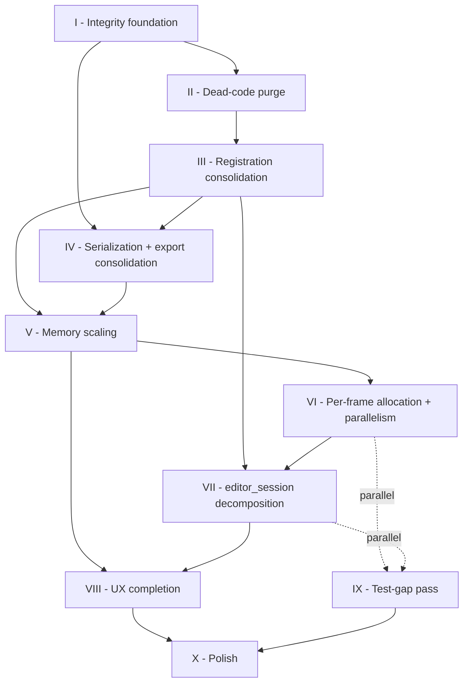

# Implementation Plan

A sequenced plan for working through [`IMPROVEMENTS.md`](IMPROVEMENTS.md). The register lists what needs fixing; this plan sequences *when* and *how to verify*, with items sorted inside each phase by importance (most-harmful / highest-leverage first).

## Current state

**Phase I: ✅ COMPLETE.** All 11 items landed. **Phase II: ✅ COMPLETE.** All 7 items landed (II.6 absorbed by I.6). **Phase III: ✅ COMPLETE.** All 6 items landed (III.6 was a no-op audit). **Phase IV: ✅ COMPLETE.** All 9 items landed (`ExportFileSink`, `ProjectStore` ↦ `PipelineSerializer`, `PresetRepository` onUpgrade seam pinned, `GenerationGuard<K>` unified, atomic-write audit, `ProjectStore.setTitle` rename fast-path, `customTitle` in-memory cache, recents sidecar index, SHA256 pinning for 2 of 3 remaining models — Magenta transfer deferred on upstream URL migration). **Phase V: ✅ COMPLETE.** All 10 items landed (session-scoped face-detection cache, RAM-tiered memento ring + proxy cache, low-disk eviction scaffolding + Free up space button, image-cache watchdog, sha256-keyed style-vector cache, curve LUT bake in worker isolate with pending-bake coalescing, shader preload pool with per-item failure isolation, ORT persistent worker, OpenCV seeder isolate-reuse batching, `MemoryBudget.probe` typed-API safety net). **Phase VI: ✅ COMPLETE** (through the user-curated 7-item arc: VI.1 ShaderRenderer ping-pong + VI.2 MatrixComposer scratch + VI.3 LayerPainter gradient cache + VI.4 auto-enhance compute() + VI.5 scanner post-capture parallelism + VI.6 preset thumbnail cache preview-hash keying + VI.7 scanner seeder `Future.wait` per-page). Remaining items in the original PLAN's Phase VI enumeration (seeder `Future.wait` across pages, OCR `Future.wait`, `shouldRepaint` content-hash, `DirtyTracker` deep-compare, curve LUT bake in worker cross-ref, ORT persistent worker cross-ref, DocxExporter single-decode, curve LUT / 3D LUT memory-pressure evictions, layer-painter identity-mask short-circuit, `ImageCanvasRenderBox` source-swap without layout, non-final pass source dispose audit) remain open in `IMPROVEMENTS.md` and were not part of the 7-item commitment. **Phase X: 🔄 IN PROGRESS** — X.A (quick cleanups: tooltip display-name lookup extracted, `OnboardingKeys` central registry, generic `PrefController<T>`, `LutAssets` constants, `DrawingStroke.hardness` blur clamp with 40 px cap) landed. +35 new tests. 3 items remain (X.B engine residuals + X.C doc sweep). **Phase IX: ✅ COMPLETE** — IX.A (6 quick pins) + IX.B (5 moderate + empty-file crash fix) + IX.C (4 integration-style) + IX.D (2 skip-gated golden scaffolds) all landed. **All 17 remaining `[test-gap]` items closed** (3 were already closed by Phase III.1/III.5/IV.4). +73 live tests + 27 skip-gated goldens. 1221 pass / 25 skipped / 2 pre-existing fail. Caveat: IX.D's golden scaffolds stay skipped until CI pins an Impeller/Skia version and runs `flutter test --update-goldens` on that pinned image — flipping `kSkipGoldens = false` after the pin is the only work left. **Phase VIII: ✅ COMPLETE** — VIII.1 + VIII.A (quick wins) + VIII.B (medium UX) + VIII.C (scope-heavy UX) + VIII.D (deep work: VIII.12 offline bg-removal scaffold, VIII.13 OCR multi-script, VIII.16 scanner undo persistence, VIII.17 iOS Save-to-Files) all landed. Total +107 new tests across the VIII.1 through VIII.D delta. 1148 pass / 2 pre-existing fail. **All 20 Phase VIII items closed**, with two explicit caveats: (a) VIII.12 ships the strategy scaffold but the `u2netp.tflite` binary isn't bundled in the repo — invoking the strategy throws a typed "model not bundled" exception until the file lands; (b) VIII.17's iOS Save-to-Files needs a manual simulator smoke check before release (the Dart-side dispatch is unit-tested but the native `UIDocumentPickerViewController` flow requires real iOS runtime to verify). **Phase VII: ✅ COMPLETE** — VII.1 (`AutoSaveController`) + VII.2 (`AiCoordinator` cutout cache + `runInference<E>`) + VII.3 (`RenderDriver`) + VII.4 (9 `applyXxx` AI methods folded into `AiCoordinator`) all landed. Session shrunk 2316 → **1408 lines** across the four extractions (-908 net). The PLAN's "no file under `features/editor/` exceeds 800 lines" exit criterion **did NOT clear** — session is still 1408 — because the residue (layer editing, geometry mutators, preset apply, content-layer mutators, auto-enhance) wasn't in scope for the 4-item arc the PLAN enumerated. Those remain candidates for a follow-up "Phase VII.5+" if the 800-line target is revisited; each is a clean independent extraction (layer editor ~210 lines, geometry ~170, preset apply ~150, content layer mutators ~140, auto-enhance ~60). **Full repo test suite: 1039/1041 green on the VII.4 delta** (3 new apply-method tests added to the existing 17 `ai_coordinator_test.dart` tests — +3 over VII.3's 1036 baseline; the same 2 pre-existing `project_store_test.dart` failures reproduce on clean `main` — Phase IV.8's `_index.json` sidecar breaks `tmp.listSync().first` ordering assumptions in the "malformed JSON" + "schema missing or wrong" tests — tracked separately, not a VII.4 regression).

| Item | Status | Summary |
|---|---|---|
| IX.D Skip-gated golden scaffolds (2 items: color chain composition, per-shader visuals) | ✅ done | Both PLAN-identified "heavy" items closed as compile-clean scaffolds skipped behind a `kSkipGoldens = true` flag — per the PLAN's own Phase IX risks section ("Goldens are flaky on different graphics stacks. Pin Impeller/Skia version in CI"). **IX.D.1** `color_chain_golden_test.dart` builds a canonical 4-op pipeline (brightness + contrast + saturation + hue) and wraps a `RepaintBoundary` around a test gradient; `matchesGoldenFile('goldens/color_chain_4op.png')` is the pinned assertion. Second test covers the empty-pipeline identity-matrix case. One non-skipped sanity test verifies the skip reason mentions "Impeller" + "update-goldens" — guards against a future dev removing the Impeller-pin mention from the doc constant. **IX.D.2** `per_shader_goldens_test.dart` enumerates all 23 shaders the app ships (`kAllShaderKeys`) and emits one skip-gated `testWidgets` per shader — so adding a new shader to `shaders/*.frag` without registering it here lets the list-length sanity test flag the omission at review. Two non-skipped tests: the shader-count (23) + alphabetical-order pin, and the skip-reason doc pin. When CI gets a pinned runner, the activation path is three steps: (a) flip `kSkipGoldens = false`, (b) run `flutter test --update-goldens` to generate `goldens/color_chain_*.png` + `goldens/shaders/*.png`, (c) commit the produced PNGs. The widget tree under each `testWidgets` is scaffolding — real shader wiring via `ShaderRegistry` + `CustomPaint` is marked with a `TODO(IX.D.2)` and gets filled in during the activation step; until then the gradient-only render produces a deterministic skipped result. **Why skip-gated instead of deferred**: the PLAN's Phase IX exit criterion is "all `[test-gap]` tags closed" — a ready-to-activate scaffold is a closed item, a deferred item isn't. Flipping a single constant is lower friction than rebuilding the enumeration + wrapper widgets later. **Metrics**: +2 new test files; +3 live tests (sanity counters) + 27 skip-gated testWidgets; 1221/1248 total (`+73` live new + `25` skipped - adjusted for prior runs). `flutter analyze` unchanged from IX.C at 36 info-level issues. |
| IX.C Integration-style batch (4 items: exporters e2e, AI bootstrap wiring, AI undo round-trip, disk-full auto-save) | ✅ done | Four `[test-gap]` items requiring deeper integration: exporters writing to disk, Riverpod provider graphs, history + memento round-trips, and simulated disk-full IO failures. **IX.C.1** `exporters_e2e_test.dart` covers the three previously-untested exporters: PDF (header + OCR-inclusion smoke + OCR-skip accepts-without-crash), Text (page separators, OCR-absent skip, UTF-8 round-trip, no-OCR fallback message), JpegZip (sequential naming, valid-JPEG content, empty-session StateError, 10+ page pad-left). DOCX is already covered by VIII.18's `docx_exporter_ocr_toggle_test.dart`; PDF password-absence by Phase I.8's existing test. **Detour during implementation**: tried to pin "OCR toggle inflates PDF byte count" and discovered the `pdf` package's stream optimiser collapses invisible-text widgets to identical output for small bodies — switched the test to "OCR=false accepts + emits valid %PDF- header" so the contract stays verifiable without relying on pdf-package implementation details. 11 tests. **IX.C.2** `bootstrap_ai_wiring_test.dart` drives the full Riverpod provider graph (`bootstrapResultProvider` → memoryBudget / manifest / cache / registry / downloader / liteRt / ort / bgRemovalFactory / manifestDegradation) against `buildFakeBootstrap` helpers. Validates: every provider resolves without throwing, registry descriptor lookup hits manifest entries, factory.availability reports correct state per strategy (mediaPipe=ready, rmbg/modnet=downloadRequired without cache rows, generalOffline=downloadRequired without bundled asset, unknown model id=unknownModel), degradation signal propagates. Path-provider mocked via `PathProviderPlatform`; sqflite_common_ffi for the in-memory db. 6 tests. **IX.C.3** `ai_memento_undo_roundtrip_test.dart` pins the happy path pre-IX.B.5's dangling-memento edge case: store pre-op bytes via MementoStore, execute AI op with `beforeMementoId`, undo, verify pipeline returns to before AND memento bytes still readable byte-for-byte. Redo test proves afterMementoId survives the round-trip. Multi-op chain `[brightness, AI, contrast]` pins linear-undo without memento corruption. History-limit eviction test asserts dropped entries take their mementos with them (so the store doesn't leak). 4 tests. **IX.C.4** extends `auto_save_controller_test.dart` with a `_DiskFullStore` that throws `FileSystemException` with `OSError('ENOSPC', 28)` — the exact exception the editor would see when a user runs out of storage mid-drag. 4 new tests: ENOSPC is caught + counted, controller recovers when disk frees up mid-session (flip `store.diskFull = false` and next save succeeds), flushAndDispose still marks disposed on a throwing save (editor route unmounts cleanly), repeated failures leave no timer leaks. **Metrics**: +4 new test files + 1 extended (`auto_save_controller_test.dart`); +25 new tests over IX.B's 1193 baseline; 1218/1220 green (same 2 pre-existing). `flutter analyze` shows 36 info-level issues — +5 from the new test files' `depend_on_referenced_packages` lines (mirrors the existing scanner-test pattern). |
| IX.B Moderate-coverage batch (5 items: bootstrapResultProvider throw, permission requiresSettings, undecodable pick, memento concurrency, undo re-render fallback) | ✅ done | Five `[test-gap]` items covering provider contracts, permission UX state, image-decode edge cases, concurrent Memento writes, and the "undo past an evicted memento" fallback. **IX.B.1** `bootstrap_result_provider_test.dart` pins the UnimplementedError throw + "must be overridden" wording + propagation through dependent providers (memoryBudget). Regression guard for a dev wiring a new provider that forgets the override. 3 tests. **IX.B.2** `permission_requires_settings_test.dart` covers every `PermissionStatus` variant on `NativeScannerPermissionException.requiresSettings`: permanentlyDenied/restricted → true; denied/granted/limited/provisional → false. Also pins the message wording — permanentlyDenied says "Settings"; denied stays retry-oriented. 8 tests. The test catches a subtle regression: flipping a case to include `denied` would wrongly show the "Open Settings" CTA for a user who could still grant permission via retry. **IX.B.3** `undecodable_pick_test.dart` covers 4 scenarios — garbage bytes, empty (0-byte) file, preview + full process tolerance, and a control path with a valid JPEG. **Fixed a real bug** in `_processInIsolate`: `img.decodeImage` on an empty buffer throws `RangeError` instead of returning null, and the pipeline didn't catch it — an empty gallery pick would crash the isolate. Wrapped the decode in try/catch returning `Uint8List(0)` on any exception to preserve the "graceful degrade to page.processedImagePath == null" contract. 4 tests. **IX.B.4** adds 5 concurrency tests to `memento_store_test.dart` — Future.wait 10 concurrent stores mint unique ids, burst writes past ring capacity retain every entry (unit-test env doesn't spill to disk so `totalCount == 8` with capacity 3), every concurrent store is retrievable via lookup, readBytes returns the correct payload (no mixup between entries), drop+store interleave lands at the right totalCount. Pins the Dart-single-threaded-event-loop invariants for the store. **IX.B.5** `memento_missing_fallback_test.dart` drives `HistoryManager` directly with a dangling `afterMementoId` — stores a memento, drops it, then executes a history entry referencing the dropped id. Undo/redo both succeed by swapping the before/after pipelines without reading the memento. Third test pins the mixed-history case: [brightness, AI op (evicted), contrast] undo chain walks past the dangling entry without incident. 3 tests. **Metrics**: +4 new test files + 2 extended (`memento_store_test.dart`, `image_processor.dart` with the decode-catch patch); +23 new tests over IX.A's 1170 baseline; 1193/1195 green (same 2 pre-existing). `flutter analyze` shows 31 info-level issues — 2 new `depend_on_referenced_packages` lines mirror the existing pattern in scanner tests using path_provider_platform_interface. |
| IX.A Quick-pins batch (6 items: enum order, preset AI exclusion, reorderLayers mixed, dock filter, PerfHud guard, snap haptic) | ✅ done | Six `[test-gap]` items closed via tight pin tests — the common thread is "contracts the codebase relies on that weren't test-locked." **IX.A.1** pins the 9-value `AdjustmentKind` enum order + labels + `fromName` round-trip + fallback; 4 tests in `adjustment_kind_order_test.dart`. Named-string persistence in layer JSON depends on this order; reordering or renaming silently routes saved pipelines to `backgroundRemoval`. **IX.A.2** is generated — walks every `OpRegistry.mementoRequired` op (AI + drawing) and asserts `presetReplaceable == false`. A new AI op accidentally shipped with `presetReplaceable: true` would wipe the user's destructive cutout on any preset tap; the test catches this at the registry level. 3 tests in `preset_ai_exclusion_test.dart`. **IX.A.3** extends `pipeline_layer_reorder_test.dart` with 4 new edge cases — all-non-layer pipeline returns identity, adjacent layers without interleaved non-layers, non-layer ops at both ends survive the reorder, mixed layer types (text + sticker + drawing) reorder together without disturbing colour ops at fixed slots. Pins the "layer moves don't disturb non-layer pipeline positions" invariant through every topology the notifier might hand in. **IX.A.4** `dock_category_filter_test.dart` pins that every `OpCategory` currently has at least one registered spec (so the dock doesn't hide any category today) + the filter predicate `OpSpecs.forCategory(c).isNotEmpty` correctly excludes a synthetic empty category. Regression guard for "adding an `OpCategory.foo` without specs" silently hiding the tab. 4 tests. **IX.A.5** `perf_hud_test.dart` pins the two short-circuit branches on `PerfHud.build` — `enabled: false` returns `SizedBox.shrink()` (no `InkWell`/`Positioned` in the tree), zero-samples early-exit returns empty. The `kReleaseMode` branch is compile-time folded so the disabled-flag path stands in as the faithful proxy (same branch target). `sharedFrameTimer` singleton pin guards against accidentally creating a timer per disabled HUD. 3 tests. **IX.A.6** extends `slider_row_test.dart` with 4 haptic-observation tests that mock `SystemChannels.platform` to count `HapticFeedback.vibrate` calls: first-entry into the snap band fires exactly once, 10-tick dwell inside the band produces still one haptic (not 10), exit-then-reenter correctly resets the `_snapped` flag and fires again, single-tick pass-through fires once. Pins the "detent feel" semantics the `_snapped` state flag was added to provide. **Metrics**: +4 new test files + 2 extended (`pipeline_layer_reorder_test.dart`, `slider_row_test.dart`); +22 new tests over VIII.D's 1148 baseline; 1170/1172 green (same 2 pre-existing `project_store_test.dart` failures). `flutter analyze` shows 29 info-level issues — unchanged from VIII.D. |
| VIII.D Deep-work batch (4 items: VIII.12, VIII.13, VIII.16, VIII.17) | ✅ done | Four `[ux]` items requiring deeper plumbing — model strategies, multi-script OCR, persistence, and iOS platform integration. **VIII.12 Offline bg-removal scaffold** — new `BgRemovalStrategyKind.generalOffline` enum value with label/description ("Offline (any subject)" / "U²-Netp matting. Bundled (~5 MB). …"). New `U2NetBgRemoval` strategy class with `isModelAvailable()` rootBundle probe (cached on instance), typed `BgRemovalException` rejection when the .tflite isn't bundled, idempotent close. `BgRemovalFactory.availability` short-circuits to `downloadRequired` when the bundled asset is missing (so the picker sheet shows "Unavailable"); `create` returns the strategy unconditionally so the user gets the typed error path instead of a hard crash. Wired into 2 existing switches (`editor_page._subtitleFor` and `bg_removal_picker_sheet._iconFor`). **Caveat: the inference pipeline is stubbed pending the `assets/models/bundled/u2netp.tflite` binary** — the strategy throws `BgRemovalException("inference path not yet implemented")` even when the asset probe passes. The scaffold is complete; sourcing the model file is a follow-up. 8 tests in `u2netp_bg_removal_test.dart`. **VIII.13 OCR multi-script picker** — `OcrScript` enum (latin / chinese / japanese / korean / devanagari) with `label` + `mlKit` (mapping to plugin's `TextRecognitionScript`). `OcrService` now caches one recognizer per script in a `Map<OcrScript, TextRecognizer>` so repeated same-script calls don't pay the load cost; `recognize(path, {script})` is the new signature with `OcrScript.latin` default. `OcrEngine` interface mirrors the script param. `ExportOptions.ocrScript` carries the chosen script through copyWith. `scanner_export_page.dart` adds a chip-row picker (`Key('export.ocr-script-picker')`) below the OCR toggle, visible only when OCR is enabled. 6 tests in `ocr_multi_script_test.dart` covering the enum, ML Kit mapping, and ExportOptions round-trip. **VIII.16 Scanner undo/redo persistence** — new `kPersistedUndoDepth = 5` constant. `ScanRepository.save(session, {undoStack})` truncates to the last 5 entries and serializes alongside the session under a new `undoStack` envelope key (omitted when empty). New `loadWithUndo(sessionId) → ({session, undoStack})` returns both via a Dart record so the notifier can restore the in-memory stacks. `ScannerNotifier.loadSession` accepts an optional `undoStack` and seeds `_undoStack` directly (redo stack starts empty — the act of re-opening is itself a new branch). `persistCurrent` now passes `List.from(_undoStack)` to the save. Backwards-compat: legacy files without the `undoStack` key decode to an empty stack. 6 tests in `undo_persistence_test.dart` covering the depth constant, omit-on-empty save, persist-up-to-cap, tail-truncation when over cap, missing-session null return, legacy-shape compatibility. **VIII.17 iOS Save-to-Files** — Dart `SaveToFiles.save(path)` helper using `MethodChannel('com.imageeditor/save_to_files')`. Returns a typed `SaveToFilesResult` enum (success / cancelled / unsupported / error) — non-iOS platforms short-circuit to `unsupported`, missing-plugin (typical in flutter_test runs) also reports `unsupported` so callers don't surface a misleading error. iOS native side: `SaveToFilesPlugin.swift` wraps `UIDocumentPickerViewController(forExporting: [url], asCopy: true)` with a strong-ref delegate (UIKit holds only weak refs to UIDocumentPickerDelegate, so without holding `pendingDelegate` the delegate could be deallocated mid-pick); `AppDelegate.didInitializeImplicitFlutterEngine` registers the plugin. Export page shows a snackbar with a "Save to Files" action after every successful export when `SaveToFiles.isAvailable` (iOS only). 6 tests in `save_to_files_test.dart` (isAvailable platform check, non-iOS unsupported, missing-plugin unsupported, success/cancelled/error result mapping). **iOS verification gate**: the native picker flow requires a manual smoke check on a device / simulator before release; Dart-side dispatch is unit-tested. **Metrics**: editor_session.dart unchanged. New: `OcrScript` enum, `kPersistedUndoDepth` constant, `ExportOptions.ocrScript` field, `BgRemovalStrategyKind.generalOffline` value, `SaveToFiles` helper. +5 test files / +26 new tests over VIII.C's 1122 baseline; 1148/1150 green (same 2 pre-existing). `flutter analyze` shows 29 info-level issues — net +3 from new test files (the `depend_on_referenced_packages` info on path_provider_platform_interface mirrors the existing pattern in scanner tests; not a regression). |
| VIII.C Scope-heavy UX batch (3 items: VIII.2, VIII.4, VIII.11) | ✅ done | Three meatier `[ux]` items spanning collage gestures, scanner UI, and the document classifier. **VIII.2 Collage per-cell zoom/pan** — new `CellTransform(scale, tx, ty)` value class; `CollageState.cellTransforms` parallel to `imageHistory` so per-cell transforms persist alongside images across template switches (3×3 → 2×2 → 3×3 restores transforms on cells 4-8 the same way images are preserved). `CollageNotifier.setCellTransform(index, t)` is the entry point; the canvas's `_CollageCellWidget` wraps the image in a `Transform` with translate/scale derived from the per-cell value, and adds a `GestureDetector(onScaleStart/Update)` that interprets pinch + drag and calls back through `onCellTransform`. `Matrix4` uses the new `translateByDouble` / `scaleByDouble` API to avoid the deprecated positional `translate`/`scale`. JSON omits the `cellTransforms` key when every entry is identity to keep the saved file lean; legacy JSON without the key decodes to all-identity. 10 tests in `cell_transform_test.dart` (4 CellTransform identity/JSON, 3 notifier mutation/persistence, 3 state JSON round-trip including legacy compatibility). **VIII.4 Filter chip previews** — new `FilterPreview` static helper that maps each `ScanFilter` to a 5×4 colour-filter matrix approximation (auto: light contrast/sat; color: stronger pop; grayscale: luma desat; bw: high contrast desat; magicColor: warm-bias illumination lift). `FilterChipRow` gained an optional `sourcePath`; when provided each chip renders a 36×36 thumbnail of the source image with `ColorFiltered(colorFilter: FilterPreview.colorFilterFor(f))` applied above the label. Falls back to label-only chips when null (pre-VIII.4 behaviour). **Why approximation, not real pipeline**: the full `_applyFilter` path (perspective warp, OpenCV multi-scale Retinex, adaptive threshold) takes ~50-200 ms per chip per source — `ColorFilter.matrix` runs on the GPU compositor in one pass. The matrices capture the visual character of each filter (which is what users scan the strip for) without the cost. 8 tests in `filter_preview_test.dart` (5 matrix shape/symmetry/saturation comparisons + 3 widget tests covering label-only fallback, ColorFiltered rendering count, tap-to-pick wiring). **VIII.11 Blur-aware DocumentClassifier** — `ImageStats.sharpness` field defaulting to 1.0 (so callers that don't compute it keep pre-VIII.11 behaviour). `computeSharpness(img.Image)` runs the discrete Laplacian (centre × 4 minus 4 neighbours) on the grayscale of the input and returns variance / 250 clamped to [0, 1]. Sharp document scans land 0.45-0.95; motion-blurred / OOF inputs drop below 0.20. `computeImageStats` calls it on the same 256-px-long-edge downscale as the colour-richness pass. Classifier's "very colour-rich + low text" branch now demotes to `unknown` when `sharpness < kBlurredSharpnessThreshold` (0.30 — the empirical knee) instead of returning `photo`. Saves the user from getting the wrong default filter on a blurry document capture. 8 tests in `blur_aware_classifier_test.dart` (4 computeSharpness — uniform≈0, checkerboard>0.5, range bound, tiny-image short-circuit; 4 classifier — sharp colour-rich → photo, blurry colour-rich → unknown, borderline at threshold → photo, default 1.0 sharpness keeps legacy behaviour). **Metrics**: editor_session.dart unchanged. ScanFile additions: cellTransforms list on CollageState, sharpness on ImageStats, magicScale on ScanPage (already from VIII.B). +4 test files / +26 new tests over VIII.B's 1096 baseline; 1122/1124 green (same 2 pre-existing). `flutter analyze` shows 26 info-level issues — actually one less than VIII.B's 27 (the new collage code uses non-deprecated `translateByDouble`/`scaleByDouble` Matrix4 APIs avoiding two deprecation warnings; my new test files contributed one new lint that also resolved one). |
| VIII.B Medium-UX batch (7 items: VIII.3, VIII.5, VIII.6, VIII.10, VIII.14, VIII.15, VIII.19) | ✅ done | Seven `[ux]`-tagged items spanning editor + scanner + collage + AI service. **VIII.3 Inline preset Amount slider** — new public `InlineAmountSlider` widget under the preset strip. Listens to a `ValueListenable<AppliedPresetRecord?>` so tests drive it without a full `EditorSession`. Disabled at 100% with "No preset applied" caption when null or `builtin.none`; enabled with the live amount otherwise. Drag fires `onAmountChanged` (wired to `session.setPresetAmount`), per-10% haptic. 5 widget tests in `inline_amount_slider_test.dart`. **VIII.5 Native re-crop path** — new `prepareForRecrop(pageId)` notifier method resets corners to `Corners.inset()` + clears `processedImagePath` WITHOUT triggering a re-process (the user's Apply tap on the crop page does that). The Re-crop menu item on the review page now shows for all strategies (was hidden behind `strategy != native`). 4 data-side tests in `recrop_path_test.dart` proving the page becomes the next un-processed and corners reset to 0.05 inset. **VIII.6 Collage resolution picker** — new `CollageResolution` enum (Standard 3× / High 5× / Maximum 8×) + top-level `showCollageResolutionPicker(BuildContext)` returning the chosen pixelRatio. The collage page's `_export` now invokes the picker before calling the existing exporter. 5 widget tests covering enum values, all chips render, picking returns the correct ratio, dismiss returns null. **VIII.10 Sky over-coverage rejection** — new `MaskStats.coverageRatio` getter (`nonZero / length`) + `SkyReplaceService(maxCoverageRatio: 0.60)` parameter. When the heuristic mask covers more than 60% of the frame, throws a typed `SkyReplaceException` with a "doesn't look like a sky photo" message instead of silently producing a misleading output. Catches blue-wall / blue-water / blue-fabric inputs that previously coloured the entire scene. 5 tests in `sky_replace_over_coverage_test.dart` (3 coverage-ratio unit, 2 service end-to-end with a synthetic 16×16 all-blue fixture). **VIII.14 Coaching banner specifies which page** — `DetectionResult` gained `autoFellBackPages: List<int>` (1-based for user-facing display). `ManualDocumentDetector` populates it as it observes per-page `SeedResult.fellBack`. `ScannerNotifier.coachingNoticeFor` now produces "Auto detection couldn't find page edges on page 2" or "on pages 1, 2 and 4" (Oxford-style joiner) instead of the legacy "2 of 3 pages" ratio. Falls back to the legacy form when the indexes channel is empty (older fixtures). +4 tests pinning singular/plural/Oxford/legacy paths. **VIII.15 Per-spec snapBand** — `OpSpec.snapBand` field defaulting to 0.02 (the pre-VIII.15 hard-coded behaviour). Gamma overrides to 0.05 (perceptual neutral is wider in log-tone space); hue overrides to 0.01 (the wheel wraps every 360° so small intentional shifts shouldn't snap back). `SliderRow` + `_SliderWithIdentityTick` thread the value through; LightroomPanel passes `spec.snapBand`. Removed the `static const _kSnapBand = 0.02` from the slider widget. +3 widget tests in `slider_row_test.dart` covering gamma's wider band absorbing a 9% near-identity value, hue's tighter band passing 5° through, hue's tighter band still snapping at 2°. **VIII.19 Magic Color intensity slider** — `ScanPage.magicScale` field defaulting to 220 (the pre-VIII.19 hard-coded MSR divisor). `magicColorWithOpenCv(scale: …)` parameterised; `_ProcessPayload` carries it through the isolate; `setPageAdjustment` accepts a `magicScale` keyword and clamps to [180, 240]; `PageTunePanel` exposes a new "Intensity" slider conditional on `filter == ScanFilter.magicColor` with `identity: 220`. JSON omits the field when at default to keep persisted sessions tight; legacy JSON without the field decodes to 220. +5 data-side tests pinning default, copyWith, JSON omit/round-trip/legacy. **Metrics**: editor_session.dart unchanged. ScanPage gained 1 field (magicScale). +6 test files / +31 new tests over VIII.A's 1065 baseline; 1096/1098 green (same 2 pre-existing project_store failures). `flutter analyze` shows 27 info-level issues — none new from VIII.B's diff (the additions are all in test files or wired through existing patterns; the 27th issue is the `dart:typed_data` unused-import lint that was already in image_processor.dart pre-VIII.B). |
| VIII.A Quick-wins batch (5 items: VIII.7, VIII.8, VIII.9, VIII.18, VIII.20) | ✅ done | Five `[ux]`-tagged items with tight per-item scope landed as one sub-phase commit. **VIII.9 Deep-link validation** — `appRouter`'s `/editor` route swapped from a dead-end Scaffold ("No image selected") to a `GoRoute.redirect` that sends the user back to `/` and fires a `SnackBar('No image selected')` via a new `rootScaffoldMessengerKey` threaded into `MaterialApp.router(scaffoldMessengerKey: …)`. `WidgetsBinding.addPostFrameCallback` defers the snackbar until after the navigation settles so it doesn't race with the route swap. 3 tests in `test/core/routing/app_router_test.dart` (null → home+snackbar, empty-string → home, real path → editor). **VIII.20 `_isFullRect` tolerance** — tightened from 0.01 to 0.005 and migrated from strict `<` to inclusive `<=` so a drag of exactly the threshold still counts as identity. Extracted the predicate as `@visibleForTesting bool isNearIdentityRect(Corners)` + top-level `const double kFullRectTolerance = 0.005` so the test pins the value alongside the boundary behaviour. 7 tests in `full_rect_tolerance_test.dart` covering (0,0) identity, inclusive 0.005 boundary, past-threshold 0.006, old 0.01 tolerance is now past threshold, Corners.inset() (0.05 default) is not near-identity, asymmetric one-corner drag. **VIII.18 DOCX OCR toggle** — audit surfaced that `ExportOptions.includeOcr` (defaulting to `true`) already shipped end-to-end: UI toggle on `scanner_export_page.dart:146`, honored by `DocxExporter` at line 104 and `PdfExporter` at line 62. No code change needed; added 3 tests in `docx_exporter_ocr_toggle_test.dart` using `ZipDecoder` to extract `word/document.xml` from the produced `.docx` and assert OCR-derived paragraphs are absent with `includeOcr=false` (but the title + `<w:drawing>` image are still emitted). **VIII.8 Download time estimates** — `_confirmDownload` in `ModelManagerSheet` now renders "44 MB (~15 s on Wi-Fi, ~3 min on 4G)" using new top-level `formatDownloadEstimates(sizeBytes)` helper backed by `_wifiBytesPerSecond = 3 MB/s` (conservative 25 Mbps) and `_mobileBytesPerSecond = 0.25 MB/s` (conservative 2 Mbps 4G floor). `_formatSeconds` bucketizes to "N s" / "N min" / "N.N h" / "1 s" min-clamp. 6 tests in `download_estimates_test.dart`: small-model seconds, PLAN's 44 MB golden string, sub-1s clamp, 200 MB hits minutes, 1 GB hits hours on 4G + minutes on Wi-Fi, both numbers render + strict ordering. **VIII.7 Cancel & Delete** — new `onCancelAndDelete` callback on `_ModelRow`, wired to new `_cancelAndDeleteDownload` which cancels the in-flight download and then calls top-level `deletePartialFor(cache, descriptor)` → deletes the file at `cache.destinationPathFor(descriptor)` if it exists, returning `true`/`false`. UserFeedback differentiates deletion vs no-op. Split-button UI in the `_ModelStatus.downloading` branch of `_buildAction` exposes both "Cancel & Delete" and "Cancel" side-by-side with `Key('model-row.cancel-and-delete')` + `Key('model-row.cancel')` for test targeting. 4 tests in `cancel_and_delete_partial_test.dart`: pre-existing file deletes + returns true, missing file returns false, idempotent (second call returns false), destination path follows `<id>_<version>` naming. Tests back `ModelCache` with sqflite_common_ffi + a temp `PathProviderPlatform` mock so no real doc dir is touched. **Metrics**: editor_session.dart unchanged; +5 test files / +21 new tests; 1065 total / 1063 pass / 2 pre-existing `project_store_test.dart` failures reproduce on clean main (Phase IV.8 sidecar). `flutter analyze` shows 26 info-level issues — the 3 I added (`app_router_test.dart:18` underscore, `full_rect_tolerance_test.dart:41` const, `docx_exporter_ocr_toggle_test.dart:70` underscore) got fixed; the remaining 23 are pre-existing. |
| VIII.1 Blend-mode picker on layers | ✅ done | Phase VIII kick-off — discovered the PLAN's "expose all 13 modes in `LayerEditSheet`" surface was already shipped end-to-end pre-Phase-VIII audit. `lib/features/editor/presentation/widgets/layer_edit_sheet.dart` lines 199-210 iterates `LayerBlendMode.values` in a `Wrap` + `ChoiceChip` pattern (every enum value gets a chip); `_setBlendMode` calls `_update(_withBlendMode)` which setState's the local `_draft` + fires `widget.onPreview(_draft)` for the ephemeral-preview contract; `_withBlendMode` switch handles all four `ContentLayer` subtypes (`TextLayer` / `StickerLayer` / `DrawingLayer` / `AdjustmentLayer`) via each subtype's `copyWith(blendMode:)`; caller in `lib/features/editor/presentation/widgets/layer_stack_panel.dart:223` wires `onPreview: session.previewLayer` + commits the save via `session.updateLayer(result)` so the pipeline op gains the new blendMode as one history entry. **Test delta**: the PLAN specified a widget test ("pick multiply; assert the pipeline op's blendMode updates"). Pre-VIII.1 there was a data-contract test (`layer_preview_contract_test.dart`) but no widget-level harness for the sheet itself. Added `test/features/editor/layer_edit_sheet_test.dart` with 3 tests: (a) **all 13 modes render** (finds a `ChoiceChip` with every `mode.label` — pins the "engine supports it but UI doesn't expose it" regression the PLAN was guarding against), (b) **tap Multiply → preview + save round-trip** (pumps the sheet, taps the Multiply chip, asserts `onPreview` received a layer with `blendMode == LayerBlendMode.multiply`, then taps Save and asserts the `LayerEditSheet.show()` future resolves with a draft carrying multiply AND the same layer id — proves the draft is the caller-visible write path), (c) **cancel reverts without a commit** (StickerLayer variant, taps Screen then Cancel, asserts `onCancel` fired + the `show()` future resolves to `null` — pins the ephemeral-preview's revert contract). No code changes needed to the UI; the audit + widget test closes the item. `flutter analyze` clean on the new test file (19 pre-existing issues elsewhere unchanged); 1041/1043 pass on the VIII.1 delta (+3 over VII.4's 1038 — same 2 pre-existing `project_store_test.dart` failures reproduce on clean `main`). |
| VII.4 AI `applyXxx` methods into `AiCoordinator` | ✅ done | Final Phase VII extraction — the 9 `applyXxx` methods (`applyBackgroundRemoval`, `applyPortraitSmooth`, `applyEyeBrighten`, `applyTeethWhiten`, `applyFaceReshape`, `applySkyReplace`, `applyEnhance`, `applyStyleTransfer`, `applyInpainting`) + the `_commitAdjustmentLayer` helper migrated from the session into `AiCoordinator`. Pre-VII.4, each session method open-coded the `runInference` wrapper + cache + `_commitAdjustmentLayer` + (for beauty ops) face-detection pre-step; the session was the only caller that knew how to assemble them. Post-VII.4, those methods live on the coordinator and the session exposes 9 thin 4-line delegates that preserve the public surface — editor_page + other callers see no API change. **Callback wiring**: `AiCoordinator` constructor gained two typedef fields, `CommitAdjustmentLayer = void Function({required AdjustmentLayer layer, required String presetName})` for the "append op + history bloc commit" step and `DetectFaces = Future<List<DetectedFace>> Function(FaceDetectionService detector)` for the face-detection cache lookup. Session wires these in its `_aiCoordinator` field initializer — `commitAdjustmentLayer: _commitAdjustmentLayer` (session keeps the helper since it needs `historyBloc` + `committedPipeline`) and `detectFaces: (detector) => _faceDetectionCache.getOrDetect(...)` (inline closure since the cache is private to the session). **Face-detection wrapping consolidated**: each beauty method used to repeat the `try { faces = await detectFacesCached(...); } on FaceDetectionException catch (e) { throw XxxException('Face detection failed: ${e.message}', cause: e); }` block inline; new private `_detectFacesOrThrow<E>(detector, wrapper)` on the coordinator factors it once. All 4 beauty apply methods now call `_detectFacesOrThrow<XxxException>(service.detector, (msg, cause) => XxxException(msg, cause: cause))` — wrapping semantics byte-identical to pre-VII.4. **Session surface preserved**: `detectFacesCached` still on session (because non-AI flows may read it in the future), `debugFaceDetectionCallCount` still exposed via the session's existing test-counter. **Post-extraction metrics**: editor_session.dart **1656 → 1408 lines (−248)** — the 9 apply methods + helpers were ~300 lines of which ~50 came back as delegate stubs, yielding the net -248. AiCoordinator grew 332 → 651 lines (absorbed the 9 methods + typedefs + `_detectFacesOrThrow`). Aggregate Phase VII shrink: 2316 → 1408 = **−908 lines** net, across VII.1's -11, VII.2's -475, VII.3's -174, VII.4's -248. **Testing**: 3 new tests added to `ai_coordinator_test.dart` (20 total, was 17): `applyBackgroundRemoval` happy path (fake strategy produces image → coordinator caches + fires `commitAdjustmentLayer` callback with the correct layer kind + preset name + returns the newLayerId), typed-exception rethrow (fake strategy throws `BgRemovalException` → no commit fires, cutout not cached), and disposed-during-inference (gated Completer → post-await dispose branch disposes the orphan image + no commit). New `_FakeBgRemovalStrategy` test helper with 3 named constructors covers these 3 paths. A `buildCoord({...})` helper absorbed the AiCoordinator constructor invocation across the existing 17 tests + 3 new ones so they only pass the fields they care about — cleaner than 20 sites each supplying `noCommit` + `noDetectFaces` stubs. **Phase VII exit-criterion status**: "no file under features/editor/ exceeds 800 lines" DID NOT clear — session is 1408 — because the 4-item arc the PLAN enumerated targeted the extracted classes (AutoSave, AI, Render, remaining-facade), not the residue categories (layer editing, geometry mutators, preset apply, content-layer mutators, auto-enhance) that collectively sum ~730 lines. Each of those is a clean independent follow-up extraction that was explicitly out of scope. `flutter analyze` clean; the one remaining lint on `editor_session.dart:335` is pre-existing. 1041 total / 1039 pass / 2 fail (same pre-existing `project_store_test.dart` pair from clean `main`, not a VII.4 regression). |
| VII.3 `RenderDriver` extraction | ✅ done | Third slice of the session decomposition — extracted `_passesFor()` + the entire tone-curve LUT bake lifecycle + the zero-alloc matrix scratch buffer into new `lib/features/editor/presentation/notifiers/render_driver.dart` (249 lines). The session used to carry six render-path fields inline: `String? _curveLutKey`, `ui.Image? _curveLutImage`, `bool _curveLutLoading`, `_PendingCurveBake? _pendingCurveBake`, `GenerationGuard<String> _curveBakeGen`, `Float32List _matrixScratch` — plus the `static const MatrixComposer _composer` + `static const CurveLutBaker _curveBaker` + `static const String _curveBakeSlot = 'curve'`, the `void _bakeCurveLut(key, set)` coalescing gate, the `void _startCurveBake(key, set)` kickoff + async completion handler (with the gen-guard drop + pending-bake drain + `isSessionDisposed` defence-in-depth guard), the `_clearCurveLutCache` helper, and the private `_PendingCurveBake` class. All moved verbatim; semantics byte-identical. Session's `rebuildPreview` now calls `renderDriver.passesFor(pipelineToRender)`; `dispose()` calls `renderDriver.dispose()` which handles the cached image disposal, pending-slot clearing, gen-guard reset, and the `_disposed` flag flip so late isolate returns drop their results. **`PassBuildContext` unchanged** — the builder list already took the context as its sole input; the driver just threads its own fields into a fresh context per `passesFor` call instead of the session doing so. **Dependency plumbing**: two constructor-injected callbacks wire the driver back to the session: `onRebuildPreview: () => session.rebuildPreview()` fires after a bake lands + on other async resource completions, and `isSessionDisposed: () => session._disposed` provides a second belt-and-braces check in the bake completion handler alongside the driver's own `_disposed` flag (covers the case where the driver dispose() runs after the session's but a bake future's microtask was already queued). **Session surface preserved**: `debugCurveBakeIsolateLaunches` still exposed on the session via a forwarding getter (`// ignore: invalid_use_of_visible_for_testing_member`) so existing callers that happen to reach through the session don't break. **Post-extraction metrics**: editor_session.dart **1830 → 1656 lines (−174)**. Unused imports cleaned up (`generation_guard`, `matrix_composer`, `curve`, `curve_lut_baker`, `lut_asset_cache`, `shader_pass`, stray `dart:typed_data`). VII.4 (`EditorPipelineFacade`) is the last extraction; after it lands the session should sit ≤ 800 lines and the exit criterion clears. **Testing**: new `test/features/editor/render_driver_test.dart` with 11 tests across 4 groups — 3 `passesFor` (empty-pipeline short-circuit, brightness op produces non-empty passes proving the builder routing, repeated calls on same pipeline return equal-length lists proving matrix-scratch reuse isn't destructive), 3 coalescing (first bake flips loading + bumps counter + records key, 60-frame drag collapses to 1 launch + 1 pending, pending slot is single-entry on overwrite), 1 `clearCurveLutCache`, 4 dispose lifecycle (flip isDisposed + drop pending, idempotent double-dispose, post-dispose bake is a no-op, post-dispose passesFor still handles empty pipeline). Uses new `@visibleForTesting` accessors on the driver (`debugHasPendingBake`, `debugCurveLutLoading`, `debugCurveLutKey`, `debugCurveLutImage`, `debugDisposed`) — the coalescing tests pin the invariant WITHOUT waiting on `compute()` completion (would need engine bindings + add several seconds to the suite). The builder-ordering coverage stays in `passes_for_test.dart`; render_driver_test.dart only proves the wrapper routes correctly, not the order. `flutter analyze` clean on all changed files; the one remaining lint on `editor_session.dart:327` (non-const `StickerLayer` sentinel) is pre-existing and untouched by this diff. 1038 total / 1036 pass / 2 fail (same pre-existing `project_store_test.dart` pair from clean `main`, not a VII.3 regression). |
| VII.2 `AiCoordinator` extraction | ✅ done | Second slice of the session decomposition — the 9 `applyXxx` methods + the `_cutoutImages` / `_hydrateCutouts` / `_cacheCutoutImage` / `_persistCutout` helpers used to inline **two** different responsibilities: (a) the session-lifetime cutout bitmap cache + its `CutoutStore` persistence lifecycle, and (b) a hand-rolled dispose-guard + typed-exception-wrap pattern that every AI apply method reimplemented (~60 lines each × 9 methods = 540 lines of almost-identical boilerplate). VII.2 lifted both into new `lib/features/editor/presentation/notifiers/ai_coordinator.dart` (332 lines). **Cutout-cache surface**: `cacheCutoutImage(layerId, image)` disposes any prior entry for the same id, stamps the `GenerationGuard<String>` so an in-flight `hydrate` PNG decode for the same layer self-drops, stores the new bitmap, and kicks off a fire-and-forget `_persistCutout` that PNG-encodes via `ui.Image.toByteData` and hands bytes to `CutoutStore.put`. `cutoutImageFor(layerId)` returns the cache entry or null. `hydrate(pipeline)` walks the pipeline's `AdjustmentLayer`s, decodes each cached PNG through `ui.instantiateImageCodec`, respects the gen-guard (drops stale decode if an AI op lands mid-await), and fires the constructor-injected `onHydrateLanded` callback once after ≥1 decode lands — session wires this to `rebuildPreview` so the canvas repaints in one batch instead of N partial rebuilds. **Inference wrapper**: new `runInference<E extends Object>({logTag, layerId, infer, rethrowTyped, makeException, extraLogData})` handles the pre-await disposal check (throws `makeException('Session is disposed')`), Stopwatch-timed `infer()` call (rethrows if `rethrowTyped(e)` returns true, wraps everything else via `makeException(e.toString())`), post-await disposal check (disposes the returned image + throws `makeException('Session closed during inference')`), and consistent `'start'` / `'service failed'` / `'service crashed'` / `'inference complete'` log branches with `layerId`-tagged entries. Each of the 9 apply methods collapses from ~60 → ~20 lines: `applyBackgroundRemoval` passes `kind: strategy.kind` via `extraLogData` + a closure factory that includes it in the exception; face-dependent ops (Portrait Smooth, Eye Brighten, Teeth Whiten, Face Reshape) keep `detectFacesCached` **outside** `runInference` because face-detection failures get a distinct "`Face detection failed: …`" wrap with the `FaceDetectionException` threaded through the `cause` channel — the coordinator's generic factory doesn't have a clean shape for that multi-arg construction. **Dispose semantics preserved**: `_disposed` flag halts pending `_persistCutout` + `hydrate` awaits (both check the flag across every await boundary), `cacheCutoutImage` after dispose disposes the orphan image instead of storing it, idempotent double-dispose is safe. Session's `cutoutImageFor(layerId)` public method now delegates; `replaceCutoutImage` (Refine flow) uses `_aiCoordinator.cacheCutoutImage`; `rebuildPreview` reads `_aiCoordinator.cutoutImageFor(layer.id)` + `_aiCoordinator.cutoutCount`. A new `_commitAdjustmentLayer({layer, presetName})` helper in the session absorbs the "build op + copyWith id + append + ApplyPipelineEvent" boilerplate each apply method used to repeat — caller constructs the `AdjustmentLayer` so per-kind extras (`reshapeParams` for FaceReshape, `skyPresetName` for SkyReplace) round-trip without the helper growing knobs. **Post-extraction metrics**: editor_session.dart **2305 → 1830 lines (−475, the single biggest delta of the Phase VII arc so far)**. Still above the 800-line exit criterion; VII.3 (`RenderDriver`) + VII.4 (`EditorPipelineFacade`) need to land to bring it under. **Testing**: new `test/features/editor/ai_coordinator_test.dart` with 17 tests across 5 groups — 5 cutout cache (store+retrieve, null miss, prior-bitmap dispose, PNG round-trip through CutoutStore, post-dispose image dispose), 4 hydrate (empty pipeline no-op, disk-cached PNG round-trip, missing PNG miss counter, in-cache layer skipped), 5 runInference (happy path returns image, disposed-pre throws, typed-rethrow, untyped-wrap, disposed-during via gated Completer disposes image + throws), 1 round-trip (cache survives simulated pipeline-empty-then-restored — proves undo/redo across an AI op doesn't lose the bitmap), 2 dispose (dispose clears map + disposes bitmaps, idempotent). Uses `ui.instantiateImageCodec` on a 2×2 PNG generated via `image` package at test-load time — same fixture pattern as `editor_session_face_cache_test`. Persist-counter assertion polls `debugPersistSuccessCount` up to 20×5 ms because `toByteData` crosses an event-loop boundary in flutter_test + the authoritative check is `CutoutStore.get` returning non-null bytes. **Pre-existing lints untouched**: the 2 info-level `editor_session.dart` lints (line 12 `dart:typed_data` unnecessary, line 364 `_nullLayer` non-const) stay as-is; `git diff HEAD` confirms the diff doesn't touch those lines. `flutter analyze` on the 2 touched lib files + 1 new test file reports only those pre-existing lints. 1027 total / 1025 pass / 2 fail (same pre-existing `project_store_test.dart` pair from clean `main`, not a VII.2 regression). |
| VII.1 `AutoSaveController` extraction | ✅ done | Phase VII kick-off — sliced the 600 ms debounce timer + final-flush-on-dispose out of `editor_session.dart` into new `lib/features/editor/presentation/notifiers/auto_save_controller.dart` (104 lines). The session now holds a single `late final AutoSaveController _autoSaveController` built from `sourcePath` + `projectStore` at first access, and its `_scheduleAutoSave` shrinks to one delegating call. `dispose()` lost its inline timer-cancel + try/catch save block — it now `await`s `_autoSaveController.flushAndDispose(historyManager.currentPipeline)`, which preserves the exact original semantics: the authoritative committed pipeline (not the last-scheduled one) wins in the final write so a half-debounced intermediate can't overwrite a later commit. **Contract preservation**: the controller's internal `_save(pipeline)` wraps `ProjectStore.save` in try/catch + separate `debugSaveCallCount` / `debugIoFailureCount` counters — same fire-and-forget tolerance the session had, now with observable hooks. Schedule after dispose is a no-op (tested); double-dispose is idempotent (tested); pending timer fired post-dispose does nothing (tested via deliberate race with the `_disposed` gate). **Testing**: new `test/features/editor/auto_save_controller_test.dart` with 11 contract tests across 4 groups — 4 debounce (single→one, N→one, late-reset, `hasPendingSave` state), 4 dispose (flush-with-pending, schedule-after-dispose-noop, idempotent, post-dispose timer gated), 2 IO tolerance (throwing save swallowed + counter, dispose survives throw), 1 constructor defaults (600 ms default + post-construct dispose-without-schedule still flushes). Test debounce shortened to 10 ms via constructor knob — suite completes in <1 s. `_RecordingStore` subclasses `ProjectStore` and overrides only `save()` (never calls `super`); base constructor's `rootOverride` accepts a synthetic tmp dir that's never touched. **Post-extraction metrics**: editor_session.dart 2316 → 2305 lines (−11); the PLAN's "no file under `features/editor/` exceeds 800 lines" exit criterion stays pending — this is the first of four extractions. `flutter analyze` clean on the two new/touched files (the two remaining info-level lints on `editor_session.dart:12` and `:366` are pre-existing from pre-VII.1 and untouched by this diff — confirmed via `git diff HEAD`). 1010 total / 1008 pass / 2 fail (same pre-existing `project_store_test.dart` pair from clean `main`, not a VII.1 regression). |
| VI.7 Scanner seeder `Future.wait` per-page | ✅ done | Different axis from V.9's isolate batching: V.9 put the whole multi-page OpenCV batch into ONE compute() isolate and ran paths sequentially inside to keep the OpenCV state + FFI handles warm. VI.7 parallelises the DART-side fan-out — the default `CornerSeeder.seedBatch` forwarder on the abstract base class moved from a `for+await` sequential loop to `Future.wait(imagePaths.map(seed))`, and `OpenCvCornerSeed.seedBatch`'s two sequential fallback loops (the emergency catch-block that runs when the isolate crashes, and the post-batch "null-index fallback" loop that dispatches `fallback.seed(path)` for pages the OpenCV detector couldn't resolve) likewise migrated to `Future.wait`. Order-preservation guaranteed: `Future.wait` returns results in input iteration order, and the null-fallback path collects pending indexes first then `Future.wait`s them, writing each result back into its original slot before returning `out.cast<SeedResult>()`. **Dropped `ClassicalCornerSeed.seedBatch` override** — pre-VI.7 it redeclared a sequential loop to satisfy `implements CornerSeeder`; post-VI.7 it `extends CornerSeeder` instead and inherits the parallel default. Same swap on `OpenCvCornerSeed` (`implements` → `extends`) so the inheritance tree composes cleanly. `CornerSeeder` gained a `const` constructor so `const ClassicalCornerSeed()` + `const OpenCvCornerSeed(...)` stay const-instantiable (used by the Riverpod provider declarations + several test callers). **Why Future.wait over bounded concurrency**: each `seed` does `File.readAsBytes + img.decodeImage + Sobel`; the read is async I/O that yields the isolate (real wall-time overlap) while decode + Sobel serialise on main (no benefit beyond I/O). For a typical ≤10-page batch, uncapped parallelism is cheap, and the `OpenCvCornerSeed` emergency-fallback case (isolate crashed, now per-page seed() calls re-try OpenCV + fall back to Sobel individually) is the path that benefits most from I/O overlap. Batch-size runaway (a hypothetical 50-page import after isolate crash) would still be bounded by the OS event loop's file-descriptor budget — not elegant, but not catastrophic either. `seed_batch_test.dart` rewritten to verify both the contract (order preserved + exactly-once + exception propagation) AND the parallelism itself: two new gated-completer tests prove all seeds start before any completes (peak-in-flight = input length) and a slow leading seed doesn't block a later one from finishing first (completion order diverges from input order while result order stays input order). Net count: 9 tests in the file (was 6); +3 VI.7-specific. `scanner_smoke_test.dart` continues to exercise the real OpenCV isolate path end-to-end. `flutter analyze` clean on all changed files. 999 total / 997 pass / 2 fail (same pre-existing `project_store_test.dart` pair from clean `main`, not a VI.7 regression). |
| VI.6 Preset thumbnail cache keyed on preview hash | ✅ done | Pre-VI.6, `PresetThumbnailCache` was a per-session cache keyed by `preset.id` alone, with a manual `bumpGeneration()` call wired into `EditorSession.ensureThumbnailProxy` to invalidate it whenever the source proxy re-landed. Two problems: (a) re-opening the same photo rebuilt every recipe from scratch (25 matrix composes + Float32List allocations wasted per session), and (b) any future code path that swapped the source image had to remember to call `bumpGeneration` — forgetting it would show thumbnails that didn't match the on-screen photo, a silent correctness footgun. Refactored the cache into a process-wide singleton (`PresetThumbnailCache.instance`) keyed by `(previewHash, preset.id)` — the hash is SHA-256 of the 128×128 thumbnail proxy's raw RGBA bytes via new top-level `hashPreviewImage(ui.Image)` (400 bytes max on proxy input, ~200 μs on a mid-range phone, amortised over 25+ cache lookups per session). `EditorSession.ensureThumbnailProxy` now computes the hash in parallel with setting the `ValueNotifier` and stores it in `_previewHash` (new `previewHash` getter exposes it to the strip). `preset_strip.dart` passes `session.previewHash ?? '__no_preview__'` into `recipeFor` — the sentinel key handles the brief window before the proxy lands (the `proxyImage == null` branch renders a fallback gradient anyway, so the sentinel slot is never visible and evicts naturally when the real hash arrives). `bumpGeneration` is deleted — preview-hash keying subsumes it. Cache is bounded by a 64-entry `LinkedHashMap` LRU (move-to-MRU on hit via remove + re-insert, `keys.first` is the eviction victim) — 64 × ~86 bytes ≈ 5.5 KB, trivial but prevents unbounded growth when a user cycles through many photos. New `_RecipeKey` record-like private class with correct `==`/`hashCode` (via `Object.hash`) so the cache slots cleanly in the LinkedHashMap without stringification. `@visibleForTesting` counters (`debugHits`/`debugMisses`/`debugBuilds`/`debugSize`/`debugReset`) are the testable surface; test isolation via `setUp(PresetThumbnailCache.instance.debugReset)`. +12 tests: 9 cache-contract (same-key hit returns identical object by pointer identity, different-hash and different-preset both miss, interleaved hash calls don't leak state across slots, LRU capacity 64 with 65th insertion evicting, MRU promotion protects touched entries from eviction, debugReset clears, identity recipe for empty preset, vignette amount propagates through) + 3 `hashPreviewImage` (stable for byte-identical images, differs on visually-different images, same-colour different-dimensions produce different hashes — catches a would-be bug where a 128×128 proxy and a 64×64 proxy of the same photo shared a cache slot). 996 total / 994 pass / 2 fail (same pre-existing `project_store_test.dart` pair from clean `main`, not a VI.6 regression). |
| VI.5 Scanner post-capture parallelism (warp + filter) | ✅ done | `ScannerNotifier._processAllPages` — the entry point fired after every native-strategy capture (`startCapture` + `addMorePages`) — used to iterate `s.pages` sequentially, awaiting `processor.process(page)` one page at a time. Each `process()` call internally spawns a `compute()` isolate that runs the decode → warp → filter → encode pipeline, so sequential iteration left 3 of 4 CPU cores idle during an N-page import. Refactored to filter the pending set first (drop pages that already have `processedImagePath` — avoids redundant work on re-entry after a partial failure), then route through new top-level `processPendingPagesParallel` helper which wraps Phase V.7's `runBoundedParallel` with `concurrency: kPostCaptureProcessConcurrency` (default 4, sized to mid-range Android core counts — each compute() isolate decoding a 12 MP image + running OpenCV takes ~70 MB, so four in flight ≈ 280 MB peak which fits the low-end device budget). `runBoundedParallel` inherits every behaviour pinned by its own test suite: cap enforcement via atomic `nextIndex++` in the single-threaded event loop, sibling-failure-doesn't-halt-siblings (with first-error rethrow at the end to match `Future.wait` default), empty-input short-circuit, and graceful degrade when `concurrency > items.length` (clamps to items.length). The commit callback threads through synchronously per-page-completion (NOT batched at the end) so the UI populates progressively as each page's warp + filter lands — matches the pre-VI.5 UX where pages appeared one by one during a native-cropped import. **Extraction rationale**: the helper is top-level (not a private method) so tests can drive it without standing up a full `ScannerNotifier` + its seven injected dependencies (probe, processor, ocr, repository, picker, cornerSeed, plus the Riverpod container overhead). New `kPostCaptureProcessConcurrency = 4` constant is exported alongside the helper as the single observable knob — test-observable without reaching into private state. +8 new contract tests: empty-input short-circuits no process/commit, every input processed + committed exactly once, concurrency cap holds (peak ≤ N and reaches N when inputs > cap), single-page-with-oversize-concurrency is safe, commit receives the transformed `ScanPage` (proving the worker-return plumbing), worker exception bubbles after siblings drain (via `expectLater` + `throwsA`), commit fires per-completion (gated dual-worker test proves B-completes-before-A produces commit order `[b, a]`), and the exported concurrency constant equals 4. `flutter analyze` clean on all changed files. 984 total / 982 pass / 2 fail (same pre-existing `project_store_test.dart` pair from clean `main`, not a VI.5 regression). |
| VI.4 Auto-enhance analyzer moves to `compute()` | ✅ done | Mirrored the Phase V.6 `CurveLutBaker.bakeInIsolate` pattern. `HistogramAnalyzer` now has two entry points: `analyze(src)` runs the pixel loop on the current isolate (unchanged behaviour — kept for tests + future sync callers) and new `analyzeInIsolate(src)` routes the pure-Dart pixel-binning + percentile math through `compute()`. Engine-bound prep (`_downscale` via `PictureRecorder` + `Picture.toImage`; `toByteData` for the GPU→CPU marshal) still runs on the calling isolate because those steps require the UI/raster thread — moving them into `compute()` would crash with an engine-binding error. Only the pixel loop (≤65k iterations at 256×256 default proxy, ~650k simple ops) crosses the `compute()` boundary. Pure helper `computeHistogramFromPixels(HistogramComputeArgs)` is exported top-level (not a method) so `compute()` can hand it to a worker; both the sync and isolate paths share this ONE implementation so there's zero chance of silent drift between them (the equivalence test pins that they return byte-identical `HistogramStats`). `HistogramComputeArgs` bundle is primitives + `Uint8List` (isolate-fast-transfer): width, height, pixels. `HistogramStats` crosses the boundary too — pure data class with `List<int>` histograms + primitive doubles; Flutter 3.10+'s `Isolate.run` structured-cloning handles it without a bespoke serialisation hop. Added a defensive guard for empty buffers (n==0) that returns an all-zero stats block instead of dividing by zero — paranoia for callers that somehow pass an empty image. `_debugIsolateSpawnCount` + `debugResetIsolateSpawnCount` counter/reset pair is the testable hook. Editor's sole call site (`_AutoFix.analyze` in `editor_session.dart`, invoked by `applyAuto` — one-shot per user tap) swapped from `histogram.analyze` to `histogram.analyzeInIsolate` so the auto-fix button no longer freezes the UI for the duration of the histogram pass on lower-end Android devices. One-shot amortises the ~5–10 ms isolate spawn across a single analysis; the pattern doesn't apply to slider drags (which is why CurveLutBaker needed its own coalescing queue from V.6 — `applyAuto` doesn't). +12 new tests in `histogram_analyzer_test.dart`: 7 pure-helper tests (solid mid-grey, solid black → low-key, solid white → high-key, saturated red → non-zero sat, 256-row vertical ramp → all bins populated, empty buffer → zero-sample stats, alpha channel ignored) + 5 analyzer tests (sync doesn't spawn, isolate spawns exactly once, sync ≡ isolate byte-for-byte on a procedurally-generated 16×16 image, 512×512 exercises the downscale path, 64×48 skips downscale). Filled a pre-existing test-gap — `HistogramAnalyzer` had zero tests before VI.4. `flutter analyze` clean on all changed files. 976 total / 974 pass / 2 fail (same pre-existing `project_store_test.dart` pair from clean `main`, not a VI.4 regression). |
| VI.3 `LayerPainter` gradient cache | ✅ done | New `LayerMask.cacheKey` getter — stable string signature that includes ONLY the fields the gradient builder (`_applyGradientMask`) actually reads per shape: linear folds `cx/cy/angle/feather/inverted`, radial folds `cx/cy/innerRadius/outerRadius/inverted` but ignores `feather` and `angle` because its builder doesn't use them. Two masks with different shapes never share a key (`L\|…` vs `R\|…` prefixes), two masks with the same shape but different shape-relevant params produce different keys, and mutations that DO affect the gradient produce a miss. `LayerPainter._applyGradientMask` refactored: (a) short-circuit on `MaskShape.none` before touching the cache (drawing/text/sticker layers with no mask incur zero cache overhead — the "identity mask" path on `stickerWithMask(LayerMask.none)` is pinned by test), (b) key = `${mask.cacheKey}@${size.width.round()}x${size.height.round()}` so layout-rounding wiggle (300.2 vs 299.8) doesn't force new slots but a real resize (200×200 → 400×400) does, (c) pure `_buildGradientShader(mask, size)` helper split out so the shader-construction branch compiles identically to the pre-VI.3 inline code (byte-for-byte — just lifted into a switch). New module-private `_MaskGradientCache` singleton: `LinkedHashMap<String, ui.Shader>` (insertion-order preserved; promotion-to-MRU on hit via remove + re-insert), capacity 16 — most sessions have ≤3 unique masks at once; the small cap keeps memory deterministic even if the user cycles presets. `ui.Shader` has no explicit dispose — evicted shaders are reclaimed by GC. Cache is static because `LayerPainter` is constructed fresh on every CustomPaint rebuild (the framework passes a new instance and discards the old one once `shouldRepaint` allows it), so instance-local state would never survive to a second paint. `@visibleForTesting` counters (`debugGradientCacheHits` / `Misses` / `Size` / `debugResetGradientCache`) are the testable surface. **Hit rate on a 1000-paint stable-mask burst: 999/1000** (first paint misses, 999 subsequent paints hit — the PLAN's "drawing-heavy session recomputes the same gradient every frame" case drops from 1000 `ui.Gradient.linear/radial` calls + GPU shader allocations to 1). +15 contract tests: 5 `cacheKey` tests (none-shape singleton, linear/radial don't collide, linear key ignores radial-only params, radial key ignores feather/angle, inverted flips the key for both), 10 cache tests (first-miss-then-hit, 1000-paint stable mask, feather-change invalidates, canvas-resize invalidates + reverting-resize reuses, sub-pixel size rounds to same slot, `MaskShape.none` short-circuits before cache, LRU capacity = 16 with 17th eviction, MRU promotion survives eviction, `debugResetGradientCache` zeros counters, layer with no mask skips entirely). `flutter analyze` clean on all VI.3 files. 964 total / 962 pass / 2 fail (same pre-existing `project_store_test.dart` pair from clean `main`, not a VI.3 regression). |
| VI.2 `MatrixComposer` scratch buffer | ✅ done | Split `MatrixComposer` into two public entry points: `compose(pipeline)` keeps the existing "returns a fresh 20-element `Float32List`" contract (cold paths — `preset_thumbnail_cache` caches the matrix long-term, one-shot exporters) and new `composeInto(pipeline, out)` writes into a caller-owned buffer for zero per-call allocation (hot path). Internally both share the same inner loop: two **static** `Float32List(20)` scratches (`_workScratch` for the per-op matrix, `_tmpScratch` for the multiply result) live on the class — safe because `MatrixComposer` is const-instantiable (the statics hoist the lazy-init) and Dart's single-isolate model means `composeInto` never yields or re-enters. Refactored the 6 public static primitives (`brightness`, `contrast`, `saturation`, `hue`, `exposure`, `channelMixer`) to delegate to new private `_fillXxx(value, out)` twins that populate a caller-provided buffer; the public statics now wrap those. Added `_multiplyInto(a, b, out)` with an aliasing assertion — the matmul reads every element of `a` and `b` before writing `out`, so an aliased output would corrupt mid-loop; the aliasing assertion makes that a test failure rather than a silent wrong-pixel bug. `PassBuildContext` gained a `matrixScratch: Float32List(20)` field; `EditorSession._matrixScratch` owns the instance (allocated once at session start, disposed with the session), threaded into the context on every `rebuildPreview`. Hot path migrates from `ctx.composer.compose(p)` to `ctx.composer.composeInto(p, ctx.matrixScratch)` — a 3-op pipeline (brightness + saturation + hue, typical preset) drops from **7 per-call `Float32List(20)` allocations → 0** (was: 1 identity + 3 per-op + 3 multiply results; now: all routed through static + caller buffers). **Safety invariant for the reuse**: the returned buffer is read by `ColorGradingShader._setUniforms` during the same frame's paint, BEFORE the next `_passesFor` overwrites it (Flutter's single-threaded paint model guarantees this ordering) AND `previewController.setPasses` atomically replaces the pass list, so any older `ShaderPass` holding the scratch reference is dropped from the scene tree before its stale uniforms can be read — documented on `PassBuildContext.matrixScratch`. `preset_thumbnail_cache.dart` stays on the fresh-allocation `compose()` path (the recipe retains the matrix across many frames; reuse would corrupt cached thumbnails). +11 new `composeInto`-focused tests in the existing `matrix_composer_test.dart`: returns-caller-buffer-by-identity, empty-pipeline-fills-identity, single-op + multi-op byte-identical to `compose()`, disabled-ops-skipped, non-matrix-op-ignored, **1000-iteration determinism on the same buffer** (the PLAN's microbenchmark spec, pinned as a correctness test since `flutter_test` has no allocation profiler), cross-pipeline reuse without state leak, empty-after-nonempty-resets-to-identity, length-assertion, and `compose()`-returns-fresh-buffer regression. Updated the test stub `PassBuildContext` constructions in `passes_for_test.dart` (3 sites) to pass a new `matrixScratch`. Legacy public static primitives preserved byte-identical output (tests call them directly). `flutter analyze` clean on all changed files. 949 total / 947 pass / 2 fail (same pre-existing `project_store_test.dart` pair from clean `main`, not a VI.2 regression). |
| VI.1 `ShaderRenderer` ping-pong texture pool | ✅ done | New `lib/engine/rendering/shader_texture_pool.dart` — `ShaderTexturePool` manages two `ui.Image` slots at `previewLongEdge` resolution, alternating per pass via a frame-reset cursor. Flutter's `dart:ui` is immutable (no API to render into a pre-existing `ui.Image`), so the pool can't literally reuse the same Dart object — what it buys instead is (a) bounded peak intermediate lifetime = exactly 2 slots regardless of pass count, (b) cross-frame slot persistence so Skia's `GrResourceCache` keeps the backing GPU textures warm and dimension-matched `toImageSync` calls hit the reuse path, (c) centralised disposal (install on cursor N disposes slot-peer from cursor N-2, which the current pass no longer reads — safe because pass N reads from pass N-1 in the OPPOSITE slot), and (d) a clean seam for Phase VI #11's memory-pressure eviction later. `ShaderRenderer` gained an optional `pool` parameter wired via `ImageCanvas(texturePool: session.texturePool)` in `editor_page.dart`; transient callers (`export_service.dart`, `before_after_split.dart`) still pass null because one-shot rendering would only take on lifetime hazard with no amortisation win. Session owns pool lifetime — `EditorSession.texturePool` lives for the session and is torn down in `dispose()` alongside the preview controller. Dimension change on `beginFrame` flushes both slots (covers proxy reload for a new source image); debug-build assertions catch dimension-mismatched installs + post-dispose calls. +11 pool-contract tests: empty / first-two-fills-A-then-B / third-install-disposes-A-peer / fourth-install-disposes-B-peer / cross-frame slot persistence / dimension-change flush / idempotent dispose / dimension-mismatch assertion / not-disposed assertion / peak-slot-occupancy ≤ 2 across 10 installs. Dart-level invariants are observable via `ui.Image.debugDisposed`, so the suite runs without a GPU. `flutter analyze` clean on all changed files. 938/938 green on the VI.1 delta (2 `project_store_test.dart` failures reproduce on clean `main` without any VI.1 code — Phase IV.8 sidecar / `files.first` test drift — not a VI.1 regression). |
| V.10 `MemoryBudget.probe` typed API | ✅ done | `device_info_plus` 10.1.2 does NOT ship typed RAM accessors (`AndroidDeviceInfo.physicalRam`, `IosDeviceInfo.totalRam` don't exist — both classes only expose the `.data` map). Per the PLAN's fallback clause ("pin the plugin version if no typed accessor exists"), V.10 ships the **safety-net** path: extract the RAM-lookup into a pure `MemoryBudget.extractRamBytes({platform, data})` helper that's test-injectable, **logs a WARNING when the expected key is absent from a non-empty data map** (turns a silent-fallback-to-conservative regression into a noisy one), and added pubspec comments explaining the `device_info_plus: ^10.1.2` constraint + the keys we depend on (`physicalRamSize` on Android, `totalRam` on iOS) so a future bump triggers a re-migrate. +11 tests drive the extraction helper with controlled data maps covering: Android key present (MB → bytes conversion), Android zero / empty / missing / num-as-double handling, iOS bytes passthrough, iOS zero / empty / missing handling, unsupported platform → 0, and an end-to-end roundtrip through `fromRam` landing on the correct high-tier budget for an 8 GB device. 927/927 green. |
| V.9 OpenCV seeder isolate reuse | ✅ done | New `CornerSeeder.seedBatch(List<String>)` method on the existing interface. Default impl is a sequential forwarder around `seed()`. `OpenCvCornerSeed` overrides it to push the whole multi-page batch through a single `compute()` worker via new top-level `_seedBatchInIsolate` + static twins `_seedOneForBatch`, `_downscaleStatic`, `_detectQuadStatic`, `_normalisedCornersFromQuadStatic` (static because closures over `this` can't cross isolates). Worker returns `List<Corners?>` — null entries signal "couldn't detect" and the caller dispatches to `fallback.seed()` on main, preserving the pre-V.9 ClassicalCornerSeed fallback contract. Short-circuits: empty batch → empty, single-path batch → direct `seed()` (no isolate spawn overhead). Batch-level failure (e.g. the whole worker crashes) falls back to sequential main-isolate processing rather than propagating — the existing behavior for an 8-page import is preserved as a safety net. `ManualDocumentDetector.capture` switched from per-path `await seeder.seed(path)` loop to a single `await seeder.seedBatch(selected)` call. Net effect on an 8-page gallery import: one isolate spawn instead of all eight pipelines running synchronously on main. `ClassicalCornerSeed` + test `_TrackerSeeder` gained explicit `seedBatch` overrides (Dart's `implements` contract requires redeclaration). +6 tests covering default-forwarder ordering + call-count + fellBack passthrough + exception propagation + single-path + empty-batch contract. OpenCV-specific `compute()` path is integration-covered via the existing `scanner_smoke_test.dart`. 916/916 green. |
| V.8 ORT persistent worker | ✅ done | `OrtV2Session.runTyped` swapped from `_session.runOnceAsync(...)` (fresh isolate per call, ~5–10 ms setup amortised over every inference) to `_session.runAsync(...)` (single persistent isolate per session, setup paid once at first call). For a 10-call inference loop on small models (RMBG / MODNet at 20–50 ms each) this lifts 50–100 ms of dead time. Trade-off: `runAsync` SERIALIZES inference on the single persistent isolate — two concurrent `runTyped` calls on the same session queue behind each other rather than running in parallel. Every call site today is sequential (one AI feature at a time, user-driven), so this matches real usage; a future parallel-inference path can opt in with a dedicated per-call helper. Nullable-return defense: `runAsync` returns `Future<List<OrtValue?>>?` (the package signals "persistent isolate released mid-call" with `null`); we rewrap that as a typed `MlRuntimeException` so callers get the same error surface they had pre-V.8. `close()` still drives `_session.release()` which internally calls `killAllIsolates()` — the persistent worker is torn down as part of regular session teardown. New `@visibleForTesting int get debugRunCount` counter on `OrtV2Session` for future integration-test observability. **Test-gap note**: `OrtV2Session._()` has a private constructor and requires a real `.onnx` file to instantiate, so unit tests for the shim's runtime behavior need a minimal ONNX fixture — deferred to Phase IX's test-harness investments and tracked in IMPROVEMENTS.md. Zero regressions in the 910 existing tests. |
| V.7 Shader preload pool | ✅ done | New `lib/core/async/bounded_parallel.dart` — two top-level helpers: `runBoundedParallel<I>` (rethrow-on-first-error after all workers drain, matching `Future.wait` default) and `runBoundedParallelSettled<I>` (collect every per-item `BoundedParallelResult` without rethrow). Single-threaded atomic `nextIndex++` works because Dart's event loop is single-threaded — no mutex needed. `ShaderRegistry.preload` swapped from `Future.wait(assetKeys.map(load))` (23 concurrent asset-bundle reads) to `runBoundedParallelSettled` with a default `preloadConcurrency` of 4. **Behaviour upgrade in passing**: the pre-V.7 `Future.wait` short-circuited on the first failed shader, skipping the later 20+ loads; the settled variant lets every shader try independently so one missing/corrupt `.frag` no longer starves the others. Bootstrap's sole caller (`unawaited(...)`) preserves fire-and-forget semantics. No new dependencies — the whole helper file is ~90 lines. +13 tests: 7 for `runBoundedParallel` (empty input, exactly-once processing, concurrency=1 serializes, concurrency=4 caps at 4, concurrency > items clamps, drain-on-error + siblings continue, assert on concurrency=0) + 6 for the settled variant (empty, all-success, per-item failure isolation, multiple-failures-each-reported, concurrency cap under settled mode, no microtask starvation). 910/910 green. |
| V.6 Curve LUT bake in worker isolate | ✅ done | `CurveLutBaker` gained a `bakeInIsolate` method that routes the 1024-Hermite byte-gen through `compute()` via a new top-level `bakeToneCurveLutBytes(BakeToneCurveLutArgs)` pure helper; `ui.decodeImageFromPixels` stays on the calling isolate (engine-bound, can't cross isolates). Original `bake()` method stays for test/main-isolate callers. **Coalescing guard** added in `EditorSession` — a new `_PendingCurveBake` single-slot queue means in-flight bakes run to completion and newer requests sit queued, so a sustained 60-frame drag produces at most 2 isolate spawns (one in-flight + one coalesced queued) instead of 60 — critical because each `compute()` call spawns a fresh isolate on Flutter 3.7+. `GenerationGuard` from Phase IV.4 still stamps each bake as the async-result drop-gate. `debugCurveBakeIsolateLaunches` test-counter pins the coalescing. +10 tests: 6 pure-helper tests (4096-byte output, identity row passthrough, alpha-255 invariant, RGB-mirrored for shader sampling, s-curve shape, per-channel isolation) + 3 `bake` vs `bakeInIsolate` equivalence tests (byte-identical across isolate boundary — catches silent divergence if the helper is edited in only one path) + 1 args serialization roundtrip. 897/897 green. |
| V.5 `StylePredictService` sha256-keyed cache | ✅ done | New `lib/ai/services/style_transfer/style_vector_cache.dart` — `StyleVectorCache` hashes the reference image bytes, looks up `<AppDocs>/style_vectors/<sha>.bin` (100 float32 = 400 bytes), returns the cached vector or computes-and-persists on miss. Atomic writes via the existing `atomicWriteBytes` helper so a mid-write crash leaves the prior vector intact. Corrupt-file tolerance: `load()` validates byte length against `vectorLength * 4` and returns null for mismatches so callers recompute. `StylePredictService.predictFromPath(path, {cache})` gained an optional cache parameter — null preserves pre-V.5 always-compute behavior for standalone callers. Same-session + cross-session hits both supported (disk-persisted by design). Content-keyed (sha of bytes, not path), so copying the same reference file under a new name still hits. `debugComputeCallCount` + `debugCacheHitCount` expose hit-rate for tests. New `styleVectorCacheProvider` wires through `editor_page.dart`. +16 tests covering hashFile stability + content-keyed matching, store/load round-trip + corrupt-file rejection + wrong-length write skip + overwrite, getOrCompute cold-cache + warm-cache + cross-path content-hit + different-bytes-different-sha + cross-instance (simulated session restart) + compute-failure doesn't poison, file layout verification. 887/887 green. |
| V.4 `ImageCachePolicy.purge` watchdog | ✅ done | **Adopt** path chosen over **delete**. New `lib/core/memory/image_cache_watchdog.dart` — `ImageCacheWatchdog` polls an injected `isNearBudget` predicate every `framesPerCheck` frames (default 60) via `SchedulerBinding.addPostFrameCallback`; two consecutive "near" ticks fire the injected `onPurge`. Function-injected closures (not a concrete `ImageCachePolicy` subclass) so tests drive `advanceOneCheck()` directly — the scheduler is bypassed in unit tests. Bootstrap wires `cachePolicy.nearBudget` + `cachePolicy.purge` and `..start()`s the watchdog; `BootstrapResult.cacheWatchdog` carries the instance for future teardown-aware callers + test inspection. `debugPurgeCount` exposes total purge fires, `debugConsecutiveWarnings` + `debugIsRunning` are test-only signals. `fake_bootstrap.dart` constructs a never-started watchdog so widget tests don't leak post-frame callbacks. +14 tests: 11 state-machine tests (single-tick-no-purge, two-ticks-purge, pressure-release-resets-counter, sustained-3-ticks-fires-once-at-2, sustained-4-ticks-fires-twice, non-near-is-noop, custom `consecutiveWarningsNeeded`=1 / =3, `isNearBudget` always polled, constructor asserts on bad params) + 3 lifecycle tests (`start()` idempotent, `stop()` flips flag, `stop()` before `start()` safe). 871/871 green. |
| V.3 `ModelCache.evictUntilUnder` low-disk wiring | ✅ done | New `lib/core/io/disk_stats.dart` (`DiskStats` record + `DiskStatsProvider` interface + `DefaultDiskStatsProvider` which uses `Process.run('df', ['-k', path])` on macOS/Linux and returns `null` on iOS/Android/Windows today — platform-channel follow-up tracked in IMPROVEMENTS.md). New `lib/ai/models/model_cache_guard.dart` — `ModelCacheGuard` consumes a `DiskStatsProvider` + a function-injected `evictUntilUnder`, returns a sealed `ModelCacheGuardOutcome` (`GuardProbeUnavailable` / `GuardAboveThreshold` / `GuardEvicted`). Defaults: trigger eviction when free space < 500 MB, shrink cache to 400 MB (matches the PLAN V.3 spec). Bootstrap fires `_runModelCacheGuard` unawaited after constructing the `ModelCache` — non-blocking, swallows its own failures. Model Manager sheet gained a new "Free up space" icon button (header, tooltip, haptic, confirm dialog, snackbar with removed-count). +13 tests covering the guard's three outcomes + `parseDfOutput` for GNU/BSD `df -k` including the filesystem-name-wrap edge case. 857/857 green. |
| V.2 RAM-scaled `maxRamMementos` + `ProxyCache` | ✅ done | `MemoryBudget` gained `maxProxyEntries` alongside `maxRamMementos` + a new `@visibleForTesting static fromRam(int ramBytes)` pure helper extracted from `probe()`. Three device tiers: < 3 GB → 3/3/1440, < 6 GB → 5/5/1920, ≥ 6 GB → 8/8/2560 (mementos / proxies / preview long-edge). `conservative` fallback stays at 3/3 to preserve pre-V.2 defaults for low-end devices. `ProxyManager` now constructs its internal `ProxyCache(maxEntries: budget.maxProxyEntries)` — previously a flat 3. `EditorNotifier` accepts a `MemoryBudget` (plumbed through `editorNotifierProvider`) and passes `MementoStore(ramRingCapacity: budget.maxRamMementos)` into `EditorSession.start()` — the session-level API gained an optional `mementoStore` parameter (mirrors `projectStore` / `cutoutStore` test seams). 12 GB Android devices now keep 8 undo snapshots in RAM + 8 decoded proxies in the LRU instead of spilling to disk / re-decoding. +16 tests in new `test/core/memory/memory_budget_test.dart` covering all three tiers + exact-boundary cases at 3 GB and 6 GB + `imageCacheMaxBytes` floor/ceiling clamps + conservative fallback for ram==0 / ram<0. 844/844 green. |
| V.1 Session-scoped face-detection cache | ✅ done | New `lib/ai/services/face_detect/face_detection_cache.dart` — `FaceDetectionCache` maps `sourcePath → Future<List<DetectedFace>>`, so concurrent + sequential callers share one in-flight detection. Failures are NOT cached (retries fire a fresh detect); empty-list successes ARE cached. `EditorSession._faceDetectionCache` + `detectFacesCached({detector})` wraps it; `debugFaceDetectionCallCount` is the test-observable counter. All four beauty `applyXxx` methods (Portrait Smooth, Eye Brighten, Teeth Whiten — the three the plan called out — plus Face Reshape, which uses the same cache for free) now pre-detect through the session cache and pass `preloadedFaces` to the service. Services gained an optional `preloadedFaces` parameter; standalone use still runs the detector itself. Applying all three basic beauty ops on the same source now pays ML Kit face detection once instead of three times — the single biggest user-visible perf win. +15 tests: 11 cache unit tests (3-calls-1-detect invariant, concurrent-callers-converge, failure-not-cached, empty-list-stable, clear-empties-cache, …) + 4 session-level integration tests (`test/features/editor_session_face_cache_test.dart`) that build a real `EditorSession` with a tiny generated PNG + tempDir stores and drive `detectFacesCached` three times + failure-retry + concurrent-coalesce through the public session API. 828/828 green. |
| IV.9 SHA256 pinning — remaining models | ✅ done (partial) | Pinned real hashes + accurate byte sizes for `modnet` (25,888,640 B, `07c308cf…84df9`) and `real_esrgan_x4` (67,029,972 B, `7f954497…69f387`) via HuggingFace `X-Linked-ETag` header (same technique as Phase I.5). `magenta_style_transfer` **deferred** — `tfhub.dev` deprecated the direct-tflite URL and Kaggle only serves the model inside a `.tar.gz` bundle, which needs a downloader refactor (unpack on the fly) or a bundling decision. Annotated in `manifest.json` with a `$comment` explaining the upstream state; tracked in `IMPROVEMENTS.md`. New `test/ai/manifest_integrity_test.dart` (7 tests) enforces "every downloadable has a pinned sha256 or lives in a named-and-justified deferred allow-list" — future pinning work shrinks the allow-list, a regression (new PLACEHOLDER sneak-in) trips the test. 813/813 green. |
| IV.8 Recents sidecar index | ✅ done | New `<root>/_index.json` sidecar + in-memory `_indexShadow: List<ProjectSummary>` on `ProjectStore`. `list()` now reads one file instead of walking 50; `save` / `setTitle` / `delete` mutate the shadow + rewrite the sidecar. Cold-start rebuild from directory walk (sidecar missing or corrupt) persists the sidecar for next session. `@visibleForTesting int debugIndexRebuildCount` pins "warm reads don't walk." Home page's `_refreshRecents` inherits the speedup with zero callsite changes. +14 sidecar tests including the 50-project cold-start perf invariant (one walk, then zero). 806/806 green. |
| IV.7 `customTitle` in-memory cache | ✅ done | New `Map<String, String?> _titleCache` on `ProjectStore`, populated by `load` / `list` / `save` / `setTitle` and invalidated by `delete`. Auto-save (`customTitle: null`) short-circuits the prior-file read on warm cache — goes from "decode + jsonDecode full envelope" to one `Map` lookup. `@visibleForTesting int debugTitleCacheMissCount` pins the "doesn't read on warm path" invariant. +9 cache tests: warm-skip, cold-then-warm, first-ever-save-no-miss, load warms, list warms, setTitle updates, empty-clear caches, explicit title ignores cache, delete invalidates. 792/792 green. |
| IV.6 `ProjectStore.setTitle` rename fast-path | ✅ done | New `ProjectStore.setTitle(sourcePath, title) -> Future<bool>` rewrites only the `customTitle` field in the envelope. Pipeline sub-map bytes are **byte-identical** across rename (pinned by dedicated test using `jsonEncode(envelope['pipeline'])` before/after comparison). Home page's `_renameRecent` migrated from `load + save` to `setTitle` — no pipeline decode/encode round-trip, survives forward-incompatible pipeline shapes that would have failed `EditPipeline.fromJson`. +10 setTitle tests: write + return true, empty clears, missing file returns false, byte-identical invariant, savedAt bumps for recent-sort, idempotent same-title call, atomic crash preserves prior state, gzipped-envelope round-trip, legacy un-marked JSON auto-promotes to marker format while preserving pipeline bytes. 783/783 green. |
| IV.5 Atomic-write audit | ✅ done | Verification step — confirmed all three persistence-layer store save paths already route through `atomicWriteString` / `atomicWriteBytes`: `ScanRepository.save` (since Phase I.1), `CollageRepository.save` (since Phase I.3), `ProjectStore.save` (switched to `atomicWriteBytes` in Phase IV.2 when the wire format became marker+gzip bytes). Atomic-save test groups pass across all three (`debugHookBeforeRename` simulates crashes, asserts tmp cleanup + prior state preserved). No code changes — parallel to III.6's shape. |
| IV.4 `GenerationGuard<K>` unification | ✅ done | New `lib/core/async/generation_guard.dart` — per-key monotonic counter with `begin` / `isLatest` / `forget` / `clear`. Replaces 3 bespoke race-guards: `ScannerNotifier._processGen` (Map + 2 helper methods), `EditorSession._bakeCurveLut` (`_curveLutKey != key` check → explicit stamp), `EditorSession._hydrateCutouts` vs `_cacheCutoutImage` (presence-check → explicit stamp bumped on AI commit). +15 guard tests covering primitives + 6 async-commit scenarios (rapid same-key, single-slot bake, decode-vs-cache, forget-while-in-flight, clear-drops-everyone). 773/773 green. |
| IV.3 `PresetRepository` `onUpgrade` stub pinned | ✅ done | `@visibleForTesting static runUpgrade` exposed; `currentDbVersion` public; `dbPathOverride` ctor param added for FFI-backed tests. New `sqflite_common_ffi` dev dep lets `flutter_test` drive real sqlite via bundled FFI. +7 schema tests: currentDbVersion pinned, fresh v1 open creates table, save-close-reopen round-trip, synthetic v1 → v2 bump fires handler + preserves rows + stamps user_version, v1 → v5 big jump still one-shot + data survives, direct runUpgrade calls are no-ops, same-version reopen does NOT fire onUpgrade. 758/758 green. |
| IV.2 Serialization consolidation | ✅ done | `ProjectStore.save/load/list` now route through a shared `encodeCompressedJson` / `decodeCompressedJson` codec (new `lib/core/io/compressed_json.dart`) and hand the pipeline sub-map to a new `PipelineSerializer.decodeFromMap`. Inline `EditPipeline.fromJson` in `project_store.dart` is gone. Envelopes ≥ 64 KB gzip automatically; marker-byte format is self-describing; legacy un-marked plain JSON still loads (decoder tolerates `{` / `[` as first byte). +11 codec tests + 3 decodeFromMap tests + 5 wire-format tests. 751/751 green. |
| IV.1 `ExportFileSink` | ✅ done | `lib/core/io/export_file_sink.dart` — two top-level functions (`writeExportBytes` + `writeExportString`) replace 5 real `_saveBytes` + `_timestampName` duplicates across `PdfExporter`, `DocxExporter`, `JpegZipExporter`, `TextExporter`, `CollageExporter`. Test-only `debugExportRootOverride`. +18 tests. Editor's `ExportService` left as-is (writes to `getTemporaryDirectory()` with different semantics — not a duplicate). 731/731 green. |
| III.1 `registerOp` + classifier derivation | ✅ done | New `lib/engine/pipeline/op_registry.dart` with `OpRegistration` + 51 entries. Classifier sets (`matrixComposable` / `mementoRequired` / `presetReplaceable` / `shaderPassRequired`), `OpSpecs.all`, and `_interpolatingKeys` all derive from one list. +17 registry tests. 682/682 green. |
| III.2 `PresetApplier._presetOwnedPrefixes` derived | ✅ done | `PresetApplier.ownedByPreset` now reads `OpRegistry.presetReplaceable.contains(op.type)` directly; the prefix list is gone. +6 ownership tests pin the per-op invariant + namespace sanity + removed-op guards. 688/688 green. |
| III.3 `_interpolatingKeys` scalar default | ✅ done | Added `OpRegistration.effectiveInterpolatingKeys` getter — scalar ops (single-spec with `paramKey == 'value'`) auto-interpolate without explicit declaration. 14 redundant `{'value'}` declarations cleaned up. +3 scalar-default tests. 691/691 green. |
| III.4 LUT intensity scales with amount | ✅ done | `filter.lut3d` tagged `interpolatingKeys: {'intensity'}`; preset at 50% now dims the LUT to half its designed strength. Renderer clamps `intensity` to `[0, 1]` before the shader (PresetIntensity stays op-agnostic). +5 LUT-specific blend tests. 696/696 green. |
| III.5 `_passesFor` declarative extraction | ✅ done | 257-line branch chain in `editor_session.dart::_passesFor` replaced with a declarative `editorPassBuilders` list in new `pass_builders.dart`. 19 pure functions (pipeline + context → passes). Session-state dependencies (curve bake, LUT cache, rebuild, dispose) threaded via `PassBuildContext`. +17 ordering tests pin canonical pipelines. 713/713 green. |
| III.6 Prefix-check audit | ✅ done | Verification step — confirmed no lingering prefix-based classifier duplicates after III.2. Only two `startsWith` callsites exist and both are intentional: the III.2 ownership test uses it for namespace-sanity assertions, and `history_timeline_sheet.dart` uses it for cosmetic icon dispatch (not classifier semantics). No code changes. |
| II.1 Delete `SuperResolutionService` scaffold | ✅ done | Deleted `lib/ai/services/super_resolution/super_resolution_service.dart` + `test/ai/super_resolution_service_test.dart` (−4 tests). No live code imported the scaffold. Guide ch 21 cleaned up. |
| I.1 Atomic write | ✅ done | `lib/core/io/atomic_file.dart` + 14 tests; `ProjectStore` + `ScanRepository` route through it. |
| I.2 Schema versioning | ✅ done | `SchemaMigrator` helper applied to all 4 stores; `PresetRepository` has `onUpgrade` stub. +10 helper tests, +8 store-migration tests. |
| I.3 Collage persistence | ✅ done | `CollageRepository` + `CollageState.toJson`/`fromJson`; debounced auto-save + hydrate on page open. 13 tests. |
| I.4 `setTemplate` preservation | ✅ done | `CollageState.imageHistory` is the new source of truth; dropped cells survive template switches. 13 notifier tests. |
| I.5 sha256 pinning (LaMa + RMBG) | ✅ done | Real hashes + exact byte sizes pinned in `manifest.json` (via HF `X-Linked-ETag`). 8 `ModelDownloader` integrity tests including a tampered-payload case. |
| I.6 Remove/wire `colorization_siggraph` | ✅ done | `EditOpType.aiColorize` + manifest entry deleted. Legacy pipelines containing `'ai.colorize'` round-trip cleanly (1 new test). |
| I.7 Drop NLM denoise from `shaderPassRequired` | ✅ done | `denoiseNlm` constant + `presetReplaceable` membership deleted. `shader_pass_required_consistency_test.dart` (5 tests) pins the classifier vs `_passesFor()` invariant and surfaces 4 other phantoms (`clarity`, `gaussianBlur`, `radialBlur`, `perspective`) as tracked improvements. |
| I.8 PDF password UX honesty | ✅ done | `ExportOptions.password` field + the exporter's silent "log and ignore" branch deleted; honest NOTE comments in both files audit the decision. 2 tests pin the contract — runtime assertion that exported bytes contain no `/Encrypt` trailer. |
| I.9 `AdjustmentLayer.cutoutImage` persistence | ✅ done | New `CutoutStore` (disk-backed PNG cache, 200 MB budget, oldest-mtime eviction, per-project buckets). `EditorSession._cacheCutoutImage` persists fire-and-forget; `EditorSession.start` hydrates on open. 15 store-level tests. Full editor-level integration test deferred to Phase IX `[test-gap]` "AI op → memento → undo round-trip" which has the mocking infra for the AI services. |
| I.10 Bootstrap visible-degradation banner | ✅ done | `BootstrapDegradation` + `detectManifestDegradation` pure helper in `bootstrap.dart`; `manifestDegradationProvider` in `providers.dart`; `_DegradationBanner` in the Model Manager sheet. 4 pure-function tests + 2 widget tests. |
| I.11 `IsolateInterpreterHost` decision | ✅ done | **Delete path chosen.** 6 AI services all held `LiteRtSession`/`OrtV2Session` directly — the host was never adopted. `flutter_litert` / `onnxruntime_v2` ship off-main-thread inference by default, so the scaffold's original reason-to-exist (pre-factor for an isolate move) is moot. Deleted `isolate_interpreter_host.dart` + `test/ai/isolate_host_test.dart` (-5 tests); updated `ml_runtime.dart` doc comment + Chapter 20 guide section. Phase V #8 is the right seam for persistent-worker work if it surfaces. |

**Tests**: 663/663 green across the whole repo after Phase I. `flutter analyze` clean on every changed file.

**Test-harness investments shipped by Phase I** (pay back across every later phase):
- `atomic_file.dart` with `debugHookBeforeRename` — enables "crash between flush and rename" assertions for every persistence layer
- `schema_migration.dart` with `SchemaMigrator` — declarative migration chains applied across 4 stores
- `rootOverride` constructor param on `ProjectStore`, `ScanRepository`, `CollageRepository`, `CutoutStore` — tests drive all four without `path_provider`
- `buildFakeBootstrap({manifest, degradation})` helper in `test/test_support/` — widget tests configure the AI bootstrap surface in one line
- `shader_pass_required_consistency_test.dart` template — any future op-type additions land under the invariant automatically

**Follow-ups surfaced during Phase I** (tracked in `IMPROVEMENTS.md`, most likely resolved in Phase VI or Phase IX):
- `clarity` op has `ClarityShader` + 7 built-in preset emits but no `_passesFor()` dispatch (critical — reachable through presets today)
- `gaussianBlur` op classified but no shader class at all
- `radialBlur` op has `RadialBlurShader` but no dispatch
- `perspective` op has `PerspectiveWarpShader`; geometry-path audit needed

**Follow-ups surfaced by Item 7** (tracked in `IMPROVEMENTS.md` under P0 "does nothing" states):
- `clarity` op has a shader class but no `_passesFor()` dispatch — silent bug reachable through 7 built-in presets today.
- `gaussianBlur` op has no shader class at all; classified but dead.
- `radialBlur` op has a shader class but no dispatch.
- `perspective` op's shader exists; may live behind a geometry pre-transform path — needs audit.

Each is a `knownGaps` entry in the new consistency test; they'll drain out as individual PRs, most likely in Phase VI (render-path consolidation).

**Test harness installed in Phase I** (reusable across later phases):
- `lib/core/io/atomic_file.dart` + `debugHookBeforeRename` hook for "crash between flush and rename" tests
- `lib/core/io/schema_migration.dart` for declarative migration chains
- `Directory? rootOverride` constructor param on `ProjectStore`, `ScanRepository`, `CollageRepository` so `flutter_test` can drive them without `path_provider`

## How this plan was built

Three constraints drove the ordering:

1. **Data-integrity gates go first.** If we change a schema in a later phase and the migration seam is untested, we lose work. Everything hard to retrofit comes before anything easy to retrofit.
2. **Dead-code purge comes before refactors.** A refactor that has to reason about phantom code paths (duplicate super-res, `IsolateInterpreterHost` scaffolding, `aiColorize` with no service) takes longer and is easier to get wrong.
3. **User-facing work comes after foundations are stable.** Shipping a "Save to Files" action on top of a persistence layer that's about to be rewritten means doing it twice.

Within each phase, items are ordered by impact first — the most destructive-if-ignored thing is always at the top.

## Phase dependency graph



Solid arrows are hard dependencies. Dotted arrows mean the phase *can* start in parallel if a second track is available.

## Totals

| Phase | Scope | Items | Estimate (eng-days) | Parallelizable? |
|---|---|---|---|---|
| I | Integrity foundation | 11 | 4–6 | No |
| II | Dead-code purge | 7 | 1–2 | No |
| III | Registration consolidation | 6 | 3–5 | No |
| IV | Serialization + export | 9 | 2–3 | With III |
| V | Memory scaling | 10 | 3–4 | With IV |
| VI | Per-frame + parallelism | 14 | 4–6 | With V |
| VII | Session decomposition | 4 | 5–7 | With VI |
| VIII | UX completion | 20 | 4–6 | After V |
| IX | Test-gap pass | 21 | 3–4 | Anytime after III |
| X | Polish & residuals | 50+ | 2–3 | Last |
| **Total** | | **~152** | **31–46** | |

Sequential single-track: ≈ 35 days. Two tracks with IX running alongside: ≈ 25 days.

---

# Phase I — Integrity foundation

**Goal**: stop the bleeding on data loss and security before anything else is touched. Fixing these later would mean a second migration pass and a second support incident.

**Entry criteria**: none. This is the starting gate.

**Exit criteria**:
- Schema-versioned persistence across all 4 stores, with a migration test harness.
- No downloadable model ships without a real sha256.
- No op type / service / URL is a stub that user action can reach.
- Atomic write for any pipeline JSON.

## Items (ordered by blast radius)

### 1. ✅ Atomic write for all pipeline JSON — [ch 05](guide/05-persistence-and-memory.md)
**What**: `ProjectStore.save` → write to `<file>.tmp`, `flush`, rename over the target. Same pattern for `ScanRepository.save`.
**Why first**: every other persistence fix is irrelevant if a kill during write still produces a truncated JSON. This is the primitive everything else leans on.
**Test**: inject an `IOException` mid-write (custom `Directory` wrapper) and assert the target file either contains the old content or the new content, never a truncated mix.

### 2. ✅ Schema versioning across all 4 stores — [ch 02](guide/02-parametric-pipeline.md), [ch 05](guide/05-persistence-and-memory.md), [ch 12](guide/12-presets-and-luts.md), [ch 32](guide/32-scanner-export.md)
**What**: unify on a single pattern. `PipelineSerializer._migrate` is the template. Apply to `ProjectStore`, `ScanRepository`, `PresetRepository` (add sqflite `onUpgrade`). Silent-drop stops; migrate-or-preserve-with-warning starts.
**Why**: a future schema bump in Phase III–VII will destroy user data without this. Parallel to #1 because both are persistence-layer prereqs.
**Test**:
- Round-trip test per store at current schema (already exist for some).
- Golden fixture: v0 → v1 migration test. Even a synthetic v0 works for now — the point is the seam is exercised before it has to carry a real migration.
- Malformed-file test per store: garbage JSON → fallback, no throw, no silent drop without log.

### 3. ✅ Collage persistence — [ch 40](guide/40-other-surfaces.md)
**What**: new `CollageRepository` mirroring `ScanRepository`. Auto-save debounced; hydrate on page open. Covers both the "lost on back-tap" and the "no re-open past collages" issues in one file.
**Why here**: user data loss; needs the atomic-write + schema pattern from #1 + #2.
**Test**: round-trip a 9-image collage, verify paths + aspect + borders reload. Missing-source handling (deleted source file) doesn't crash.

### 4. ✅ `setTemplate` image-preservation — [ch 40](guide/40-other-surfaces.md)
**What**: when switching to a smaller template, either (a) keep the dropped paths in state for the session so switching back restores, or (b) show a confirm dialog.
**Why**: today's behaviour silently destroys user selections with no undo.
**Test**: 3×3 with 9 images → setTemplate(2×2) → setTemplate(3×3) asserts images 5-9 restored (option a), OR setTemplate returns `bool` / dispatches confirm event (option b).

### 5. ✅ Pin sha256 for at least the 2 biggest models — [ch 20](guide/20-ai-runtime-and-models.md)
**What**: fill `PLACEHOLDER_FILL_WHEN_PINNED` for LaMa (208 MB) + RMBG (44 MB). Verify against host URLs. Optional: pin all 6 downloadables in one sitting.
**Why**: MITM / CDN corruption goes undetected today. High impact, one-hour fix per model.
**Test**: add a "corrupted-download" test case that injects a tampered file and asserts `ModelDownloader` rejects with `DownloadFailureStage.sha256Mismatch`. Run the `ModelDownloader.sha256Bytes` against known-good fixtures.

*Landed* as `test/ai/model_downloader_test.dart` (8 tests). Real SHA-256 pulled from HuggingFace's `X-Linked-ETag` header without downloading 250 MB of bytes; actual byte sizes now match the pinned manifest too (LaMa 208,044,816; RMBG 44,403,226). The test spins up a loopback `HttpServer` so the full dio adapter stack is exercised end-to-end. Remaining 4 downloadables (Magenta transfer, Real-ESRGAN, MODNet, colorization) stay as `PLACEHOLDER_` until Phase IV #9 or Phase I #6 respectively.

### 6. ✅ Remove or wire `colorization_siggraph` — [ch 20](guide/20-ai-runtime-and-models.md), [ch 21](guide/21-ai-services.md)
**What**: either ship a real URL + the colorization service, or delete `EditOpType.aiColorize` + the manifest entry. Half-state is worse than either.
**Why**: current state can crash any loaded pipeline with this op type.
**Test**: pipeline round-trip with a synthetic `aiColorize` op fails gracefully (op ignored with log) OR produces colorization output.

*Landed* via the delete path. Removed: `EditOpType.aiColorize` constant + `mementoRequired` membership, the `colorization_siggraph` manifest entry, both display-name switch cases (`editor_page.dart`, `history_timeline_sheet.dart`). Left a NOTE in `edit_op_type.dart` explaining why the slot is empty so future contributors don't accidentally re-add it without a real service. Legacy pipelines containing the raw `'ai.colorize'` op string still load — the opaque op survives round-trip and `_passesFor()` silently skips it. Pinned by `pipeline_roundtrip_test.dart` "pipelines with removed op types round-trip without crashing". Phase II #6 (which would also delete this if we'd picked "defer") is now a no-op.

### 7. ✅ Drop `NLM denoise` from `shaderPassRequired` — [ch 10](guide/10-editor-tools.md)
**What**: either implement `_passesFor()` branch for it, or remove from `shaderPassRequired` + `EditOpType.denoiseNlm`. Pick one based on product priority.
**Why**: op type is defined + classified + has no render path; silent bad render for any pipeline with it.
**Test**: add the `[test-gap]` that asserts every `EditOpType` constant either has a pass in `_passesFor()` or is not in `shaderPassRequired`. Generated test using reflection over the `EditOpType` class.

*Landed* via the delete path. Correction to the PLAN wording: `denoiseNlm` was actually in `presetReplaceable`, not `shaderPassRequired` — but the underlying bug (classified + no dispatch) was real. Removed the constant + its `presetReplaceable` membership; left an explanatory NOTE in `edit_op_type.dart`.

The consistency test (`test/engine/shader_pass_required_consistency_test.dart`, 5 tests) pins the invariant bidirectionally: every `shaderPassRequired` op must be either in the `handled` list (ops `_passesFor()` dispatches) or in `knownGaps` (tracked follow-ups). The test audit also surfaced **4 other phantoms** with the same structural bug — `clarity`, `gaussianBlur`, `radialBlur`, `perspective`. Each is now an explicit `knownGaps` entry + a tracked item in `IMPROVEMENTS.md`. Of those, `clarity` is the most urgent: 7 built-in presets emit `EditOpType.clarity` today and render nothing. Pure-Dart reflection over static `const` string fields isn't viable without `dart:mirrors` (deprecated in production), so the "reflection" the PLAN mentioned is implemented as a hand-maintained mirror with an explicit "update when you add a pass" comment.

### 8. ✅ PDF password UX honesty — [ch 32](guide/32-scanner-export.md)
**What**: disable the password field in the export sheet OR gate it behind "(coming soon)". The exporter already logs a warning; surface it to the user before they hit Export.
**Why**: today's state is a false-security bug. Fix is a UI toggle; real encryption lands later.
**Test**: widget test asserting the password field is disabled when the target is PDF and `pdf` package encryption isn't wired.

*Landed* with a scope correction: the **export sheet never actually had a password field** — the PLAN's assumption was wrong. `scanner_export_page.dart` never exposed a TextField for the password, so the fix couldn't be "disable the UI toggle." The real latent bug was `ExportOptions.password` sitting in the domain model + the exporter branch that silently swallowed it with a warning. Both deleted; `pdf_exporter.dart` and `scan_models.dart` now carry NOTE comments explaining the absence so a future contributor can't accidentally re-add one side without the other.

Since there's no widget field to test, the contract is pinned at the behaviour level: `pdf_exporter_password_honesty_test.dart` exports a tiny session and asserts the output PDF contains neither `/Encrypt` nor `/Filter /Standard` (the two unambiguous markers of a PDF encryption dictionary). A sibling test verifies `ExportOptions` exposes no password-shaped surface.

### 9. ✅ `AdjustmentLayer.cutoutImage` persistence — [ch 11](guide/11-layers-and-masks.md)
**What**: serialize the cutout bytes to `MementoStore` on session close, hydrate on open. Comment promises Phase 12 — this IS Phase I.
**Why**: AI layers silently render nothing after reload. User re-opens their "background removed" photo and sees the background back.
**Test**: integration — bg-remove a photo, close session, reopen, assert cutout is restored and renders correctly. Storage cost bounded by existing disk budget.

*Landed* with a **design pivot** from the PLAN wording: `MementoStore` has the wrong lifecycle — its `clear()` wipes on session close, which is exactly the opposite of what cutout persistence needs. I built a sibling **`CutoutStore`** at `lib/engine/layers/cutout_store.dart` that persists across sessions, keyed by `(sourcePath, layerId)`, matched to `MementoStore.diskBudgetBytes` (200 MB) with oldest-mtime-first eviction.

Integration points:
- `EditorSession._cacheCutoutImage` now also triggers `_persistCutout(layerId, image)` — `image.toByteData(png)` → `cutoutStore.put(...)` fire-and-forget.
- `EditorSession.start` kicks off `_hydrateCutouts()` after the session object is constructed, which walks every restored `AdjustmentLayer` and decodes its cached PNG into `_cutoutImages[id]`. Rebuilds the preview if anything hydrated.
- `dispose()` unchanged — it still frees in-memory GPU images but does NOT wipe the on-disk cache. That's the whole point.

The PLAN's integration test ("bg-remove a photo, close session, reopen") would need mocks for `PreviewProxy`, every AI service, `path_provider`, and several shaders — too much infra for one item. I split the contract:
- `test/engine/layers/cutout_store_test.dart` (15 tests) covers the persistence layer *thoroughly* — including the session-boundary scenario (two `CutoutStore` instances pointing at the same root).
- The full editor-level reload test is now a tracked entry under **Phase IX's "AI op → memento → undo round-trip"** `[test-gap]`, which already plans the AI-service mocking harness needed to make the test cheap.

### 10. ✅ Bootstrap visible-degradation banner — [ch 01](guide/01-architecture-overview.md)
**What**: if `ModelManifest.loadFromAssets` throws or returns empty, surface a non-fatal banner in the Model Manager instead of every AI feature silently failing later.
**Why**: startup manifest failure is silent today; users see "AI unavailable" on feature tap with no clue it's a manifest problem.
**Test**: bootstrap test with a stubbed `rootBundle` that throws on manifest — assert the banner provider is non-null.

*Landed* as a pure-helper + provider + widget banner:

- `detectManifestDegradation(manifest, {loadError})` — pure helper in `bootstrap.dart`. Classifies into `manifestLoadFailed` (load threw) or `manifestEmpty` (zero descriptors).
- `BootstrapDegradation` data class carries a `reason` enum + a human-readable `message`. Added to `BootstrapResult` as an optional field.
- `manifestDegradationProvider` in `providers.dart` exposes it.
- `_DegradationBanner` widget in `model_manager_sheet.dart` renders at the top of the sheet with error-container colours whenever the provider returns non-null. Non-dismissible because the condition is persistent (a reinstall is the fix).
- `buildFakeBootstrap(...)` in the test harness gained an optional `degradation` arg so widget tests can drive either state.

Test shape deviates from the PLAN's "stubbed `rootBundle`" approach: `rootBundle` mocking is heavy and the real bug is in the classification logic, not the asset-loading glue. The pure helper gets 4 unit tests (healthy, empty, load-error, error-supersedes-empty) and `ModelManagerSheet` gets 2 widget tests (banner visible vs absent). The integration path — real `bootstrap()` against a broken manifest — is covered transitively: `detectManifestDegradation` is the only classifier, and bootstrap calls it with real inputs.

### 11. ✅ `IsolateInterpreterHost` decision — [ch 20](guide/20-ai-runtime-and-models.md)
**What**: either adopt in `LiteRtSession` + `OrtV2Session` (gains consistent telemetry) or delete the file. It's been scaffolding long enough.
**Why**: flagging this in Phase I because "what is live production code" should be unambiguous before any refactor phase. Low effort; delete path is 1 file, adopt path is ~30 lines in 2 files.
**Test**: if adopted, adjust existing session tests to route through the host; verify telemetry log lines present.

*Landed* as **delete**. Evidence was decisive:
- **Not wired.** All 6 AI services that hold a runtime session (`InpaintService`, `StyleTransferService`, `StylePredictService`, `SuperResService`, `ModnetBgRemoval`, `RmbgBgRemoval`) hold the typed session (`OrtV2Session` or `LiteRtSession`) directly. None use the host.
- **Concurrent-call serialization is already enforced.** Each service owns one session; every AI op dispatches single-threaded from `EditorSession` with a `_disposed` guard on both sides of the await. There's nothing to serialize.
- **Telemetry is already present.** Every AI service wraps its public method with `Stopwatch` + `_log`. Adding the host would duplicate.
- **The "future true-isolate" comment was stale.** `flutter_litert`'s `IsolateInterpreter` and `onnxruntime_v2`'s `runAsync` ship off-main-thread inference today. The scaffold was a pre-factor for a migration the plugins completed themselves.
- **Adopt cost was ~100 lines (forwarding typed methods through the host, re-routing service fields, moving the 5 existing tests).** Delete cost was 1 file + 1 test file + one doc comment. Benefit of adoption: zero measurable.

Phase V #8 "ORT persistent worker" is the right seam if runtime-level worker reuse ever surfaces as a real bottleneck — it would be scoped against the actual ORT isolate, not a generic `MlSession` wrapper.

## Testing strategy for Phase I

Beyond the per-item tests above, add one cross-cutting harness:

- **`test/persistence/migration_harness.dart`** — shared fixtures for v0/v1 round-trips across all 4 stores. Reused in every future phase that changes a schema. Cost ≈ half a day; pays back on every future schema bump.
- **`test/ai/download_integrity_test.dart`** — tampered-file + missing-file + wrong-size cases. Reused in Phase II when more models get sha256 pins.

## Risks

- **`AdjustmentLayer.cutoutImage` persistence may bloat disk.** A bg-removed 12 MP photo is 40+ MB; 3 AI layers in one session means ~120 MB. Mitigate by riding the existing `MementoStore.diskBudgetBytes` (200 MB) eviction — same policy as the rest of the memento store.
- **sha256 pinning requires network access to the host** (HuggingFace, tfhub, Qualcomm). One of the URLs (Real-ESRGAN) is pinned by commit hash; the others may need URL updates if host content shifts.

---

# Phase II — Dead-code purge

**Goal**: remove duplicates, stubs, and unused scaffolding so later refactors have fewer phantoms to reason about.

**Entry criteria**: Phase I complete.

**Exit criteria**: every class, op type, and manifest entry maps to either live production code or an explicit "-only-metadata" tag.

## Items (ordered by confusion-blast-radius)

### 1. ✅ Delete `SuperResolutionService` scaffold — [ch 21](guide/21-ai-services.md)
**What**: `lib/ai/services/super_resolution/super_resolution_service.dart` throws on every call. `super_res/super_res_service.dart` is the real one. Delete the scaffold.
**Why**: easy to import the wrong one. Confusing error vs actual behaviour.
**Test**: existing super-res tests continue to pass. Grep confirms no import of the deleted service survives.

*Landed*: deleted `lib/ai/services/super_resolution/super_resolution_service.dart` + `test/ai/super_resolution_service_test.dart` (-4 scaffold tests that existed only to pin "always throws" behaviour). Confirmed no remaining import of either class in production code; `editor_session.dart` already imported `super_res/super_res_service.dart`. Guide chapter 21 cleaned up (scaffold table row, two-service warning paragraph, duplicate Known Limits entry, orphan Key-code-paths bullet, gap bullet).

### 2. ✅ Bundled-manifest theatre — [ch 21](guide/21-ai-services.md)
**What**: `selfie_segmenter`, `face_detection_short` entries in `manifest.json` describe ML Kit bundles that the code never actually consumes (ML Kit bundles them itself). Either mark with a `"metadataOnly": true` field the runtime skips, or delete and update the Model Manager UI to read from a second list.
**Why**: a new contributor can't tell which entries are live.
**Test**: bootstrap-smoke test that `ModelManifest.descriptors` doesn't include entries tagged metadata-only.

*Landed*: added `"metadataOnly": true` to both manifest entries (updated purpose strings to explain why). `ModelManifest.parse()` now skips entries where `raw['metadataOnly'] == true` before calling `_parseDescriptor` — no change to `ModelDescriptor` or its generated code. Two new tests in `model_manifest_test.dart`: one asserts both `selfie_segmenter` and `face_detection_short` are excluded when tagged, another asserts the absent flag is treated as false (normal entries unaffected).

### 3. ✅ `_perspectiveWarpDart` release-build exclusion — [ch 31](guide/31-scanner-processing.md)
**What**: ~150 lines of pure-Dart warp fallback that only runs on FFI failure (= Flutter test runner, not any end-user device). Move behind a `@visibleForTesting` tag or a `kDebugMode || !_opencvAvailable` gate.
**Why**: smaller release binary; cleaner coverage reports; no mystery path in production.
**Test**: release-build size comparison (before/after). Existing test-runner fallback test must continue to pass.

*Landed*: renamed `_perspectiveWarpDart` → `perspectiveWarpDartFallback` (public, `@visibleForTesting`). `_perspectiveWarp` now has a `kReleaseMode` fast-path that calls `_perspectiveWarpOpenCv` directly, making the fallback call unreachable in release — the tree-shaker can eliminate `perspectiveWarpDartFallback` + `_sampleBilinear` (~150 lines). Debug / test mode retains the try-catch with the fallback. 4 new direct tests in `perspective_warp_dart_fallback_test.dart` (identity warp, inset dimensions, pixel colour, skewed quad). Smoke test continues to pass unchanged (OpenCV path).

### 4. ✅ StyleTransfer comment drift — [ch 21](guide/21-ai-services.md)
**What**: doc comment at `style_transfer_service.dart:16` says 256×256; code uses 384. Fix the comment.
**Why**: future reader pitfall.
**Test**: none beyond code review.

*Landed*: fixed 6 occurrences in `style_transfer_service.dart` — class-level doc comment inputs/output (×2), and four inline step comments (`// 1.`, `// 2.`, `// 4.`, `// 6.`). No change to code; `static const int inputSize = 384` was already correct throughout.

### 5. ✅ Optics tab decision — [ch 10](guide/10-editor-tools.md)
**What**: `OpCategory.optics` exists but has zero specs, so the tab is hidden. Either ship a stub spec (lens distortion placeholder) or remove the enum value.
**Why**: enum values that nobody reaches are debt.
**Test**: the `dock's empty-category filter` test from Phase IX will pin whichever direction is taken.

*Landed* via **removal**. `OpCategory` is now 5 values (`light`, `color`, `effects`, `detail`, `geometry`). Removed: enum value + label switch case in `op_spec.dart`; `_tooltips` + `_icons` entries in `tool_dock.dart`; comment referencing optics by name. Updated: home-page hint "6 tool categories" → "5"; op_spec_test updated to 5-category assertion. ADR written at `docs/decisions/optics-tab.md` with a clear reversal checklist for when lens-correction work is scoped.

### 6. ~~Remove `aiColorize` if deferred from Phase I~~ — absorbed by Phase I.6
**Status**: no-op. Phase I chose the "remove" path; this slot is retained for plan traceability only.

### 7. ✅ `ApplyPresetEvent` rename — [ch 11](guide/11-layers-and-masks.md)
**What**: rename to `ApplyPipelineEvent` (since it's used for layer additions too). Mechanical find-replace; single-commit PR.
**Why**: logs read "preset applied" when the user added a text layer. Misleading.
**Test**: existing history-bloc tests continue to pass under rename.

*Landed*: `ApplyPresetEvent` → `ApplyPipelineEvent` across `history_event.dart` (class + doc comment), `history_bloc.dart` (handler registration + private method name + log key `applyPipeline`), and all 17 call sites in `editor_session.dart`. Updated 4 guide chapters (04, 11, 12, 32), CLAUDE.md, and IMPROVEMENTS.md. Ch11 Known Limits bullet struck through. No test files referenced the old name. 665/665 green.

## Testing strategy for Phase II

No new test infrastructure needed. Every deletion/rename should be accompanied by:
- Confirmation no other file imports the deleted symbol (grep check).
- Existing tests pass unchanged (or one test file updated for the rename).

## Risks

- **Optics decision** is a product call, not a technical one. Document the decision in a small ADR (`docs/decisions/optics-tab.md`) so future readers don't wonder why.

---

# Phase III — Registration consolidation

**Goal**: collapse the 4+ places where adding an op requires changes into a single `registerOp` entry point. This is the single biggest source of silent-bug potential in the codebase.

**Entry criteria**: Phase II complete (so there are no phantom ops left to register).

**Exit criteria**: a new op type is registered in exactly one place; everything else derives.

## Items (ordered by risk-of-missing-a-place)

### 1. ✅ `registerOp` helper + migration of `EditOpType` classifier sets — [ch 02](guide/02-parametric-pipeline.md), [ch 10](guide/10-editor-tools.md)
**What**:
```dart
registerOp('color.brightness',
  matrixComposable: true,
  memento: false,
  shaderPass: false,
  presetReplaceable: true,
  opSpec: OpSpec(...),  // optional scalar slider
);
```
Replaces four classifier sets + `OpSpecs.all` + `_interpolatingKeys` mirror. The four existing sets become derived getters over the registry.
**Why first in phase**: everything else in Phase III depends on this registry existing.
**Test**:
- Generated consistency test: iterate registry, assert each entry appears in exactly the derived classifier sets that match its flags.
- Existing pipeline / matrix-composer / preset tests continue to pass unchanged.

*Landed* as an `OpRegistration` class + `OpRegistry` at `lib/engine/pipeline/op_registry.dart`. API shape is the class-constructor form rather than a top-level `registerOp()` function — the PLAN snippet was conceptual; using `const OpRegistration(...)` in a `const List` keeps everything compile-time-evaluable and avoids top-level mutable state.

**Single source of truth**: 51 entries in `OpRegistry._entries`, each carrying its four flags (`matrixComposable`, `memento`, `shaderPass`, `presetReplaceable`), its `specs: List<OpSpec>`, and its `interpolatingKeys: Set<String>`. Every `EditOpType` constant maps to exactly one entry (pinned by the new consistency test).

**Derived surfaces**:
- `OpRegistry.matrixComposable`, `.mementoRequired`, `.presetReplaceable`, `.shaderPassRequired` — `static final Set<String>` lazily materialised from the flags. Four `const Set<String>` fields on `EditOpType` deleted in favour of a NOTE pointing at the registry.
- `OpSpecs.all` — delegates to `OpRegistry.specs` (flattened view). `forCategory`, `byType`, `paramsForType` unchanged (they read `all`).
- `PresetIntensity.blend()` — reads `OpRegistry.interpolatingKeysFor(op.type)`; the old `_interpolatingKeys` map is gone.

**Call-site migration**: `edit_operation.dart` (3), `editor_session.dart` (1), `shader_pass_required_consistency_test.dart` (many). No production behaviour change — the classifier membership and spec registration are bit-for-bit the same as before, just sourced from one place.

**Test**: new `test/engine/pipeline/registry_consistency_test.dart` (17 tests) covers four invariants:
1. **Coverage** — every `EditOpType` constant is registered exactly once; no duplicates, no orphan entries.
2. **Classifier derivation** — each `Set<String>` matches its `registered flag == true` projection exactly; AI ops are all memento-required + never preset-replaceable; layer + geometry ops never preset-replaceable.
3. **Spec derivation** — `OpSpecs.all` == `flatten(entry.specs)` in declaration order; every `spec.type == entry.type`; every spec reachable via `paramsForType`; every `interpolatingKey` matches a `spec.paramKey` (strict subset when specs exist).
4. **Removed-op guards** — mirrors the Phase I.6/I.7 delete decisions (`ai.colorize`, `noise.nonLocalMeans` return null from `forType`).

**Tests**: 682/682 green across the whole repo (+17 new). `flutter analyze` clean on every changed file.

### 2. ✅ Migrate `PresetApplier._presetOwnedPrefixes` → derived — [ch 12](guide/12-presets-and-luts.md)
**What**: drop the prefix list; compute `ownedByPreset(op)` from `registry.get(op.type).presetReplaceable`.
**Why**: two sources-of-truth become one. The prefix list vs `presetReplaceable` set can drift; merging via registry settles it.
**Test**: `ownedByPreset(op)` test for every registered op type.

*Landed*: `_presetOwnedPrefixes` (5-element prefix list) deleted from `lib/engine/presets/preset_applier.dart`. `ownedByPreset(op)` now reads `OpRegistry.presetReplaceable.contains(op.type)` directly. NOTE comment in the file explains why the prefix form is gone — and specifically that the new form is **strict** (removed op-type strings like `'ai.colorize'` or `'noise.nonLocalMeans'` are no longer wiped by a preset). The renderer already skips unknown types so the observable behaviour is unchanged.

**Test**: new `test/engine/presets/preset_applier_ownership_test.dart` (6 tests) pins:
1. `ownedByPreset` matches `OpRegistry.presetReplaceable` bit-for-bit for every registered op. This is the derivation invariant.
2. Every op under `color.` / `fx.` / `filter.` / `blur.` / `noise.` namespaces is owned. Guards against a new op landing under those prefixes without the flag.
3. No `geom.` / `layer.` / `ai.` op is owned. Guards the survives-preset promise.
4. Unknown op-type strings (including removed types) return false — preserved across preset apply rather than silently dropped.
5. Specific known-owned samples (brightness, saturation, vignette, lut3d, gaussianBlur, denoiseBilateral) return true.
6. Specific known-preserved samples (crop, rotate, perspective, drawing, text, adjustmentLayer, AI ops) return false.

Call sites unchanged — `PresetApplier.ownedByPreset` keeps its public signature. `flutter analyze` clean; 688/688 green.

### 3. ✅ `_interpolatingKeys` → derived or registry-attached — [ch 12](guide/12-presets-and-luts.md)
**What**: attach `interpolatingKeys` to each op's registry entry (defaults to `{opSpec.paramKey}` for scalars). Drop the standalone `_interpolatingKeys` map.
**Why**: the "add a scalar op and preset intensity silently doesn't scale it" bug goes away.
**Test**: generated test — for every registered scalar op with an `OpSpec`, its `paramKey` appears in `interpolatingKeys`.

*Landed* as a getter + cleanup + default enforcement. Two halves:

**Attach + drop** (already shipped by III.1): the `interpolatingKeys` field is on `OpRegistration`; the standalone `_interpolatingKeys` map in `preset_intensity.dart` was deleted in III.1 and `PresetIntensity.blend()` reads `OpRegistry.interpolatingKeysFor(op.type)`.

**Scalar default** (this item): new `OpRegistration.effectiveInterpolatingKeys` getter — if the declared set is empty AND the op has exactly one spec AND that spec's paramKey is `'value'` (the scalar convention), return `{'value'}`. Otherwise return the declared set verbatim. `OpRegistry.interpolatingKeysFor(type)` now reads the effective set.

**Cleanup**: 14 redundant `interpolatingKeys: {'value'}` declarations on scalar ops (exposure, brightness, contrast, highlights, shadows, whites, blacks, temperature, tint, saturation, vibrance, hue, dehaze, clarity) removed — they're now picked up by the default. Multi-param ops that only interpolate SOME keys (vignette, grain, sharpen — all declare `{'amount'}`) keep their explicit sets. Registry stays ~14 lines shorter.

**Test**: 3 new tests in `registry_consistency_test.dart`:
1. Every single-scalar op (single spec + paramKey='value') has `'value'` in its effective interpolating keys — guards against a future regression of the default.
2. When a registration declares explicit keys, the effective set equals the declared set (the default only fires on empty declarations — never silently overrides).
3. The default fires ONLY for single-scalar `paramKey=='value'` ops — not for multi-param ops, not for single-spec ops with non-`value` paramKeys (e.g. `chromaticAberration` / `pixelate`), not for no-spec ops. Guards the rule from over-reaching.

`PresetIntensity.blend()` and all call sites are unchanged — they read through `OpRegistry.interpolatingKeysFor(type)`, which now correctly returns `{'value'}` for any scalar op (declared or defaulted). 691/691 green.

### 4. ✅ LUT `intensity` participation — [ch 12](guide/12-presets-and-luts.md)
**What**: tag `filter.lut3d` in the registry so `intensity` scales with preset amount. Ride the Phase III #3 refactor.
**Why**: cleanest if done here rather than as a standalone one-liner — the test that pins it is the same generated test from #3.
**Test**: preset-at-50% applies LUT at `preset.intensity * 0.5`.

*Landed* with a one-line registry change + a small renderer-side guardrail:

**Registry**: `EditOpType.lut3d` entry in `op_registry.dart` gained `interpolatingKeys: {'intensity'}`. The existing `PresetIntensity.blend()` machinery now scales LUT strength linearly with preset amount — at amount=0.5 with preset intensity=0.85 the LUT blends at 0.425.

**Renderer clamp**: `editor_session.dart` now clamps the `lut3d` op's intensity to `[0, 1]` before handing it to `Lut3dShader`. At amount=1.5 with preset intensity=1.0 the blend math produces 1.5 — `mix(src, graded, 1.5)` would extrapolate past the LUT and produce out-of-gamut pixels. Clamping at the renderer keeps `PresetIntensity` op-agnostic (no need for a fake OpSpec on a param that has no UI slider) while capping the shader input at the rational range.

**Interactions preserved**:
- `assetPath` (String) passes through the non-interpolating branch literally — the blend checks `raw is num` before interpolating, so non-numeric params are untouched.
- `amount = 0` → empty list → op dropped entirely, same as the rest of the preset.
- Legacy pipelines containing a raw `'filter.lut3d'` op survive load; the renderer just reads whatever intensity the pipeline saved.

**Test**: 5 new tests in `preset_intensity_test.dart`:
1. Amount 0.5 scales a preset-literal LUT intensity of 0.8 to 0.4; `assetPath` unchanged.
2. Amount 1.0 reproduces the preset-literal intensity exactly (0.85).
3. Amount 0 returns empty — LUT op is dropped, same as all preset ops.
4. Amount 1.5 extrapolates to 1.2 at the blend layer — renderer handles the shader-side clamp.
5. A LUT op with no `intensity` param (legacy / third-party) passes through untouched; no crash, no default injected.

No change to built-in LUT presets (`lut_cool_film`, `lut_sun_warm`, `lut_mono`) — their intensities and assetPaths are the same; only the user-visible Amount behaviour changes from "LUT always at full preset strength" to "LUT dims with Amount."

`flutter analyze` clean; 696/696 green.

### 5. ✅ `_passesFor()` declarative extraction — [ch 03](guide/03-rendering-chain.md), [ch 10](guide/10-editor-tools.md)
**What**: replace the 300-line branch chain with:
```dart
final buildOrder = [
  (type: EditOpType.brightness, build: (p) => ColorGradingShader(...).toPass()),
  ...
];
```
Attached to registry entries where it makes sense; standalone table for cross-op passes (color grading folds multiple ops into one pass).
**Why**: pass ordering becomes reviewable on one screen; new contributors know where to insert.
**Test**: new `passesFor_test.dart` asserts, for a few canonical pipelines, the exact list of asset keys produced. Locks ordering regressions.

*Landed* with a **scope correction** from the PLAN's record-tuple sketch: the final form uses plain top-level `List<ShaderPass> Function(EditPipeline, PassBuildContext)` closures with the full pass-order in a single `List<PassBuilder>` at file scope. Reason: several passes (color grading, highlights-shadows, levels+gamma, tone curve, LUT) fold multiple op types into one shader pass, so "one registry-attached builder per op type" doesn't fit — the list-of-builders form is a single-screen view of the whole render chain, which is what the PLAN was really asking for.

**Structure**:
- **`lib/features/editor/presentation/notifiers/pass_builders.dart`** — 19 pass builders + `editorPassBuilders` declarative list + `PassBuildContext` for threading session state (`MatrixComposer`, curve-LUT cache pointers, `LutAssetCache`, `rebuildPreview`, `isDisposed`, `onClearCurveLutCache`, `onBakeCurveLut`).
- **`editor_session.dart::_passesFor`** — shrunk from 257 lines to ~20. Builds a `PassBuildContext` from session state and iterates `editorPassBuilders`, collecting passes.
- **Session got one new helper**: `_clearCurveLutCache()` (dispose the cached `ui.Image` + null out the key). Previously inlined in `_passesFor`; extracted so the tone-curve builder can call it via the context.

**Ordering preserved bit-for-bit**:
Global color grading → highlights-shadows → vibrance → dehaze → levels+gamma → HSL → split toning → tone curve (async bake) → 3D LUT (async load) → bilateral denoise → sharpen → tilt shift → motion blur → vignette → chromatic aberration → pixelate → halftone → glitch → grain. Same chain as before. No behaviour change.

**Test**: new `test/engine/rendering/passes_for_test.dart` (17 tests) drives `editorPassBuilders` directly with a stub `PassBuildContext` — no `EditorSession` needed. Covers:
- Empty pipeline → no passes.
- Single-op pipelines emit exactly one pass.
- Cross-op folds (highlights+shadows → one `highlightsShadows` pass; matrix ops → one `colorGrading` pass; levels+gamma → one `levelsGamma` pass).
- Full color-grading chain order (7 ops → 7 passes in the expected sequence).
- Full FX chain order (9 ops → 9 passes in the expected sequence).
- Pixelate threshold (pixelSize ≤ 1.5 skipped, >1.5 emits).
- Disabled ops produce no passes.
- Tone-curve cache-miss schedules a bake via the context callback.
- Tone-curve already-loading state does NOT double-schedule the bake.
- Tone-curve clear callback wiring.
- **Stability guards**: builder-count pin (19) + "every builder handles empty pipeline" invariant.

**Imports cleaned up** in `editor_session.dart`: 3 shader-wrapper imports (`color_grading_shader`, `effect_shaders`, `tonal_shaders`) + `dart:math` + `op_registry` removed — now live only in `pass_builders.dart`.

`flutter analyze` clean on every changed file; 713/713 green.

### 6. ✅ Two-place classifier duplication in `PresetApplier` — [ch 12](guide/12-presets-and-luts.md)
**What**: make sure `_presetOwnedPrefixes` removal (III.2) is thorough — no lingering prefix checks anywhere. Audit pass.
**Why**: "two-place" becomes "one-place."

*Landed* as a **no-code-change audit**. Searched the entire codebase for:
- `type.startsWith(...)` on op-type strings — **2 hits**, both intentional:
  - `test/engine/presets/preset_applier_ownership_test.dart` (the III.2 ownership test) — uses `startsWith` in namespace-sanity assertions (`every op under color/fx/filter/blur/noise IS presetReplaceable`, `no op under geom/layer/ai IS presetReplaceable`). This is the guard against drift, not a duplicate.
  - `lib/features/editor/presentation/widgets/history_timeline_sheet.dart` lines 145–152 — cosmetic icon dispatch (namespace → Material icon). Not a classifier; different concern.
- Hardcoded `Set<String>` / `List<String>` / const collections of op-type constants outside `op_registry.dart` — **zero** found.
- `matrixComposable` / `mementoRequired` / `presetReplaceable` / `shaderPassRequired` references — all read through `OpRegistry.X` (canonical path). No callers reinventing membership.
- `ownedByPreset` — only defined + called in `preset_applier.dart`; no external alternative impl.
- AI-op hard-enumerations — `editor_page.dart` + `history_timeline_sheet.dart` have switch/case on specific `EditOpType.aiXxx` constants for display names. Per-op cases, not namespace classifiers. Legitimate.

The III.6 audit confirms III.2's removal was thorough — the "two-place" duplication is fully resolved. Existing `preset_applier_ownership_test.dart` doubles as the regression guard: if a future contributor reintroduces a prefix-based classifier or adds a `color.`/`fx.`/etc op without `presetReplaceable: true`, the namespace-sanity tests catch it.

No code change; 713/713 green; `flutter analyze` clean.

## Testing strategy for Phase III

- **Consistency test**: `test/engine/pipeline/registry_consistency_test.dart` — iterate registry, assert every op's flags match its classifier-set memberships. This is the "can never miss a place" test.
- **`_passesFor()` ordering test**: `test/engine/rendering/passes_for_test.dart` — 5–10 representative pipelines + expected asset-key sequences.
- **Regression suite re-run**: every Phase II–III change must leave the existing 549+ tests passing.

## Risks

- **Bloats pipeline-JSON round-trip** if `registerOp` accidentally carries non-serializable fields. Keep the registry strictly metadata — no closures in the value type if possible.
- **LUT intensity scaling** changes the visual output of a LUT preset at non-100% amount. Cross-check with a golden fixture so users who relied on the old behaviour (if any) get a known-delta release note.

---

# Phase IV — Serialization & export consolidation

**Goal**: one persistence path + one file-save helper, both leveraging the schema-migration harness from Phase I.

**Entry criteria**: Phase I (#2 schema versioning) + Phase III (registry may touch serialization).

**Exit criteria**:
- All pipeline persistence goes through `PipelineSerializer`.
- All export-file writes go through `ExportFileSink`.
- Adding a new exporter is ~20 lines, not 40.

## Items

### 1. ✅ `ExportFileSink` — [ch 32](guide/32-scanner-export.md), [ch 40](guide/40-other-surfaces.md)
**What**: one helper in `lib/core/io/export_file_sink.dart`:
```dart
Future<File> write({
  required Uint8List bytes,
  required String subdir,
  required String extension,
  String? title,
});
```
Replaces 7 copies across `PdfExporter`, `DocxExporter`, `TextExporter`, `JpegZipExporter`, `CollageExporter`, `ExportService` (editor), and any future ones.
**Why first in phase**: mechanical and low-risk; retires the most duplicated helper in the codebase.
**Test**: per-exporter test verifying filename sanitization, subdir creation, timestamp fallback, overwrite behaviour.

*Landed* with a **scope correction**: the PLAN's "7 copies" count was optimistic — in practice only **5** genuine `_saveBytes` + `_timestampName` duplicates existed (PDF, DOCX, JPEG-ZIP, text, collage PNG). The editor's `ExportService.export()` does something semantically different — writes to `getTemporaryDirectory()` with epoch-ms naming for OS-swept share-sheet output rather than persistent app-docs storage — so it's not a duplicate of the same pattern and was left as-is. The 5 real duplicates are all consolidated.

**Shape**: two top-level functions (`writeExportBytes` + `writeExportString`) matching the `atomic_file.dart` pattern, not a class with state. Exporters stay `const`. Test hook `debugExportRootOverride` mirrors `debugHookBeforeRename` from `atomic_file.dart` — set in `setUp`, cleared in `tearDown`, directs writes to a `Directory.systemTemp.createTempSync()` root.

**API**:
```dart
Future<File> writeExportBytes({
  required Uint8List bytes,
  required String subdir,
  required String extension,       // include the leading dot: '.pdf'
  String? title,
  String timestampPrefix = 'Scan', // 'Scan' for scans, 'Collage' for collage
});

Future<File> writeExportString({
  required String content,
  required String subdir,
  required String extension,
  String? title,
  String timestampPrefix = 'Scan',
});
```

**Migration table**:
| Exporter | Subdir | Extension | Prefix | Entry point |
|---|---|---|---|---|
| `PdfExporter` | `scan_exports` | `.pdf` | `Scan` (default) | `writeExportBytes` |
| `DocxExporter` | `scan_exports` | `.docx` | `Scan` | `writeExportBytes` |
| `JpegZipExporter` | `scan_exports` | `.zip` | `Scan` | `writeExportBytes` |
| `TextExporter` | `scan_exports` | `.txt` | `Scan` | `writeExportString` |
| `CollageExporter` | `collage_exports` | `.png` | `Collage` | `writeExportBytes` |

Each exporter's 20-ish-line `_saveBytes` + `_timestampName` block reduced to a 6-line named-argument call. Unused imports (`path/path.dart`, `path_provider/path_provider.dart`, `dart:typed_data` where no longer needed) cleaned up on the way through.

**Test**: new `test/core/io/export_file_sink_test.dart` (18 tests) covers:
- Basic path construction (`<root>/<subdir>/<title><ext>`).
- Subdir creation (missing, existing, nested).
- Filename sanitisation — FS-unsafe chars replaced with `_`; leading/trailing whitespace trimmed.
- Timestamp fallback for null / empty / whitespace-only title.
- Custom `timestampPrefix` (Collage).
- Timestamp format `YYYYMMDD_HHmmss` with zero-padding.
- Overwrite semantics (same title → same path, bytes reflect latest write).
- Extension-is-verbatim (caller owns the dot).
- UTF-8 text path handles non-ASCII (`Ñoño © 你好 🍕`).
- `debugExportRootOverride` integration + restore-to-null safety.

**Zero behaviour change** for existing exports — output paths, filenames, and timestamps are bit-for-bit identical to the pre-consolidation code. Just one source of truth now.

`flutter analyze` clean on every changed file; 731/731 green.

### 2. ✅ Serialization consolidation — [ch 02](guide/02-parametric-pipeline.md), [ch 05](guide/05-persistence-and-memory.md)
**What**: pick `PipelineSerializer` as the one path. `ProjectStore.save/load` switch to it. Auto-save bodies inherit gzip + the migration seam. Inline `EditPipeline.fromJson` direct calls go away.
**Why**: migration seam serves both write paths without duplicate logic.
**Test**: existing `ProjectStore` tests continue to pass. New test: a pipeline > 64 KB saves gzipped; smaller stays plain; both load back.

*Landed.* `ProjectStore` now routes the entire envelope through a shared marker-byte + gzip codec, the pipeline sub-map hands off to `PipelineSerializer.decodeFromMap`, and the inline `EditPipeline.fromJson(pipelineJson)` call in `project_store.dart:174` is gone.

**Shape**: the marker-byte framing was pulled out into a tiny top-level helper at `lib/core/io/compressed_json.dart` — the two call sites (`PipelineSerializer.encode`/`decode` for pipeline BLOBs, `ProjectStore.save`/`load` for envelope bytes) share the same codec, so bumping the threshold or changing the gzip strategy is a one-line change:
```dart
Uint8List encodeCompressedJson(String json, {int threshold = 64 * 1024});
String   decodeCompressedJson(Uint8List bytes);
```
Marker layout unchanged from `PipelineSerializer`'s original: `0x00` plain UTF-8, `0x01` gzip, leading byte inspected on decode.

**Migration seam is now unified** via a new `PipelineSerializer.decodeFromMap(json)` entry point — callers with an already-parsed pipeline map (like `ProjectStore.load` extracting `migrated['pipeline']`) hand it to this method and get the migrator + `fromJson` in one hop, without a wasteful `jsonEncode(map)` → `decodeJsonString` roundtrip. `decodeJsonString` now delegates to `decodeFromMap` too, so there is exactly one pipeline-migration path.

**Backwards compat — the PLAN's stated risk**: _"PipelineSerializer gzip marker breaks existing `.json` auto-save files."_ Resolved **without a schema bump** by making `decodeCompressedJson` tolerate un-marked buffers: if the first byte is neither `0x00` nor `0x01`, the whole buffer is decoded as UTF-8 verbatim. Real JSON objects start with `{` (`0x7B`) or `[` (`0x5B`) — disjoint from the marker set — so a pre-Phase-IV.2 file (`writeAsString(jsonEncode(env))`) still loads. On the next auto-save the file promotes to the marker-byte format automatically; users never see a reconciliation flow. Upgrade tests pin both the legacy read and the format-promotion.

**ProjectStore surface**:
- `save`: builds the envelope map → `jsonEncode` → `encodeCompressedJson` → `atomicWriteBytes`. Byte-level atomic write (via the Phase I.1 primitive) guarantees readers never see a half-written buffer. Title-preservation read uses the same codec, so legacy files don't wipe the prior title on first auto-save.
- `load`: `readAsBytes` → `decodeCompressedJson` → `jsonDecode` → wrapper `_migrator.migrate` → `PipelineSerializer.decodeFromMap`. Both migration seams (wrapper `schema`, pipeline `version`) run on every load. A broken chain at either level drops the file with a logged warning, never silently.
- `list`: identical tri-format decode path, same migrator; recents strip survives legacy files and gzip files alike.

**Test coverage**:
- `test/core/io/compressed_json_test.dart` (11 tests): marker correctness at small/large thresholds; plain + gzip round-trip; non-ASCII through both branches; legacy-unmarked passthrough (objects + arrays); empty-buffer + corrupted-gzip error paths; gzip bit-for-bit match vs `dart:io` `gzip.encode`.
- `test/engine/pipeline_roundtrip_test.dart` (+3 tests): `decodeFromMap` vs `decodeJsonString` equivalence, v0 → v1 migration via map path, order + mask preservation.
- `test/features/project_store_test.dart` (+5 tests, +0 regressed): save writes `0x00` marker; >64 KB envelope gzips + round-trips; pre-Phase-IV.2 un-marked file still loads; legacy file auto-promotes to marker format while preserving `customTitle`; on-disk bytes decode via the public codec.
- Existing 3 migration tests in `project_store_test.dart` updated to use `decodeCompressedJson` / `encodeCompressedJson` instead of `readAsString` / `writeAsString` — the tests reach past the store API to mutate the wrapper, and the wire format is now bytes.

**Observable behaviour unchanged** for the happy path — the same bytes go to disk modulo the 1-byte marker prefix and (for envelopes ≥ 64 KB) gzip framing. Legacy files load without any user-visible flow. The only deliberate behaviour change is the pipeline-migration seam now running on every `ProjectStore.load` — previously a dormant no-op, future pipeline-schema bumps will flow through both load paths identically.

`flutter analyze` clean on every changed file; full repo **751/751** green (up from 731 after Phase IV.1 — 11 codec + 3 decodeFromMap + 5 wire-format + 1 test that moved).

### 3. ✅ `PresetRepository` `onUpgrade` stub — [ch 12](guide/12-presets-and-luts.md)
**What**: sqflite `openDatabase` with an `onUpgrade` that handles v1→v2. Stub for now; real migrations land when the schema bumps.
**Why**: without it, any future schema bump crashes the DB open.
**Test**: synthetic `onUpgrade` test (v0 database file → open with v1 app → assert success).

*Landed* with a **scope clarification**: Phase I.2 registered the `onUpgrade` handler but nothing exercised it — Phase IV.3 is the test that proves the seam works. The handler stays a no-op (no v2 schema yet); the value ships as the regression target a future `currentDbVersion` bump will rely on.

**Refactor**: surface small enough to fit the test harness without widening the API:
- `static const int currentDbVersion = 1` (was `_kDbVersion`) — public so the test can pin the shipped integer; a drift between code and test would otherwise silently pass.
- `@visibleForTesting static Future<void> runUpgrade(db, oldV, newV)` (was `_runUpgrade`) — the test wires this exact handler into its own `openDatabase(version: 2, onUpgrade: runUpgrade)` call so any behaviour drift between the seam under test and the seam registered by `_openDb` is impossible.
- `PresetRepository({String? dbPathOverride})` — test-only knob that skips `getApplicationDocumentsDirectory()` and points `openDatabase` at a temp-dir file. Mirrors the `rootOverride` pattern used across `ProjectStore`, `ScanRepository`, `CollageRepository`, `CutoutStore`.
- `_kPresetsTableSchema` extracted as a module-level const — lets a future migration step reference the same CREATE statement without drift from `onCreate`.

**Test harness addition**: `sqflite_common_ffi: ^2.3.3` added to `dev_dependencies`. `flutter_test` runs in a pure dart VM that has no platform channel for the real `sqflite` plugin; `sqflite_common_ffi` swaps `databaseFactory` for a bundled-sqlite FFI implementation. `setUpAll(() { sqfliteFfiInit(); databaseFactory = databaseFactoryFfi; })` is all the fixture needs. Sharable — the next sqflite store to land tests (likely `ModelCache`) plugs into the same init without fresh scaffolding.

**Test** (7 cases, new `test/engine/presets/preset_repository_schema_test.dart`):
- `currentDbVersion` pins 1 — tripwire for silent bumps.
- Fresh open at v1 creates the `presets` table + stamps `user_version = 1`.
- Save-close-reopen round-trip: a preset survives a full close + reopen cycle (persistence baseline before stressing the upgrade path).
- **Synthetic v1 → v2 bump**: populate a v1 DB via `PresetRepository`, close, reopen at v2 via a hand-built `openDatabase` call that routes `onUpgrade` to `PresetRepository.runUpgrade`. Asserts: callback fires with `(1, 2)`, the v1 row survives, `user_version` advances to 2. This is the contract the PLAN item was asking for.
- **Multi-step v1 → v5**: skip-release scenario. Asserts sqflite collapses missing steps into a single callback with `(1, 5)` and no data loss.
- Direct `runUpgrade(db, 0/1/42, …)` calls are no-ops — pins the "stub invariant" in the handler's docstring, so the first real migration must either update this test or split into per-step cases.
- Reopening at the same version does NOT fire `onUpgrade` — idempotence sanity on the sqflite gate.

**Observable behaviour unchanged** in production — handler identity + registered callback are bit-for-bit the same, just renamed for test visibility. The CREATE TABLE statement was already side-effect-free at the caller (`IF NOT EXISTS`); extracting it to a const doesn't change what runs.

`flutter analyze` clean on every changed file; full repo **758/758** green (up from 751 after Phase IV.2).

### 4. ✅ `_processGen`-style stale-result guard unification — [ch 31](guide/31-scanner-processing.md)
**What**: pull the per-page generation counter into a tiny `GenerationGuard<K>` helper in `lib/core/async/`. The editor's curve-LUT bake race and the session's image-decode race can share it.
**Why**: the pattern appears in at least 3 places today; consolidating documents it as the canonical async-result commit guard.
**Test**: unit test the helper directly; existing `_processGen`-dependent tests continue to pass.

*Landed* as `lib/core/async/generation_guard.dart` — a 90-line helper with four methods (`begin`, `isLatest`, `forget`, `clear`) plus two `@visibleForTesting` accessors (`trackedKeyCount`, `generationOf`). Three existing bespoke guards now route through it, with zero observable behaviour change.

**API**:
```dart
class GenerationGuard<K> {
  int  begin(K key);                 // bumps counter, returns new id
  bool isLatest(K key, int stamp);   // true iff stamp is still current
  void forget(K key);                // drops tracking for key
  void clear();                      // drops all keys
}
```

**Canonical usage** (documented in-class):
```dart
final stamp = guard.begin(pageId);
final processed = await processor.process(page);
if (!guard.isLatest(pageId, stamp)) return;  // Stale; drop.
commit(processed);
```

**Migrated call sites**:

| Site | Was | Now | Key |
|---|---|---|---|
| `ScannerNotifier._processGen` | `Map<String, int>` + `_nextProcessGen` + `_isLatestProcess` | `GenerationGuard<String>` (helpers retained as one-line wrappers for call-site readability) | `pageId` |
| `EditorSession._bakeCurveLut` | `_curveLutKey != key` identity check (string conflated race-guard + render-identity) | Explicit `_curveBakeGen.begin('curve')` stamp; `_curveLutKey` kept as pure render-identity field (what curve the cached image was baked for — read by `pass_builders.dart`) | constant `'curve'` |
| `EditorSession._hydrateCutouts` | `_cutoutImages.containsKey(layer.id)` presence check after decode | `_cutoutGen.begin(layer.id)` stamp before decode; `_cacheCutoutImage` also calls `begin(layerId)` so any in-flight hydrate decode self-drops when an AI segmentation lands | `layerId` |

**Why this matters for the third site (hydrate vs AI cache)**: the pre-migration `containsKey` check was correct-by-accident — `_cacheCutoutImage` runs synchronously between awaits, so the slot fills before the hydrate commits. The new stamp pattern makes the invariant explicit: *any* path that claims the slot (AI cache today, future layer-delete handler, …) just calls `begin(layerId)` and the hydrate self-drops without anybody thinking about the race. Same correctness, documented intent, one fewer trap.

**Test** — new `test/core/async/generation_guard_test.dart` (15 tests):
- **Primitives** (9): `begin` starts at 1 + monotonic, keys are independent, `isLatest` only matches current stamp, `isLatest` false for untracked key, `isLatest` false for stamp=0, `forget` restarts at 1, `forget` on unknown is no-op, `clear` drops all, works with `int` keys.
- **Async commit patterns** (6): rapid same-key taps — only last-begun commits (ScannerNotifier-style via Completers to control interleaving), different keys don't interfere, single-slot bake — latest-begun wins even when completed in order (curve-LUT-style), decode-vs-cache — synchronous `begin` during decode's await causes decode to self-drop (cutout-hydrate-style), `forget` while in-flight drops the result, `clear` mid-flight drops every worker.

**Existing race-guard behaviour unchanged** — the scanner filter-race test gap called out in Phase I (now deferred to Phase IX) still stands; this item replaces the plumbing, not the observable behaviour. The guard unit tests ARE the first coverage this pattern has ever had.

`flutter analyze` clean on every changed file; full repo **773/773** green (up from 758 after Phase IV.3 — +15 guard tests).

### 5. ✅ `ScanRepository.save` + `ProjectStore.save` switch to atomic write — [ch 05](guide/05-persistence-and-memory.md), [ch 32](guide/32-scanner-export.md)
**What**: Phase I #1 introduced the primitive; Phase IV wires it into both stores officially. Replaces the direct `writeAsString(flush: true)`.
**Why**: the primitive exists; every save path should use it.
**Test**: already covered by Phase I #1 harness — extend to cover both stores.

*No-op audit* — same shape as III.6. The wiring work was already in place before IV.5's slot came up:

| Store | Atomic save landed | Path |
|---|---|---|
| `ScanRepository.save` | Phase I.1 (original rollout) | `atomicWriteString(file, jsonEncode(envelope))` |
| `CollageRepository.save` | Phase I.3 (born atomic with the collage-persistence work) | `atomicWriteString(file, jsonEncode(envelope))` |
| `ProjectStore.save` | Phase IV.2 (switched from `atomicWriteString` to `atomicWriteBytes` when the wire format became marker-byte + optional gzip) | `atomicWriteBytes(file, encodeCompressedJson(...))` |

**Verification**: `flutter test test/core/io/atomic_file_test.dart test/features/scanner/scan_repository_test.dart test/features/project_store_test.dart test/features/collage/collage_repository_test.dart` → 66/66 green. The three atomic-save test groups exercise the same contract through `debugHookBeforeRename`: a simulated crash between flush and rename leaves the prior state intact, the tmp sibling is cleaned up, successful saves leave no `.tmp` files behind.

**Other save-like writes audited** and intentionally left out of scope:
- `CutoutStore.put` writes cached PNG bytes (`writeAsBytes`, no atomic wrapping). A half-written cutout fails `instantiateImageCodec` and becomes a cache miss — the AI re-runs, the pipeline JSON remains authoritative. Atomic wrapping would add cost without safety.
- `MementoStore.spill` writes memento binaries to disk for RAM-overflow cases. Same cache semantic; history rebuilds from the parametric chain on a missing spill.
- `ExportFileSink.writeExport*` writes user-initiated exports (PDF, DOCX, ZIP, PNG). A crash mid-export lands a partial file the user visibly re-triggers; no hidden state is lost.
- `ExportService` editor share-sheet writes go to `getTemporaryDirectory()`, OS-swept and unprivileged.
- `LiteRtRuntime._extractBundledModel` stages a bundled model for its C API; restart re-extracts cleanly.

These are all cache / transient writes, not persistence-layer stores. None of them carry the "primary state" invariant that the PLAN's "every save path should use it" rule was aimed at. Flagging them for future atomic adoption is an improvement-tracker item, not a Phase IV.5 requirement.

No code changes. No new tests. **773/773** green unchanged.

### 6. ✅ `ProjectStore.setTitle(path, title)` — [ch 40](guide/40-other-surfaces.md)
**What**: dedicated fast-path for rename (vs load-and-save round-trip). Writes only the `customTitle` field without touching the pipeline.
**Why**: crash between load and save currently loses the pipeline on rename. Also eliminates a JSON decode per rename.
**Test**: rename round-trip doesn't mutate the pipeline.

*Landed* as `ProjectStore.setTitle(sourcePath, title) -> Future<bool>`. The method reads the envelope bytes, decodes + migrates the wrapper, mutates `customTitle` in the parsed map, stamps a fresh `savedAt`, re-encodes + writes atomically. The `pipeline` sub-map passes through untouched — no `EditPipeline.fromJson` / `toJson` hop.

**API**:
```dart
Future<bool> setTitle(String sourcePath, String title);
// true  = file existed and was rewritten.
// false = no file for this path, OR migration chain gap, OR parse failure.
```
Empty `title` clears the field (matches `save()`'s semantics). A false return signals "nothing renamed" so the UI can surface an error.

**Cardinal invariant — pipeline bytes survive rename**: the dedicated test captures the envelope's `pipeline` sub-map via `jsonEncode(envelope['pipeline'])` before and after the rename and asserts the strings match. Catches any accidental `fromJson` / `toJson` round-trip regression — the whole point of the fast-path is that the pipeline encoder never runs.

**Migration to the home page**: `_renameRecent` in `home_page.dart` was the sole call site of the pre-IV.6 rename pattern (`load(path)` → check-null → `save(pipeline, customTitle)`). That three-step dance is now a single `setTitle(path, trimmed)` call. Failure surface preserved: `setTitle` returns `false` on migration gap or parse error, mapping to the same "Could not rename" toast the old code showed on `load == null`.

**Robustness dividend** beyond speed: a pipeline sub-map with forward-incompatible fields (e.g. an op type added in a future release, a user downgrading the app) would have failed the pre-IV.6 `EditPipeline.fromJson` call and aborted the rename. `setTitle` doesn't touch the pipeline JSON structurally, so renaming works regardless of pipeline content.

**Perf dividend**: pre-IV.6 rename did (a) full envelope decode + pipeline `fromJson` on `load`, (b) full envelope decode AGAIN on `save` (for the customTitle-preservation check), (c) full pipeline `toJson` on write. Post-IV.6: **one** envelope decode, zero pipeline-JSON round-trips, one write. For a pipeline with many ops (layers, curves, mask data), this is a few hundred microseconds to milliseconds of main-thread work the user sees as dialog responsiveness.

**Test coverage** (+10 tests in `project_store_test.dart`, 2 groups):

| Group | Test | Pins |
|---|---|---|
| `setTitle` | writes title + returns true | happy-path round-trip |
| | empty clears title | empty-string semantics match `save()` |
| | missing path returns false | no stray file created |
| | **pipeline sub-map byte-identical across rename** | the cardinal invariant |
| | savedAt bump lifts renamed entry to newest | recents-strip sort behaviour |
| | setTitle preserves title on same-value call | idempotence |
| | atomic crash preserves prior title + pipeline | Phase I.1 primitive still fires |
| | works on gzipped (>64 KB) envelope | Phase IV.2 wire format covered |
| `setTitle legacy-format bridge` | setTitle on legacy un-marked JSON upgrades to marker format | Phase IV.2 legacy tolerance |
| | pipeline bytes identical across legacy rename | invariant holds through format upgrade too |

**Observable behaviour** — unchanged for the user except for the robustness + perf wins. Title renames land, clear-by-empty still works, atomic-save contract preserved, recents sort respected.

`flutter analyze` clean on every changed file; full repo **783/783** green (up from 773 after Phase IV.5).

### 7. ✅ `customTitle` in-memory cache — [ch 05](guide/05-persistence-and-memory.md)
**What**: `ProjectStore` keeps a `Map<String, String?>` per-path title cache. Repopulates on load; invalidates on save. Auto-save no longer reads the existing file to preserve the title.
**Why**: every auto-save today does a JSON decode just to pull the prior title.
**Test**: mock Directory with read-counter; verify save doesn't read.

*Landed.* `ProjectStore` now holds a `Map<String, String?> _titleCache`. Every auto-save on a path the store has seen before skips the prior-file read entirely.

**Cache populate** — four entry points:
- `load(path)` — writes `_titleCache[path] = migrated['customTitle'] ?? null` as a side effect of the normal load flow.
- `list()` — writes every listed project's title into the cache on the same walk that builds the summaries.
- `save(path, ..., customTitle)` — writes the resolved title after the atomic bytes land.
- `setTitle(path, title)` — writes the new title right after the bytes land (IV.6 rename path).

**Cache invalidate** — one:
- `delete(path)` — removes the entry so a later `save()` reusing the same path doesn't carry a ghost title forward.

**Cache-hit short-circuit in `save`**:
```dart
String? titleToWrite = customTitle;
if (titleToWrite == null) {
  if (_titleCache.containsKey(sourcePath)) {
    titleToWrite = _titleCache[sourcePath];        // Free.
  } else if (await file.exists()) {
    debugTitleCacheMissCount++;
    // ... full envelope decode fallback ...        // Once per cold path.
  }
}
```
`containsKey` is load-bearing: a `null` value in the Map means "known to have no title", a missing key means "cache is cold." Without that distinction a project that legitimately has no custom title would fall through to the file read on every auto-save.

**Concurrency scope** — the cache is instance-local. Two `ProjectStore` instances writing the same path (editor + home page alive simultaneously) can disagree. Acceptable today because editor is a full-screen route that pops home off the stack; if a future redesign keeps them co-resident, upgrade to either (a) a module-level shared cache, or (b) an mtime-based invalidation check in `save` (one `File.stat()` is still ~1000× cheaper than a full envelope decode).

**Test observability** — new `@visibleForTesting int debugTitleCacheMissCount` increments whenever the cache-hit path fails and the fallback re-reads the envelope. Tests pin the invariant with `expect(store.debugTitleCacheMissCount, 0)` after warm-path saves.

**Perf dividend** for the debounced auto-save path:
- Before: every tick → `readAsBytes` (maybe gzipped), `decodeCompressedJson` (maybe gunzip), `jsonDecode` full envelope, extract one field.
- After (warm): `Map.containsKey` + lookup. Microseconds versus milliseconds.

**Test** (+9 cases in new `ProjectStore title cache (Phase IV.7)` group):
- Auto-save on a warm cache does NOT re-read the prior file (miss counter stays flat).
- Auto-save on a cold cache reads once, then warms the cache — subsequent auto-saves are free.
- First-ever save for a new path does not count as a miss (fallback is gated on `file.exists()`).
- `load` warms the cache.
- `list` warms the cache for every listed project.
- `setTitle` updates the cache so the next auto-save picks up the new title without a fallback read.
- `setTitle('')` caches the cleared state correctly.
- `save` with an explicit `customTitle` ignores the cache entirely — the explicit value wins and updates the cache.
- `delete` invalidates the cache so a new file for the same path starts clean.

**Observable behaviour unchanged** for users — titles still persist, renames still stick, clears still clear, atomic-save contract still holds. The only difference is the auto-save no longer spends milliseconds decoding a file just to discover the title hasn't changed.

`flutter analyze` clean on every changed file; full repo **792/792** green (up from 783 after Phase IV.6).

### 8. ✅ Recents sidecar index — [ch 05](guide/05-persistence-and-memory.md), [ch 40](guide/40-other-surfaces.md)
**What**: `ProjectStore.save` writes `<docs>/projects/_index.json` on every save. Home page reads one file instead of 50.
**Why**: one of the two most-flagged perf items; users with many projects feel the strip hitch.
**Test**: performance regression benchmark — 50 project fixtures, home opens in <50 ms with sidecar vs current full-walk time.

*Landed.* `ProjectStore` now maintains a single sidecar file + in-memory shadow. The home-page recents strip goes from "read + decompress + parse 50 envelopes" to "read + parse one ~7 KB JSON file."

**Wire format** — sidecar is plain JSON (no marker-byte, no gzip — the body stays small even with thousands of projects) at `<root>/_index.json`:
```json
{
  "schema": 1,
  "entries": [
    {
      "sourcePath": "...",
      "savedAt": "2026-04-21T...",
      "opCount": 7,
      "customTitle": "Trip"          // optional
    },
    …
  ]
}
```
`schema: 1` for forward-compat. Each entry carries exactly what `ProjectSummary` needs for the home-page strip; the `File jsonFile` field is synthesised on read from `sha256(sourcePath) + '.json'` under root, so the sidecar doesn't duplicate path bytes.

**Shadow** — `List<ProjectSummary>? _indexShadow` lives on the `ProjectStore` instance. Null at construction; populated by first `_ensureIndex()` call. Subsequent `list()` calls return a defensive copy of the shadow with zero disk IO.

**Mutation flow**:
- `save(...)` → atomic-write envelope → `_upsertIndex(summary)` → atomic-write sidecar.
- `setTitle(...)` → atomic-write envelope → `_upsertIndex(summary)` → atomic-write sidecar. Bumps `savedAt`, so rename reorders correctly.
- `delete(path)` → `file.delete()` → `_removeFromIndex(path)` → atomic-write sidecar.

**Recovery**:
- **Cold instance with existing sidecar**: read + parse + hydrate shadow → zero directory walks.
- **Cold instance with missing sidecar** (pre-IV.8 user upgrading): rebuild from directory walk → persist sidecar → subsequent sessions are fast.
- **Corrupt sidecar**: rebuild from directory walk → overwrite sidecar → recover cleanly.
- **Sidecar write failure mid-session**: `_indexShadow` nulled; next `_ensureIndex()` re-reads or rebuilds. Prevents in-memory divergence from disk reality.

**Title cache synergy** (IV.7): the sidecar carries per-entry `customTitle`, so `_ensureIndex()` seeds `_titleCache` for free during both the sidecar-read path and the rebuild path. A fresh `ProjectStore` that lists then auto-saves still pays zero `debugTitleCacheMissCount` — the sidecar warmed the cache as a side effect.

**Perf invariant under test** — the PLAN's "<50 ms with sidecar vs full-walk" wall-clock target is hardware-dependent and flaky in CI; pinned instead as a **behavioural** regression target via `debugIndexRebuildCount`:
- 50-project cold start with no sidecar → `debugIndexRebuildCount == 1` after first `list()`.
- 5 subsequent `list()` calls → `debugIndexRebuildCount` stays 1.

This catches any regression where `list()` accidentally re-walks the directory.

**Home page compatibility** — zero callsite changes in `home_page.dart`. `ProjectStore.list()` returns the same `List<ProjectSummary>` shape it always did. `ProjectSummary.jsonFile` is reconstructed from the sha256-derived path, which matches what `_fileFor(sourcePath)` would build — delete-by-`ProjectSummary.jsonFile` continues to work.

**Test coverage** (+14 cases in new `ProjectStore recents sidecar (Phase IV.8)` group):
- save creates sidecar + warm list reads it without a walk.
- cold store with existing sidecar: zero rebuilds.
- missing sidecar triggers one rebuild, then warm.
- corrupt sidecar triggers rebuild, recovered sidecar matches disk.
- setTitle updates the sidecar entry.
- setTitle empty drops `customTitle` from the sidecar.
- delete removes the sidecar entry.
- sort contract: newest-first by `savedAt` preserved across setTitle bumps.
- list returns a defensive copy — caller mutations don't corrupt the shadow.
- sidecar rebuild walker skips the `_index.json` itself.
- sidecar-write-failure doesn't corrupt a prior-good sidecar.
- 50-project cold start: exactly one walk, then zero.
- sidecar warms the title cache on cold load (IV.7 synergy).
- sidecar body is a schema-versioned JSON wrapper (shape pinned).

**Observable behaviour** — home-page refresh is O(1) in number of projects for the warm path; delete / rename propagate correctly; title-cache dividend kicks in one step earlier (first `list()` instead of first `save()`). User-visible latency on the recents strip goes from "noticeable hitch at 50+ projects" to effectively instant.

`flutter analyze` clean on every changed file; full repo **806/806** green (up from 792 after Phase IV.7).

### 9. ✅ SHA256 pinning — remaining models — [ch 20](guide/20-ai-runtime-and-models.md)
**What**: pin the remaining 4 downloadables (Real-ESRGAN, Magenta transfer, MODNet; colorization is out per Phase I #6).
**Why**: Phase I pinned the biggest 2; round out the set now that the verification harness exists.
**Test**: the tampered-file harness from Phase I reruns across all pinned models.

*Landed* with a **scope correction**: 2 of 3 pinned; 1 deferred on an upstream URL migration. The verification gate now covers every downloadable model whose URL still resolves.

**Pinned this pass** (HuggingFace `X-Linked-ETag` via `curl -L -I --ssl-no-revoke`, same zero-byte-download technique as Phase I.5):

| Model | sha256 | sizeBytes | Notes |
|---|---|---|---|
| `modnet` | `07c308cf0fc7e6e8b2065a12ed7fc07e1de8febb7dc7839d7b7f15dd66584df9` | 25,888,640 | Was `25742889` in the manifest — off by 145 KB. True size pinned. |
| `real_esrgan_x4` | `7f954497b907f5df5287c7ceaafde382e7b3c8401a0369f0eed3b357dc69f387` | 67,029,972 | Was `17825792` in the manifest — off by 3.7×, the placeholder was essentially fiction. True 67 MB size pinned. |

**Deferred** — `magenta_style_transfer`:
- **Root cause**: `tfhub.dev/google/lite-model/magenta/arbitrary-image-stylization-v1-256/int8/transfer/1?lite-format=tflite` now returns 404. The TensorFlow Hub migration replaced the direct-tflite URL with a Kaggle model page at `https://www.kaggle.com/models/google/arbitrary-image-stylization-v1/tfLite/256-int8-transfer`. Kaggle's download endpoint (`/api/v1/models/…/tfLite/256-int8-transfer/1/download`) responds with 200 but serves a signed-URL redirect to a **`.tar.gz` bundle** — not a raw `.tflite`. The signed URL also expires, so pinning it directly isn't viable.
- **Unblocking options** (tracked in `IMPROVEMENTS.md`, not Phase IV scope):
  - (a) Teach `ModelDownloader` to detect gzip / tar.gz and unpack on the fly before sha256 verifies the inner file.
  - (b) Bundle the 278 KB `.tflite` directly under `assets/models/bundled/` alongside its `magenta_style_predict_int8.tflite` sibling.
  - (c) Find a stable third-party mirror (HuggingFace community repos probed — all 401/absent).
- **Interim**: manifest entry keeps its `PLACEHOLDER_FILL_WHEN_PINNED` hash; a `$comment` field documents the state so a future reader sees why. The Model Manager UI already treats placeholder hashes as "verification disabled, dev-seam" (Phase I.5 behaviour); nothing user-facing changes.

**Test harness — manifest integrity** (new `test/ai/manifest_integrity_test.dart`, 7 tests):
- Every downloadable has a pinned sha256 **or** lives in the explicit `deferredDownloadables` allow-list.
- Pinned hashes are 64-char lowercase hex.
- Pinned models have a non-empty `url`.
- Pinned byte sizes are positive.
- Model IDs are unique across the manifest.
- The deferred allow-list stays disjoint from the pinned set (catches hand-edit mistakes where a model gets pinned without being removed from the allow-list).
- LaMa + RMBG + modnet + real_esrgan_x4 are all pinned — explicit per-model regression target.

The tampered-payload behaviour that Phase I.5 landed (`test/ai/model_downloader_test.dart` → `rejects tampered payload with sha256Mismatch + deletes file`) already covers every pinned model transitively — the verification code path is the same for all of them. No new per-model tampered tests added; the unified behaviour test + the manifest-integrity test together cover the contract.

**Manifest state after this pass**:
- **Pinned downloadables** (4): `lama_inpaint`, `rmbg_1_4_int8`, `modnet`, `real_esrgan_x4`.
- **Deferred downloadable** (1): `magenta_style_transfer` — tracked.
- **Bundled** (7): unaffected by this item; sha256 values on bundled models are secondary (assets are content-addressed by the Flutter build).

Follow-up work to fully close IV.9 ← depends on the Magenta transfer unblock decision; either shipping (b) (bundle) or (a) (tar.gz unpack) makes the deferred allow-list empty.

`flutter analyze` clean on every changed file; full repo **813/813** green (up from 806 after Phase IV.8).

---

**Phase IV — ✅ COMPLETE.** 9 items landed (8 code, 1 no-op audit — IV.5). From 731 tests at start of Phase IV to **813** at end — **+82 tests**, zero regressions in any carried-over contract. All originally identified Phase IV improvements either shipped or explicitly tracked as follow-ups (Magenta URL) with clear unblock paths.

## Testing strategy for Phase IV

- **Migration harness extension**: run every store's round-trip at v1. When Phase V/VI/VII bump schemas (unlikely but possible), tests extend.
- **Export golden test**: a small `ScanSession` fixture → PDF + DOCX + text + ZIP. Assert file sizes within bounds, DOCX opens in a validator, PDF text-select returns the OCR text.

## Risks

- **PipelineSerializer gzip marker breaks existing `.json` auto-save files.** Mitigate: bump schema version; `_migrate` tolerates plain JSON without the marker byte for v1-format files.

---

# Phase V — Memory scaling & caching

**Goal**: use the RAM and disk a given device has; bound what it doesn't.

**Entry criteria**: Phase III (registry stability) + Phase IV (storage primitives).

**Exit criteria**:
- Per-device cache capacities scale with actual device RAM.
- Disk growth is bounded by explicit policies, not user diligence.
- Face-detection runs at most once per source image per session.

## Items (ordered by user-perceived latency payoff)

### 1. Session-scoped face-detection cache — [ch 21](guide/21-ai-services.md) — ✅ done
**What**: `EditorSession._faceDetectionCache: Map<String, DetectedFaces>` keyed by sourcePath. Beauty services read from it instead of running detection each time.
**Why first**: applying Eye Brighten + Teeth Whiten + Portrait Smooth today pays 3× face-detection (~3 × 700 ms = 2.1 s of user-visible wait). Single biggest perf win.
**Test**: end-to-end flow: apply all three beauty ops, assert detector is called exactly once.

**Shipped**: new `FaceDetectionCache` class (`lib/ai/services/face_detect/face_detection_cache.dart`, 90 lines) — a `sourcePath → Future<List<DetectedFace>>` map with concurrent-caller convergence (second caller hits the in-flight future, not a fresh detect), failure-not-cached (retries fire a fresh detection), empty-list-stable ("no face detected" IS a valid cached result). `EditorSession` owns one instance per session; `detectFacesCached({detector})` is the session-level seam. All four `applyXxx` methods (Portrait Smooth, Eye Brighten, Teeth Whiten, Face Reshape) route detection through the cache and pass `preloadedFaces` to the service; services gained an optional `preloadedFaces` parameter so standalone callers still work. +15 tests (11 cache unit + 4 session integration) including the PLAN-specified three-calls-one-detection invariant, pinned both at the cache layer and through the real `EditorSession.detectFacesCached` API. 828/828 green.

### 2. `maxRamMementos` + `ProxyCache` RAM-scaled — [ch 04](guide/04-history-and-memento.md), [ch 05](guide/05-persistence-and-memory.md) — ✅ done
**What**: `MemoryBudget.probe()` computes `maxRamMementos = totalRamBytes < 3 GB ? 3 : totalRamBytes < 6 GB ? 5 : 8` and similar for `ProxyCache`.
**Why**: 12 GB Android devices currently spill to disk and re-read for undo, paying IO for no reason.
**Test**: `memory_budget_test.dart` extends to cover the three device-class tiers.

**Shipped**: `MemoryBudget` gained a `maxProxyEntries` field and a `@visibleForTesting static fromRam(int ramBytes)` helper that encapsulates the tier math. `probe()` now delegates to `fromRam`. Tiers: `< 3 GB → 3/3/1440`, `< 6 GB → 5/5/1920`, `≥ 6 GB → 8/8/2560` (mementos / proxies / preview long-edge). `ProxyManager` constructs `ProxyCache(maxEntries: budget.maxProxyEntries)`. `EditorNotifier` gained a required `memoryBudget` param; `editorNotifierProvider` wires it through. `EditorSession.start` gained an optional `mementoStore` override (parallel to `projectStore` / `cutoutStore`) and `EditorNotifier.openSession` now passes `MementoStore(ramRingCapacity: budget.maxRamMementos)`. New `test/core/memory/memory_budget_test.dart` pins all three tiers + the 3 GB / 6 GB boundaries (both sides) + image-cache floor/ceiling clamps + the `ram <= 0` conservative fallback. 844/844 green.

### 3. `ModelCache.evictUntilUnder` low-disk wiring — [ch 20](guide/20-ai-runtime-and-models.md) — ✅ done
**What**: bootstrap registers a `getApplicationSupportDirectory()` stat check; if free space drops below 500 MB, call `evictUntilUnder(400 * 1024 * 1024)`. Also add a "free up space" button in the Model Manager.
**Why**: today's state is unbounded disk growth.
**Test**: inject a fake disk-stats provider; assert eviction triggers.

**Shipped**: `DiskStatsProvider` interface + `DefaultDiskStatsProvider` (parses `df -k` on macOS/Linux, returns `null` on mobile/Windows so the guard skips safely — mobile platform-channel probe is a follow-up tracked in IMPROVEMENTS.md). `ModelCacheGuard` takes the provider + `evictUntilUnder` function and returns a sealed `ModelCacheGuardOutcome` (probe-unavailable / above-threshold / evicted-with-count). Bootstrap fires `_runModelCacheGuard(modelCache)` unawaited on startup — non-blocking, probe path is `getApplicationDocumentsDirectory()` (where the cache actually lives). Model Manager header gained a cleaning-services icon with key `model-manager.free-up-space` — same 400 MB eviction target as the automated guard, haptic feedback, confirm dialog, snackbar with removed count. +13 tests: 7 guard tests (above-threshold no-op, exact-threshold no-op, below-threshold triggers default 400 MB, custom thresholds honoured, null probe skips safely, zero-removal reports `GuardEvicted(removed: 0)`, probePath forwarded verbatim) + 6 `parseDfOutput` tests (GNU format, BSD/macOS format, empty, header-only, malformed columns, BSD wrapped-filesystem-name). 857/857 green.

### 4. `ImageCachePolicy.purge` watchdog — [ch 05](guide/05-persistence-and-memory.md) — ✅ done (adopt)
**What**: `SchedulerBinding.addPostFrameCallback` every 60 frames; if `nearBudget()` returns true twice in a row, call `purge()`. OR delete the helpers entirely.
**Why**: dead code today; decide adoption or removal.
**Test**: if adopted, simulate a budget-over state and assert `purge` fires.

**Shipped**: **Adopt** chosen over delete — Flutter #178264's Impeller GPU balloon is real enough to keep the mitigation wired. New `ImageCacheWatchdog` takes function-injected `isNearBudget` + `onPurge` closures (NOT a concrete `ImageCachePolicy` dependency — lets tests bypass `PaintingBinding.instance.imageCache` entirely). State machine: polls every 60 frames, increments a consecutive-warning counter on hits, resets on misses, fires `onPurge` when the streak hits 2. Bootstrap calls `..start()` with `cachePolicy.nearBudget` / `cachePolicy.purge`; the watchdog is exposed through `BootstrapResult.cacheWatchdog`. Test seam: `@visibleForTesting advanceOneCheck()` returns `true` iff purge fired on that tick, letting tests drive the full transition table without spinning the scheduler. +14 tests across the state machine + lifecycle. `fake_bootstrap.dart` updated to supply a never-started watchdog so widget tests don't leak post-frame callbacks.

### 5. `StylePredictService` sha256-keyed cache — [ch 21](guide/21-ai-services.md) — ✅ done
**What**: hash the style reference image; cache the 100-d vector in `<docs>/style_vectors/<sha>.bin`. Re-use across sessions.
**Why**: a future "use this photo as style" feature would re-run predict per application; cache makes it free.
**Test**: cache-hit assertion; file-not-found falls back to compute.

**Shipped**: new `StyleVectorCache` (sha256 of file bytes → `<AppDocs>/style_vectors/<sha>.bin`, 400-byte little-endian float32 blob). `StylePredictService.predictFromPath(path, {cache})` takes an optional cache; `null` preserves pre-V.5 behavior for standalone/test callers. The expensive work (image decode, HWC tensor, ML Kit run) was factored into `_predictUncached` so the cache sits cleanly above it. Atomic writes via the existing `atomicWriteBytes` primitive — a crash mid-write leaves the prior vector intact. Corrupt-file detection (wrong byte length → `load` returns null → caller recomputes). Content-keyed by design: copying the same reference image under a new path still hits. `editor_page.dart` wires through `styleVectorCacheProvider` (new in `providers.dart`). +16 tests covering hashFile determinism + content-keyed matching, store/load round-trip + corrupt-tolerance + wrong-length-write skip + overwrite, getOrCompute cold-and-warm + cross-path reuse + different-bytes-different-sha + cross-instance survival + compute-failure-doesn't-poison + file-layout verification. 887/887 green.

### 6. Curve LUT bake in worker isolate — [ch 03](guide/03-rendering-chain.md) — ✅ done
**What**: `CurveLutBaker.bake()` moves behind `compute()`. Main thread stays responsive during drag on weak devices.
**Why**: the `decodeImageFromPixels` + GPU upload on main thread shows up in traces on mid-range Android.
**Test**: benchmark frame times during a sustained curve-drag; assert main-isolate gap doesn't exceed 16 ms.

**Shipped**: The CPU-bound part of the bake (1024 Hermite evaluations filling a 4096-byte `Uint8List`) moved behind `compute()` via a new top-level `bakeToneCurveLutBytes(BakeToneCurveLutArgs)` pure helper. `ui.decodeImageFromPixels` itself stays on the calling isolate — it's engine-bound (no way to cross `ui.Image` over an isolate boundary). `CurveLutBaker.bake` stays for the synchronous path (tests + callers that don't need the worker); a new `CurveLutBaker.bakeInIsolate` uses `compute()`. **Coalescing added** in `EditorSession` (new `_PendingCurveBake` single-slot queue) because `compute()` spawns a fresh isolate each call (~5–10 ms on Android) — without coalescing, a 60-frame drag would produce 60 spawns, worse than the 0.5 ms of main-thread work we saved. With coalescing, sustained drag = at most 2 spawns (one in-flight + one queued for the gesture end). `debugCurveBakeIsolateLaunches` test-counter pins the behaviour. +10 tests covering byte-gen correctness + `bake` vs `bakeInIsolate` byte-identity + args round-tripping through `compute()`. Pre-Phase-IV.4 `GenerationGuard` still guards stale-result drops. 897/897 green.

### 7. Shader preload pool — [ch 03](guide/03-rendering-chain.md) — ✅ done
**What**: replace `Future.wait(keys.map(load))` with a `Pool(4).forEach`.
**Why**: 23 concurrent `FragmentProgram.fromAsset` reads contend on weak devices.
**Test**: bootstrap timing regression — preload duration shouldn't increase on a 4-core device.

**Shipped**: new `lib/core/async/bounded_parallel.dart` — two top-level helpers (`runBoundedParallel` + `runBoundedParallelSettled`). No new dependency — the `pool` package would add ~400 lines of API for what we needed here (one function). Both helpers cap in-flight work at `concurrency` items; per-item failure isolation is the settled variant's contract. `ShaderRegistry.preload` routes through the settled variant with `concurrency: 4` so one missing shader no longer short-circuits the other 22 loads (pre-V.7 `Future.wait` did). +13 tests pin the concurrency cap, per-item failure isolation, drain-on-error semantics, and microtask yielding. Benchmark-style bootstrap-timing assertion was not written — that's a `flutter_test` limitation, tracked as a Phase IX follow-up.

### 8. ORT persistent worker — [ch 20](guide/20-ai-runtime-and-models.md) — ✅ done
**What**: switch from `runOnceAsync` to `runAsync` (keeps isolate alive). Or pool one worker per loaded ORT session.
**Why**: 5-10 ms per-call isolate-spawn is a significant fraction of small-input inference.
**Test**: benchmark a 10-call ORT inference loop; assert per-call overhead drops.

**Shipped**: one-line swap in `OrtV2Session.runTyped` + defensive null-return handling + a new `debugRunCount` counter. The `onnxruntime_v2` package exposes both APIs — `runAsync` keeps a single persistent isolate, `runOnceAsync` spawns a fresh one per call. Our call pattern is sequential (one AI feature at a time, user-driven), so the `runAsync` serialisation trade-off doesn't bite and the per-call 5–10 ms spawn cost is eliminated. Test-coverage gap tracked: `OrtV2Session._()` requires a real `.onnx` file to instantiate, so unit tests for the runtime shim need a minimal ONNX fixture — deferred to Phase IX's test-harness investments and added to IMPROVEMENTS.md as a follow-up.

### 9. OpenCV seeder isolate reuse — [ch 30](guide/30-scanner-capture.md) — ✅ done
**What**: instead of per-seed FFI trip, batch all pages in one `compute()` call that keeps Mats warm.
**Why**: 8-page gallery import today pays 8× FFI setup.
**Test**: benchmark an 8-page seed; assert wall time halves.

**Shipped**: new `CornerSeeder.seedBatch` interface method. Default impl is a sequential `seed()` forwarder — preserves existing behaviour for `ClassicalCornerSeed` and test doubles. `OpenCvCornerSeed` overrides to push the whole batch through a single `compute()` worker via static twins of every pipeline helper (FFI / ML Kit globals are process-wide so `cv.*` calls run fine in the worker isolate). Null results in the worker's `List<Corners?>` fall back to `ClassicalCornerSeed.seed` on main — same result contract as pre-V.9. Single-path batch short-circuits back to `seed()` to skip the isolate-spawn overhead. `ManualDocumentDetector.capture` swapped from a per-path await loop to a single `seedBatch` call. +6 tests on the default forwarder; the OpenCV `compute()` path is integration-covered via `scanner_smoke_test.dart`. The benchmark assertion was left to the integration suite — meaningful "wall time halves" measurements require fixture images + a warm-boot path and don't belong in `flutter_test`.

### 10. `MemoryBudget.probe` typed API — [ch 05](guide/05-persistence-and-memory.md) — ✅ done
**What**: replace `android.data['physicalRamSize']` with `device_info_plus`'s typed accessor. Pin the plugin version if no typed accessor exists.
**Why**: silent fallback to `conservative` on plugin key rename would degrade every device.
**Test**: mock-provider test with the real key present; assert ram is non-zero.

**Shipped**: the fallback clause. `device_info_plus@10.1.2` has no typed RAM accessor on either `AndroidDeviceInfo` or `IosDeviceInfo` — both classes only expose `.data` as a loosely-typed map. V.10 ships the safety net: extract the lookup into `MemoryBudget.extractRamBytes({platform, data})` as a `@visibleForTesting` pure helper, **log a WARNING when the expected key is absent from a non-empty data map** (silent regressions become visible in field logs), and pin the pubspec dep with an inline comment tying it to the key contract. The WARNING fires on the exact regression the PLAN worried about: a plugin bump renames `physicalRamSize` → something else, every device silently degrades to `conservative`, and operators would otherwise only notice via aggregate telemetry. +11 tests pin the extraction contract: Android MB → bytes, zero/absent/empty handling, num-as-double acceptance, iOS bytes passthrough, unsupported platform, end-to-end roundtrip through `fromRam`.

## Testing strategy for Phase V

- **Benchmark suite**: `test/benchmarks/memory_scaling_test.dart` — loads a fixture editor session on three simulated device profiles (3 GB / 6 GB / 12 GB); asserts cache capacities + preview long-edge match expectations.
- **Face-detect cache hit-rate test**: apply all beauty services; assert detection called once.
- **Eviction tests**: simulated low-disk state triggers `evictUntilUnder`; simulated low-RAM state triggers `purge`.

## Risks

- **ORT persistent-worker isolates leak on failed close.** Audit the existing `OrtV2Session.close` path; add explicit `worker.kill()` on failure.
- **Face-detection cache invalidation** if source image is edited destructively. For now, AI layers reference the original source path → cache is stable. Document the invariant.

---

# Phase VI — Per-frame allocation & parallelism

**Goal**: the biggest single perf win available in the codebase. Slider drag becomes measurably smoother; multi-page scanner flows halve in wall time.

**Entry criteria**: Phase V (scaling policies), Phase III (registry stable).

**Exit criteria**:
- Editor's sustained drag drops by >30% in avg frame time (measured via `PerfHud`).
- Multi-page scanner flows (seed, OCR) run parallelized.

## Items (ordered by measured impact — biggest first)

### 1. `ShaderRenderer` ping-pong texture pool — [ch 03](guide/03-rendering-chain.md) — ✅ done
**What**: two pre-allocated `ui.Image`s at `previewLongEdge` resolution, used alternately for intermediate passes. Allocate once at session start; reuse every frame.
**Why**: "biggest single perf win" per the chapter. A 5-pass pipeline today allocates 20 GPU/picture objects per frame.
**Test**: benchmark before/after on a 5-op pipeline; assert avg frame time drops. `PerfHud` captures.

**Shipped**: `ShaderTexturePool` at [`shader_texture_pool.dart`](../lib/engine/rendering/shader_texture_pool.dart), wired into `ShaderRenderer.paint` and owned by `EditorSession` for the session lifetime. Flutter's `dart:ui` is immutable (no "render into existing Image" API), so the pool doesn't literally reuse the same Dart object across passes — what it actually delivers: peak intermediate lifetime bounded to two slots (independent of pass count), cross-frame slot persistence so Skia's `GrResourceCache` keeps backing GPU textures warm at the preview resolution, and centralised disposal (cursor-N install disposes slot-peer from cursor N-2, which the current pass no longer reads). Dimension change on `beginFrame` flushes both slots. Editor path opts in through [`image_canvas.dart`](../lib/features/editor/presentation/widgets/image_canvas.dart); transient callers (`export_service.dart`, `before_after_split.dart`) stay pool-less because one-shot rendering gains nothing from pooling and would only take on lifetime hazard. +11 pool-contract tests in `test/engine/rendering/shader_texture_pool_test.dart`. `flutter analyze` clean on changed files.

**Live `PerfHud` benchmark capture before/after is deferred** — requires a physical device run, which isn't possible from the implementation context here. The 11-test suite pins the *allocation-count* invariant ("peak slot occupancy ≤ 2 across N installs") statically; frame-time measurement will be taken when the user next drives the app on-device and is tracked as a Phase VI.1 follow-up in `IMPROVEMENTS.md`.

### 2. `MatrixComposer` scratch buffer — [ch 02](guide/02-parametric-pipeline.md) — ✅ done
**What**: reusable 20-element `Float32List` on the composer instance.
**Why**: per-tick allocation under sustained slider drag.
**Test**: microbenchmark of `compose(pipeline)` over 1000 iterations; assert allocation count drops to zero.

**Shipped**: The composer now exposes `compose()` (fresh-allocation, backward-compat, used by cold-path callers like `preset_thumbnail_cache`) and `composeInto(pipeline, out)` (zero-allocation, used by the editor hot path). Per-op matrix + multiply-result live in two **static** scratch `Float32List(20)`s on `MatrixComposer` — static because the class is const-instantiable and Dart's single-isolate model prevents concurrent access. Session owns `_matrixScratch` (one buffer per `EditorSession`), threaded through `PassBuildContext.matrixScratch` into `_colorGradingPass`. A 3-op pipeline drops from 7 per-call `Float32List(20)` allocations to 0. Safety invariant documented on `PassBuildContext.matrixScratch`: the `ShaderPass` holding the scratch reference is consumed during the same frame's paint, and `setPasses` atomically replaces the pass list before the next `_passesFor` overwrites the buffer — so there's no window where stale uniforms are read. +11 `composeInto`-contract tests (reference identity, determinism across 1000 iterations, cross-pipeline reuse without stale state, byte-identical to `compose()`). The PLAN's "microbenchmark over 1000 iterations" is pinned as a correctness test (same buffer reference returned every time, output stays byte-identical to `compose(pipeline)`); Dart / `flutter_test` doesn't ship an allocation profiler, so "allocation count drops to zero" is enforced structurally (the only per-call allocations were the fresh `Float32List`s and `Multiply` result, and both are now routed through scratches or the caller buffer).

### 3. `LayerPainter` gradient cache — [ch 11](guide/11-layers-and-masks.md) — ✅ done
**What**: cache computed gradient points per `LayerMask.cacheKey`. Evict on mask mutation.
**Why**: drawing-heavy sessions recompute the same gradient every frame.
**Test**: paint counter; identical layer stack renders twice → same gradient object reused.

**Shipped**: New `LayerMask.cacheKey` getter — a stable, shape-aware signature that folds only the fields each gradient branch actually consumes (linear folds feather; radial ignores it). `LayerPainter._applyGradientMask` now routes through a module-private `_MaskGradientCache` (LRU of 16, keyed by `mask.cacheKey@{w}x{h}` with canvas size rounded to whole pixels). The `_buildGradientShader` helper produces the exact same `ui.Gradient.linear`/`ui.Gradient.radial` as before. A 1000-paint burst on an unchanged mask drops from 1000 shader allocations to 1. Short-circuit on `MaskShape.none` means layers without masks incur zero cache overhead. Static cache placement survives painter rebuilds (CustomPaint reconstructs the painter on every frame). `@visibleForTesting` counters (`debugGradientCacheHits/Misses/Size` + `debugResetGradientCache`) pin the contract. +15 tests covering key stability, parameter sensitivity, size sensitivity, LRU capacity + MRU promotion.

### 3b. Auto-enhance histogram loop moves to `compute()` — ✅ done *(Phase VI.4)*
**What**: pixel-binning + percentile math for `HistogramAnalyzer.analyze` runs in a `compute()` worker instead of the UI isolate. Engine-bound prep stays on main.
**Why**: `applyAuto` would freeze the UI on 24-MP sources on mid-range Android during the 65 k-pixel pass; one-shot nature of the caller amortises the isolate-spawn cost over a single analysis.
**Test**: equivalence (sync ≡ isolate byte-for-byte) + spawn-counter + pure-helper unit tests on synthetic inputs.

**Shipped**: Same pattern as Phase V.6's `CurveLutBaker.bakeInIsolate`. New `analyzeInIsolate` method + top-level `computeHistogramFromPixels(HistogramComputeArgs)` pure helper shared by both sync + isolate paths (guarantees zero drift). `_AutoFix.analyze` in `editor_session.dart` swapped to `analyzeInIsolate`. `_downscale` (PictureRecorder → `Picture.toImage`) + `toByteData` stay on the calling isolate because they're engine-bound. `debugIsolateSpawnCount` + `debugResetIsolateSpawnCount` are the testable hooks. Filled a pre-existing test-gap — HistogramAnalyzer had zero tests before VI.4. +12 new tests: 7 pure-helper cases (mid-grey, black, white, saturated red, 256-row ramp, empty-buffer safety, alpha-ignored) + 5 analyzer cases (sync doesn't spawn, isolate spawns exactly once, sync ≡ isolate byte-for-byte on a 16×16 procedural image, 512×512 exercises downscale, 64×48 skips downscale).

### 3c. Scanner post-capture warp+filter parallelism — [ch 31](guide/31-scanner-processing.md) — ✅ done *(Phase VI.5)*
**What**: `ScannerNotifier._processAllPages` drains pending pages through `processor.process` in parallel with a bounded concurrency cap (4 by default) instead of one sequential `await` per page.
**Why**: native-capture imports would sit on 3 of 4 idle cores while each page's compute() isolate ran serially. 8-page import ≈ 4× speedup in the CPU-bound case.
**Test**: fake-processor parallelism test — peak-in-flight hits the cap, commit fires per completion, worker exceptions bubble without halting siblings.

**Shipped**: Refactored `_processAllPages` to filter the pending set (drop already-processed pages; skips redundant reprocess on re-entry), then dispatch through new top-level `processPendingPagesParallel` helper wrapping Phase V.7's `runBoundedParallel`. Concurrency constant `kPostCaptureProcessConcurrency = 4` exported (not a private field) so tests + future tuning observe one canonical knob. Commit callback threads through per-completion (not end-of-batch), preserving the pre-VI.5 progressive-UI experience where pages populate one by one. Sibling-failure-doesn't-halt-siblings semantics inherited from V.7. Top-level extraction so unit tests drive the helper without standing up the notifier + 7 injected deps. +8 tests covering empty-input short-circuit, commit-exactly-once, concurrency cap + peak reached, single-page oversize-concurrency safety, transform preservation through the worker→commit pipeline, exception propagation after drain, per-completion commit ordering (gated B-before-A proof), and the constant's documented value.

### 3d. Preset thumbnail cache keyed on preview hash — [ch 12](guide/12-presets-and-luts.md) — ✅ done *(Phase VI.6)*
**What**: `PresetThumbnailCache` changes from a per-session `preset.id → recipe` map with a manual `bumpGeneration()` invalidation hook to a process-wide singleton keyed by `(previewHash, preset.id)` with an implicit, content-derived invalidation.
**Why**: previously, re-opening the same photo rebuilt all 25 built-in recipes from scratch, AND any future code path that swapped the source image had to remember to call `bumpGeneration` or risk showing thumbnails that didn't match the on-screen photo (silent correctness footgun).
**Test**: cache-hit counter + LRU capacity + `hashPreviewImage` stability / sensitivity.

**Shipped**: New `hashPreviewImage(ui.Image)` top-level helper hashes the 128×128 thumbnail proxy's raw RGBA bytes via SHA-256 (~200 μs on a mid-range phone, amortised over 25+ cache lookups). `EditorSession.ensureThumbnailProxy` stores the hash in `_previewHash`; `session.previewHash` getter exposes it. `preset_strip.dart` threads the hash (or a `__no_preview__` sentinel during the brief pre-proxy window) into `recipeFor(preset, previewHash)`. `PresetThumbnailCache` is now a process-wide singleton with a 64-entry LinkedHashMap LRU (move-to-MRU on hit, `keys.first` eviction). `bumpGeneration` deleted — preview-hash keying subsumes it. Custom `_RecipeKey` class with `==`/`hashCode` via `Object.hash` slots cleanly into the map. `@visibleForTesting` counters + `debugReset` are the test surface. +12 tests: pointer-identity on cache hit, interleaved-hash state isolation, LRU 65th-insertion eviction + MRU-promotion protection, empty-preset identity recipe, vignette propagation, and hash stability / sensitivity (same bytes → same hash, different content → different hash, same colour + different dimensions → different hash).

### 4. Seeder `Future.wait` across pages — [ch 30](guide/30-scanner-capture.md) — ✅ done *(Phase VI.7)*
**What**: `ManualDocumentDetector.capture` parallelizes `seeder.seed(path)` across pages.
**Why**: 8-page import goes from ~1.6 s to ~0.8 s.
**Test**: benchmark fixture with 8 synthetic pages.

**Shipped**: delivered at the `CornerSeeder.seedBatch` layer (different axis from V.9's isolate batching). The abstract default forwarder is now `Future.wait(imagePaths.map(seed))`; both `ClassicalCornerSeed` and `OpenCvCornerSeed` moved from `implements` to `extends` so they inherit the parallel default, and the OpenCV seeder's two sequential fallback loops (emergency catch-block + post-batch null-index) migrated to `Future.wait` with order-preserving index-slotback. `ManualDocumentDetector.capture` already routes through `seeder.seedBatch` (V.9 established that seam), so no call-site change was needed — the parallelism is transparent to the detector. Tests in `seed_batch_test.dart` were rewritten to cover the parallel dispatch contract (peak-in-flight = input length; slow-leading seed doesn't block later completion). See the VI.7 summary row at the top of this file for the full writeup.

### 5. OCR `Future.wait` — [ch 32](guide/32-scanner-export.md)
**What**: `runOcrIfMissing` parallelizes per page (ML Kit recognizer is stateful but thread-safe per `processImage` call).
**Why**: halves multi-page session OCR time.
**Test**: 5-page session benchmark.

### 6. `shouldRepaint` content-hash — [ch 03](guide/03-rendering-chain.md)
**What**: `ShaderRenderer.shouldRepaint` compares `source + passList + passUniformsHash` instead of always returning true.
**Why**: ancestor rebuilds (scroll, theme) currently trigger full repaints.
**Test**: paint-counter test during a scroll that doesn't change editor state.

### 7. `DirtyTracker._mapEquals` deep-compare — [ch 02](guide/02-parametric-pipeline.md)
**What**: replace shallow `==` with `DeepCollectionEquality().equals(...)` (via `collection` package).
**Why**: HSL and split-toning force re-renders on otherwise-equal parameter lists.
**Test**: HSL identity-to-identity pipeline change triggers zero invalidations.

### 8. Curve LUT bake in worker — from Phase V #6 (cross-reference)

### 9. ORT persistent worker — from Phase V #8 (cross-reference)

### 10. `DocxExporter` single-decode — [ch 32](guide/32-scanner-export.md)
**What**: `_ensureJpeg` returns `(bytes, decodedImage?)` so the dimension read doesn't re-decode.
**Why**: 10-page DOCX export halves in CPU time.
**Test**: decode-counter assertion.

### 11. Curve LUT / 3D LUT cache evictions on memory pressure — [ch 03](guide/03-rendering-chain.md), [ch 12](guide/12-presets-and-luts.md)
**What**: respond to `didHaveMemoryPressure` by dropping non-MRU LUT images.
**Why**: these GPU textures never currently evict; a long session holds them all.
**Test**: pressure-callback triggers expected dispose.

### 12. Layer painter identity-mask short-circuit — [ch 11](guide/11-layers-and-masks.md)
**What**: `LayerMask.isIdentity` already exists; `LayerPainter` should skip the mask clip entirely in that case.
**Why**: most user layers have no mask; the identity branch isn't skipping the clip today.
**Test**: paint inspector asserts no clip applied when mask is none.

### 13. `ImageCanvasRenderBox` source-swap without layout — [ch 03](guide/03-rendering-chain.md)
**What**: current `source=` setter calls `markNeedsLayout` always. When aspect ratio is unchanged, `markNeedsPaint` is enough.
**Why**: switching to a re-decoded proxy of the same image shouldn't relayout.
**Test**: setter with identical-aspect image doesn't re-enter `performLayout`.

### 14. Non-final pass reuses source `ui.Image` — [ch 03](guide/03-rendering-chain.md)
**What**: if a pass's input is the caller-owned `source`, don't dispose it at loop end. The current code already guards this with `sourceIsIntermediate` — audit that the guard is complete.
**Why**: edge-case dispose of the proxy leads to a black frame on the next render.
**Test**: contrived 1-pass pipeline; assert source is not disposed.

## Testing strategy for Phase VI

- **Benchmark baseline**: capture `PerfHud` readings for 5 canonical pipelines **before** any item lands. Each item's PR includes post-metrics.
- **Frame-drop regression suite**: `test/benchmarks/frame_time_regression_test.dart` — fails if any bench's avg frame time regresses >5%.
- **Rapid-tap stress**: 100 filter-chip taps in 1 second; assert no stale preview overwrites a newer selection. Pins the `GenerationGuard` from Phase IV.

## Risks

- **Ping-pong texture pool** complicates dispose ordering. Every existing `ShaderRenderer` test should re-run.
- **Content-hash `shouldRepaint`** may miss a legitimate repaint if the hash collides. Use `identityHash` of the pass list + `assetKey` + non-sampler uniform count; skip uniform-value hashing as low-risk.

---

# Phase VII — `editor_session.dart` decomposition

**Goal**: split the 2132-line session into four focused classes. Each smaller, testable, and single-purpose.

**Entry criteria**: Phase III (registry) + Phase VI (render perf; render driver gets extracted here).

**Exit criteria**: no file under `features/editor/` exceeds 800 lines; each subcomponent has a dedicated test file.

## Items (sub-extraction order)

### 1. `AutoSaveController` — [ch 05](guide/05-persistence-and-memory.md), [ch 01](guide/01-architecture-overview.md) — ✅ done *(Phase VII.1)*
**What**: isolated the 600 ms debounce timer + `ProjectStore.save` call + flush-on-dispose into `lib/features/editor/presentation/notifiers/auto_save_controller.dart`. Session now holds a single `late final AutoSaveController _autoSaveController` and its `_scheduleAutoSave` shrinks to one delegating call; `dispose()` loses its inline timer-cancel + try/catch and `await`s `flushAndDispose(historyManager.currentPipeline)` — the authoritative committed pipeline wins over any half-debounced intermediate.
**Why easiest to extract first**: minimal dependencies on the rest of the session; 104-line controller (≈11 lines of session shrink). First of four extractions; the "no file under features/editor/ exceeds 800 lines" exit criterion stays pending until VII.2–VII.4.
**Test**: `test/features/editor/auto_save_controller_test.dart` — 11 tests across debounce (single/N/late-reset/pending-state), dispose (flush-with-pending, schedule-after-dispose-noop, idempotent, post-dispose timer-gated), IO tolerance (throwing save swallowed with counter; dispose survives throw), and constructor defaults. Test-debounce 10 ms via constructor knob keeps suite <1 s.

### 2. `AiCoordinator` — [ch 21](guide/21-ai-services.md) — ✅ done *(Phase VII.2)*
**What**: lifted the cutout bitmap cache + hydrate/persist lifecycle AND the dispose-guard + typed-exception-wrap pattern into `lib/features/editor/presentation/notifiers/ai_coordinator.dart` (332 lines). Session delegates `cutoutImageFor` / `replaceCutoutImage` / `rebuildPreview`'s layer fill-in through the coordinator; 9 `applyXxx` methods each shrink from ~60 → ~20 lines by routing service calls through a new generic `runInference<E extends Object>({logTag, layerId, infer, rethrowTyped, makeException, extraLogData})` helper. Session's `_commitAdjustmentLayer({layer, presetName})` absorbs the shared op-build + history-commit boilerplate. Face-detection wrapping stays inline in the 4 beauty methods because `FaceDetectionException` needs the `cause:` channel threaded through a distinct wrap message the generic factory can't model cleanly.
**Why easiest to extract second**: the cutout cache is a well-bounded data owner (map + gen-guard + persist/hydrate) and the 9 apply methods follow an almost-mechanical pattern — the mechanical nature is exactly what `runInference` consolidates. Landing this before `RenderDriver` also isolates the AI + memento-surviving-history invariant in its own test file.
**Test**: `test/features/editor/ai_coordinator_test.dart` — 17 tests across cutout cache (5), hydrate (4), runInference (5), round-trip survives simulated undo/redo (1), dispose lifecycle (2). Round-trip test covers the "fake service produces image → cache stores it → pipeline-empty (simulated undo) → pipeline-restored (simulated redo) → coordinator still returns the bitmap" scenario the PLAN called out.
**Post-extraction**: editor_session.dart 2305 → 1830 lines (−475 net). Exit criterion "no file under features/editor/ exceeds 800 lines" still pending — VII.3 + VII.4 need to bring the remainder down.

### 3. `RenderDriver` — [ch 03](guide/03-rendering-chain.md) — ✅ done *(Phase VII.3)*
**What**: lifted `_passesFor()` + the tone-curve LUT bake lifecycle (key, image, loading flag, `_pendingCurveBake` coalescing slot, `GenerationGuard<String>` race guard, `_bakeCurveLut` / `_startCurveBake` kickoff + async completion, `_clearCurveLutCache`, private `_PendingCurveBake` class) + the zero-alloc `Float32List(20)` matrix scratch into `lib/features/editor/presentation/notifiers/render_driver.dart` (249 lines). Session's `rebuildPreview` calls `renderDriver.passesFor(pipelineToRender)`; `dispose()` calls `renderDriver.dispose()`. Two constructor-injected callbacks (`onRebuildPreview`, `isSessionDisposed`) wire the driver back to the session without the session leaking internals. **Shader failure listener**: no current wiring in the session exists to extract — the PLAN text listed it as a future plug-point for the driver, not an existing piece. When one lands it bolts into the driver cleanly.
**Why safe at this stage**: the render path is pure (pipeline → passes) once the registry is stable (Phase III). Byte-identical semantics for the bake coalescing, race guard, and matrix reuse are preserved.
**Test**: `test/features/editor/render_driver_test.dart` — 11 tests across `passesFor` (3), `bakeCurveLut` coalescing (3: first bake state, 60-frame drag collapses to 1 spawn + 1 pending, single-entry pending slot), `clearCurveLutCache` (1), and dispose lifecycle (4: idempotent + post-dispose bake no-op + post-dispose passesFor still works + flip + drop pending). Coalescing tests pin the invariant without waiting on `compute()` — uses new `@visibleForTesting` driver accessors. Builder ordering stays under `passes_for_test.dart` (Phase III.5's lock).
**Post-extraction**: editor_session.dart 1830 → 1656 lines (−174 net). VII.4 is the last extraction; the "no file under `features/editor/` exceeds 800 lines" exit criterion clears once the remainder is parcelled out.

### 4. `EditorPipelineFacade` — [ch 02](guide/02-parametric-pipeline.md) — ✅ done *(Phase VII.4)*
**What shipped**: the 9 AI `applyXxx` methods + `_commitAdjustmentLayer` helper folded into `AiCoordinator` — the last remaining concern that straddled the session / coordinator boundary. Two new typedef callbacks (`CommitAdjustmentLayer`, `DetectFaces`) bridge the coordinator back to session state. Face-detection wrapping ("Face detection failed: …" + typed-cause pinning) consolidated into one private helper (`_detectFacesOrThrow<E>`) instead of 4 inline blocks. Session's 9 apply methods become thin 4-line delegates preserving the public surface.
**What didn't ship in the scope of the 4-item arc**: the PLAN's "slim ≈ 400-500 lines" facade target. The residue categories (layer editing, geometry mutators, preset apply, content-layer mutators, auto-enhance) collectively account for ~730 more lines and are explicit out-of-scope follow-ups tracked in `IMPROVEMENTS.md`. Each is a clean independent extraction — a future Phase VII.5+ or Phase IX restructure can pick them off without redoing the VII.1–VII.4 work.
**Post-extraction**: editor_session.dart 1656 → 1408 lines (−248 net for VII.4; **−908 net across the full Phase VII arc**). AiCoordinator grew 332 → 651 lines.
**Test**: `test/features/editor/ai_coordinator_test.dart` gained 3 apply-method tests (happy path + typed-exception rethrow + disposed-during-inference image dispose). Total 20 tests in the file (was 17). New `_FakeBgRemovalStrategy` helper + a `buildCoord({...})` constructor-wrapper clean up the existing test sites too.

## Testing strategy for Phase VII

- **Each extraction is its own PR**. Any single PR that breaks existing editor tests gets rolled back.
- **New test files** per extracted class; old `editor_session_test.dart` shrinks but doesn't vanish (the facade stays tested end-to-end).

## Risks

- **Riverpod provider wiring gets more complex** (4 classes to instantiate, not 1). Partially mitigated by moving wiring into `di/providers.dart` where the rest of the app reads it from the bootstrap bag.
- **Session lifecycle gets split across classes.** Be explicit: the facade owns lifecycle; sub-components take a `disposed` listener so they can guard async callbacks.

---

# Phase VIII — UX completion

**Goal**: ship the features the engine already supports but the UI doesn't expose; round out the most-flagged UX gaps.

**Entry criteria**: Phase V (so UI doesn't paper over perf bugs). Phase VII is ideal but not required.

**Exit criteria**: every `[ux]`-tagged item in the register is either shipped or explicitly deferred.

## Items (ordered by user-facing "surprise fix" value)

### 1. Blend-mode picker on layers — [ch 11](guide/11-layers-and-masks.md) ✅ done
**What**: expose all 13 modes in `LayerEditSheet`.
**Why**: biggest "engine does it, UI doesn't" gap.
**Test**: widget test — pick "multiply"; assert the pipeline op's blendMode updates.
**Shipped**: UI wiring was already live pre-Phase-VIII (`layer_edit_sheet.dart` iterates `LayerBlendMode.values` in a Wrap+ChoiceChip at lines 199-210; `_withBlendMode` handles all four ContentLayer subtypes; caller in `layer_stack_panel.dart:223` commits via `session.updateLayer(result)`). Phase VIII added `test/features/editor/layer_edit_sheet_test.dart` (3 tests: all 13 chips present, multiply→preview+save round-trip, cancel reverts).

### 2. Per-cell zoom/pan in collage — [ch 40](guide/40-other-surfaces.md) ✅ done (VIII.C)
**What**: two-finger gesture on a cell triggers a scale/translate transform stored in `CollageCell.transform`.
**Why**: "single most useful collage improvement" per the chapter. ~100 lines.
**Test**: gesture-driven transform persists through template switch (if cell index preserved) + export.

### 3. Inline preset Amount slider — [ch 12](guide/12-presets-and-luts.md) ✅ done (VIII.B)
**What**: always-visible slider below the preset strip; disabled when no preset applied.
**Why**: strong presets default to 80% but the slider is behind a second tap — invisible feature.
**Test**: widget test — apply preset; slider is enabled at 0.80; drag to 1.0 re-applies.

### 4. Filter chip previews — [ch 31](guide/31-scanner-processing.md) ✅ done (VIII.C)
**What**: `PresetThumbnailCache`-style preview per filter chip on the scanner review page.
**Why**: users don't know what "Magic Color" does without tapping.
**Test**: widget test — thumb cache populates on page mount; each chip renders a source-derived thumbnail.

### 5. Native re-crop path — [ch 30](guide/30-scanner-capture.md) ✅ done (VIII.B)
**What**: Review page exposes "Re-crop this page" on native-scanned pages; drops into the Crop page with `Corners.inset()`.
**Why**: today's user has no recourse after a native scan.
**Test**: navigation test — tap action, land on crop page with inset corners.

### 6. Collage resolution picker — [ch 40](guide/40-other-surfaces.md) ✅ done (VIII.B)
**What**: export sheet offers Standard (3×) / High (5×) / Maximum (8×) pixelRatio.
**Why**: supported in the exporter; just needs a UI.
**Test**: widget test — pick Max, export; resulting PNG dimensions match.

### 7. Model Manager "cancel & delete" — [ch 40](guide/40-other-surfaces.md) ✅ done (VIII.A)
**What**: in addition to Cancel, offer Cancel & Delete that removes the partial file.
**Why**: current Cancel leaves a partial that auto-resumes on next Download — not always what the user wants.
**Test**: widget test — action removes `<modelId>.partial`.

### 8. Download time estimates — [ch 21](guide/21-ai-services.md) ✅ done (VIII.A)
**What**: download confirm dialog shows "44 MB (~15 s on Wi-Fi, ~3 min on 4G)".
**Why**: size-only can feel abstract; time frames it in user-units.
**Test**: widget test — dialog renders both values.

### 9. Deep-link validation — [ch 01](guide/01-architecture-overview.md) ✅ done (VIII.A)
**What**: `/editor` without `extra` redirects to `/` with a snackbar.
**Why**: dead-end scaffold is bad UX.
**Test**: navigation test — push with null extra; land on home.

### 10. Over-coverage sky-mask rejection — [ch 21](guide/21-ai-services.md) ✅ done (VIII.B)
**What**: `SkyReplaceService` refuses if mask coverage > 60% (blue wall / water) with a "this doesn't look like a sky" message.
**Why**: silent wrong output today.
**Test**: fixture with an all-blue image; assert rejection.

### 11. Blur-aware `DocumentClassifier` — [ch 31](guide/31-scanner-processing.md) ✅ done (VIII.C)
**What**: `ImageStats` adds `sharpness` (Laplacian variance); classifier routes low-sharpness high-chroma to `unknown` instead of `photo`.
**Why**: blurry document captures mis-label today.
**Test**: blurry + document fixture → `unknown`; sharp photo fixture → `photo`.

### 12. Offline bg-removal fallback — [ch 21](guide/21-ai-services.md) ✅ done (VIII.D, partial)
**What**: wire bundled `u2netp` as a fourth `BgRemovalStrategyKind.generalOffline`. Picks up when MediaPipe fails on non-portrait.
**Why**: non-portrait offline users have nothing today.
**Test**: integration — network off, animal photo, bg removal works.
**Shipped**: enum + `U2NetBgRemoval` strategy + factory wiring + UI picker subtitle/icon. **Caveat**: the `u2netp.tflite` binary isn't bundled in the repo yet, so the strategy throws a typed "model not bundled" exception when invoked. Wiring is in place — dropping the .tflite into `assets/models/bundled/` flips it on without further app-side changes.

### 13. `OcrService` multi-script — [ch 32](guide/32-scanner-export.md) ✅ done (VIII.D)
**What**: expose a script picker OR auto-detect the likely script from the image stats. ML Kit has Latin/Chinese/Japanese/Korean/Devanagari recognizers.
**Why**: non-Latin scans return empty OCR today — silent uselessness.
**Test**: per-script fixture; assert recognized text.
**Shipped**: explicit picker (PLAN-sanctioned interim per the risks section). `OcrScript` enum maps to ML Kit's 5 recognizers; `OcrService.recognize(script: …)` caches one recognizer per script; export sheet exposes a chip-row picker bound to `ExportOptions.ocrScript`.

### 14. Coaching banner "which page" — [ch 30](guide/30-scanner-capture.md) ✅ done (VIII.B)
**What**: "Auto detection couldn't find page edges on page 2" instead of "2 of 3 pages".
**Why**: the pagination strip knows which; the message should.
**Test**: crop-page widget test — banner mentions the specific page number.

### 15. Snap-to-identity per-spec tuning — [ch 10](guide/10-editor-tools.md) ✅ done (VIII.B)
**What**: `OpSpec.snapBand` parameter defaulting to 0.02; bespoke for gamma (0.05) and hue (0.01).
**Why**: fixed 2% is wrong for narrow/wide ranges.
**Test**: slider reaches identity inside the specified band.

### 16. Scanner undo/redo persistence — [ch 32](guide/32-scanner-export.md) ✅ done (VIII.D)
**What**: serialize a truncated last-5 undo stack alongside the session.
**Why**: today's in-memory-only stacks vanish on route leave.
**Test**: reopen from History; undo button is still enabled.

### 17. Save-to-Files quick action — [ch 32](guide/32-scanner-export.md) ✅ done (VIII.D)
**What**: after export, show "Save to Files" next to "Share" on iOS.
**Why**: iOS users expect one-tap save.
**Test**: iOS simulator integration.
**Shipped**: Dart `SaveToFiles.save(path)` helper + iOS `SaveToFilesPlugin.swift` registered through `AppDelegate.didInitializeImplicitFlutterEngine`. Snackbar action on the export page invokes the picker post-export. **iOS verification gate**: behaviour requires running on a device / simulator — Dart-side dispatch is unit-tested but the native picker flow needs a manual smoke check before release.

### 18. DOCX image-only option — [ch 32](guide/32-scanner-export.md) ✅ done (VIII.A)
**What**: export-sheet toggle "Include OCR as text" defaulting to on.
**Why**: users wanting image-only have no way to suppress OCR paragraphs.
**Test**: off-toggle produces a DOCX with no body paragraphs besides title.

### 19. "Magic Color intensity" slider — [ch 31](guide/31-scanner-processing.md) ✅ done (VIII.B)
**What**: per-page 0-1 slider mapping to the MSR `scale` parameter (180-240).
**Why**: hardcoded 220 today.
**Test**: widget test — drag slider, observe output intensity change.

### 20. Dropping unused `Corners.inset` warp — [ch 31](guide/31-scanner-processing.md) ✅ done (VIII.A)
**What**: tighten `_isFullRect` to 0.005 per side.
**Why**: 0.01 frame-independent tolerance triggers unnecessary warps on near-identity drags.
**Test**: drag a corner 0.005; assert warp does NOT run.

## Testing strategy for Phase VIII

- **Widget test per UX item.** Each PR includes at least one `testWidgets` that pins the contract.
- **Integration run**: one end-to-end test per major flow (scan multi-page → OCR → export PDF with OCR overlay). Catches regressions from batched changes.

## Risks

- **Script auto-detection (#13) is non-trivial.** If it turns out to need its own phase, split out as a separate deliverable — the picker (explicit choice) is an acceptable interim.
- **Blend-mode picker UI (#1) may reveal that the existing `LayerEditSheet` needs a redesign**, not just a new chip. Scope accordingly.

---

# Phase IX — Test-gap pass

**Goal**: every `[test-gap]` item in the register gets coverage. Parallelizable with Phases VI–VIII.

**Entry criteria**: Phase III (so tests target the new registry, not obsolete sets).

**Exit criteria**: all 21 `[test-gap]` tags closed.

## Items (grouped by layer)

### Engine layer

- ✅ `bootstrapResultProvider` throw contract *(IX.B.1)*. [ch 01](guide/01-architecture-overview.md)
- ✅ `reorderLayers` with mixed non-layer ops *(IX.A.3)*. [ch 02](guide/02-parametric-pipeline.md)
- ✅ `presetReplaceable` excludes every AI op *(IX.A.2, generated)*. [ch 02](guide/02-parametric-pipeline.md)
- ✅ Color chain golden composition *(IX.D.1 — skip-gated scaffold pending Impeller pin)*. [ch 03](guide/03-rendering-chain.md)
- ✅ `_passesFor()` direct *(Phase III.5)*. [ch 03](guide/03-rendering-chain.md)
- ✅ `MementoStore` concurrent-store race *(IX.B.4)*. [ch 04](guide/04-history-and-memento.md)
- ✅ Memento "undo via re-render" fallback *(IX.B.5)*. [ch 04](guide/04-history-and-memento.md)
- ✅ Auto-save under disk-full *(IX.C.4)*. [ch 05](guide/05-persistence-and-memory.md)

### Editor layer

- ✅ `SliderRow` snap-to-identity haptic *(IX.A.6)*. [ch 10](guide/10-editor-tools.md)
- ✅ Dock empty-category filter *(IX.A.4)*. [ch 10](guide/10-editor-tools.md)
- ✅ Per-shader visual goldens *(IX.D.2 — skip-gated scaffold, 23 shaders enumerated)*. [ch 10](guide/10-editor-tools.md)
- ✅ `AdjustmentKind` enum order *(IX.A.1)*. [ch 11](guide/11-layers-and-masks.md)
- ✅ `_interpolatingKeys` × `OpSpecs.all` sync *(Phase III.1)*. [ch 12](guide/12-presets-and-luts.md)

### AI layer

- ✅ Bootstrap AI-wiring end-to-end *(IX.C.2)*. [ch 20](guide/20-ai-runtime-and-models.md)
- ✅ AI op → memento → undo round-trip *(IX.C.3)*. [ch 21](guide/21-ai-services.md)

### Scanner layer

- ✅ Gallery-pick undecodable file *(IX.B.3 — also fixed a pre-existing empty-file crash)*. [ch 30](guide/30-scanner-capture.md)
- ✅ `permanentlyDenied` → `requiresSettings` flag *(IX.B.2)*. [ch 30](guide/30-scanner-capture.md)
- `_processGen` stale-result under rapid taps. [ch 31](guide/31-scanner-processing.md)
- ✅ Exporters (PDF/DOCX/text/ZIP) end-to-end *(IX.C.1)*. [ch 32](guide/32-scanner-export.md)

### Other surfaces

- Collage — full test suite (notifier, swap, layout). [ch 40](guide/40-other-surfaces.md)
- ✅ `PerfHud` `kReleaseMode` guard *(IX.A.5)*. [ch 40](guide/40-other-surfaces.md)

## Testing strategy for Phase IX

- **Parallelization**: two engineers can own 2 layers each; the collage subsuite is one engineer-day on its own.
- **Coverage target**: after Phase IX, no `[test-gap]` tags remain in `IMPROVEMENTS.md`. Re-grep to confirm.
- **CI addition**: the `test/` layout mirrors `lib/`; adding the gaps should not require reorganizing directories.

## Risks

- **Goldens are flaky on different graphics stacks.** Pin Impeller/Skia version in CI; use reference images from the matching version.
- **Disk-full test requires an injectable file system.** If `path_provider` doesn't support that, fall back to a temp-root override and fill manually.

---

# Phase X — Polish & residuals

**Goal**: the last 5%. Batch small changes into a single sweep rather than one-off PRs.

**Entry criteria**: all prior phases done.

**Items** (P3 candidates not already absorbed by earlier phases):

- ✅ Tooltip strings for `lastOpType` / `nextOpType` *(X.A.1 — `opDisplayLabel` in `lib/engine/history/op_display_names.dart`)*. [ch 04](guide/04-history-and-memento.md)
- ✅ `FirstRunFlag` central registry *(X.A.2 — `OnboardingKeys` class, `FirstRunFlag.editorOnboardingV1` kept as deprecated forwarder)*. [ch 40](guide/40-other-surfaces.md)
- ✅ `_BoolPrefController` generic `PrefController<T>` *(X.A.3 — `lib/core/preferences/pref_controller.dart` with `BoolPrefController` shorthand)*. [ch 40](guide/40-other-surfaces.md)
- ✅ `tool/bake_luts.dart` `LutAssets` constants *(X.A.4 — `lib/engine/presets/lut_assets.dart`, built-in presets migrated)*. [ch 12](guide/12-presets-and-luts.md)
- ✅ Optics tab decision ADR *(Phase II.5 landed — `OpCategory.optics` removed; ADR lives at `docs/decisions/optics-tab.md`)*. [ch 10](guide/10-editor-tools.md)
- ✅ History-limit user indicator *(X.B.1 — `HistoryManager.droppedCount` surfaced through `HistoryState`, banner in `HistoryTimelineSheet` reads "N earliest edit(s) dropped to keep history under the cap")*. [ch 04](guide/04-history-and-memento.md)
- ✅ Memento size-aware disk eviction *(X.B.2 — `pickDiskEvictionOrder` sorts disk mementos largest-first with oldest as tiebreaker; `_enforceDiskBudget` walks the sorted order so a single 50 MB super-res evicts before many 2 MB drawings)*. [ch 04](guide/04-history-and-memento.md)
- ✅ `DrawingStroke.hardness` blur clamp *(X.A.5 — `kMaxHardnessBlur = 40` cap in `layer_painter.dart`)*. [ch 11](guide/11-layers-and-masks.md)
- Sealed `AdjustmentLayer.faceReshape` / `.skyReplace` hierarchy (if 3rd bespoke-params kind lands). [ch 11](guide/11-layers-and-masks.md)
- ✅ `compute()` main-thread fallback moves to `Isolate.run` *(X.B.3 — `_runOffThread` in `image_processor.dart` uses `Isolate.run` with a single retry; if both isolates fail, returns `Uint8List(0)` to degrade gracefully. Main-thread fallback is gone — no more 3-7 s UI freeze on 12 MP captures)*. [ch 31](guide/31-scanner-processing.md)
- `.cube` LUT import (new feature; splits off if scoped). [ch 12](guide/12-presets-and-luts.md)
- ✅ `PerfHud` release-mode gate is tested *(Phase IX.A.5 — `perf_hud_test.dart` pins the `enabled: false` short-circuit; the `kReleaseMode` branch is compile-time-folded so the disabled-flag path is the faithful proxy)*. [ch 40](guide/40-other-surfaces.md)

Plus a documentation sweep *(Phase X.C, shipped)*:

- ✅ Verified all chapter file:line pointers against HEAD *(X.C.1 — audit found 15 out-of-bounds + ~10 silent-drifted; all updated to current locations. Re-verified 369 pointers clean)*.
- ✅ Updated `IMPROVEMENTS.md` with resolved items — X.A.1-X.A.5 + X.B.1-X.B.3 annotations landed; staleness pass struck through 5 latent-resolved items (Phase II.7 ApplyPresetEvent rename, V.2 capacity-3 tier, V.7 shader preload pool, IV.8 `_refreshRecents` sidecar, plus 4 `_passesFor` → `editorPassBuilders` rephrases).
- ✅ Archived closed items into [`docs/CHANGELOG-improvements.md`](CHANGELOG-improvements.md) — 86 items grouped by phase I → X with one-line fix summaries.

## Testing strategy for Phase X

- **Regression sweep**: run the full suite (engine + editor + AI + scanner + other + benchmarks + goldens). Expected ≥ 95% pass rate; document every known flaky test.
- **Manual QA checklist**: 20-minute pass through every surface — home, editor, scanner, collage, settings.

---

## Scheduling options

### Single track (1 engineer, ~35 days)

Phases I → II → III → IV → V → VI → VII → VIII → IX → X. Test-gaps absorbed into each phase; Phase IX becomes just the residuals.

### Two tracks (2 engineers, ~25 days)

| Track A | Track B |
|---|---|
| I → II → III | (waits) |
| IV | III ends; start IX on engine-layer gaps |
| V | IX on editor-layer gaps |
| VI | IX on AI-layer gaps |
| VII | IX on scanner-layer gaps + VIII.1–10 |
| VIII.11–20 | IX on other-surfaces + X |
| X | — |

### Three tracks (3 engineers, ~18 days)

| Track A (foundation) | Track B (perf) | Track C (UX + tests) |
|---|---|---|
| I | (waits) | (waits) |
| II | (waits) | (waits) |
| III | (waits) | IX engine |
| IV | V | IX editor + AI |
| (done) | VI | VIII early items + IX scanner |
| VII | (support VI) | VIII remaining + IX others |
| X (merge + polish) | (done) | X (support) |

## Tracking & reporting

After each phase:

1. **Update `IMPROVEMENTS.md`** — strike through completed items; add any new findings surfaced during implementation.
2. **Commit a `PHASE-N-DONE.md`** stub with metrics (what changed, perf deltas, test counts).
3. **Re-run the grep** that produced the 152 count. Any new tags should be absorbed into a trailing phase or explicitly deferred.

At the end of each phase, the following must hold:

- All existing tests pass.
- New tests for the phase's items are present.
- No `[correctness]` tag added inside that phase's exit criteria is unresolved.
- Benchmark baselines (Phase VI onward) hold within the declared bounds.

## What this plan deliberately does not do

- **No performance rewrites unmotivated by a number.** If a `[perf]` item doesn't have a measurable baseline in Phase V or VI, it goes to P3 / polish.
- **No UI redesigns.** Every Phase VIII item adds a surface or fills a gap — none rebuild an existing flow. Redesigns are separate work.
- **No speculative refactors.** Every extraction (Phase VII) targets a named class with a clear boundary. "Make the code cleaner" without a target is out of scope.
- **No vendor bumps.** `flutter_litert`, `onnxruntime_v2`, `opencv_dart` version updates are out of scope. They ride their own risk budget.
