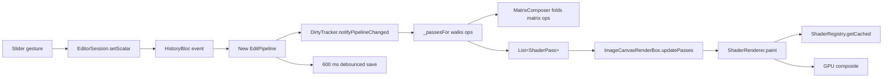

# 01 — Architecture Overview

## Purpose

Give a map of the codebase before diving into any one subsystem. Covers the layering (app → features → engine → core → AI), how DI is wired, and the end-to-end path a pixel takes from disk to screen. Every later chapter zooms into one box in this map; read this one first to know which box.

## Top-level layout

```
lib/
├── main.dart            — runApp entry
├── bootstrap.dart       — async init: memory budget, shader preload, AI subsystem
├── app.dart             — root MaterialApp.router + theme
├── core/                — cross-cutting: logging, theme, routing, memory, platform
├── di/providers.dart    — Riverpod providers (single file)
├── engine/              — pure engine: pipeline, rendering, history, presets, layers
├── ai/                  — runtimes (LiteRT/ORT), model manifest, per-feature services
├── features/
│   ├── editor/          — main editor route + session + tool panels
│   ├── scanner/         — document scanner
│   ├── collage/         — multi-image collage
│   ├── home/            — feature picker + recent projects
│   └── settings/        — theme, logging, model manager
├── plugins/             — native plugin bridges (platform-specific wrappers)
└── shaders/             — fragment shader wrappers (Dart side)
```

The three most important shape rules:

1. **`engine/` never imports `features/`.** The engine is pure — it takes a pipeline in, produces an image out. Every feature module is a client of the engine, never the other way around.
2. **`core/` never imports `engine/` or `features/`.** Core is truly foundational: logging, theme, platform abstractions. Anything that would need domain awareness lives one level up.
3. **`di/providers.dart` is the *only* Riverpod-provider file.** All singletons are constructed during `bootstrap()` and re-exposed via providers from this one file. No module owns its own provider declarations — that keeps the graph readable and tests overridable.

Fragment shaders are authored twice by convention: the raw `.frag` lives at repo-root `shaders/`, while the Dart wrapper that builds uniform payloads lives at `lib/engine/rendering/shaders/`. Only the Dart side shows up in imports.

## Data model at the top

| Concept | Where it lives | Who owns the state |
|---|---|---|
| Parametric edit state | `EditPipeline` | `HistoryBloc` (one per editor session) |
| Rendered preview | `ui.Image` (proxy + per-op cache) | `DirtyTracker` inside the session |
| Session lifecycle | `EditorSession` ([editor_session.dart](../../lib/features/editor/presentation/notifiers/editor_session.dart)) | `EditorNotifier` (one per open image) |
| App-wide singletons | `BootstrapResult` | injected once via `bootstrapResultProvider` override |
| Device constraints | `MemoryBudget` | probed once during bootstrap |

Every editor session (`EditorSession`) is a short-lived object tied to one open image. It composes: the pipeline (via `HistoryBloc`), the proxy image (via `ProxyManager`), the memento store (one per session), the dirty tracker, and the curve/LUT caches. When the user opens a second image, a brand-new session is built and the old one disposes its image resources — nothing is shared between sessions except the globally-cached shader programs and AI runtimes.

## Startup flow

```mermaid
flowchart TD
  Main[main.dart] --> HydrateLog[hydratePersistedLogLevel]
  Main --> Bootstrap[bootstrap&#40;&#41;]
  Bootstrap --> Probe[MemoryBudget.probe]
  Bootstrap --> Cache[ImageCachePolicy.apply]
  Bootstrap --> Shaders[ShaderRegistry.preload all]
  Bootstrap --> AI[ModelManifest + Registry + Runtimes]
  Bootstrap --> Factory[BgRemovalFactory]
  Main --> RunApp[runApp ProviderScope]
  RunApp --> Overrides[bootstrapResultProvider override]
  Overrides --> App[ImageEditorApp - MaterialApp.router]
  App --> Router[GoRouter]
  Router --> Home[/ Home/]
  Router --> Editor[/editor - EditorPage/]
  Router --> Scanner[/scanner/*/]
  Router --> Collage[/collage/]
```



### Runtime walk

1. **`main()`** at [main.dart:9](../../lib/main.dart) awaits `hydratePersistedLogLevel()` so early bootstrap logs already respect the user's debug/info/warning choice, then awaits `bootstrap()`.
2. **`bootstrap()`** at [bootstrap.dart:32](../../lib/bootstrap.dart) sets `AppLogger.level` from build mode, installs a `FlutterError.onError` sink, probes `MemoryBudget`, applies `ImageCachePolicy`, fires an unawaited `ShaderRegistry.preload(ShaderKeys.all)`, and loads the AI subsystem (manifest → cache → registry → runtimes → factories). It returns a `BootstrapResult` bag.
3. **`runApp`** wraps the app in a `ProviderScope` that overrides `bootstrapResultProvider` with the bag ([main.dart:15](../../lib/main.dart)). That override is the whole DI mechanism — every other provider reads from it.
4. **`ImageEditorApp`** at [app.dart:9](../../lib/app.dart) watches `themeModeControllerProvider` and returns `MaterialApp.router(routerConfig: appRouter)`.
5. **`appRouter`** at [app_router.dart:16](../../lib/core/routing/app_router.dart) declares the ten routes: `/`, `/editor`, `/scanner`, `/scanner/crop`, `/scanner/review`, `/scanner/export`, `/scanner/history`, `/collage`, `/settings`. The editor takes its `sourcePath` from `state.extra`; a null path renders a fallback scaffold instead of crashing.

## How a pixel reaches the screen

This is the hot path for the editor. Scanner and collage have analogous (simpler) flows covered in their chapters.



Key handoffs:

1. **UI → Session**: panel widgets never touch the pipeline directly. They call `session.setScalar(type, value)` (or an op-specific helper). The session owns the shape rules (e.g. "drop at identity").
2. **Session → Bloc → Pipeline**: mutations go through `HistoryBloc` events ([history_bloc.dart:27](../../lib/engine/history/history_bloc.dart)). The bloc holds the `HistoryManager`, which owns the committed pipeline. See [History & Memento Store](04-history-and-memento.md).
3. **Pipeline → Dirty Tracker**: the session hands the new pipeline to `DirtyTracker`, which diffs common prefix and disposes stale cached `ui.Image`s. See [Parametric Pipeline](02-parametric-pipeline.md).
4. **Pipeline → Passes**: `RenderDriver.passesFor()` at [render_driver.dart:125](../../lib/features/editor/presentation/notifiers/render_driver.dart:125) translates the pipeline into an ordered `List<ShaderPass>` by walking the ordered `editorPassBuilders` list in [pass_builders.dart:119](../../lib/features/editor/presentation/notifiers/pass_builders.dart:119). Matrix ops fold into one pass; each non-matrix op emits its own. See [Rendering Chain & Tone Curves](03-rendering-chain.md).
5. **Passes → Render box**: `ImageCanvasRenderBox.updatePasses(...)` updates the pass list and calls `markNeedsPaint` without `markNeedsLayout` ([image_canvas_render_box.dart:54](../../lib/engine/rendering/image_canvas_render_box.dart)). This is the blueprint's explicit "paint-only" optimisation — slider drags never re-layout.
6. **Render box → GPU**: `ShaderRenderer` walks the pass list, allocates an offscreen `PictureRecorder` per intermediate result, and draws the final pass to the screen canvas at display size. `ShaderRegistry` is the shared `FragmentProgram` cache — shaders are loaded once per app lifetime.
7. **Pipeline → Auto-save**: in parallel, the session's 600 ms debounce timer — extracted in Phase VII.1 into `AutoSaveController` ([auto_save_controller.dart:36](../../lib/features/editor/presentation/notifiers/auto_save_controller.dart:36)) — writes the pipeline to `ProjectStore` keyed by `sha256(sourcePath)`. See [Persistence & Memory](05-persistence-and-memory.md).

## Dependency injection

All DI runs through [di/providers.dart](../../lib/di/providers.dart) — 91 lines, one file, no sub-files.

The mechanism is unusual and worth stating plainly: `bootstrapResultProvider` throws `UnimplementedError` by default. It is *only* usable once `main()` has overridden it with a concrete `BootstrapResult` ([providers.dart:18](../../lib/di/providers.dart)). Every downstream provider (`memoryBudgetProvider`, `proxyManagerProvider`, `modelRegistryProvider`, `liteRtRuntimeProvider`, `ortRuntimeProvider`, `bgRemovalFactoryProvider`, etc.) simply reads a field off that bag. The pattern has one nice property and one quirk:

- **Tests skip `bootstrap()`** by constructing a fake `BootstrapResult` (stub runtimes, empty manifest) and overriding the provider at the test's `ProviderScope`. No module-specific mocking needed.
- Some providers look like they have no factory logic because they don't — they are one-liners that forward a bootstrap field. If you wonder "where is the memory budget configured?", the answer is `MemoryBudget.probe()` inside `bootstrap()`, not inside the provider.

Session-scoped state (`EditorNotifier`) lives in the same file ([providers.dart:41](../../lib/di/providers.dart)) but is not populated by bootstrap — it's a `StateNotifierProvider` that constructs per-subscription.

## Feature module anatomy

Every feature module under `lib/features/` is organized the same way:

```
features/<name>/
├── domain/         — pure models (no Flutter imports)
├── data/           — persistence + IO (e.g. project_store.dart, exporters)
├── application/    — Riverpod notifiers / Blocs
└── presentation/
    ├── pages/      — GoRouter destinations
    ├── widgets/    — reusable feature widgets
    ├── notifiers/  — widget-scoped state
    └── sheets/     — modal surfaces
```

Not every module has every layer — e.g. `collage/` is small enough that it collapses to `domain` + `application` + `presentation`. The `editor/` module is the biggest; its `presentation/notifiers/editor_session.dart` is 2132 lines, by far the largest single file in the codebase.

## Cross-cutting systems

| System | Entry | Chapter |
|---|---|---|
| Logging (`AppLogger`, key=val format) | [app_logger.dart](../../lib/core/logging/app_logger.dart) | — |
| Theme (light/dark + mode controller) | [app_theme.dart](../../lib/core/theme/app_theme.dart), [theme_mode_controller.dart](../../lib/core/theme/theme_mode_controller.dart) | [40 — Other surfaces](40-other-surfaces.md) |
| Routing (GoRouter) | [app_router.dart](../../lib/core/routing/app_router.dart) | [40 — Other surfaces](40-other-surfaces.md) |
| Memory budget | [memory_budget.dart](../../lib/core/memory/memory_budget.dart) | [05](05-persistence-and-memory.md) |
| Image cache policy (Flutter #178264) | [image_cache_policy.dart](../../lib/core/memory/image_cache_policy.dart) | [05](05-persistence-and-memory.md) |
| UI image disposer (ref-counted) | [ui_image_disposer.dart](../../lib/core/memory/ui_image_disposer.dart) | [05](05-persistence-and-memory.md) |
| Haptics / platform abstraction | `lib/core/platform/` | — |
| Preferences (first-run flag, log level) | `lib/core/preferences/` | — |

## Native plugin surface

`lib/plugins/` and platform-side code under `android/` and `ios/` expose two native integrations worth knowing about upfront:

- **`com.imageeditor/play_services`** (Android only) — method channel queried during scanner capability probe to check `GoogleApiAvailability.isGooglePlayServicesAvailable()`. Used to decide whether ML-Kit-backed native document scanning is offered. See [Scanner Capture & Detection](30-scanner-capture.md).
- **`cunning_document_scanner`** — pub package that wraps VisionKit (iOS) / ML Kit (Android) for native scan capture.

AI runtimes (ORT, LiteRT) also ride native channels but are abstracted behind runtime wrappers in `lib/ai/runtime/`.

## What isn't covered in this chapter

- **How ops fold into shader passes** (matrix composition + per-op branching in `_passesFor()`) → [Rendering Chain & Tone Curves](03-rendering-chain.md).
- **How history survives kills** (memento spill + project store debounce) → [History & Memento Store](04-history-and-memento.md) + [Persistence & Memory](05-persistence-and-memory.md).
- **How AI features gate on models** (manifest, downloader, dispose-guard) → [AI Runtime & Models](20-ai-runtime-and-models.md).
- **How the scanner chain is different from the editor** → Phase 4 chapters.

## Key code paths

- [main.dart:9 `main`](../../lib/main.dart:9) — the whole startup sequence fits on one screen.
- [bootstrap.dart:32 `bootstrap`](../../lib/bootstrap.dart:32) — single source of truth for app-wide init. AI-load failures are swallowed to keep the editor booting.
- [providers.dart:18 `bootstrapResultProvider`](../../lib/di/providers.dart:18) — the throw-by-default seam that makes `main()` the only place allowed to construct real singletons.
- [app_router.dart:16](../../lib/core/routing/app_router.dart:16) — flat GoRouter; no nested shell routes today.
- [render_driver.dart:125 `passesFor`](../../lib/features/editor/presentation/notifiers/render_driver.dart:125) — where the pipeline becomes a list of shader passes. Central choke point; most perf work ends up touching this function. The per-op builders live in [pass_builders.dart](../../lib/features/editor/presentation/notifiers/pass_builders.dart) (Phase VII.3 split `_passesFor` out of `EditorSession`).

## Tests

- `test/` mirrors `lib/` path-for-path. Engine has the best coverage (pipeline, history, presets). Bootstrap itself is not tested — it fans into stubs that *are* tested individually, and `bootstrapResultProvider.overrideWithValue(fake)` covers the contract from the client side.
- No architectural-fitness tests (e.g. "engine imports nothing from features"). The import discipline is enforced by convention and code review only.

## Known limits & improvement candidates

- **`[maintainability]` The provider graph is a bag, not a DI container.** `BootstrapResult` has 10 fields today. Each new AI feature (super-res, style, colorize) adds another field *and* another mirror provider. An instance-of-interface pattern (`GetIt`, or a tagged `ProviderFamily`) would scale better once the bag hits 15+ fields. Cost of change is low — every provider is a one-liner.
- **`[maintainability]` Import discipline is unenforced.** Nothing prevents a `features/` file from importing another feature's `presentation/` layer (or `engine/` importing `features/`). A static check (`import_lint`, `dependency_validator`, or a custom `analysis_options.yaml` rule) would lock the layering.
- **`[correctness]` Bootstrap silently degrades.** If `ModelManifest.loadFromAssets` throws, the manifest becomes empty and every AI service other than bundled MediaPipe fails silently at first use. The user sees a generic "AI unavailable" later rather than a startup-time warning. A visible non-fatal banner in the Model Manager would surface this.
- **`[perf]` Shader preload is fire-and-forget.** `unawaited(ShaderRegistry.instance.preload(...))` at [bootstrap.dart:61](../../lib/bootstrap.dart:61) means the first slider drag can race the preload and hit `getCached == null`, falling back to "draw intermediate unchanged" for a frame. The UX impact is low (one dropped frame) but the result is nondeterministic — could await with a timeout, or gate the editor's first frame on it.
- **`[test-gap]` No test for the `bootstrapResultProvider` throw contract.** The throw-by-default is the whole DI seam; a single test that `ProviderContainer()` without override throws the expected `UnimplementedError` would guard future accidental fallback values.
- **`[ux]` The router has no deep-link validation.** `/editor` with a missing `extra` renders a "No image selected" scaffold ([app_router.dart:27](../../lib/core/routing/app_router.dart:27)), which is dead-end UX. Redirecting to `/` with a snackbar would recover.
- **`[maintainability]` `editor_session.dart` is 2132 lines.** It mixes pipeline orchestration, render pass construction, LUT baking, AI service coordination, auto-save, and gesture handling. Splitting by concern (pipeline facade, render driver, auto-save, AI adapters) would make each half easier to test and reason about — but it touches every feature-panel caller, so best done as a documented refactor rather than incremental.
