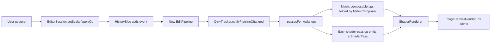

# 02 — Parametric Pipeline

## Purpose

The editor is **parametric**, not destructive: the source image on disk is never mutated, and pixels shown on screen are always re-derived from an ordered list of `EditOperation`s. That list is the `EditPipeline` — the single source of truth for what an edit session *is*. Every other engine subsystem (rendering, history, auto-save, presets, AI) is downstream of it.

Keeping edits parametric is what makes unlimited undo, non-destructive AI ops, and presets-as-JSON possible. It also means the pipeline must be cheap to mutate and cheap to diff — the dirty tracker cares which op changed, not how the final pixel looks.

## Data model

| Type | File | Role |
|---|---|---|
| `EditPipeline` | [edit_pipeline.dart:21](../../lib/engine/pipeline/edit_pipeline.dart) | Immutable Freezed class: `originalImagePath`, `List<EditOperation> operations`, `metadata`, schema `version`. Root of the session. |
| `EditOperation` | [edit_operation.dart:26](../../lib/engine/pipeline/edit_operation.dart) | Immutable Freezed class: `id`, `type`, `parameters` map, `enabled`, optional `mask`, `timestamp`, optional `layerId`. |
| `EditOpType` | [edit_op_type.dart:6](../../lib/engine/pipeline/edit_op_type.dart) | Canonical string constants (`'color.brightness'`, `'fx.vignette'`, …) plus three classifier sets: `matrixComposable`, `mementoRequired`, `shaderPassRequired`, `presetReplaceable`. |
| `OpSpec` | [op_spec.dart:14](../../lib/engine/pipeline/op_spec.dart) | Per-parameter metadata: `min`, `max`, `identity`, `paramKey`, `group`, category, label. Drives both the UI slider panels and the "drop op at identity" rule. |
| `OpCategory` | [op_spec.dart:47](../../lib/engine/pipeline/op_spec.dart) | `light | color | effects | detail | optics | geometry`. Maps to the dock tabs. |
| `PipelineReaders` | [pipeline_extensions.dart:18](../../lib/engine/pipeline/pipeline_extensions.dart) | Extension on `EditPipeline` with typed getters (`brightnessValue`, `toneCurves`, `contentLayers`, `geometryState`, …) so widgets don't `firstWhere` through the ops list. |
| `DirtyTracker` | [dirty_tracker.dart:20](../../lib/engine/pipeline/dirty_tracker.dart) | Holds `firstDirtyIndex` and an `opId → ui.Image` cache of intermediate renders. Invalidated by `notifyPipelineChanged()`. |
| `PipelineSerializer` | [pipeline_serializer.dart:17](../../lib/engine/pipeline/pipeline_serializer.dart) | JSON + optional gzip round-trip with a magic byte and a `_migrate()` seam. |

### Op categorisation sets

`OpRegistry` (Phase III.1) defines four disjoint-ish sets that drive how the engine handles each op. They previously lived as standalone `const Set<String>` fields on `EditOpType`; registering a new op now means one entry in `OpRegistry._entries` with boolean flags instead of touching four sets in sync.

- **`matrixComposable`** — brightness, contrast, saturation, hue, exposure, channel mixer. Folded into one 5×4 color matrix and applied in a single shader pass. [op_registry.dart:870](../../lib/engine/pipeline/op_registry.dart:870).
- **`shaderPassRequired`** — highlights, shadows, levels, toneCurve, hsl, splitToning, lut3d, vignette, grain, aberration, glitch, pixelate, halftone, sharpen, gaussian/motion/radial/tiltShift, bilateral denoise, perspective. Each gets its own `.frag` pass. [op_registry.dart:891](../../lib/engine/pipeline/op_registry.dart:891).
- **`mementoRequired`** — every `ai.*` op plus `drawing`. Cannot be reversed analytically, so history captures a raster snapshot. [op_registry.dart:877](../../lib/engine/pipeline/op_registry.dart:877).
- **`presetReplaceable`** — the colour/effect/blur ops a preset is allowed to overwrite in *reset* mode. Layers, geometry, masks, and AI ops are deliberately excluded. [op_registry.dart:884](../../lib/engine/pipeline/op_registry.dart:884).

Classification is string-based, set-membership only. There is no enum hierarchy and no subclass of `EditOperation` per op type — this keeps Freezed/JSON round-trip trivial at the cost of having every op share one `Map<String, dynamic> parameters`.

## Flow

### Runtime walk

1. **User moves a slider.** The editor's tool panel calls `EditorSession.setScalar(type, value, paramKey)` (or an op-specific helper for multi-param ops). See the handlers in [editor_session.dart](../../lib/features/editor/presentation/notifiers/editor_session.dart).
2. **Session routes to history.** `setScalar` dispatches an event on `historyBloc`. The bloc folds it into the current pipeline and emits a new `HistoryState` — the session's `state.pipeline` updates reactively.
3. **Identity collapse.** If every `OpSpec` in `OpSpecs.paramsForType(type)` now reports identity, the session omits the op entirely instead of storing an inert one. This keeps the shader chain short. [op_spec.dart:113](../../lib/engine/pipeline/op_spec.dart:113) (`paramsForType`) + the caller in `editor_session.dart`.
4. **Dirty tracking.** The session hands the new pipeline to `DirtyTracker.notifyPipelineChanged(next)`. The tracker compares op ids + parameters + enabled + mask pairwise with the previous pipeline and sets `_firstDirtyIndex` to the first divergence ([dirty_tracker.dart:95](../../lib/engine/pipeline/dirty_tracker.dart)). Cached images keyed by ops at or after that index are disposed ([dirty_tracker.dart:74](../../lib/engine/pipeline/dirty_tracker.dart)).
5. **Pass assembly.** `RenderDriver.passesFor()` ([render_driver.dart:125](../../lib/features/editor/presentation/notifiers/render_driver.dart:125)) walks `pipeline.operations`, folds all matrix-composable ops with `MatrixComposer.compose()` ([matrix_composer.dart:35](../../lib/engine/pipeline/matrix_composer.dart)), then emits one `ShaderPass` per `shaderPassRequired` op in encounter order via the `editorPassBuilders` list in [pass_builders.dart](../../lib/features/editor/presentation/notifiers/pass_builders.dart). Layer ops become separate composite passes. Disabled ops are skipped via `activeOperations`.
6. **Render.** `ShaderRenderer` samples the last cached image for each pass start (via `DirtyTracker.cachedOutputFor(opId)`), applies the pass, and caches the output by op id before feeding it into the next pass. See [Rendering Chain](03-rendering-chain.md) for the pass-batching rules.
7. **Persistence.** The auto-save debouncer watches `state.pipeline`; 600 ms after the last mutation, `PipelineSerializer.encode(pipeline)` writes JSON (+gzip if >64 KB) to the project store keyed by `sha256(originalImagePath)`. See [Project Store & Auto-Save](05-project-store-and-autosave.md).

### Compare-hold (tap-and-hold before/after)

`setAllOpsEnabledTransient(false)` at [editor_session.dart:451](../../lib/features/editor/presentation/notifiers/editor_session.dart:451) dispatches `SetAllOpsEnabled(false)` to the bloc. Because this fans out through the normal history event, undo/redo still work — the "transient" aspect is that the tap-release handler restores the flags without writing a *new* history entry. During the hold, the dirty tracker fully invalidates (every op changed its `enabled` flag), so the render falls back to the original proxy. This is why compare-hold shows a pixel-accurate "before" without a separate render path.

### Serialization

`PipelineSerializer.encode()` stamps `currentVersion` (1 today), UTF-8 encodes the JSON, and gzips when `> 64 KB`. The first byte is a magic marker: `0x00` plain, `0x01` gzip. `decode()` branches on the marker and pipes through `_migrate()` before `EditPipeline.fromJson`. Migrations are a no-op today; the seam exists so a future schema bump doesn't require a SQL-style migration pass. [pipeline_serializer.dart:31](../../lib/engine/pipeline/pipeline_serializer.dart).

`encodeJsonString` / `decodeJsonString` skip the marker byte — they exist for contexts that always speak raw JSON (tests, debug dumps, any future Rust bridge). Both paths share the `_migrate()` call.

## Key code paths

- [edit_pipeline.dart:40 `append`](../../lib/engine/pipeline/edit_pipeline.dart:40) — every pipeline mutation returns a new `EditPipeline` via Freezed `copyWith`. Immutability is load-bearing for the dirty tracker's prefix comparison.
- [edit_pipeline.dart:67 `reorderLayers`](../../lib/engine/pipeline/edit_pipeline.dart:67) — moves a layer op within the layer slot subset while preserving the positions of colour/geometry ops. Takes an `isLayer` predicate so the pipeline file doesn't import the layer taxonomy.
- [edit_operation.dart:65 `isMatrixComposable` / `needsShaderPass` / `requiresMemento`](../../lib/engine/pipeline/edit_operation.dart:65) — convenience getters over the `EditOpType` classifier sets. Everything else in the engine branches on these.
- [matrix_composer.dart:35 `compose`](../../lib/engine/pipeline/matrix_composer.dart:35) — folds all matrix-composable ops in encounter order, multiplied right-to-left so later ops see earlier ops' output.
- [dirty_tracker.dart:47 `notifyPipelineChanged`](../../lib/engine/pipeline/dirty_tracker.dart:47) — common-prefix diff; everything from the first divergence onwards is rendered; everything before is reused from cache.
- [pipeline_extensions.dart:192 `geometryState`](../../lib/engine/pipeline/pipeline_extensions.dart:192) — derives the combined rotate/flip/straighten/crop state from the pipeline. Used by the canvas to transform before the colour chain runs.
- [pipeline_extensions.dart:59 `toneCurves`](../../lib/engine/pipeline/pipeline_extensions.dart:59) — reads master + R/G/B curves off the first enabled `toneCurve` op; returns `null` when every channel is at identity so the `CurveLutBaker` can skip.
- [pipeline_extensions.dart:237 `activeCategories`](../../lib/engine/pipeline/pipeline_extensions.dart:237) — used by the dock to show the "edit dot" on category tabs; checks identity per-spec rather than "op exists."

## Tests

- `test/engine/pipeline/edit_pipeline_test.dart` — append, insert, remove, replace, reorder, findById.
- `test/engine/pipeline/matrix_composer_test.dart` — identity, each matrix primitive, composition order, channel mixer length guards.
- `test/engine/pipeline/pipeline_serializer_test.dart` — round-trip, gzip threshold, unknown marker rejection.
- `test/engine/pipeline/dirty_tracker_test.dart` — common-prefix detection across insert/remove/reorder, cache disposal under moves.
- `test/engine/pipeline/tone_curve_set_test.dart` + `pipeline_extensions_test.dart` — `toneCurves`, `geometryState`, `activeCategories`.

Coverage is solid at this layer — the pipeline is one of the best-tested parts of the engine. Gaps are in the consumers (editor widget tests) not the pipeline itself.

## Known limits & improvement candidates

- **`[correctness]` Parameters map is untyped.** `Map<String, dynamic>` for `EditOperation.parameters` means every op reader (`doubleParam`, `intParam`, custom readers in `PipelineReaders`) re-validates shape at read time. A typo in a parameter key silently returns identity. A sealed class hierarchy (or a param-schema registry keyed off `EditOpType`) would catch these at construction.
- **`[maintainability]` Four classifier sets in `EditOpType` must stay in sync.** Adding a new op type today means remembering to edit `matrixComposable` / `shaderPassRequired` / `mementoRequired` / `presetReplaceable`. Miss one and the op silently renders wrong or refuses to undo. A single per-op declaration (`registerOp('fx.foo', shaderPass: true, memento: false, …)`) would centralise this.
- **`[correctness]` `DirtyTracker._mapEquals` is shallow.** It compares `parameters` values with `==`, which works for numbers and strings but fails for `List` / `Map` values (different instances with the same contents compare unequal, forcing an unnecessary re-render). HSL and split-toning ops carry list parameters and hit this.
- **`[perf]` Matrix composition rebuilds `Float32List` on every slider tick.** `MatrixComposer.compose` allocates a new 20-element buffer per op per tick. Under aggressive drag (60 Hz × several matrix ops) this is pressure on the young-gen. A reusable scratch buffer on the composer would eliminate the allocs.
- **`[correctness]` Migration seam is present but untested.** `_migrate()` in `PipelineSerializer` is a no-op with `currentVersion = 1`. When the schema bumps, there is no test ensuring older-version fixtures still load. Worth checking in a v0→v1 fixture (even synthetic) so the first real migration has a regression target.
- **`[ux]` Compare-hold fully invalidates the dirty cache.** Flipping every op's `enabled` bit forces `DirtyTracker` to dispose every cached intermediate, so releasing the hold re-renders from scratch. For a pipeline with expensive AI ops the hold-release moment is jarring. The invalidation is correct behaviour for the current data model, but if the tracker keyed caches by `(opId, enabled)` or a separate "disabled-view" snapshot, the release would be instant.
- **`[test-gap]` No test for `reorderLayers` vs. mixed non-layer ops.** Unit coverage verifies the layer-only reorder preserves relative order, but doesn't assert that interleaved `color.*` / `geom.*` ops stay put. The logic is correct; the test would be cheap regression insurance.
- **`[test-gap]` No test asserts `presetReplaceable` excludes every AI op.** Adding a new `ai.*` constant and forgetting to omit it from `presetReplaceable` would silently let presets clobber AI raster results. A generated test (iterate `ai.*` constants, assert none appear in the set) would pin this.
