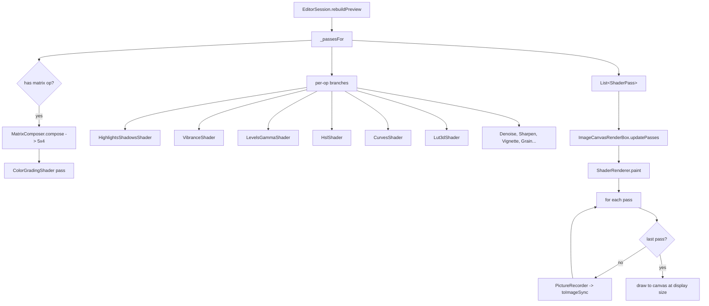

# 03 — Rendering Chain & Tone Curves

## Purpose

Turn an `EditPipeline` into pixels on screen. This chapter covers everything between "the pipeline changed" and "the GPU drew a frame": pass assembly, shader caching, the per-frame paint path, and the tone-curve LUT bake that feeds `shaders/curves.frag`. The design target from the blueprint is **< 5 ms for a full color chain at 1080p** — the patterns below exist to hit that.

Prerequisite: [Parametric Pipeline](02-parametric-pipeline.md). That chapter's `_passesFor()` reference is the first function we look at here.

## Data model

| Type | File | Role |
|---|---|---|
| `ShaderPass` | [shader_pass.dart:9](../../lib/engine/rendering/shader_pass.dart) | Immutable description of one shader invocation: `assetKey`, a `setUniforms` callback, extra `samplers`, optional `intensity`. |
| `ShaderKeys` | [shader_keys.dart:6](../../lib/engine/rendering/shader_keys.dart) | String constants for every `.frag` the app ships. `ShaderKeys.all` feeds the preload. |
| `ShaderRegistry` | [shader_registry.dart:16](../../lib/engine/rendering/shader_registry.dart) | Process-wide singleton: lazy-load + cache `ui.FragmentProgram`, first-failure listeners, `preload()` for warm-up. |
| `ShaderRenderer` | [shader_renderer.dart:22](../../lib/engine/rendering/shader_renderer.dart) | `CustomPainter` that walks the pass list and draws through offscreen `PictureRecorder`s. |
| `ImageCanvasRenderBox` | [image_canvas_render_box.dart:19](../../lib/engine/rendering/image_canvas_render_box.dart) | `RenderBox` host that swaps pass lists via `markNeedsPaint` without `markNeedsLayout`. |
| `MatrixComposer` | [matrix_composer.dart:20](../../lib/engine/pipeline/matrix_composer.dart) | Folds every matrix-composable op into one 5×4 matrix. |
| `ShaderPass` wrappers | `lib/engine/rendering/shaders/*.dart` | Typed builders (`ColorGradingShader`, `HslShader`, `CurvesShader`, …). Each produces a `ShaderPass` via `toPass()`. |
| `ToneCurve` | [curve.dart:9](../../lib/engine/color/curve.dart) | Monotonic cubic (Fritsch-Carlson) curve evaluated to produce 256-entry LUT rows. |
| `ToneCurveSet` | [tone_curve_set.dart:42](../../lib/engine/pipeline/tone_curve_set.dart) | Four-channel bundle: master + R/G/B. Carries a stable `cacheKey`. |
| `CurveLutBaker` | [curve_lut_baker.dart:14](../../lib/engine/color/curve_lut_baker.dart) | Builds a 256×4 RGBA `ui.Image` from a `ToneCurveSet` for the shader to sample. |

## Flow



### Pass assembly — `RenderDriver.passesFor()`

Source: [render_driver.dart:125](../../lib/features/editor/presentation/notifiers/render_driver.dart:125) (Phase VII.3 moved this off `EditorSession`). The body walks the ordered `editorPassBuilders` list in [pass_builders.dart:119](../../lib/features/editor/presentation/notifiers/pass_builders.dart:119); each builder reads parameters via `PipelineReaders`, returns zero or more `ShaderPass` values, and the driver concatenates the results. Order matters: passes run top-to-bottom and each reads the previous one's output as `u_texture`.

Canonical order:

1. **Color matrix + exposure/temperature/tint** — one `ColorGradingShader` pass. Matrix ops (brightness, contrast, saturation, hue, channelMixer) are folded by `MatrixComposer.compose()`. Exposure / temperature / tint are non-multiplicative and ride as dedicated uniforms inside the same shader instead of joining the matrix. The pass is emitted only when at least one of these ops is enabled ([pass_builders.dart:150](../../lib/features/editor/presentation/notifiers/pass_builders.dart:150)).
2. **Highlights / shadows / whites / blacks** — `HighlightsShadowsShader`, one pass covering all four recovery knobs.
3. **Vibrance** — separate pass because the smart-saturation math differs from the matrix's global saturation.
4. **Dehaze** — midtone stretch approximation.
5. **Levels + gamma** — combined into `LevelsGammaShader` (input black/white, midtone gamma).
6. **HSL 8-band** — per-hue hue/saturation/luminance deltas packed as three 8-float arrays.
7. **Split toning** — shadow/highlight tints with a balance bias.
8. **Tone curves (LUT)** — pass present *only* if the baked LUT is ready. The bake is async (see below). First appearance of a new curve shape triggers the bake and skips this pass for one frame.
9. **3D LUT (filter preset)** — per-op, one pass each via `LutAssetCache`. Missing LUTs kick off an async load and skip for one frame.
10. **Detail passes**: bilateral denoise → sharpen.
11. **Blur passes**: tilt-shift, motion blur, radial blur (depending on which ops are enabled).
12. **Effects**: vignette, chromatic aberration, pixelate, halftone, glitch, grain.
13. **Perspective warp** — geometry pass (non-color pixel relocation).
14. **Layer composition** — text / sticker / drawing / raster / adjustment layers. Each layer op emits its own pass with appropriate blend.

No single pipeline runs all of these; the blueprint target assumes 3–5 active passes in a typical session.

### Matrix fold — the fast path

Six op types are matrix-composable: brightness, contrast, saturation, hue, exposure, channelMixer (see [Parametric Pipeline](02-parametric-pipeline.md)'s classifier sets). `MatrixComposer.compose()` ([matrix_composer.dart:35](../../lib/engine/pipeline/matrix_composer.dart)) walks the enabled ops in order, multiplies each op's 5×4 matrix into a running accumulator, and returns one 20-element `Float32List`. The composed matrix is uploaded as 16 consecutive floats via `ShaderPass.uploadMat4` — Flutter's `FragmentShader` API doesn't support matrix uniforms natively, so every matrix uniform is packed as row-major floats.

Note that at [pass_builders.dart:163](../../lib/features/editor/presentation/notifiers/pass_builders.dart:163), exposure / temperature / tint are passed *alongside* the matrix into `ColorGradingShader`, not multiplied into it. Temperature and tint are linear-ish but non-multiplicative — folding them would either lose precision or require a larger matrix form. Exposure is similarly kept out because it's applied in linear light inside the shader (after gamma decoding) while the matrix operates in sRGB.

### Per-frame paint — `ShaderRenderer.paint`

Source: [shader_renderer.dart:36](../../lib/engine/rendering/shader_renderer.dart:36). The rules:

1. **Empty pass list** → draw source as-is with `FilterQuality.medium`, return.
2. **Intermediate resolution** ≠ display size. Intermediates render at `source.width × source.height` (the preview proxy's native resolution, already memory-budgeted). Otherwise every pass would downsample toward the widget's logical pixel size and a 3–5 pass stack would visibly soften the photo ([shader_renderer.dart:42](../../lib/engine/rendering/shader_renderer.dart:42)).
3. **Pass loop** — for each pass:
   - Grab the `FragmentProgram` from `ShaderRegistry.getCached(assetKey)`. If missing, fire an async `load()`, draw the current intermediate as fallback, and return. Next frame the chain includes the pass.
   - If this is the last pass, write directly to the screen canvas at display size — Flutter's compositor handles the HiDPI up-scale.
   - Otherwise, record into a `PictureRecorder`, call `picture.toImageSync(w, h)` at intermediate resolution, dispose the picture, and make the result the next pass's input. The previous intermediate (if it wasn't the caller-owned `source`) is disposed.
4. `_applyPass` uploads uniforms:
   - Index 0/1: `u_size` (width, height).
   - Sampler 0: `u_texture` (previous output).
   - Samplers 1+: extras declared on the pass (LUT textures, blurred companion textures).
   - Float index 2+: pass-specific uniforms via `pass.setUniforms(shader, 2)`.

### `ShaderRegistry` — loading and pre-warm

Every `.frag` is a Flutter asset declared in `pubspec.yaml`. `ui.FragmentProgram.fromAsset()` reads the compiled SPIR-V from the bundle; the first read per shader costs 1–5 ms and allocates GPU resources. `ShaderRegistry` ([shader_registry.dart:48](../../lib/engine/rendering/shader_registry.dart)) caches by asset key:

- `load(key)` returns the cached program or an in-flight future (deduping concurrent callers).
- `preload(keys)` fires parallel `load()` calls for warm-up. Bootstrap calls `preload(ShaderKeys.all)` inside `unawaited(...)` so the editor can open while shaders compile in the background.
- Failures are recorded in `_failed` (a set of keys) and notify each registered failure listener once per key. The editor's shell subscribes to these so a genuinely-missing shader surfaces as a snackbar rather than silently hiding a pass forever.
- `dispose()` clears everything; called on memory pressure warnings.

### `ImageCanvasRenderBox` — paint-only updates

Blueprint rule: when a slider moves, do `markNeedsPaint()`, not `markNeedsLayout()`. `ImageCanvasRenderBox` ([image_canvas_render_box.dart:19](../../lib/engine/rendering/image_canvas_render_box.dart)) exists to enforce that:

- Changing `source` (a new image) → `markNeedsLayout` (aspect ratio may have changed).
- Changing `passes` (every slider tick) → `markNeedsPaint` only.
- `updatePasses(next)` is the pure paint-only entry the session calls from its render driver.

`paint()` constructs a new `ShaderRenderer` per frame, which is fine because all the expensive state (`FragmentProgram`s) lives in the shared registry — the renderer itself is a thin wrapper.

## Tone curves

The tone-curve feature has three pieces: data model (points per channel), interpolation (Hermite-Fritsch-Carlson monotonic cubic), and a GPU-sampled 256×4 RGBA LUT.

### `ToneCurve` — evaluation

Source: [curve.dart:9](../../lib/engine/color/curve.dart). Control points are normalized to [0,1]² with at least two points (the endpoints). `evaluate(x)` binary-searches the segment, computes Fritsch-Carlson tangents for the surrounding points, and performs Hermite cubic interpolation:

```
h00*a.y + h10*dx*m0 + h01*b.y + h11*dx*m1
```

Monotonic interpolation matters for tone curves because a naive cubic can overshoot past 1.0 (blowing highlights) or below 0.0 (crushing shadows) even when every control point is in-bounds. Fritsch-Carlson clamps tangent magnitudes to `min(avg, 3*a_slope, 3*b_slope)` to guarantee monotonicity ([curve.dart:61](../../lib/engine/color/curve.dart:61)).

`ToneCurve.identity()` and `ToneCurve.sCurve(strength)` are convenience constructors used for UI previews and tests.

### `ToneCurveSet` — per-channel bundle

Source: [tone_curve_set.dart:42](../../lib/engine/pipeline/tone_curve_set.dart). Groups `master`, `red`, `green`, `blue` control-point lists — each nullable so an identity channel costs nothing. `cacheKey` is the deterministic identifier used for the baked-LUT cache:

```
m:0.0000,0.0000;1.0000,1.0000|r:_|g:_|b:_
```

Rounded to four decimals so sub-pixel drag jitter doesn't bust the cache mid-drag. Identity channels render as `_`.

The pipeline reader `PipelineReaders.toneCurves` ([pipeline_extensions.dart:59](../../lib/engine/pipeline/pipeline_extensions.dart:59)) reconstructs a `ToneCurveSet` from the `toneCurve` op's `parameters` and returns `null` when every channel is identity — this is how the session knows to skip the bake entirely.

### `CurveLutBaker` — 256×4 RGBA

Source: [curve_lut_baker.dart:14](../../lib/engine/color/curve_lut_baker.dart). Layout:

- Row 0 (y=0.125 in texel coords): master curve.
- Row 1 (y=0.375): red.
- Row 2 (y=0.625): green.
- Row 3 (y=0.875): blue.

Each row has 256 texels; the red channel of each texel stores the mapped output `evaluate(x/255)*255`. Green/blue/alpha mirror red so the fragment shader can `.r`-sample either direction. The bake evaluates the curve 256 times per channel (~1k calls max), packs a 4 KB byte array, and hands it to `ui.decodeImageFromPixels(RGBA8888)` which returns a `ui.Image`.

### Bake-and-cache dance in `passesFor()`

Owned by `RenderDriver` since Phase VII.3. State lives on the driver itself ([render_driver.dart:78](../../lib/features/editor/presentation/notifiers/render_driver.dart:78)):

- `_curveLutImage: ui.Image?` — the baked LUT texture.
- `_curveLutKey: String?` — `cacheKey` of the shape currently baked.
- `_curveLutLoading: bool` — an in-flight bake.

Rules:

1. Get `pipeline.toneCurves`. If `null` and we had a cached image, dispose it and clear both keys.
2. Otherwise compute the cache key.
3. If `_curveLutImage != null && _curveLutKey == key`, the cache is valid → append a `CurvesShader` pass using that image.
4. If the cache is stale and we're not already baking this key, call `bakeCurveLut(key, curveSet)` at [render_driver.dart:149](../../lib/features/editor/presentation/notifiers/render_driver.dart:149). The bake is async; the current frame renders without the curve pass and `rebuildPreview()` is called once the bake lands.
5. Race protection: if the user authored a newer curve during the bake (`_curveLutKey` moved on), the finished bake's image is disposed rather than installed ([render_driver.dart:182](../../lib/features/editor/presentation/notifiers/render_driver.dart:182)).

The 3D LUT path (`filter.lut3d` op) follows the same pattern via `LutAssetCache` — load async, skip the pass for one frame, rebuild when the PNG decodes.

## Key code paths

- [shader_renderer.dart:36 `paint`](../../lib/engine/rendering/shader_renderer.dart:36) — the per-frame pass loop. Read this to understand the offscreen-picture dance.
- [shader_registry.dart:48 `load`](../../lib/engine/rendering/shader_registry.dart:48) — lazy + deduped shader loading. First-use fallback is "draw previous intermediate, try again next frame."
- [image_canvas_render_box.dart:54 `updatePasses`](../../lib/engine/rendering/image_canvas_render_box.dart:54) — the paint-only update seam; slider drags land here.
- [render_driver.dart:125 `passesFor`](../../lib/features/editor/presentation/notifiers/render_driver.dart:125) — the pass-assembly function. The ordering decisions live in the `editorPassBuilders` list in [pass_builders.dart:119](../../lib/features/editor/presentation/notifiers/pass_builders.dart:119).
- [render_driver.dart:149 `bakeCurveLut`](../../lib/features/editor/presentation/notifiers/render_driver.dart:149) — async bake with race guard.
- [matrix_composer.dart:35 `compose`](../../lib/engine/pipeline/matrix_composer.dart:35) — the color-fold fast path.
- [shader_pass.dart:45 `uploadMat4`](../../lib/engine/rendering/shader_pass.dart:45) — helper for packing matrices into the float-uniform API.

## Tests

- `test/engine/rendering/shader_pass_test.dart` — uniform-setter contract, matrix upload.
- `test/engine/rendering/shader_registry_test.dart` — cache hit, dedupe, failure listener firing once.
- `test/engine/color/curve_test.dart` — Hermite interpolation, monotonicity under arbitrary control points, endpoint behaviour.
- `test/engine/color/curve_lut_baker_test.dart` — 256×4 RGBA output, identity curves, nullable channels.
- `test/engine/pipeline/tone_curve_set_test.dart` — `cacheKey` stability under jitter, `withChannel` behaviour.
- **Gap**: no integration test exercises `_passesFor()` end-to-end. The branches are trivially correct each, but a regression in ordering (e.g. HSL moved before the matrix pass) would pass every unit test and still render wrong.
- **Gap**: no golden test for the full color chain. Small per-pass deltas could accumulate without a pixel-diff alarm.

## Known limits & improvement candidates

- **`[perf]` `shouldRepaint` always returns true.** [shader_renderer.dart:158](../../lib/engine/rendering/shader_renderer.dart:158) comments "uniform changes are opaque to us" and repaints unconditionally. That's fine for the editor (slider drags really do need repaint) but means static canvases with no gesture still repaint on every `markNeedsPaint` bubble from ancestor widgets. Changing to a content-hash would save repaints on scroll and theme changes.
- **`[perf]` Intermediate `PictureRecorder` allocations.** Each non-final pass allocates a `PictureRecorder`, `Canvas`, `Picture`, and `ui.Image` per frame. A pipeline with 5 passes allocates 20 GPU / picture objects per frame. Pooling the intermediate images across frames (keeping two ping-pong textures at `previewLongEdge`) would remove the per-frame churn. This is the biggest single perf win available at this layer.
- **`[correctness]` `_passesFor()` branch order is implicit.** A contributor adding a new op has to guess where in the 300-line chain it belongs. The correct answer is "wherever the color science demands" but nothing documents or tests it. Extracting a declarative pass-order table (`List<({String type, ShaderPass Function(pipe) build})>`) would make the order reviewable in one screen and enable an ordering test.
- **`[perf]` Shader preload is parallel, unbounded.** `ShaderRegistry.preload(ShaderKeys.all)` fires 23 concurrent `FragmentProgram.fromAsset` reads. On mid-range Android devices this can contend with the image decode on first launch. A small `Pool` (say 4) would be nicer.
- **`[correctness]` Failure listeners fire once per key, forever.** After a shader load fails, every subsequent frame that tries to use it hits the cache miss, retries the load, fails again, but the listener does not fire again. Fine for a missing-asset case (it'll never load), but misleading for a transient GPU OOM — the user sees one snackbar and never hears about it again.
- **`[ux]` Missing-shader fallback is silent from the renderer.** `ShaderRenderer` draws the last intermediate when a shader isn't loaded yet, which is correct for first-frame races but identical-looking to "the shader is broken." Users can't tell why a filter seems to have no effect. The registry emits failure listeners for *hard* failures, but "still loading" is indistinguishable from "loaded".
- **`[perf]` Curve LUT bake runs on the UI isolate.** 256×4 pixel evaluations is cheap, but the `decodeImageFromPixels` call allocates a GPU texture on the main thread. On a sustained drag across a new curve shape this adds up. The bake is already async-gated, but offloading to a worker isolate would keep drag responsive on weaker devices.
- **`[test-gap]` No golden test for the color chain.** Per-pass shader unit tests exist; no pixel-level regression guard on their composition.
- **`[maintainability]` Shader wrappers and `.frag` files drift independently.** A uniform added to `curves.frag` requires a matching `CurvesShader.setUniforms` update with no compiler to catch a mismatch. Generating the wrapper from the `.frag` uniform block (or adding a runtime assertion that the uniform count matches) would catch this.
- **`[test-gap]` `_passesFor()` has no direct test.** It's a 300-line pure function of `EditPipeline` → `List<ShaderPass>`. A test that asserts pass count + asset key order for representative pipelines (identity, all-matrix, matrix+curves+LUT) is cheap and would lock ordering regressions.
