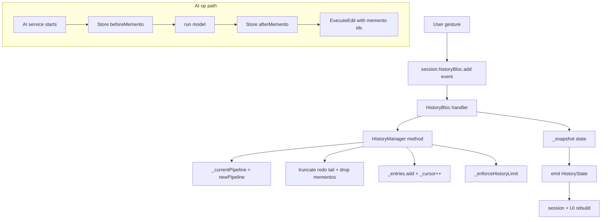

# 04 — History & Memento Store

## Purpose

Give the editor unlimited (up to a bounded cap) undo/redo across a mix of parametric and non-reversible ops. Parametric ops (every slider, layer add, preset) are cheap to undo — swap in the previous `EditPipeline`. Non-reversible ops (LaMa inpaint, background removal, style transfer, super-res, multi-stroke drawing) can't be reversed analytically — the pre-op pixels are gone. The `MementoStore` captures a raster snapshot for exactly those, keeps a small ring in RAM, and spills older ones to disk so a long AI-heavy session stays within a 200 MB disk budget.

This chapter covers the Bloc that mediates history, the `HistoryManager` that does the command bookkeeping, and the `MementoStore` that backs the raster captures.

## Data model

| Type | File | Role |
|---|---|---|
| `HistoryBloc` | [history_bloc.dart:15](../../lib/engine/history/history_bloc.dart) | Bloc wrapping `HistoryManager` with an event/state interface. Emits a new `HistoryState` on every mutation. |
| `HistoryEvent` (sealed) | [history_event.dart:6](../../lib/engine/history/history_event.dart) | Nine event subclasses: `ExecuteEdit`, `AppendEdit`, `UndoEdit`, `RedoEdit`, `ToggleOpEnabled`, `JumpToEntry`, `SetAllOpsEnabled`, `ClearHistory`, `ApplyPresetEvent`. |
| `HistoryState` | [history_state.dart:8](../../lib/engine/history/history_state.dart) | Equatable snapshot: `pipeline`, `canUndo`, `canRedo`, `entryCount`, `cursor`, `lastOpType`, `nextOpType`. |
| `HistoryManager` | [history_manager.dart:44](../../lib/engine/history/history_manager.dart) | Hybrid Command + Memento implementation. Owns the committed pipeline and the entries list. |
| `HistoryEntry` | [history_manager.dart:13](../../lib/engine/history/history_manager.dart) | One undo step: `op`, `beforePipeline`, `afterPipeline`, optional memento ids, timestamp. |
| `MementoStore` | [memento_store.dart:53](../../lib/engine/history/memento_store.dart) | RAM ring + disk-spill for raster snapshots. One store per session. |
| `Memento` | [memento_store.dart:21](../../lib/engine/history/memento_store.dart) | One snapshot: `id`, `opId`, `width`, `height`, `inMemory: Uint8List?`, `diskPath: String?`. |

### Why Bloc for history specifically

The editor uses Riverpod for most state. History is the exception — the blueprint picked Bloc because its explicit `Event → State` flow maps cleanly to the Command/Memento pattern ([history_bloc.dart:11](../../lib/engine/history/history_bloc.dart)). Events are named after user intents (`UndoEdit`, `ExecuteEdit`); the bloc's `on<T>` dispatch is the event→command mapping; `HistoryState` is the snapshot the UI reads. Mixing paradigms inside one module would be noise, but here it's a good fit.

## Flow

### Parametric edit (cheap path)

Example: the user drags the brightness slider. The editor session calls `historyBloc.add(ExecuteEdit(op: updated, afterParameters: {...}))`. The handler at [history_bloc.dart:62](../../lib/engine/history/history_bloc.dart):

1. Reconstructs the final op with `copyWith(parameters: afterParameters)`.
2. Checks whether the pipeline already contains this op id — decides between `replace` (in-place update) and `append` (new op).
3. Calls `_manager.execute(op, newPipeline)`.
4. `HistoryManager.execute` ([history_manager.dart:83](../../lib/engine/history/history_manager.dart)):
   - Builds a `HistoryEntry` with `beforePipeline = _currentPipeline`, `afterPipeline = newPipeline`.
   - If `_cursor < _entries.length - 1` (user had undone something), truncates the redo tail and drops mementos those entries owned.
   - Appends the entry, advances the cursor, updates `_currentPipeline`.
   - Calls `_enforceHistoryLimit()` — while over 128 entries, evict the oldest and drop its mementos.
5. The bloc emits a fresh `HistoryState` built by `_snapshot()`.

Cost per edit: one `HistoryEntry` object holding two references to immutable `EditPipeline` values. The pipelines themselves share structure because Freezed `copyWith` is shallow — the only new allocations are the changed op and the rebuilt `operations` list.

### Undo / redo

[history_bloc.dart:95](../../lib/engine/history/history_bloc.dart) and [:107](../../lib/engine/history/history_bloc.dart:107). Undo calls `_manager.undo()` which sets `_currentPipeline = entry.beforePipeline` and decrements the cursor. Redo re-applies `afterPipeline` and increments. Both are O(1). The bloc emits a new state either way.

`JumpToEntry(index)` ([history_manager.dart:134](../../lib/engine/history/history_manager.dart)) snaps directly to any entry — used by the history timeline sheet. `-1` means "before any edit"; the pipeline returns to `_entries.first.beforePipeline`.

### Non-reversible edit (memento path)

Example: background removal. The AI service knows the op requires a memento because `EditOpType.aiBackgroundRemoval` is in `mementoRequired` ([edit_op_type.dart:96](../../lib/engine/pipeline/edit_op_type.dart:96)). Order of operations:

1. Before running the model, the service reads the current pre-op pixels and calls `mementoStore.store(opId, width, height, bytes)`. Returns a `Memento` with an id.
2. The model runs (often in an isolate).
3. The service writes the result into the session's layer cache and stores a *second* memento for the post-op bytes.
4. The session dispatches `ExecuteEdit(op, afterParameters, beforeMementoId: before.id, afterMementoId: after.id)`.
5. `HistoryEntry` captures both ids.
6. On undo, the session's renderer reads `beforeMementoId`, looks it up in the store, reads the bytes, and uses them instead of re-running the model.
7. If a later history edit truncates the redo tail, `_dropRemovedMementos` ([history_manager.dart:172](../../lib/engine/history/history_manager.dart)) drops the mementos the evicted entries owned.

The bloc doesn't know about mementos directly — it just forwards the ids from the `ExecuteEdit` event into the entry. The store is owned by the session and injected into the manager.

### Compare-hold (tap-and-hold before/after)

`SetAllOpsEnabled` is special — it does *not* write a history entry. Source: [history_bloc.dart:131](../../lib/engine/history/history_bloc.dart).

- On press (`enabled: false`): `emit(_snapshot(pipeline: disabled))` — a synthesised `pipeline.setAllEnabled(false)` goes into the state *without* touching `_manager.currentPipeline`. The renderer sees a pipeline where every op is disabled and draws the original proxy.
- On release (`enabled: true`): `emit(_snapshot())` — the manager's current pipeline flows back through. Nothing was written, so there's nothing to undo.

This is the cleanest example in the codebase of state vs. commit separation: the state stream can carry transient views that the manager never sees.

### Preset apply (atomic multi-op)

`ApplyPresetEvent` ([history_event.dart:57](../../lib/engine/history/history_event.dart)) carries a pre-computed `EditPipeline` with all the preset's ops pre-applied. The handler ([history_bloc.dart:158](../../lib/engine/history/history_bloc.dart)) builds a single `preset.apply` marker op and calls `_manager.execute(marker, pipeline)`. The entire preset is one undo step. This matters because a preset like "Cinematic" might add tone curves, a 3D LUT, vignette, grain, and split toning — the user expects one undo to revert all of them.

## `MementoStore` — RAM ring + disk spill

Source: [memento_store.dart:53](../../lib/engine/history/memento_store.dart). Two budgets:

- `ramRingCapacity` (default 3): maximum in-memory mementos. Tuned to match `MemoryBudget.maxRamMementos`, which is 3 across all device classes today.
- `diskBudgetBytes` (default 200 MB): soft cap on the on-disk spill set.

### Store behaviour

`store(opId, w, h, bytes)` at [memento_store.dart:94](../../lib/engine/history/memento_store.dart):

1. Lazily initializes the disk directory (`ApplicationDocumentsDirectory/mementos/`) via `path_provider`. In unit-test environments without platform channels, `init()` catches and flips the store to RAM-only ([memento_store.dart:82](../../lib/engine/history/memento_store.dart)).
2. Appends a new `Memento` holding `inMemory: bytes`.
3. Calls `_enforceRamRing()` — if more than 3 entries are `isInMemory`, spill the *oldest* overflow to disk. The byte buffer is written to `<id>.bin`, `inMemory` is nulled, `diskPath` is set.
4. Calls `_enforceDiskBudget()` — walk disk-resident mementos in insertion order, summing `await File.length()`; if over 200 MB, evict oldest first until under budget.

### Drop behaviour

`drop(mementoId)` at [memento_store.dart:122](../../lib/engine/history/memento_store.dart) — called by `HistoryManager` when:

- The entry that owned the memento is truncated by a new edit (redo tail drop).
- The entry ages out past `historyLimit = 128`.
- `clear()` is called on session close.

It removes the entry from `_ring`, deletes the disk file if present, and nulls `inMemory`.

### Degradation

If a disk write fails or the file is missing during a later read, the memento effectively vanishes. `HistoryManager` tolerates this — the comment at [memento_store.dart:191](../../lib/engine/history/memento_store.dart) spells it out: **"undo for that op falls back to re-rendering the parametric chain."** In practice this means the AI op's effect becomes "sticky" — the user can still undo it by truncating history past it, but the specific bytes restoration doesn't work. The trade was chosen deliberately: bounded disk usage on long sessions vs. edge-case fidelity loss.

## `HistoryState` — what the UI reads

Source: [history_state.dart:8](../../lib/engine/history/history_state.dart). Besides the obvious (`pipeline`, `canUndo`, `canRedo`, `entryCount`, `cursor`), two fields matter for UX:

- `lastOpType` — the type of the op that undo would revert, so the tooltip can read "Undo Brightness" instead of a bare "Undo".
- `nextOpType` — the type the next redo would re-apply.

These are filled by `_snapshot()` at [history_bloc.dart:40](../../lib/engine/history/history_bloc.dart) by reading `entries[cursor].op.type` and `entries[cursor+1].op.type` respectively.

## Key code paths

- [history_bloc.dart:62 `_onExecute`](../../lib/engine/history/history_bloc.dart:62) — the main command path. Branches replace-vs-append based on op id existence.
- [history_bloc.dart:131 `_onSetAll`](../../lib/engine/history/history_bloc.dart:131) — the transient (not-recorded) compare-hold. Read to understand how state can diverge from the manager.
- [history_manager.dart:83 `execute`](../../lib/engine/history/history_manager.dart:83) — the command bookkeeping. Truncates the redo tail, appends, enforces the 128-entry cap.
- [history_manager.dart:151 `toggleEnabled`](../../lib/engine/history/history_manager.dart:151) — toggling an op is itself an event; the user can undo the toggle.
- [memento_store.dart:166 `_enforceRamRing`](../../lib/engine/history/memento_store.dart:166) — RAM→disk spill logic.
- [memento_store.dart:197 `_enforceDiskBudget`](../../lib/engine/history/memento_store.dart:197) — disk eviction. Read the long comment for the correctness/footprint trade-off.

## Tests

- `test/engine/history/history_manager_test.dart` — execute, undo, redo, truncate-on-branch, jumpTo, history limit enforcement, memento id propagation.
- `test/engine/history/history_bloc_test.dart` — each event handler, state equality, the `SetAllOpsEnabled` transient path.
- `test/engine/history/memento_store_test.dart` — store + drop + clear, RAM ring spill, disk budget eviction (uses a temp directory fixture).
- Coverage is strong here; history is one of the best-tested subsystems. Gaps are in cross-cutting scenarios: there is no test for "session with both memento-backed ops and parametric ops alternating past the 128-entry cap."

## Known limits & improvement candidates

- **`[correctness]` `historyLimit` is 128 with no user signal when the oldest edits age out.** When an edit drops past the cap, it silently vanishes along with its mementos. A user doing a long touch-up session could see their earliest edit become unrevertable with no indication. Either surface a history-full indicator or make the cap configurable.
- **`[correctness]` Memento disk-budget eviction is LRU-by-insertion, not by value.** Oldest spills first, regardless of size. A 40 MB super-res memento and a 2 MB drawing memento are treated identically. A size-aware eviction (prefer dropping the largest candidate that frees enough bytes) would delay the "undo fell back to re-render" moment for long sessions.
- **`[perf]` RAM ring is fixed at 3 across all devices.** `MemoryBudget.maxRamMementos = 3` regardless of device RAM. On a 12 GB Android the editor could comfortably hold 6–8 raster snapshots; instead it spills to disk eagerly and pays the IO cost on undo. The probe knows the RAM class; `maxRamMementos` should scale.
- **`[correctness]` `_onSetAll` relies on identity comparison for release.** [history_bloc.dart:141](../../lib/engine/history/history_bloc.dart) releases the transient view by emitting the manager's current pipeline. Any other subscriber that stashed the disabled pipeline by reference keeps the disabled one. Today only the session subscribes this way and the behaviour is correct, but the invariant is implicit.
- **`[test-gap]` No concurrency test for `MementoStore.store` under rapid AI ops.** A user tapping "auto-enhance" twice in quick succession could race two `store()` calls — both would fight for the RAM ring and the disk spill. The current code uses `await` between spills, but there's no test locking this.
- **`[correctness]` `drop()` returns `Future<void>` but callers don't await.** `HistoryManager._dropRemovedMementos` ([history_manager.dart:172](../../lib/engine/history/history_manager.dart)) calls `_mementoStore.drop()` without await. File deletions are fire-and-forget; a session-close immediately followed by app-kill could orphan a few memento files. The comment on `clear()` in the store sweeps them via `_diskDir.delete(recursive: true)`, so this is bounded, but only if `clear()` ran.
- **`[ux]` `lastOpType` / `nextOpType` are raw type strings.** The UI uses them as-is; the user sees "color.brightness" in the tooltip if a localization pass is missed. A display-name lookup table keyed off `EditOpType` would isolate the UI from the type-string evolution.
- **`[maintainability]` `ApplyPresetEvent` writes a synthetic `preset.apply` op.** This op type is not in `EditOpType`'s classifier sets, which works because it doesn't need to render or be memento-backed — but if a future developer wires `preset.apply` into `_passesFor()` by accident, it'd appear as a broken render. A `const _markerOpTypes = {'preset.apply'}` set checked by the renderer would make the role explicit.
- **`[test-gap]` Memento fallback "undo via re-render" is asserted only in comments.** The code tolerates a missing memento by falling back to the parametric pipeline, but there's no test where the store returns null on read and the session still renders correctly.
