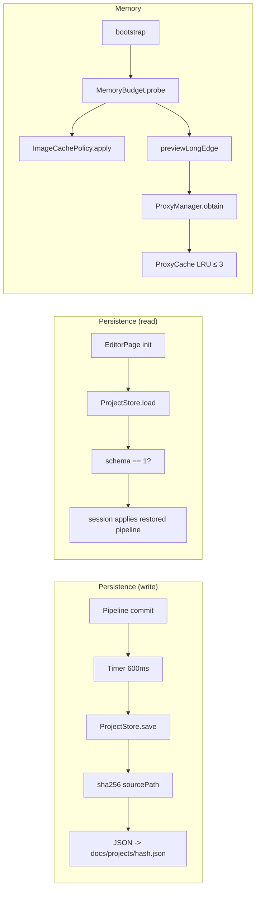

# 05 — Persistence & Memory

## Purpose

Two related problems, handled by three subsystems:

1. **Don't lose the user's work.** Every committed pipeline must survive a crash, kill, or "accidentally closed the app" — on next open, the session restores to exactly where it was. Handled by `ProjectStore` with a 600 ms debounce from the editor session.
2. **Don't OOM on mobile.** A 20 MP JPEG is ~75 MB uncompressed; Impeller on some Android builds balloons GPU memory under load ([Flutter issue #178264](https://github.com/flutter/flutter/issues/178264)). Handled together by `MemoryBudget` (device-aware constants), `ImageCachePolicy` (Flutter's image cache cap + purge), `ProxyManager` + `ProxyCache` (LRU of decoded preview images), and `UiImageHandle` (ref-counted `ui.Image` disposal).

Both concerns are cross-cutting — any feature that loads or edits an image touches them. This chapter covers the mechanisms; per-feature usage lives in the feature chapters.

## Data model

| Type | File | Role |
|---|---|---|
| `ProjectStore` | [project_store.dart:38](../../lib/features/editor/data/project_store.dart) | JSON persistence keyed by `sha256(sourcePath)`. Save / load / delete / list. |
| `ProjectSummary` | [project_store.dart:210](../../lib/features/editor/data/project_store.dart) | Lightweight metadata (path, saved-at, op count, custom title) for the home recents strip. |
| `MemoryBudget` | [memory_budget.dart:18](../../lib/core/memory/memory_budget.dart) | Device-aware constants: `totalPhysicalRamBytes`, `imageCacheMaxBytes`, `previewLongEdge`, `maxRamMementos`. |
| `ImageCachePolicy` | [image_cache_policy.dart:11](../../lib/core/memory/image_cache_policy.dart) | Applies budget to Flutter's `PaintingBinding.instance.imageCache`; exposes `nearBudget()` + `purge()`. |
| `ProxyManager` | [proxy_manager.dart:13](../../lib/engine/proxy/proxy_manager.dart) | Session-wide facade for obtaining `PreviewProxy`s. Dedupes concurrent loads. |
| `ProxyCache` | [proxy_cache.dart:10](../../lib/engine/proxy/proxy_cache.dart) | LRU of up to 3 `PreviewProxy`s keyed by source path. Evictions dispose. |
| `UiImageHandle` | [ui_image_disposer.dart:14](../../lib/core/memory/ui_image_disposer.dart) | Ref-counted wrapper around `ui.Image` so multiple consumers can share one decoded image. |
| `PreviewProxy` | [preview_proxy.dart](../../lib/engine/pipeline/preview_proxy.dart) | The decoded source at `previewLongEdge` resolution. (Covered by [Rendering Chain](03-rendering-chain.md); it's the input to every pass chain.) |

## Flow



### Auto-save (debounced write)

The editor session owns a single `Timer` re-scheduled on every pipeline commit. Source: [editor_session.dart:1943](../../lib/features/editor/presentation/notifiers/editor_session.dart:1943).

```dart
static const Duration _kAutoSaveDelay = Duration(milliseconds: 600);

void _scheduleAutoSave(EditPipeline pipeline) {
  if (_disposed) return;
  _autoSaveTimer?.cancel();
  _autoSaveTimer = Timer(_kAutoSaveDelay, () {
    if (_disposed) return;
    unawaited(projectStore.save(sourcePath: sourcePath, pipeline: pipeline));
  });
}
```

Characteristics:

- **Coalesced**: rapid commits (slider drag that commits per delta) land as one save 600 ms after the last event.
- **Fire-and-forget**: `unawaited` on the `save` future; IO failures log inside the store, never block the editor.
- **Dispose-aware**: both the scheduling and the fired timer bail if the session was disposed.
- **Empty pipelines still persist** — resetting to a clean state overwrites the file so re-opening doesn't spring back into a stale edit.

### `ProjectStore.save`

Source: [project_store.dart:82](../../lib/features/editor/data/project_store.dart). Steps:

1. Resolve the project file path: `<docs>/projects/<sha256(sourcePath)>.json`. The docs directory comes from `path_provider`; on failure (sandbox corruption, no platform channel in tests), the store logs and becomes a no-op.
2. Preserve the `customTitle` across saves: if the caller doesn't pass one, read the existing file and carry the prior title forward. This matters because auto-save fires far more often than the user renames a project; a per-commit save must not wipe a rename that happened 30 seconds ago.
3. Write a JSON body: `schema: 1`, `sourcePath`, `savedAt` (ISO-8601), `pipeline.toJson()`, optional `customTitle`.
4. `writeAsString(..., flush: true)` so the OS commits the bytes before the future resolves. IO errors log via `AppLogger` but don't throw.

### `ProjectStore.load`

Source: [project_store.dart:125](../../lib/features/editor/data/project_store.dart). On editor open:

1. Resolve the file for the `sourcePath`.
2. Parse JSON, check `schema == _kProjectSchemaVersion` (currently 1). Mismatch → log and return `null`. The comment at [project_store.dart:15](../../lib/features/editor/data/project_store.dart) calls this out: "older project files with a missing or lower version are silently dropped — we'd rather lose stale state than load garbage and crash mid-render."
3. Decode `pipeline` with `EditPipeline.fromJson`. Any exception → return `null`.
4. Callers treat `null` as "no prior edits" — the session boots into a clean pipeline.

This is deliberately less sophisticated than `PipelineSerializer._migrate()` (covered in [Parametric Pipeline](02-parametric-pipeline.md)). The project store uses `EditPipeline.fromJson` directly — no gzip marker, no migration seam — because the project files are small (seldom over 64 KB) and migrations would be a one-off cost worth owning when they happen.

### `ProjectStore.list`

Source: [project_store.dart:174](../../lib/features/editor/data/project_store.dart). Used by the home page's recents strip. Walks `<docs>/projects/`, parses just the metadata of each JSON (skipping the full pipeline to keep the list page snappy), filters out schema mismatches, and sorts newest-first by `savedAt`. A file that fails to parse is silently skipped — the home page must never crash on a corrupted entry.

The `customTitle` is surfaced via `ProjectSummary.displayLabel(fallback)` ([project_store.dart:239](../../lib/features/editor/data/project_store.dart)) which prefers the user-chosen name and falls back to the source filename.

## `MemoryBudget` — device-aware constants

Source: [memory_budget.dart:18](../../lib/core/memory/memory_budget.dart). Four numbers, probed once at startup via `MemoryBudget.probe()`:

| Field | Derivation | Purpose |
|---|---|---|
| `totalPhysicalRamBytes` | `AndroidDeviceInfo.physicalRamSize` (MB×1024²) on Android, `IosDeviceInfo.totalRam` (bytes) on iOS, 0 if unavailable | Diagnostic only |
| `imageCacheMaxBytes` | `(ram / 8).clamp(64 MB, 512 MB)` | Feeds `PaintingBinding.imageCache.maximumSizeBytes` |
| `previewLongEdge` | 1440 if ram < 3 GB; 1920 if < 6 GB; 2560 otherwise | Decode target for the source proxy |
| `maxRamMementos` | 3 (fixed) | Passed to `MementoStore.ramRingCapacity` |

When `DeviceInfoPlugin` can't determine RAM (older Android, test environments), `MemoryBudget.conservative` applies: 192 MB cache, 1920 long-edge, 3 mementos. The whole probe is wrapped in a try/catch so a platform-channel failure never blocks app start ([memory_budget.dart:85](../../lib/core/memory/memory_budget.dart)).

### `ImageCachePolicy`

Source: [image_cache_policy.dart:11](../../lib/core/memory/image_cache_policy.dart). Applies the budget to Flutter's painting image cache:

- `maximumSizeBytes = budget.imageCacheMaxBytes`
- `maximumSize = 128` (separate cap on entry count; prevents thumbnail churn from holding dozens of decoded images).

Two operational helpers for the Impeller balloon case:

- `nearBudget()` — true when `currentSizeBytes > 75% * maximumSizeBytes`. Call from a watchdog tick.
- `purge()` — aggressive `cache.clear() + cache.clearLiveImages()`. The comment at [image_cache_policy.dart:41](../../lib/core/memory/image_cache_policy.dart:41) calls this the "Flutter #178264 mitigation" — the GPU-memory balloon symptom is that the image cache is *logically* under budget but Impeller is holding GPU textures past their eviction. Dropping live images forces a re-upload on next paint but frees the GPU side.

`ImageCachePolicy` is constructed during `bootstrap()` and exposed via `BootstrapResult.cachePolicy` — features that detect suspected pressure (scanner on multi-page sessions, AI services on big inputs) can reach for `purge()`.

## `ProxyManager` + `ProxyCache`

Every editor session needs the original image decoded to `previewLongEdge` as its input texture. This is the `PreviewProxy`.

- `ProxyManager.obtain(sourcePath)` ([proxy_manager.dart:23](../../lib/engine/proxy/proxy_manager.dart)) first checks the cache. If already loaded → return. If a load is in-flight → join its `Future`. Otherwise kick off a new load and register it.
- `_load` ([proxy_manager.dart:40](../../lib/engine/proxy/proxy_manager.dart)) instantiates a `PreviewProxy(sourcePath, longEdge)`, awaits `load()` (decodes the image at target resolution via `cacheWidth`/`cacheHeight`), and inserts into the cache.
- `ProxyCache` ([proxy_cache.dart:10](../../lib/engine/proxy/proxy_cache.dart)) is a `LinkedHashMap<String, PreviewProxy>` with `maxEntries = 3`. `get()` moves the entry to MRU position. `put()` evicts the oldest when over capacity and disposes the evicted proxy (releasing its `ui.Image`).

The cache size of 3 is chosen so the user can flip between three recently-opened images without a re-decode hit, but not so large that four open sessions keep 300+ MB of decoded pixels resident. `evictAll()` is wired to the `proxyManagerProvider.onDispose` so a provider-scope tear-down releases everything.

## `UiImageHandle` — ref-counted `ui.Image`

Source: [ui_image_disposer.dart:14](../../lib/core/memory/ui_image_disposer.dart). A single 20 MP `ui.Image` is ~75 MB of GPU memory; GC is too slow to keep up under rapid slider drags. `UiImageHandle` gives consumers explicit retain/release:

```dart
final handle = UiImageHandle(decoded);
handle.retain();   // another consumer starts using it
handle.release();  // when that consumer is done
// Underlying image disposes when refCount hits 0.
```

Used sparingly today — `DirtyTracker`'s cache doesn't go through it (it disposes directly on eviction), but the AI service raster results and the memento-restore path use it to let the render pipeline and the service share one image without either disposing it mid-read.

## Key code paths

- [project_store.dart:66 `_keyFor`](../../lib/features/editor/data/project_store.dart:66) — the digest keying. `sha256(utf8.encode(sourcePath)).toString()`.
- [project_store.dart:82 `save`](../../lib/features/editor/data/project_store.dart:82) — preserve-title + atomic write. Fire-and-forget by design.
- [project_store.dart:125 `load`](../../lib/features/editor/data/project_store.dart:125) — schema check, silent drop on mismatch or parse failure.
- [editor_session.dart:1946 `_scheduleAutoSave`](../../lib/features/editor/presentation/notifiers/editor_session.dart:1946) — the debounce timer pattern.
- [memory_budget.dart:50 `probe`](../../lib/core/memory/memory_budget.dart:50) — device RAM → budget triplet. Conservative fallback is the cliff the probe lands on when any platform channel fails.
- [image_cache_policy.dart:43 `purge`](../../lib/core/memory/image_cache_policy.dart:43) — Flutter #178264 mitigation. Drop live images to force GPU re-upload.
- [proxy_manager.dart:23 `obtain`](../../lib/engine/proxy/proxy_manager.dart:23) — load dedup + cache check.

## Tests

- `test/features/editor/data/project_store_test.dart` — save, load, delete, list; schema mismatch drop; `customTitle` preservation across saves; corrupt-file handling.
- `test/engine/proxy/proxy_cache_test.dart` — LRU ordering, eviction disposes the evicted proxy.
- `test/engine/proxy/proxy_manager_test.dart` — dedup concurrent `obtain`, cache-hit fast path.
- `test/core/memory/memory_budget_test.dart` — conservative fallback, tier boundaries (3 / 6 GB), clamp.
- `test/core/memory/image_cache_policy_test.dart` — `apply` sets both caps, `nearBudget` threshold.
- **Gap**: no test for `UiImageHandle` with concurrent retains from an isolate boundary.
- **Gap**: `_scheduleAutoSave` has no direct test — the debounce behaviour relies on `Timer` and is covered only implicitly by editor-session integration tests.

## Known limits & improvement candidates

- **`[correctness]` Silent schema drop is a one-way door.** On a bump from schema 1 to 2, every existing user's projects evaporate on first open with no warning. The drop is documented in code but invisible to users. A "this project was made in an older version and couldn't be loaded" toast with a one-time confirm before the drop would be less destructive.
- **`[ux]` No conflict detection between auto-save and explicit save.** If a future export flow adds an explicit "Save" action during a 600 ms debounce window, two writes race. Today there's only one writer, so it's not a problem — worth noting if that changes.
- **`[perf]` `ProjectStore.list` reads every JSON fully then discards the pipeline.** At scale (50+ projects) this is 50 full decodes of 64 KB+ files just to show a list. Either split the metadata into a sidecar file (fast path for the list UI) or stream-parse the JSON header only. Low priority until the recents list exceeds ~30 entries.
- **`[correctness]` `sha256(sourcePath)` keying is absolute-path sensitive.** Moving a file on iOS (container UUID change across reinstalls — called out in CLAUDE.md) changes the path, which changes the key, which hides the prior project. Keying by a file-content hash would survive these moves. Cost: every open pays a one-time hash of the source.
- **`[correctness]` No write-ahead. A kill during `writeAsString` can leave a truncated JSON.** Next open, `load` logs a parse failure and returns null — user loses all edits since the last successful save. Atomic write via "write to `.json.tmp` then rename" would give true durability.
- **`[perf]` `MemoryBudget.probe()` uses `.data[...]` with a magic string key.** [memory_budget.dart:58](../../lib/core/memory/memory_budget.dart:58) reads `android.data['physicalRamSize']` — a string lookup into `device_info_plus`'s private map (`invalid_use_of_visible_for_testing_member` warning suppressed). If the plugin renames the key, the probe falls through to `conservative` and every device lands at 192 MB cache + 1920 long-edge regardless of actual RAM. Worth swapping for a typed API or pinning the plugin version.
- **`[perf]` `ProxyCache` max = 3 is fixed.** Same observation as `maxRamMementos`: high-end devices can comfortably hold more. Making this scale with `imageCacheMaxBytes / avgProxyBytes` would let a 12 GB device hold 5–6 proxies at no extra memory cost.
- **`[correctness]` `ImageCachePolicy.purge()` is never wired to a watchdog.** `nearBudget()` is the detector; `purge()` is the remediation; nothing calls either today. The symptom they target (Impeller balloon) is real but rare, so the mitigation is dead code. Either wire a `SchedulerBinding.addPostFrameCallback` watchdog or delete the helpers and rely on Flutter's own eviction.
- **`[maintainability]` Two serialization paths co-exist.** `ProjectStore` uses `EditPipeline.fromJson/toJson` directly. `PipelineSerializer` (covered in [02](02-parametric-pipeline.md)) has a gzip marker and a migration seam. If either format needs to evolve, both call sites must be updated in lockstep. Picking one (probably `PipelineSerializer`) and migrating the other would remove the drift risk.
- **`[test-gap]` No integration test for auto-save survives disk-full.** A filled sandbox silently drops saves (caught inside `writeAsString`). The editor keeps running, which is correct, but the user loses work they might have thought was safe. A test that injects an `Directory` whose writes throw, and asserts the editor surfaces *something* (a snackbar, a banner), would pin the UX.
- **`[ux]` `customTitle` preservation requires reading+reparsing on every save.** Cheap today, but every auto-save triggers a JSON decode of the existing file to pull the prior title. A small in-memory cache (title per sourcePath) on the `ProjectStore` instance would eliminate the read.
