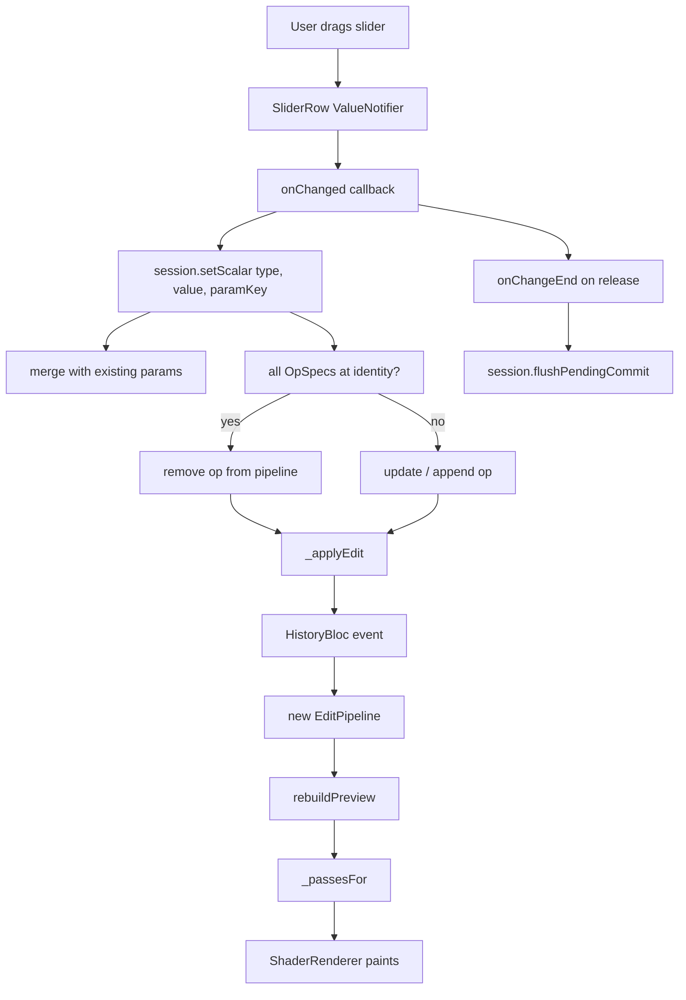

# 10 — Editor Tool Surface

## Purpose

This chapter covers every scalar/parametric tool the editor exposes — the 40+ knobs across Light, Color, Effects, Detail, Optics, and Geometry. The goal is to document the *tool surface*: how sliders bind to ops, where the UI lives, and how each category is wired into `_passesFor()`. Layers, presets, and AI tools are separate concerns covered in chapters [11](11-layers-and-masks.md), [12](12-presets-and-luts.md), and [21](21-ai-services.md).

Prerequisite reading: [02 — Parametric Pipeline](02-parametric-pipeline.md) (defines `EditOperation`, `OpSpec`, `EditOpType`) and [03 — Rendering Chain](03-rendering-chain.md) (explains how each op becomes a shader pass).

## Data model

| Type | File | Role |
|---|---|---|
| `OpSpec` | [op_spec.dart:14](../../lib/engine/pipeline/op_spec.dart) | Per-parameter metadata: `min`, `max`, `identity`, `paramKey`, `group`, `label`, `description`. |
| `OpSpecs.all` | [op_spec.dart:76](../../lib/engine/pipeline/op_spec.dart) | Declarative registry — ~40 entries. One for each scalar parameter. The source of truth the UI iterates. |
| `OpCategory` | [op_spec.dart:47](../../lib/engine/pipeline/op_spec.dart) | `light / color / effects / detail / optics / geometry`. Drives the dock tabs. |
| `ToolDock` | [tool_dock.dart:14](../../lib/features/editor/presentation/widgets/tool_dock.dart) | Bottom dock: category chips + active panel. Hides categories whose `OpSpecs.forCategory` is empty. |
| `LightroomPanel` | [lightroom_panel.dart:26](../../lib/features/editor/presentation/widgets/lightroom_panel.dart) | Generic scalar-slider panel. Renders every spec in a category by iterating `OpSpecs.forCategory(category)`. |
| `SliderRow` | [slider_row.dart:15](../../lib/features/editor/presentation/widgets/slider_row.dart) | One slider with identity tick, snap-to-identity haptic detent, reset button, long-press tooltip. |
| `HslPanel` | [hsl_panel.dart:15](../../lib/features/editor/presentation/widgets/hsl_panel.dart) | Tabbed Hue/Sat/Lum sliders across 8 colour bands. Not driven by `OpSpec` (one op, 24 values). |
| `SplitToningPanel` | [split_toning_panel.dart](../../lib/features/editor/presentation/widgets/split_toning_panel.dart) | Shadow+highlight colour pickers with a balance slider. |
| `CurvesSheet` | [curves_sheet.dart:22](../../lib/features/editor/presentation/widgets/curves_sheet.dart) | Modal bottom sheet: master/R/G/B draggable curve. |
| `GeometryPanel` | [geometry_panel.dart:18](../../lib/features/editor/presentation/widgets/geometry_panel.dart) | Rotate / flip / straighten / crop. Not driven by `OpSpec` — ops are boolean/int, not scalars. |
| `AutoSectionButton` | [auto_section_button.dart](../../lib/features/editor/presentation/widgets/auto_section_button.dart) | "Auto" button on Light/Color tabs — analyses the source and folds computed values into the sliders. |

### The `OpSpec → SliderRow` binding

The pattern is declarative: `LightroomPanel` asks `OpSpecs.forCategory(category)` for a list, then renders a `SliderRow` per spec. Adding a new scalar tool is three lines in `op_spec.dart` + one shader wrapper + one branch in `_passesFor()` — zero widget code. This is the whole point of the registry pattern: the panel doesn't know what tools exist.

The fast-path in `LightroomPanel._valueFor` ([lightroom_panel.dart:119](../../lib/features/editor/presentation/widgets/lightroom_panel.dart)) is an opt-in lookup table that calls named getters on `PipelineReaders` (e.g. `pipeline.brightnessValue`) instead of the generic `readParam`. Purely a performance shortcut — the generic branch at [:152](../../lib/features/editor/presentation/widgets/lightroom_panel.dart:152) would work for everything, but the fast-path avoids a second linear scan through `operations` for each slider on every rebuild. Worth knowing because adding a new top-level scalar won't show up in the table — it'll use the generic path, which is fine.

## Flow

### Slider lifecycle

1. **Drag begins** — `SliderRow` holds a local `ValueNotifier<double>` so the thumb and numeric readout update without rebuilding the parent. Drag events never cascade up through the widget tree.
2. **`onChanged(v)`** fires on every sub-tick. The panel calls `session.setScalar(spec.type, v, paramKey: spec.paramKey)` at [lightroom_panel.dart:113](../../lib/features/editor/presentation/widgets/lightroom_panel.dart:113).
3. **`session.setScalar`** at [editor_session.dart:295](../../lib/features/editor/presentation/notifiers/editor_session.dart:295):
   - Merges the new value into the existing op's parameter map (preserving sibling keys for multi-param ops).
   - Walks every `OpSpec` for the op type; if all parameters are at identity, flags the op for removal. This is the "drop at identity" rule that keeps the shader chain short.
   - Dispatches `_applyEdit(type, params, removeIfPresent)`.
4. **`_applyEdit`** at [editor_session.dart:340](../../lib/features/editor/presentation/notifiers/editor_session.dart:340) invalidates the applied-preset record (any direct slider edit detaches the pipeline from the preset that made it) and dispatches through `HistoryBloc`. See [History & Memento Store](04-history-and-memento.md) for bloc behaviour.
5. **Drag release** — `onChangeEnd` calls `session.flushPendingCommit()` so the final value is durable in history.

### Snap-to-identity detent

`_SliderWithIdentityTick` ([slider_row.dart:148](../../lib/features/editor/presentation/widgets/slider_row.dart:148)) paints a 2 px tick at the op's identity position and implements a 2%-wide snap band. When the drag value lands inside the band, it pulls to exactly `identity` and emits a `Haptics.tap()` on the first entry — same feel as Lightroom Mobile. The `_snapped` flag ensures the haptic fires once per entry, not per tick inside the band.

The band size is a constant: `_kSnapBand = 0.02 × (max - min)`. A 2% band on a `[-1, 1]` slider is ±0.04 of range — wide enough to feel helpful, narrow enough to not fight authorial intent. Not currently tunable per-spec.

## Category-by-category walk

### Light

All 7 base knobs plus a 3-param Levels group. Every scalar spec is rendered by `LightroomPanel` with no per-op widget. The `Light` tab has two extras:

- **Auto button** ([lightroom_panel.dart:62](../../lib/features/editor/presentation/widgets/lightroom_panel.dart:62)) — the `AutoSectionButton` runs `AutoEnhanceAnalyzer` on the source proxy and folds computed targets into the light sliders (exposure, highlights, shadows, contrast). Reset restores identity.
- **Tone curve entry** ([lightroom_panel.dart:195](../../lib/features/editor/presentation/widgets/lightroom_panel.dart:195)) — a tile above the sliders that opens `CurvesSheet` and shows an "active" badge when a custom curve is committed. This is the only place curves are discoverable; they don't appear as sliders.

| Op | Range | Identity | Pass |
|---|---|---|---|
| `color.exposure` | −2 … 2 | 0 | color grading (uniform, not matrix) |
| `color.brightness` | −1 … 1 | 0 | color matrix |
| `color.contrast` | −1 … 1 | 0 | color matrix |
| `color.highlights`, `color.shadows`, `color.whites`, `color.blacks` | −1 … 1 | 0 | `highlights_shadows.frag` |
| `color.levels` (black, white, gamma) | 0 … 1, 0 … 1, 0.1 … 4 | 0, 1, 1 | `levels_gamma.frag` |
| `color.toneCurve` | N/A | identity diagonal | `curves.frag` via baked 256×4 LUT |

### Color

The panel's "Color" tab renders the scalars (temperature, tint, saturation, vibrance, hue) and the Color auto button. Two non-scalar tools live outside the panel:

- **HSL** — tapped via a dedicated entry in the color tab; `HslPanel` is a 3-tab (Hue/Sat/Lum) layout with 8 colour-coded bands each, driven by the 24-value `color.hsl` op. Not registered in `OpSpecs` because the op is a map, not 24 scalars.
- **Split toning** — similar bespoke panel with two colour pickers and a balance slider.

| Op | Range | Identity | Pass |
|---|---|---|---|
| `color.temperature` | −1 … 1 | 0 | color grading (uniform) |
| `color.tint` | −1 … 1 | 0 | color grading (uniform) |
| `color.saturation` | −1 … 1 | 0 | color matrix |
| `color.vibrance` | −1 … 1 | 0 | `vibrance.frag` |
| `color.hue` | −180 … 180 | 0 | color matrix |
| `color.channelMixer` | N/A | identity | color matrix |
| `color.hsl` | N/A | all zeros | `hsl.frag` |
| `color.splitToning` | N/A | neutrals | `split_toning.frag` |

### Effects

Covers stylised/fx ops. Everything except clarity/dehaze gets its own shader pass. Vignette, grain, tilt-shift, motion-blur, and halftone are each multi-parameter — their specs share a `group` name so the panel renders them under a single section header.

| Op | Params | Identity | Pass |
|---|---|---|---|
| `color.clarity` | `value` | 0 | `clarity.frag` (local contrast via unsharp mask) |
| `color.dehaze` | `value` | 0 | `dehaze.frag` (midtone stretch) |
| `fx.vignette` | amount, feather, roundness (+ centerX/Y internal) | 0, 0.4, 0.5 | `vignette.frag` |
| `fx.grain` | amount, cellSize | 0, 2 | `grain.frag` |
| `fx.chromaticAberration` | amount | 0 | `chromatic_aberration.frag` |
| `fx.glitch` | amount | 0 | `glitch.frag` |
| `fx.pixelate` | pixelSize | 1 | `pixelate.frag` |
| `fx.halftone` | dotSize, angle | 2, 0.785 | `halftone.frag` |
| `blur.tiltShift` | blurAmount, focusWidth, angle (+ focusX/Y) | 0, 0.15, 0 | `tilt_shift.frag` |
| `blur.motion` | strength, angle | 0, 0 | `motion_blur.frag` |

**Interior parameters that aren't in `OpSpecs`**: `vignette.centerX/centerY`, `tiltShift.focusX/focusY` are set by gesture overlays (the `vignette_center_overlay` and tilt-shift gesture), not sliders, so they skip the spec registry but are still read by the shader wrappers in `_passesFor()`.

### Detail

Sharpen (unsharp mask) and bilateral denoise, both multi-param under group headers.

| Op | Params | Identity | Pass |
|---|---|---|---|
| `fx.sharpen` | amount, radius | 0, 1 | `sharpen_unsharp.frag` |
| `noise.bilateralDenoise` | sigmaSpatial, sigmaRange, radius | 0, 0.15, 1 | `bilateral_denoise.frag` |

NLM denoise (`noise.nonLocalMeans`) is defined in `EditOpType` but has no `OpSpec` entry and no pass in `_passesFor()` — placeholder for a future phase.

### Optics

Defined in `OpCategory.optics` but empty of specs today. `ToolDock._CategoryTabs` hides empty categories ([tool_dock.dart:103](../../lib/features/editor/presentation/widgets/tool_dock.dart:103)) — **"showing a tab whose only content is 'coming in a later phase' trains users to ignore the tab bar."** As a result, Optics doesn't appear in the UI despite being in the enum.

### Geometry

Geometry ops aren't scalars — rotate is an int (`steps`), flip is two booleans, crop is a rect + aspect ratio, straighten is the only real scalar. `GeometryPanel` is a bespoke widget that calls op-specific session methods:

- `session.rotate90(direction)` — direction is ±1, increments/decrements `rotate.steps`.
- `session.toggleFlipH()` / `toggleFlipV()`.
- Straighten slider calls `setScalar('geom.straighten', v)` like every other scalar — this one op *is* in `OpSpecs`.
- Crop opens `CropOverlay` full-screen and commits a `cropRect` via session on confirm.

`pipeline.geometryState` ([pipeline_extensions.dart:192](../../lib/engine/pipeline/pipeline_extensions.dart:192)) derives the combined state so the canvas can transform the image before the colour chain runs.

Perspective warp exists as `EditOpType.perspective` with a shader pass but no authoring UI yet.

## Dock behaviour

`ToolDock` ([tool_dock.dart:14](../../lib/features/editor/presentation/widgets/tool_dock.dart:14)) is stateless — the active category is owned by the `EditorPage`. Two UX details worth knowing:

- **Edit-dot indicator**: `activeCategories` is a `Set<OpCategory>` derived via `pipeline.activeCategories` ([pipeline_extensions.dart:237](../../lib/engine/pipeline/pipeline_extensions.dart:237)). A chip shows a small tertiary-colored dot badge when its category contains any non-identity op. Computed per-spec, not per-op, so a vignette at default feather+roundness but zero amount doesn't light up Effects.
- **Empty categories hidden** — dock chips are filtered to categories where `OpSpecs.forCategory(cat).isNotEmpty`, skipping Optics today.

## Key code paths

- [op_spec.dart:76 `OpSpecs.all`](../../lib/engine/pipeline/op_spec.dart:76) — the one list that drives all scalar-tool UI.
- [lightroom_panel.dart:95 `_buildSlider`](../../lib/features/editor/presentation/widgets/lightroom_panel.dart:95) — spec → SliderRow binding.
- [slider_row.dart:182 `_maybeSnap`](../../lib/features/editor/presentation/widgets/slider_row.dart:182) — snap-to-identity detent math.
- [editor_session.dart:295 `setScalar`](../../lib/features/editor/presentation/notifiers/editor_session.dart:295) — merge, identity-check, commit.
- [editor_session.dart:340 `_applyEdit`](../../lib/features/editor/presentation/notifiers/editor_session.dart:340) — routes to the right `HistoryBloc` event; detaches applied-preset record on direct edits.
- [editor_session.dart:407 `rotate90`](../../lib/features/editor/presentation/notifiers/editor_session.dart:407) — geometry-op path; different from scalar ops because `steps` is an int.
- [tool_dock.dart:103](../../lib/features/editor/presentation/widgets/tool_dock.dart:103) — empty-category filter.
- [pipeline_extensions.dart:237 `activeCategories`](../../lib/engine/pipeline/pipeline_extensions.dart:237) — edit-dot source.

## Tests

- `test/engine/pipeline/op_spec_test.dart` — identity rounding, `forCategory` filtering, `paramsForType` completeness.
- `test/engine/pipeline/pipeline_extensions_test.dart` — `activeCategories` computation, `geometryState` for each rotate/flip/straighten combination.
- `test/features/editor/presentation/notifiers/editor_session_test.dart` — scalar drop-at-identity, multi-param merge, preset detach on direct edit.
- Widget-level coverage is thin: no `SliderRow` test for the snap detent haptic; no `LightroomPanel` test for the spec iteration; `GeometryPanel` widget tests don't exist. These are gaps.

## Known limits & improvement candidates

- **`[maintainability]` Tool registration is split across four places.** Adding a new scalar op requires touching `EditOpType` (constant + classifier sets), `OpSpecs.all` (slider metadata), the shader wrapper file, and `_passesFor()`. Easy to forget one — a missing entry in `shaderPassRequired` silently misses the render; a missing entry in `OpSpecs` silently disappears from the UI. A single `registerOp(...)` helper that threads all four would eliminate this.
- **`[test-gap]` No widget test for snap-to-identity.** The detent is the only haptic in the slider path and is the main "feel" differentiator; it's never exercised by a test.
- **`[test-gap]` No regression test for the dock's empty-category filter.** Adding `OpCategory.optics` specs later would make it appear, which is probably intended, but nothing pins the current "hide if empty" rule.
- **`[ux]` Fast-path lookup table in `_valueFor` drifts from `OpSpecs.all`.** Any scalar added to `OpSpecs.all` silently uses the generic `readParam` path (correct, just slower). An assertion that every category's specs either hit a fast-path branch or a single scalar-reader helper would catch accidental omissions — or the fast-path could be removed in favour of one typed reader keyed off the op type.
- **`[correctness]` "Drop at identity" is all-or-nothing.** Multi-param ops like Vignette only drop when amount, feather, AND roundness are at identity. Users typically set feather/roundness once (maybe adjusting the shape) then zero out amount — the op survives with feather at 0.6 and does nothing visible but still contributes a no-op shader pass each frame. A second rule ("drop when the meaningful effect-strength param is identity, even if shape params are non-default") would be worth it for the effect group but tricky to state cleanly.
- **`[ux]` Snap band is fixed at 2%.** On narrow ranges (levels gamma 0.1-4) a 2% band is 0.078 — generous. On wide ranges (hue ±180°) 2% is 7.2° — also generous. Per-spec tuning would be nice for the rare op where it matters.
- **`[ux]` Optics exists in the enum but is invisible in the UI.** The CLAUDE.md status snapshot lists editor as "working" but the Optics tab is dead. Either remove the enum value until there's a spec to put there, or ship a stub spec.
- **`[correctness]` `NLM denoise` op type exists but has no pass.** `EditOpType.denoiseNlm` ([edit_op_type.dart:54](../../lib/engine/pipeline/edit_op_type.dart:54)) is defined, appears in `shaderPassRequired`, but no case in `_passesFor()` handles it. A pipeline with that op enabled today silently renders nothing — if loaded from a JSON fixture it would pass schema validation but produce a bad render.
- **`[ux]` `CurvesSheet` entry is Light-tab only.** A valid UX decision, but R/G/B curves tonally live as much in Color as in Light. Worth re-visiting the entry point once more than the master channel is authorable per the Phase 0 note.
- **`[test-gap]` No golden tests for per-shader visual output.** The sliders are correct; the pass assembly is correct; what would catch a regression where (say) `highlights_shadows.frag`'s output drifts one percent is a set of golden fixtures per op. See the similar gap in [03](03-rendering-chain.md).
- **`[maintainability]` HSL + split toning + curves bypass `OpSpec`.** They're authored via bespoke panels, so adding a new 8-band multi-op later would require copying the pattern from scratch. Not urgent — there are only three such ops today.
