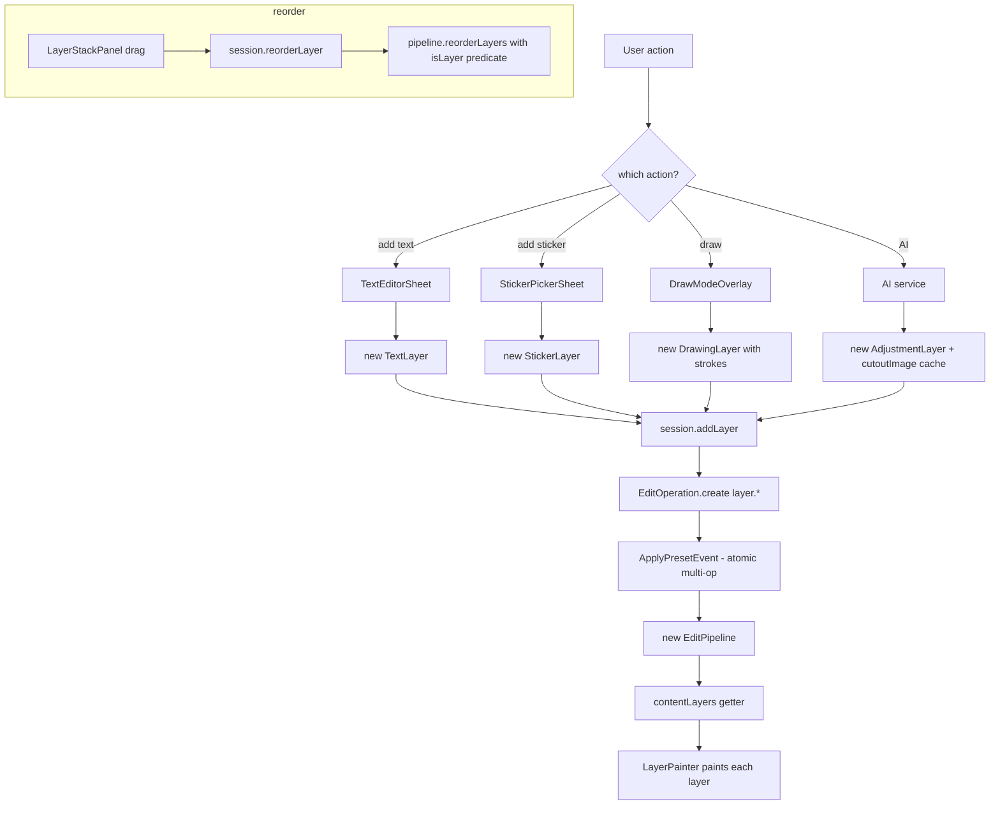

# 11 — Layers & Masks

## Purpose

Content layers sit *on top* of the colour shader chain — text, stickers, drawings, and AI-generated cutouts live in the pipeline as `layer.*` ops and paint after every colour/effect pass has run. This chapter covers the layer taxonomy, blend modes, procedural masks, and the session/UI plumbing that adds and reorders them.

Layers are parametric like every other op: the pipeline stores layer *parameters*, not rasterized bitmaps. The one exception is `AdjustmentLayer.cutoutImage` — a volatile in-memory `ui.Image` that holds AI raster results; it's session-local and is not serialized. The AI services that produce these are covered in [21 — AI Services](21-ai-services.md).

## Data model

| Type | File | Role |
|---|---|---|
| `ContentLayer` (sealed) | [content_layer.dart:22](../../lib/engine/layers/content_layer.dart) | Base class with common transform/blend/mask fields + `toParams()` / `fromOp()` contract. |
| `TextLayer` | [content_layer.dart:141](../../lib/engine/layers/content_layer.dart) | Glyphs: text, fontSize, fontFamily, bold, italic, alignment, shadow, colour. |
| `StickerLayer` | [content_layer.dart:262](../../lib/engine/layers/content_layer.dart) | One emoji/character positioned and scaled like a glyph. |
| `DrawingLayer` + `DrawingStroke` | [content_layer.dart:349](../../lib/engine/layers/content_layer.dart) | Brush session as a list of strokes, each a polyline with color/width/opacity/hardness/brushType. |
| `AdjustmentLayer` | [content_layer.dart:532](../../lib/engine/layers/content_layer.dart) | AI-produced layer: bg removal, face beauty, sky replace, inpaint, super-res, style, face reshape. |
| `AdjustmentKind` enum | [content_layer.dart:674](../../lib/engine/layers/content_layer.dart) | 9 values. Order matters — persisted pipelines reference by `name`, so new values append only. |
| `LayerBlendMode` | [layer_blend_mode.dart:11](../../lib/engine/layers/layer_blend_mode.dart) | 13 modes: normal + 12 Flutter-native (multiply, screen, overlay, …). String-serialized. |
| `LayerMask` | [layer_mask.dart:39](../../lib/engine/layers/layer_mask.dart) | Procedural mask: none / linear / radial + `cx,cy`, angle, feather, inverted. |
| `LayerStackPanel` | [layer_stack_panel.dart:21](../../lib/features/editor/presentation/widgets/layer_stack_panel.dart) | Reorderable list, visibility/delete buttons, layer edit sheet launcher. |
| `LayerPainter` | [layer_painter.dart](../../lib/features/editor/presentation/widgets/layer_painter.dart) | `CustomPainter` that renders layers over the shader-chain output. |
| `TextEditorSheet`, `StickerPickerSheet`, `DrawModeOverlay`, `LayerEditSheet`, `RefineMaskOverlay` | `lib/features/editor/presentation/widgets/*` | Authoring surfaces for each layer kind. |

### Common transform fields

Every `ContentLayer` shares these on top of the kind-specific payload:

- `id` — same as the underlying op id; layer mutations look up by layer id.
- `visible` — mirrors the op's `enabled` flag. The painter skips invisible layers.
- `opacity` — 0 … 1 blend factor.
- `x, y` — normalized position (0 … 1) within the canvas rect.
- `rotation` — radians around the layer's center.
- `scale` — 1.0 = native size.
- `blendMode` — default `normal` (Flutter's `srcOver`).
- `mask` — default `LayerMask.none`.

Drawing and Adjustment layers fix `x = y = 0.5`, `rotation = 0`, `scale = 1` in their constructors — they paint across the full canvas, not as transformable sprites.

## Flow

### Layer addition

1. The user opens a sheet (`TextEditorSheet`, `StickerPickerSheet`) or enters draw mode (`DrawModeOverlay`). Each sheet constructs a typed `ContentLayer` with fresh defaults.
2. The page calls `session.addLayer(layer)` ([editor_session.dart:581](../../lib/features/editor/presentation/notifiers/editor_session.dart:581)).
3. The session calls `opTypeForLayerKind(layer.kind)` to get the right `layer.*` type string, builds an `EditOperation` via `layer.toParams()`, and dispatches `ApplyPresetEvent(pipeline: newPipeline, presetName: 'Add ${kind}')`.
4. The bloc writes the entry as one undo step. See [History & Memento Store](04-history-and-memento.md).

Using `ApplyPresetEvent` here is a repurpose: it's the only existing event that accepts a whole pipeline rather than a single op delta. The alternative would be `AppendEdit(op)`, which works for single-op additions — the `ApplyPresetEvent` path is used because session code wants the whole-pipeline atomicity guarantee. See Known Limits below.

### Layer derivation from pipeline

`PipelineReaders.contentLayers` ([pipeline_extensions.dart:180](../../lib/engine/pipeline/pipeline_extensions.dart)) walks `pipeline.operations` in insertion order, calls `contentLayerFromOp(op)` on each, and returns the typed layers. Disabled ops still appear (with `visible: false`) so the stack panel can show them greyed-out.

`contentLayerFromOp` at [content_layer.dart:504](../../lib/engine/layers/content_layer.dart) is a switch over the four `layer.*` op types. Each `*.fromOp(op)` parses the params map back into a typed layer, defaulting missing fields — so a partially-legit pipeline loads without throwing.

### Reorder semantics

Layers are painted bottom-to-top in pipeline order. `LayerStackPanel` displays them top-to-bottom (UI convention), so the panel reverses the list for display and flips the drag index back when calling `session.reorderLayer(id, paintIndex)` ([layer_stack_panel.dart:114](../../lib/features/editor/presentation/widgets/layer_stack_panel.dart:114)).

The pipeline method `reorderLayers` at [edit_pipeline.dart:67](../../lib/engine/pipeline/edit_pipeline.dart:67) takes an `isLayer` predicate from the caller. The session passes it from the `layer.*` type prefix. Crucially, the reorder *only* shuffles layer ops — non-layer ops (colour, geometry) stay in their positions. The function captures their original slot indices and writes the rearranged layer list back into those same slots. This way a user moving a layer can't accidentally reorder colour adjustments relative to each other.

### Rendering layers

Layers render after the shader chain, not during it. The canvas widget paints in this order:

1. `ImageCanvasRenderBox.paint` runs `ShaderRenderer` for the colour/effect chain (final pass writes to the canvas).
2. `LayerPainter` walks `pipeline.contentLayers` and paints each visible layer on top, applying the layer's transform, opacity, blend mode, and mask.

Blend modes map to Flutter's built-in `BlendMode` via `LayerBlendModeX.flutter` ([layer_blend_mode.dart:29](../../lib/engine/layers/layer_blend_mode.dart)) — no custom shaders required today. This is fine because the 13 modes we expose are exactly the subset Flutter implements natively; soft-light / pin-light / vivid-light would need `.frag` support and are out of scope.

### `AdjustmentLayer` — the volatile exception

`AdjustmentLayer.cutoutImage` is an in-memory `ui.Image` held by the layer instance. It's **never serialized**:

- `toParams()` omits it ([content_layer.dart:628](../../lib/engine/layers/content_layer.dart)).
- `fromOp()` returns a layer with `cutoutImage: null`.
- The session maintains a separate `Map<layerId, ui.Image>` cache (`_cutoutImages`) and fills the layer's `cutoutImage` during `rebuildPreview`. On session reload from a persisted pipeline, the cutout is gone — the layer renders nothing until the user re-runs the AI op. A future phase will persist cutouts via `MementoStore`.

The AI op type in the pipeline (`ai.*`) is separate from the layer op (`layer.adjustment`) — the AI op records the operation happened (memento-backed), while the adjustment layer op composites the result. The session links them via matching ids.

Per-kind state:

- `reshapeParams` (for `faceReshape`) — `Map<String, double>` of slider strengths. Serialized so reload can re-run the warp at full resolution.
- `skyPresetName` (for `skyReplace`) — stored as a plain String to keep the engine independent of the `ai/` package.
- Everything else (bg removal, smooth, whiten, brighten, inpaint, super-res, style) relies solely on the `cutoutImage` cache.

## Masks

`LayerMask` ([layer_mask.dart:39](../../lib/engine/layers/layer_mask.dart)) supports three shapes today:

- `none` — full coverage. The `isIdentity` fast-path lets callers skip mask processing.
- `linear` — gradient along a direction vector through `(cx, cy)` at `angle`. `linearEndpoints()` returns the two gradient endpoints scaled by `1 + feather` so the transition fits the feather zone.
- `radial` — gradient from `(cx, cy)` between `innerRadius` and `outerRadius`, both as fractions of `min(canvas.w, canvas.h)`.

`feather` softens both shapes. `inverted` flips visible/hidden regions. Serialized via `toJson()` at [layer_mask.dart:86](../../lib/engine/layers/layer_mask.dart) — inverted and shape-specific params are omitted when defaulted.

Brush-painted masks and AI-segmented masks are not supported yet — the enum leaves room (`MaskShape` could grow) but the rendering code only handles the two gradient shapes. The `RefineMaskOverlay` widget exists to edit AI-produced cutouts by refining their alpha, but that goes through `AdjustmentLayer.cutoutImage` directly, not through `LayerMask`.

## Brush strokes (DrawingLayer)

A `DrawingLayer` holds `List<DrawingStroke>`, each a polyline in normalized (0..1) space with:

- `colorArgb` — 32-bit ARGB.
- `width` — stroke thickness.
- `opacity` — multiplies the colour's alpha so opaque colours can lay down translucently.
- `hardness` — 0..1; the renderer maps `(1 - hardness)` to a `MaskFilter` blur radius proportional to width. A fast soft-edge approximation that looks reasonable across brush sizes without needing per-stroke SDFs.
- `brushType` — `pen` (solid), `marker` (wider semi-transparent), `spray` (scattered dots).

Strokes are captured by `DrawModeOverlay` as the user drags; on release the overlay commits the accumulated `DrawingLayer` via `session.addLayer` (for the first stroke) or `session.updateLayer` (to append to an existing drawing). A drawing session is one `layer.drawing` op with a growing stroke list — saved as one history entry on exit, not per-stroke.

Because strokes aren't analytically reversible mid-session, the `layer.drawing` op type is in `EditOpType.mementoRequired` ([edit_op_type.dart:96](../../lib/engine/pipeline/edit_op_type.dart)). Undoing a finished drawing restores the prior-session memento rather than replaying a parametric reversal.

## Key code paths

- [content_layer.dart:22 `ContentLayer`](../../lib/engine/layers/content_layer.dart:22) — sealed base with the transform/mask contract.
- [content_layer.dart:489 `opTypeForLayerKind`](../../lib/engine/layers/content_layer.dart:489) — maps kind → op type string. The single authoritative table.
- [content_layer.dart:504 `contentLayerFromOp`](../../lib/engine/layers/content_layer.dart:504) — reverse: op → typed layer.
- [editor_session.dart:581 `addLayer`](../../lib/features/editor/presentation/notifiers/editor_session.dart:581) — the add-layer session entry point. Uses `ApplyPresetEvent` for atomic history.
- [edit_pipeline.dart:67 `reorderLayers`](../../lib/engine/pipeline/edit_pipeline.dart:67) — layer-only shuffle preserving non-layer slot positions.
- [layer_mask.dart:121 `linearEndpoints`](../../lib/engine/layers/layer_mask.dart:121) — the gradient-direction math the painter consumes.
- [layer_stack_panel.dart:114](../../lib/features/editor/presentation/widgets/layer_stack_panel.dart:114) — display-to-paint index conversion during reorder.
- [layer_blend_mode.dart:29 `flutter`](../../lib/engine/layers/layer_blend_mode.dart:29) — enum → `BlendMode`; the fact that this is one-line explains why no custom shaders are needed.

## Tests

- `test/engine/layers/content_layer_test.dart` — round-trip through `toParams` / `fromOp` for every layer kind; default value restoration; `AdjustmentKind.name` stability (order locked because persisted pipelines reference by name).
- `test/engine/layers/layer_blend_mode_test.dart` — `fromName` fallback, `flutter` mapping.
- `test/engine/layers/layer_mask_test.dart` — `isIdentity`, `linearEndpoints` geometry, JSON round-trip.
- `test/engine/pipeline/edit_pipeline_test.dart::reorderLayers` — layer-only shuffle; non-layer position preservation.
- **Gap**: no widget test for `LayerStackPanel` reorder (the display↔paint index flip is where bugs live).
- **Gap**: no integration test for `AdjustmentLayer.cutoutImage` volatility — reload-from-JSON should render "no cutout" rather than crash, but there's no test asserting it.
- **Gap**: `LayerPainter` has no test. The blend-mode and mask paths are well-testable with a small headless canvas.

## Known limits & improvement candidates

- **`[maintainability]` `addLayer` uses `ApplyPresetEvent` as a generic atomic-write.** It's a naming mismatch — the event name reads like "a preset was applied" in logs, obscuring layer additions. Either rename to `ApplyPipelineEvent` (which fits both real uses) or introduce a dedicated `AppendLayerEvent`.
- **`[correctness]` `AdjustmentLayer.cutoutImage` lost on reload.** A persisted pipeline with background-removed layers reloads with those layers present but invisible — no cutout, no rendering. The comment promises Phase 12 will fix it via `MementoStore` persistence; until then, users lose AI results across sessions. Surfacing a "re-run" affordance in the stack panel would at least make the degraded state actionable.
- **`[correctness]` Mask rendering supports only two shapes.** `LayerMask` has three enum values (none/linear/radial) matching the painter's capability; adding a new shape requires changes in `MaskShape`, the painter, and the mask editor UI. Brush-painted masks are called out as future work but the scaffolding for "arbitrary raster mask" does not exist.
- **`[perf]` `LayerPainter` re-reads blend modes / transforms every frame.** Per-layer state is recomputed on each paint; a layer with an expensive mask recomputes the same gradient points per frame. Pooling the computed gradient paints across frames would save allocation in drawing-heavy sessions.
- **`[ux]` Blend-mode picker not exposed on text/sticker/drawing layers.** The data model supports 13 blend modes but the default `LayerEditSheet` doesn't expose them (only opacity). Users can't produce multiply-blended stickers even though the engine can. Exposing a blend-mode chip in the sheet is cheap.
- **`[correctness]` `DrawingStroke.hardness` uses `MaskFilter.blur` as a proxy for soft edges.** Fast but not physically accurate — the stroke profile is a Gaussian-blurred solid rather than a true soft-edge brush. At very small widths the blur can exceed the stroke width. A radius clamp relative to width would prevent the worst artefacts.
- **`[correctness]` `reshapeParams` and `skyPresetName` are nullable per-kind but stored on every `AdjustmentLayer`.** Two fields that are meaningless for 7 of the 9 adjustment kinds. A sealed hierarchy (`AdjustmentLayer.faceReshape`, `.skyReplace`, etc.) would enforce "only the right kind carries its params" at compile time. Current shape is fine while there are only two such kinds, but adding a third bespoke-params kind should prompt the refactor.
- **`[ux]` Layer reorder via drag is the only reorder path.** Moving a layer 10 spots down requires a long drag. A "send to front/back" context action (or keyboard in the desktop build) is worth adding.
- **`[test-gap]` No test for `AdjustmentKind` enum order stability.** The comment promises order matters but nothing asserts it. One test that compares the string list of `AdjustmentKind.values.map((v) => v.name)` to a golden fixture would prevent a merge from silently renumbering it.
- **`[maintainability]` Two separate "layer invisible" concepts.** `ContentLayer.visible` (class field) and `EditOperation.enabled` (op field) are mirrored — `fromOp` computes `visible: op.enabled && params.visible`. Same for `toParams` which writes `visible` into the params map. The duality exists because the history bloc toggles `enabled` and the layer panel toggles `visible`; they're kept in sync by the session but an inconsistent update could leave them out of phase.
