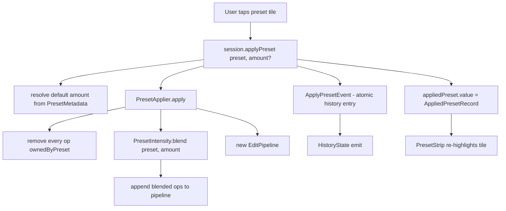

# 12 — Presets & LUTs

## Purpose

A **preset** is a saved recipe of `EditOperation`s — tap a preset tile, and the editor folds those ops into the current pipeline. Presets ship two flavours: curated built-ins declared in Dart, and user-saved customs persisted in sqflite. A preset application is atomic: one history entry covers all the preset's ops, so one undo reverts the whole look.

A **3D LUT** is a colour lookup texture (a 33×33×33 grid flattened into a 1089×33 PNG) sampled by `shaders/lut3d.frag`. LUTs live as assets; `LutAssetCache` decodes them lazily and shares one `ui.Image` per asset across the app's lifetime. Presets reference LUTs via the `filter.lut3d` op.

This chapter covers both the declarative preset model and the apply/intensity/LUT-cache mechanics. The LUT *shader* path is covered in [03 — Rendering Chain](03-rendering-chain.md).

## Data model

| Type | File | Role |
|---|---|---|
| `Preset` | [preset.dart:16](../../lib/engine/presets/preset.dart) | Freezed record: `id`, `name`, `operations`, optional `thumbnailAssetPath`, `builtIn`, `category`. |
| `BuiltInPresets.all` | [built_in_presets.dart:35](../../lib/engine/presets/built_in_presets.dart) | Static list of ~25 curated presets across 6 categories. |
| `PresetRepository` | [preset_repository.dart:24](../../lib/engine/presets/preset_repository.dart) | sqflite-backed persistence for custom presets. Built-ins come from `BuiltInPresets` and aren't stored. |
| `PresetApplier` | [preset_applier.dart:33](../../lib/engine/presets/preset_applier.dart) | Wipes preset-owned ops + appends the preset's ops (at `amount`). |
| `PresetIntensity` | [preset_intensity.dart:28](../../lib/engine/presets/preset_intensity.dart) | Linear blend against identity baseline, per-op-type interpolation rules. |
| `PresetMetadata` | [preset_metadata.dart:31](../../lib/engine/presets/preset_metadata.dart) | Side-table classifying each preset's strength; drives the default amount + UI badge. |
| `PresetStrength` | [preset_metadata.dart:13](../../lib/engine/presets/preset_metadata.dart) | `subtle / standard / strong`. Presets at "strong" default to 80% on first apply. |
| `LutAssetCache` | [lut_asset_cache.dart:26](../../lib/engine/presets/lut_asset_cache.dart) | Singleton: asset-path → `ui.Image`. |
| `PresetThumbnailCache` | [preset_thumbnail_cache.dart](../../lib/features/editor/domain/preset_thumbnail_cache.dart) | Per-session cache of miniature previews rendered through each preset. |
| `PresetStrip` | [preset_strip.dart:37](../../lib/features/editor/presentation/widgets/preset_strip.dart) | The horizontal scrollable tile strip at the bottom of the editor. |
| `AppliedPresetRecord` | editor_session.dart | `{preset, amount}` — nulled whenever a direct slider edit detaches the pipeline from the preset state. |

### Categories

Built-in presets are tagged into six canonical categories via `BuiltInPresets.categories` ([built_in_presets.dart:474](../../lib/engine/presets/built_in_presets.dart)):

`popular / portrait / landscape / film / bw / bold`

Custom user presets are tagged `'Custom'` in the repository. The `PresetStrip`'s category pills filter on this string directly; the "All" pill shows everything including Customs; selecting a specific category hides Customs (they rarely fit the canonical taxonomy).

## Flow

### Applying a preset



1. `PresetStrip` tile tap → `session.applyPreset(preset)` ([editor_session.dart:1440](../../lib/features/editor/presentation/notifiers/editor_session.dart:1440)).
2. Session resolves `effectiveAmount = amount ?? PresetMetadata.defaultAmountOf(preset)` — strong presets land at 0.8, everything else at 1.0.
3. `PresetApplier.apply(preset, base, amount)` ([preset_applier.dart:59](../../lib/engine/presets/preset_applier.dart:59)):
   - **Wipe**: removes every op whose type starts with `color.`, `fx.`, `filter.`, `blur.`, or `noise.`. Geometry (`geom.*`), layers (`layer.*`), and AI results (`ai.*`) survive — a preset is a *look*, not a destructive edit.
   - **Blend**: `PresetIntensity.blend(preset, amount)` produces the ops to append. See below.
   - Appends each blended op to the wiped base.
4. The session dispatches `ApplyPresetEvent(pipeline: next, presetName: preset.name)` — one history entry for the whole batch. See [04 — History & Memento Store](04-history-and-memento.md).
5. The session sets `appliedPreset.value = AppliedPresetRecord(preset, amount)` so the strip tile stays highlighted and the Amount slider remembers state.
6. Any subsequent direct slider edit invalidates the record at [editor_session.dart:350](../../lib/features/editor/presentation/notifiers/editor_session.dart:350) — the pipeline has been manually tweaked, so "applied preset at 100%" is no longer accurate.

### Why "replace-the-look"

The current strategy is deliberate. The comment at [preset_applier.dart:16](../../lib/engine/presets/preset_applier.dart) explains:

> This matches Snapseed / Instagram / Apple Photos filter semantics where tapping a new filter completely replaces the previous filter rather than compounding on top of it. The previous "leave panels untouched" behaviour caused visible artefacts when stacking presets (e.g. Pastel after Portrait Pop kept Portrait Pop's vibrance boost on top of Pastel's desaturation, producing unnatural colours).

The five wiped prefixes are:

```dart
static const List<String> _presetOwnedPrefixes = [
  'color.', 'fx.', 'filter.', 'blur.', 'noise.',
];
```

This matches `EditOpType.presetReplaceable` semantically but uses prefix matching rather than a hard-coded set — any future `color.*` or `fx.*` op is automatically in scope. Applying the `Original` preset (empty operations) clears every color/tone/effect while keeping geometry and layers — the fastest "back to the photo" action.

### Intensity blending

`PresetIntensity.blend` at [preset_intensity.dart:71](../../lib/engine/presets/preset_intensity.dart:71) produces the ops to append. The maths:

```
applied = baseline + amount * (preset - baseline)
```

Where `baseline` is the per-parameter identity (0 for most scalars, 1 for gamma, etc.) and `amount` is clamped to `[0, 1.5]`. At:

- `amount == 0` → empty list; the preset is fully undone.
- `amount == 1.0` → the preset as designed (baseline + 1.0 × delta).
- `amount == 1.5` → 50% extrapolation past the preset; each value is then clamped per-spec to prevent "150% saturation" pushing past the op's valid range.

Only some parameters interpolate — declared in `_interpolatingKeys` at [preset_intensity.dart:41](../../lib/engine/presets/preset_intensity.dart:41). These are the `value` (or `amount` for multi-param ops) keys that represent the effect's *strength*. Shape parameters (vignette feather, grain cellSize) pass through verbatim at any amount > 0 — varying them with amount would produce visible strobing (a vignette whose shape morphs as you ride the Amount slider feels uncanny).

Non-numeric parameters (split-toning colour triples) also pass through verbatim. An op with zero interpolating keys and `amount == 0` is dropped entirely.

The clamp to `OpSpec.min/max` at [preset_intensity.dart:122](../../lib/engine/presets/preset_intensity.dart) is crucial — without it, `saturation * 1.5` on a preset that already hit `+1.0` would push to `1.5`, producing inverted/NaN-shaped colour.

## `PresetRepository` — custom presets

Persisted via sqflite at `<docs>/presets.db`. Schema ([preset_repository.dart:40](../../lib/engine/presets/preset_repository.dart)):

```sql
CREATE TABLE IF NOT EXISTS presets (
  id TEXT PRIMARY KEY,
  name TEXT NOT NULL,
  json TEXT NOT NULL,
  created_at INTEGER NOT NULL
)
```

- `saveFromPipeline(name, pipeline)` at [preset_repository.dart:78](../../lib/engine/presets/preset_repository.dart) copies every **enabled** op from the current pipeline into a new `Preset`, JSON-encodes, inserts.
- `loadAll` returns built-ins *first*, then customs ordered newest-first. Built-ins aren't stored in sqflite — they come from `BuiltInPresets.all` every load. This avoids the migration headache of "what happens when we add a new built-in and the user's local copy is stale."
- `loadCustom` is separate so the strip can re-query just customs after a save/delete.

The `json` column stores the full `Preset.toJson()` payload, including every op's parameters map. If the pipeline schema ever changes, custom presets deserialize via `EditOperation.fromJson` — same path as pipeline loads. No extra migration layer.

## Built-in preset curation

Source: [built_in_presets.dart:35](../../lib/engine/presets/built_in_presets.dart). Each preset is an `EditOperation.create` list; no LUTs for most, so the colour chain is pure-matrix+curve-free. A typical spec:

```dart
Preset(
  id: 'builtin.natural',
  name: 'Natural',
  category: 'popular',
  builtIn: true,
  operations: [
    _op(EditOpType.exposure, {'value': 0.05}),
    _op(EditOpType.contrast, {'value': 0.08}),
    _op(EditOpType.highlights, {'value': -0.10}),
    _op(EditOpType.shadows, {'value': 0.10}),
    _op(EditOpType.vibrance, {'value': 0.10}),
  ],
),
```

Design rules (from the doc comment at [built_in_presets.dart:11](../../lib/engine/presets/built_in_presets.dart)):

- Values stay inside "safe" ceilings documented by Adobe/VSCO — never degrade a well-shot photo at 100%.
- No clarity on portrait presets (the #1 thing portrait guides warn against).
- Shadow/highlight symmetry capped at ±0.25 — higher produces the "HDR-crunchy" look.
- Presets that deliberately push past safe ceilings (Noir, Dramatic, Cyberpunk, Moody, Sharp B&W, Sepia) are tagged `strong` in `PresetMetadata`, surface a badge, and default to 80% amount.

Three presets use 3D LUTs (`builtin.lut_cool_film`, `lut_sun_warm`, `lut_mono`). They stack a `filter.lut3d` op with `assetPath` + `intensity` on top of small finishing tweaks (contrast, grain, vibrance). Worth reading these three as templates for adding new LUT-backed presets.

## 3D LUTs

### Format

LUTs ship as pre-baked PNGs under `assets/luts/`. Current set (5 bundled):

```
cool_33.png, warm_33.png, sepia_33.png, mono_33.png, identity_33.png
```

Each is a 33×33×33 grid flattened to a 1089×33 RGBA image — `33³ = 35937` colour entries at 4 bytes = 140 KB per LUT. Flat sizes are tiny, so keeping them cached for the app lifetime is cheap.

`identity_33.png` is the null LUT; sampling it with intensity 1.0 is visually a no-op. It exists so tests can assert the LUT shader path without needing a visible effect.

### Baking

`tool/bake_luts.dart` is the build-time script that produces the PNGs. The comment at [built_in_presets.dart:424](../../lib/engine/presets/built_in_presets.dart) gives the three-step recipe: add a `Lut` entry to `tool/bake_luts.dart`, run `dart run tool/bake_luts.dart`, reference the new `assetPath` in a preset or the UI.

This keeps LUT authoring in Dart rather than requiring a separate DaVinci Resolve / 3DL file — the tradeoff is that custom LUT import from user-supplied files is not supported today.

### `LutAssetCache`

Source: [lut_asset_cache.dart:26](../../lib/engine/presets/lut_asset_cache.dart). Process-wide singleton. API:

- `getCached(assetPath)` — synchronous read, returns `null` if not loaded.
- `load(assetPath)` — async load via `rootBundle.load` + `ui.instantiateImageCodec`. Dedupes concurrent calls.
- `dispose()` — drops every cached image; next access re-decodes.

The cache-miss pattern in `_passesFor()` mirrors the shader-registry fallback: if `getCached` returns null, kick off an async `load` and skip the `lut3d` pass for this frame. On completion the pipeline rebuilds and the pass lands. See [03 — Rendering Chain](03-rendering-chain.md).

Cache is never size-bounded because the total bundled set is small (≤1 MB across 5 LUTs). If custom LUT import ships later, an LRU would become necessary.

## Thumbnail rendering

`PresetThumbnailCache` ([preset_thumbnail_cache.dart](../../lib/features/editor/domain/preset_thumbnail_cache.dart)) renders miniature previews of the user's current source image through each preset, so the strip shows what the preset would do to *their* photo, not a generic sample.

Crucially, thumbnails only run matrix-composable ops ([preset_strip.dart:32](../../lib/features/editor/presentation/widgets/preset_strip.dart) comment explains): clarity, grain, vignette, and non-matrix colour ops are skipped. This is an approximation — what matters at thumbnail scale is the dominant colour character, and composing a full shader chain per tile at thumb size is needless frame budget.

Thumbnails are invalidated when the user opens a new source image but survive within a session.

## `PresetStrip` interaction

Source: [preset_strip.dart:37](../../lib/features/editor/presentation/widgets/preset_strip.dart). Three interactions:

- **Tap** a preset → `applyPreset` at default amount.
- **Tap the currently-applied tile again** → opens a bottom sheet with an Amount slider (0–150%). This is the "dial it in" UX — one tap to commit, second tap to tweak.
- **Long-press a custom preset** → offers delete.

A trailing "Save" tile captures the current pipeline as a named custom preset via `PresetRepository.saveFromPipeline`.

The strip is the only place in the editor today where an `EditorPage`-level widget owns its own sqflite connection — via `final PresetRepository _repo = PresetRepository();` in the state. The repo's db connection is opened lazily on first `loadAll` and closed in `dispose`. See Known Limits.

## Key code paths

- [preset_applier.dart:59 `apply`](../../lib/engine/presets/preset_applier.dart:59) — the "wipe then append blended" core.
- [preset_applier.dart:40 `_presetOwnedPrefixes`](../../lib/engine/presets/preset_applier.dart:40) — the 5 op-type prefixes a preset is allowed to clobber.
- [preset_intensity.dart:71 `blend`](../../lib/engine/presets/preset_intensity.dart:71) — the amount-scaling maths + per-op-type interpolation table.
- [preset_intensity.dart:41 `_interpolatingKeys`](../../lib/engine/presets/preset_intensity.dart:41) — the declarative table of which params scale with amount.
- [preset_metadata.dart:34 `_strengthById`](../../lib/engine/presets/preset_metadata.dart:34) — strong/standard/subtle classification. Presets default to 80% amount if strong.
- [editor_session.dart:1440 `applyPreset`](../../lib/features/editor/presentation/notifiers/editor_session.dart:1440) — session entry point; resolves default amount, dispatches `ApplyPresetEvent`, records the applied preset.
- [editor_session.dart:350](../../lib/features/editor/presentation/notifiers/editor_session.dart:350) — where `appliedPreset` is nulled on any direct slider edit.
- [lut_asset_cache.dart:40 `load`](../../lib/engine/presets/lut_asset_cache.dart:40) — lazy LUT decode with dedup.
- [tool/bake_luts.dart](../../tool/bake_luts.dart) — build-time LUT PNG generator.

## Tests

- `test/engine/presets/preset_applier_test.dart` — wipe rules (geometry/layers/AI survive), empty-preset = reset, `ownedByPreset` membership.
- `test/engine/presets/preset_intensity_test.dart` — amount 0/1/1.5 math, non-interpolating keys pass verbatim, clamp to spec range.
- `test/engine/presets/preset_repository_test.dart` — save/load round-trip, custom preset ordering, db open failure fallback.
- `test/engine/presets/built_in_presets_test.dart` — every built-in has unique id, references valid op types, LUT assets exist.
- `test/engine/presets/lut_asset_cache_test.dart` — dedup of concurrent `load`, disposed cache re-decodes.
- **Gap**: no test for `PresetMetadata.defaultAmountOf` covering every strength. One table-driven test would pin the 80/100 split.
- **Gap**: no integration test for the "applied preset detaches on direct edit" invariant. The session sets `appliedPreset.value = null` inside `_applyEdit`; nothing asserts this across a real sequence.

## Known limits & improvement candidates

- **`[maintainability]` Two nearly-identical classifier sets.** `PresetApplier._presetOwnedPrefixes` (prefixes) and `EditOpType.presetReplaceable` (explicit set) both define "what a preset can clobber." They agree today but can drift. Pick one source of truth and derive the other.
- **`[correctness]` LUT intensity is a per-op parameter but not in `_interpolatingKeys`.** `filter.lut3d` has an `intensity` parameter that would sensibly scale with preset amount (a 50% applied LUT preset should ride intensity from 0→preset value). It's not in `_interpolatingKeys`, so the LUT comes in at its full preset-configured intensity whenever amount > 0. Adding it is a one-line change with a small test.
- **`[ux]` Strong presets default to 80% — but the Amount slider is behind a second tap.** First-time users don't know they can re-tap the selected tile. Surfacing the Amount slider inline (below the strip, always visible, disabled when no preset applied) would make the intensity feature discoverable.
- **`[correctness]` `PresetStrength` is side-table metadata, not on the `Preset` class.** A custom preset always falls back to `standard`. If a user saves a deliberately-strong look (say "saturation +0.8 + contrast +0.5"), its Amount slider defaults to 100% and the tile shows no Strong badge. Either infer strength from the op-value magnitudes at save time, or add an explicit strength picker to the Save dialog.
- **`[perf]` Thumbnails only approximate.** Non-matrix ops (clarity, grain, dehaze) are skipped at thumb scale. The LUT-backed presets' thumbnails are reasonable because `lut3d` is a single texture fetch, but the approximation diverges further for effects-heavy presets. A pluggable "thumbnail pipeline" that includes a cheap cached LUT could close the gap for common cases.
- **`[correctness]` Built-in LUT paths are string literals scattered across two files.** `BuiltInPresets` references `'assets/luts/cool_33.png'` by literal string; the pubspec declares them separately; `tool/bake_luts.dart` writes them. A `LutAssets` constants class would prevent typos.
- **`[ux]` Custom presets hidden when a category pill is active.** Intentional per the comment ("custom category strings rarely match canonical set"), but surprising — a user who saved a "Portrait Pop +10 clarity" preset can't find it under Portrait. Offering a "Custom" pill would restore discoverability.
- **`[correctness]` `PresetRepository` never migrates.** DB version 1 and no `onUpgrade` handler. A future schema bump on the preset table would crash on open. Unlikely to be needed soon (one table, flat json), but worth noting.
- **`[test-gap]` No test asserts `_interpolatingKeys` stays in sync with `OpSpecs.all`.** Any new scalar op added to `OpSpecs` should ideally appear here too (so presets scale it with amount) — but nothing enforces that. A generated test that iterates all `OpSpecs.all`, notes which are single-scalar, and asserts each has at least the `value` key in `_interpolatingKeys` would catch it.
- **`[correctness]` `PresetStrip` opens its own `PresetRepository`.** Every build of the editor page constructs a fresh sqflite connection instead of reusing a shared one. Not leaky because `close()` runs in dispose, but two editor pages in a row pay two connection opens. A `presetRepositoryProvider` would share one instance.
- **`[ux]` No "revert to prior look" after Apply.** Applying a preset wipes the user's prior colour state; the only way back is undo. A "snapshot before preset" banner that survived subsequent edits would let a user bail out of a preset after tweaking without losing their tweaks.
- **`[maintainability]` `tool/bake_luts.dart` is a Dart-only LUT pipeline.** Fine for curated bundles but excludes the community `.cube` format. If user-supplied LUT import ships later, a parser for `.cube` + on-device bake into the same 1089×33 PNG format is a decent chunk of work.
