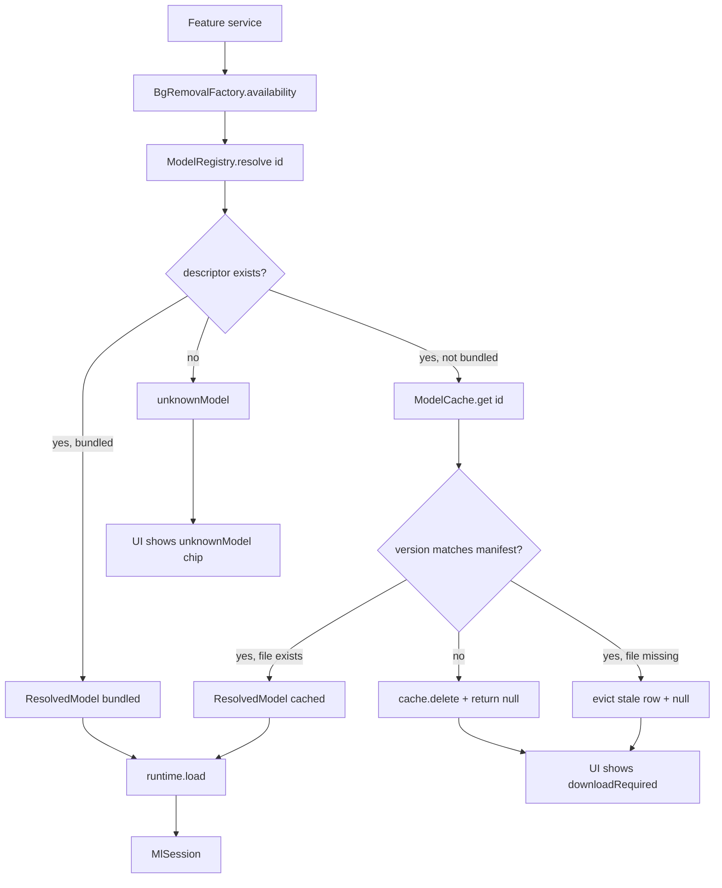

# 20 — AI Runtime & Models

## Purpose

On-device ML in this app uses three runtimes in parallel: Google ML Kit (in-process SDK, no manual loading), LiteRT (TFLite via `flutter_litert`), and ONNX Runtime (`onnxruntime_v2`). This chapter covers the shared substrate that makes them interchangeable to feature code:

- `MlRuntime` / `MlSession` — the interface both LiteRT and ORT implement.
- `DelegateSelector` — the hardware-acceleration chooser.
- `ModelManifest` / `ModelDescriptor` — the declarative list of every model the app knows about.
- `ModelRegistry` — "where is this model right now?" resolver.
- `ModelCache` — sqflite-indexed disk cache of downloaded files.
- `ModelDownloader` — dio-based downloader with resume + sha256 verification.

Per-feature services (bg removal, face detect, etc.) are covered in [21 — AI Services](21-ai-services.md).

## Data model

| Type | File | Role |
|---|---|---|
| `MlRuntime` (abstract) | [ml_runtime.dart:19](../../lib/ai/runtime/ml_runtime.dart) | `load(resolved) → MlSession`, `close()`. The interface feature code is blind to. |
| `MlSession` (abstract) | [ml_runtime.dart:36](../../lib/ai/runtime/ml_runtime.dart) | `run(inputs) → outputs`, `close()`. Byte-level `run` is not actually used — concrete sessions throw and require `runTyped`. |
| `MlRuntimeException` | [ml_runtime.dart:57](../../lib/ai/runtime/ml_runtime.dart) | Typed error with `stage ∈ {load, run, close}`. |
| `LiteRtRuntime` / `LiteRtSession` | [litert_runtime.dart](../../lib/ai/runtime/litert_runtime.dart) | `flutter_litert` wrapper. Copies bundled assets to temp files for the TFLite file-based API. |
| `OrtRuntime` / `OrtV2Session` | [ort_runtime.dart](../../lib/ai/runtime/ort_runtime.dart) | `onnxruntime_v2` wrapper. Loads `.onnx` from disk only; bundled ONNX is explicitly unsupported. |
| `TfLiteDelegate` | [delegate_selector.dart:8](../../lib/ai/runtime/delegate_selector.dart) | `gpu / nnapi / coreml / xnnpack / cpu`. |
| `DeviceCapabilities` | [delegate_selector.dart:30](../../lib/ai/runtime/delegate_selector.dart) | Per-device hints the selector reads. Populated in `bootstrap()`. |
| `DelegateSelector` | [delegate_selector.dart:63](../../lib/ai/runtime/delegate_selector.dart) | `preferredChain()` for LiteRT, `preferredOnnxChain()` for ORT. |
| `ModelDescriptor` | [model_descriptor.dart:31](../../lib/ai/models/model_descriptor.dart) | Freezed record: `id`, `version`, `runtime`, `sizeBytes`, `sha256`, `bundled`, optional `assetPath`/`url`, `purpose`. |
| `ModelRuntime` enum | [model_descriptor.dart:9](../../lib/ai/models/model_descriptor.dart) | `mlkit / litert / onnx`. |
| `ModelManifest` | [model_manifest.dart:17](../../lib/ai/models/model_manifest.dart) | `List<ModelDescriptor>` loaded from `assets/models/manifest.json`. |
| `ModelRegistry` | [model_registry.dart:21](../../lib/ai/models/model_registry.dart) | Manifest + cache → `ResolvedModel?`. |
| `ResolvedModel` | [model_registry.dart:85](../../lib/ai/models/model_registry.dart) | Descriptor + `kind ∈ {bundled, cached}` + `localPath`. |
| `ModelCache` | [model_cache.dart:66](../../lib/ai/models/model_cache.dart) | sqflite index (`models.db`) + files under `<docs>/models/`. |
| `ModelDownloader` | [model_downloader.dart:22](../../lib/ai/models/model_downloader.dart) | dio-based downloader. Handles resume via `Range:` header, sha256 verification, in-flight cancel. |
| `DownloadProgress` (sealed) | [download_progress.dart](../../lib/ai/models/download_progress.dart) | `DownloadQueued / DownloadProgress / DownloadComplete / DownloadFailed`. |

## Three runtimes

### ML Kit (mlkit)

In-process via Google's plugin packages. No manual loading, no delegate selection, no manifest entry required (the manifest has entries for `selfie_segmenter` and `face_detection_short` marked `bundled: true`, but they document the plugin's bundle — the runtime doesn't actually consume them). Used by:

- `MediaPipeBgRemoval` — selfie segmentation, always-available fallback.
- `FaceDetectionService` — face bounding boxes + landmarks + contours.

ML Kit doesn't implement `MlRuntime`. Its services own their plugin handles directly.

### LiteRT (litert)

TFLite via `flutter_litert`. One interpreter per session, paired with an `IsolateInterpreter` so inference runs off the main thread ([litert_runtime.dart:161](../../lib/ai/runtime/litert_runtime.dart:161)). Used by:

- `StylePredictService`, `StyleTransferService` (Magenta)
- `SuperResService` (Real-ESRGAN)
- Sky segmentation (DeepLabV3, declared in manifest, not yet wired)
- Face mesh (declared in manifest, not yet wired)

LiteRT uses the GPU delegate on iOS/Android when available. NNAPI and CoreML are **intentionally not wired today** — the doc at [litert_runtime.dart:187](../../lib/ai/runtime/litert_runtime.dart:187) explains: "those delegates have known compatibility quirks and a later phase will introduce runtime probing + disable lists."

### ONNX Runtime (onnx)

Via `onnxruntime_v2`. One `OrtSession` per model; `runOnceAsync` spins up a fresh isolate per call rather than a persistent worker. Used by:

- `RmbgBgRemoval`, `ModNetBgRemoval`
- `InpaintService` (LaMa)

ORT's key constraint: **CoreML execution provider is disabled** ([ort_runtime.dart:101](../../lib/ai/runtime/ort_runtime.dart:101)):

> Skip CoreML: it tries to compile the entire ONNX graph into a CoreML model at runtime, consuming 2-3 GB of memory and OOM-killing the app on devices with ≤4 GB RAM. CPU/XNNPACK is fast enough for the quantized models we use (~2-5 s on A17 Pro).

This is a field-tested decision — the alternative caused crashes on the most constrained iOS targets.

## Bundled vs. downloaded

Every model in the manifest is either `bundled: true` (shipped in `assets/models/bundled/`) or `bundled: false` (downloaded on first use to `<docs>/models/`). The split matters for three reasons:

1. **Load path differs.** `LiteRtRuntime.load` copies bundled assets to a temp file because the TFLite C API takes a file path ([litert_runtime.dart:58](../../lib/ai/runtime/litert_runtime.dart:58)). `OrtRuntime.load` **rejects bundled models outright** ([ort_runtime.dart:50](../../lib/ai/runtime/ort_runtime.dart:50)) — a comment notes "Phase 9g adds that if needed."
2. **Verification differs.** Bundled model integrity is guaranteed by the app binary; downloaded models are sha256-verified after the download finishes.
3. **Update path differs.** A bundled model upgrade requires an app update. A downloaded model upgrades when the manifest version string bumps — `ModelRegistry.resolve` evicts the cached copy on mismatch ([model_registry.dart:62](../../lib/ai/models/model_registry.dart:62)).

Manifest as of today (14 entries):

| Bundled (7) | Downloaded (7) |
|---|---|
| `selfie_segmenter` (mlkit) | `modnet` (onnx, 24 MB) |
| `face_detection_short` (mlkit) | `rmbg_1_4_int8` (onnx, 44 MB) |
| `face_mesh` (litert) | `lama_inpaint` (onnx, 208 MB) |
| `deeplabv3_sky` (litert) | `magenta_style_transfer` (litert, 570 KB) |
| `u2netp` (litert) | `real_esrgan_x4` (litert, 17 MB) |
| `espcn_3x` (litert) | `colorization_siggraph` (litert, 15 MB, URL is placeholder) |
| `magenta_style_predict` (litert) | — |

`assets/models/manifest.json` carries `PLACEHOLDER_FILL_WHEN_PINNED` for every sha256 — the real hashes are filled in when the host (HuggingFace / tfhub.dev / Qualcomm) URLs are verified. Downloads of pinned models would refuse on checksum mismatch; placeholder-sha256 entries effectively disable the verification gate.

## Flow — model lookup & load



### `ModelRegistry.resolve(id)`

Source: [model_registry.dart:35](../../lib/ai/models/model_registry.dart:35). Steps:

1. `manifest.byId(id)` — missing id logs a warning and returns `null`.
2. **Bundled path**: returns a `ResolvedModel(kind: bundled, localPath: assetPath)`. `localPath` is a Flutter asset key, not a filesystem path — runtimes know to copy it to a temp file.
3. **Cached path**: `cache.get(id)` returns the entry. If the cached version string doesn't match the manifest's current version, the stale row is deleted and `null` is returned (forcing re-download). If the row exists but the file is missing on disk (user wiped `<docs>`), the row is evicted and `null` is returned.

### Delegate-chain load

Source: [litert_runtime.dart:122](../../lib/ai/runtime/litert_runtime.dart:122). The chain is walked in `DelegateSelector.preferredChain()` order:

- iOS → CoreML → GPU → XNNPACK → CPU
- Android → NNAPI → GPU → XNNPACK → CPU
- Other → XNNPACK → CPU

For each delegate, the runtime builds `InterpreterOptions` (always calling `addMediaPipeCustomOps()` because face_mesh uses the transposed-conv custom op), attaches the delegate if applicable, and attempts `Interpreter.fromFile`. On failure it:

1. Deletes the raw `Delegate` handle (if any) + the `InterpreterOptions` — both are native allocations that leak if only the `Interpreter.fromFile` throw unwound the Dart stack.
2. Logs the delegate + error.
3. Moves to the next delegate.

If every delegate fails, `MlRuntimeException(stage: load, message: 'attempts: ...')` is thrown with the per-delegate error map. The comment at [litert_runtime.dart:114](../../lib/ai/runtime/litert_runtime.dart:114) is explicit about this: "If `Interpreter.fromFile` throws, the attached delegate + options leak unless we explicitly tear them down." The `_DelegateBuild` helper at [litert_runtime.dart:317](../../lib/ai/runtime/litert_runtime.dart:317) returns both objects so the failure path can release them individually.

Once an interpreter builds, `IsolateInterpreter.create` wraps it on a background isolate. Inference calls through `_isolate.runForMultipleInputs(inputs, outputs)` in `LiteRtSession.runTyped`.

### ORT load

Simpler. Source: [ort_runtime.dart:36](../../lib/ai/runtime/ort_runtime.dart:36).

1. Rejects bundled descriptors outright.
2. Initializes the `OrtEnv` once per process on first load.
3. Builds `OrtSessionOptions` with `setInterOpNumThreads(2) / setIntraOpNumThreads(2)` (failures tolerated — the comment notes thread config can fail on some iOS builds).
4. Constructs `OrtSession.fromFile(file, options)`. On failure, releases the options and rethrows wrapped.

`OrtV2Session.runTyped` uses `session.runOnceAsync(...)` which spawns a fresh isolate per call. No persistent worker; ORT's concurrency model is "each call runs in its own ephemeral isolate." This matches the 9a "inference never blocks the main thread" invariant without the session having to manage a long-running worker.

## ~~`IsolateInterpreterHost`~~ — removed in Phase I.11

An earlier draft shipped an `IsolateInterpreterHost` class that wrapped `MlSession` with per-session call serialization + telemetry, intended as a forward-compat scaffold for a future "true isolate worker" migration. Nothing ever adopted it — all 6 AI services held `LiteRtSession` / `OrtV2Session` directly — and the reason-to-exist evaporated when `flutter_litert`'s `IsolateInterpreter` and `onnxruntime_v2`'s `runAsync` shipped off-main-thread inference as their default. Deleted entirely in Phase I.11 (see `docs/PLAN.md`) along with its 5 orphan tests. If a future workload needs persistent-worker semantics, **Phase V #8** ("ORT persistent worker") is the right seam.

## `ModelCache` — sqflite index + disk files

Source: [model_cache.dart:66](../../lib/ai/models/model_cache.dart). One-row-per-model:

```sql
CREATE TABLE IF NOT EXISTS models (
  id TEXT PRIMARY KEY,
  version TEXT NOT NULL,
  path TEXT NOT NULL,
  size_bytes INTEGER NOT NULL,
  sha256 TEXT NOT NULL,
  downloaded_at INTEGER NOT NULL
)
```

Files live under `<docs>/models/` with filename `<id>_<version>` (no extension — the file bytes are the model, not a JSON wrapper). `destinationPathFor(descriptor)` computes the path and creates the parent dir.

`get(id)` does a consistency check: if the sqflite row exists but the file is gone (user cleared storage, sandbox corrupted), the row is evicted and `null` returned. Callers get the same signal as "never downloaded" and re-fetch.

`evictUntilUnder(maxBytes)` is oldest-first LRU eviction. Exposed for the Model Manager UI's "free up space" action and for a future auto-eviction on low-disk triggers. Not currently wired to any automatic trigger.

## `ModelDownloader` — dio + resume + sha256

Source: [model_downloader.dart:22](../../lib/ai/models/model_downloader.dart). Flow:

1. Reject bundled descriptors + null URLs immediately.
2. Track a `CancelToken` per in-flight download so the UI can cancel.
3. Check for partial file at `destinationPath`. If present, send `Range: bytes=<partialLength>-` to resume.
4. On 416 (Range Not Satisfiable), check if the local file is within 5% of the expected size — if yes, treat as complete. This handles the case where the manifest's `sizeBytes` is an estimate (HuggingFace's `content-length` can differ slightly from manifest declarations).
5. Stream the response body to disk with periodic progress events.
6. On completion, hash the file and compare against `descriptor.sha256`. Mismatch → fail. (Today this check is a no-op because manifest hashes are placeholders; callers still have the signal via the non-zero error case once hashes are pinned.)
7. Insert into `ModelCache`.

Progress events are typed (`DownloadProgress` sealed class) so the UI can render the right chip — queued / percent / complete / failed. Failures carry a `DownloadFailureStage ∈ {queued, fileSystem, network, checksum, unknown}` tag.

## Dispose-guard pattern

Every AI service follows this pattern — worth documenting here because it's cross-cutting:

```dart
class FooService {
  Future<ui.Image> foo(String path) async {
    if (_closed) throw const FooException('FooService is closed');
    // ... expensive async work ...
    if (_closed) {       // second check after await
      // release whatever we built
      throw const FooException('FooService is closed');
    }
    // ...
  }
}
```

The double-check (before AND after async work) matters because the session can be disposed mid-inference — a user tapping away from the editor while `OrtSession.runOnceAsync` is resolving. Without the second check, the service would finish building a `ui.Image`, hand it to the session, and the disposed session would leak it. The pattern appears in every `runTyped` / `removeBackgroundFromPath` / `inpaint` / `transferFromPath`. CLAUDE.md calls it out explicitly: "dispose-guard pattern — check `_disposed` before AND after async inference."

## Key code paths

- [bootstrap.dart:72](../../lib/bootstrap.dart:72) — one call site constructs `ModelManifest` → `ModelCache` → `ModelRegistry` → `ModelDownloader` → `DelegateSelector` → `LiteRtRuntime` / `OrtRuntime` → `BgRemovalFactory`. Read this to see the graph.
- [model_registry.dart:35 `resolve`](../../lib/ai/models/model_registry.dart:35) — the central "where is model X?" answer.
- [litert_runtime.dart:122](../../lib/ai/runtime/litert_runtime.dart:122) — the delegate-chain fallback loop. Study the leak-prevention pattern.
- [ort_runtime.dart:101](../../lib/ai/runtime/ort_runtime.dart:101) — the "no CoreML" comment is a field-tested decision worth reading.
- [model_downloader.dart:149](../../lib/ai/models/model_downloader.dart:149) — 416 Range-Not-Satisfiable = already-complete file heuristic.
- [model_cache.dart:175 `evictUntilUnder`](../../lib/ai/models/model_cache.dart:175) — LRU eviction. Present but not wired to an automatic trigger.

## Tests

- `test/ai/models/model_manifest_test.dart` — parse happy path, malformed entries skipped, missing runtime rejected.
- `test/ai/models/model_registry_test.dart` — bundled / cached / missing paths, version-mismatch eviction, file-missing eviction.
- `test/ai/models/model_cache_test.dart` — put / get / delete, `fileExists` falsy path, LRU eviction order.
- `test/ai/models/model_downloader_test.dart` — uses `dio_test` fixtures; resume from partial, 416 pass-through, sha256 mismatch rejection, cancel.
- `test/ai/runtime/delegate_selector_test.dart` — chain ordering per platform, conservative fallback.
- `test/ai/runtime/isolate_interpreter_host_test.dart` — serialization guarantee, disposed-fail-fast, telemetry wrapping.
- **Gap**: `LiteRtRuntime` and `OrtRuntime` are not unit-tested — they require platform channels. They're exercised transitively through the service tests for the strategies that use them, but a leaked-delegate regression would slip through unit tests.
- **Gap**: no integration test for the "placeholder sha256 bypasses verification" case. A test fixture with a real pinned hash + a corrupted file would pin the gate.

## Known limits & improvement candidates

- **`[correctness]` Placeholder sha256 hashes disable download verification.** Every downloaded-model descriptor has `"sha256": "PLACEHOLDER_FILL_WHEN_PINNED"`. Until real hashes are pinned, a MITM or CDN corruption goes undetected. The verification logic exists — it just has nothing to compare against. Ship the next release with at least the largest models (LaMa 208 MB, RMBG 44 MB) pinned.
- **`[correctness]` `colorization_siggraph` URL is `https://example.com/`.** [manifest.json:134](../../assets/models/manifest.json:134) still has a placeholder URL. The `aiColorize` op type exists in `EditOpType`; attempting to use it would fail at download time. Either remove the entry or ship a real URL.
- **`[correctness]` ORT bundled-load is hard-rejected.** [ort_runtime.dart:50](../../lib/ai/runtime/ort_runtime.dart:50) throws rather than copying to a temp file like LiteRT does. If a future model ships both as an ONNX bundle (for non-network-users) and a downloadable, that path would fail. The fix mirrors `LiteRtRuntime`'s temp-file copy and is ~30 lines.
- **`[correctness]` Delegate leak path is paper-thin.** The explicit `options.delete()` / `delegate.delete()` on a failed build is correct but per-attempt. If `options.addMediaPipeCustomOps()` itself throws mid-construction (unlikely but possible on a plugin upgrade), those resources leak because the build isn't wrapped in try/catch. A scope-guard helper (`withOptions(build) { ... }`) would make this robust.
- **`[perf]` NNAPI and CoreML delegates are permanently disabled for LiteRT.** The chain walks through them (they're in the returned list) but `_buildOptionsFor` has `break;` for both — the interpreter builds without their delegate attached, so the "fallback" is really XNNPACK. The comment says a future phase adds runtime probing + disable lists. Until then, Android devices with good NNAPI support pay a 2-3× inference cost vs theoretical.
- ~~**`[correctness]` `IsolateInterpreterHost` is never used.** It's mentioned in `ml_runtime.dart` as the isolate boundary, but neither `LiteRtSession` nor `OrtV2Session` routes through it today — both sessions expose `runTyped` directly.~~ ✅ *Phase I.11 deleted the scaffold; see the section above for the audit trail.*
- **`[perf]` ORT spawns a fresh isolate per `runOnceAsync` call.** That's 5-10 ms of isolate-spawn overhead per inference, which is a significant fraction of inference time for small inputs. A persistent ORT worker would amortize this. `onnxruntime_v2`'s `runAsync` (without `Once`) keeps the isolate alive; worth investigating if we decide to ship sustained back-to-back AI workflows.
- **`[correctness]` `ModelCache.evictUntilUnder` is never called.** Implemented + tested but no automatic trigger and no Model Manager button wires to it. On-disk growth is unbounded today (user downloads RMBG + LaMa + Real-ESRGAN = ~270 MB and nothing ever reclaims it unless they manually "Delete" per entry). A low-disk watchdog or a "fit within 500 MB" policy would close the gap.
- **`[ux]` Download-required state is an enum, not a URL.** When `BgRemovalFactory.availability` returns `downloadRequired`, the UI layer has to look up the descriptor, read `sizeBytes` for the confirm dialog, and wire `ModelDownloader.download` itself. A higher-level helper (`factory.prepare(kind, onProgress)`) would centralize the boilerplate.
- **`[maintainability]` Two runtime tracks for one concern.** `LiteRtRuntime` and `OrtRuntime` share maybe 40% of their structure (delegate chain walk, isolate wrap, error typing) but the implementations don't share code. A common `runAndWrap` template method + per-runtime "build session" specialization would reduce the code-drift risk.
- **`[test-gap]` No end-to-end test exercises `bootstrap()`'s AI subsystem wiring.** The individual pieces have tests; the graph of "manifest load failure → empty manifest → MediaPipe still available" case isn't covered. A bootstrap test with a stubbed `rootBundle` that throws on manifest would prove the graceful-degradation path.
- **`[correctness]` Manifest size estimates drift.** The downloader's 5% tolerance at [model_downloader.dart:149](../../lib/ai/models/model_downloader.dart:149) papers over estimate-vs-actual drift. Pinning manifest `sizeBytes` to the real `content-length` at the time of hash-pinning would remove the need for the tolerance.
