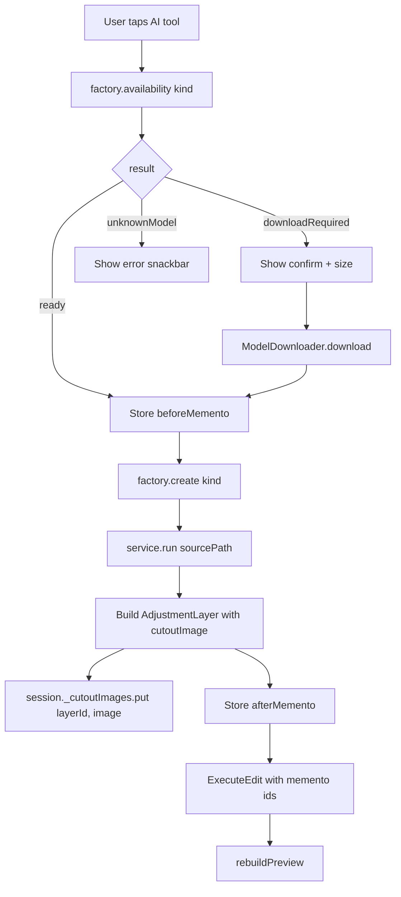

# 21 — AI Services

## Purpose

This chapter walks every AI-backed feature the editor exposes. Each service sits on top of the shared substrate from [20 — AI Runtime & Models](20-ai-runtime-and-models.md) — they load a model, preprocess a `ui.Image` into a tensor, run inference, and postprocess the output into a `ui.Image` that gets stored as an `AdjustmentLayer.cutoutImage` (see [11 — Layers & Masks](11-layers-and-masks.md)).

Common patterns recur: tensor layout (HWC vs CHW), input size, dispose guards, typed exception classes. Rather than repeat them per service, I state them once here and then tabulate each service's specifics.

Prerequisite reading: [04 — History & Memento Store](04-history-and-memento.md) (AI ops are memento-backed) and [11 — Layers & Masks](11-layers-and-masks.md) (`AdjustmentLayer` is the paint surface).

## Data model — the service contract

Every concrete service exposes the same shape:

```dart
class FooService {
  FooService({required this.session});  // or a detector, or params
  final MlSession session;
  bool _closed = false;

  Future<ui.Image> fooFromPath(String sourcePath, { ...params }) async {
    if (_closed) throw const FooException('closed');
    // 1. decode source
    // 2. build input tensor
    // 3. session.runTyped(...)
    // 4. build output ui.Image
    if (_closed) { /* release + throw */ }
    return resultImage;
  }

  Future<void> close() async { _closed = true; await session.close(); }
}

class FooException implements Exception { ... }
```

The dispose-guard pattern (double-check `_closed` before AND after async work) is explained in [20 — AI Runtime & Models](20-ai-runtime-and-models.md). Every service ships its own `FooException` so the UI can render typed error messages rather than surfacing runtime-level ONNX/TFLite failures verbatim.

### Shared preprocessing / postprocessing helpers

Services never reimplement common building blocks. Helpers under `lib/ai/preprocessing/`, `lib/ai/inference/`, and `lib/ai/postprocessing/`:

- `BgRemovalImageIo.decodeFileToRgba(path, maxDimension?)` — decode + optional cap. Used by almost every service.
- `ImageTensor.fromRgba(rgba, src{W,H}, dst{W,H})` — bilinear resize into `[1, 3, H, W]` CHW `[0,1]` float32.
- `MaskStats` — mean / coverage / empty-check used by sky replace and bg removal to catch "empty result" failures.
- `MaskToAlpha` — composite a single-channel mask into an RGBA `ui.Image` with soft alpha.
- `RgbaCompositor` — blend two RGBA buffers with a per-pixel alpha mask.
- `FaceMaskBuilder` — feathered face-shape mask with eye/mouth exclusion zones, driven by ML Kit landmarks.
- `SkyMaskBuilder` / `SkyPalette` — pure-Dart sky segmentation heuristic + procedural gradient generator.
- `BoxBlur` — separable box blur on raw RGBA.

These are called out per-service below; the point is that each service is mostly "pre → run → post" with ~50–150 lines of inference-specific plumbing, not a re-implementation of image-processing primitives.

## Service inventory

| Service | Runtime | Model | Input | Output | Storage |
|---|---|---|---|---|---|
| [`MediaPipeBgRemoval`](../../lib/ai/services/bg_removal/media_pipe_bg_removal.dart) | ML Kit | Selfie Segmenter (bundled) | file path | RGBA cutout | `AdjustmentLayer.backgroundRemoval` |
| [`ModNetBgRemoval`](../../lib/ai/services/bg_removal/modnet_bg_removal.dart) | ORT | `modnet` (24 MB, DL) | `[1,3,512,512]` f32 | `[1,1,512,512]` f32 mask | same |
| [`RmbgBgRemoval`](../../lib/ai/services/bg_removal/rmbg_bg_removal.dart) | ORT | `rmbg_1_4_int8` (44 MB, DL) | `[1,3,1024,1024]` f32 | `[1,1,1024,1024]` f32 mask | same |
| [`FaceDetectionService`](../../lib/ai/services/face_detect/face_detection_service.dart) | ML Kit | Face Detection short | file path, ≤1536 px | `List<DetectedFace>` (bbox + landmarks + optional contours) | consumed by beauty services, not its own layer |
| [`PortraitSmoothService`](../../lib/ai/services/portrait_beauty/portrait_smooth_service.dart) | FaceDetect + Dart box-blur | — | face list from detector + source `ui.Image` | `ui.Image` with blurred skin composited | `AdjustmentLayer.portraitSmooth` |
| [`EyeBrightenService`](../../lib/ai/services/portrait_beauty/eye_brighten_service.dart) | FaceDetect + Dart | — | face landmarks | RGBA with local brightness boost over eye circles | `AdjustmentLayer.eyeBrighten` |
| [`TeethWhitenService`](../../lib/ai/services/portrait_beauty/teeth_whiten_service.dart) | FaceDetect + Dart | — | face landmarks | RGBA with local desat+brighten over mouth circle | `AdjustmentLayer.teethWhiten` |
| [`FaceReshapeService`](../../lib/ai/services/portrait_beauty/face_reshape_service.dart) | FaceDetect + Dart warp | — | face contours + strength params | RGBA warped | `AdjustmentLayer.faceReshape` + `reshapeParams` |
| [`SkyReplaceService`](../../lib/ai/services/sky_replace/sky_replace_service.dart) | Pure-Dart heuristic | — | source `ui.Image` + `SkyPreset` | composited `ui.Image` | `AdjustmentLayer.skyReplace` + `skyPresetName` |
| [`StylePredictService`](../../lib/ai/services/style_transfer/style_predict_service.dart) | LiteRT | `magenta_style_predict` (3 MB, bundled) | `[1,256,256,3]` HWC f32 | `Float32List(100)` style vector | ephemeral — feeds transfer |
| [`StyleTransferService`](../../lib/ai/services/style_transfer/style_transfer_service.dart) | LiteRT | `magenta_style_transfer` (570 KB, DL) | `[1,384,384,3]` HWC f32 + 100-vec | `[1,384,384,3]` HWC f32 | `AdjustmentLayer.styleTransfer` |
| [`InpaintService`](../../lib/ai/services/inpaint/inpaint_service.dart) | ORT | `lama_inpaint` (208 MB, DL) | `[1,3,512,512]` f32 image + `[1,1,512,512]` mask | `[1,3,512,512]` f32 filled | `AdjustmentLayer.inpaint` |
| [`SuperResService`](../../lib/ai/services/super_res/super_res_service.dart) | LiteRT | `real_esrgan_x4` (17 MB, DL) | `[1,256,256,3]` HWC f32 | `[1,1024,1024,3]` HWC f32 | `AdjustmentLayer.superResolution` |
| [`SuperResolutionService`](../../lib/ai/services/super_resolution/super_resolution_service.dart) | — scaffold, always throws | — | — | — | not wired |

Two last rows are worth noting upfront: there are **two super-resolution services** — the working `SuperResService` in `super_res/` and a scaffold `SuperResolutionService` in `super_resolution/`. Only the former is wired into the editor session; the latter is Phase-0 scaffolding with a friendly error message. See Known Limits.

## Background removal — three strategies

Background removal ships a strategy picker so users can pick quality/speed tradeoffs at runtime. Three kinds, one factory, one interface.

### `BgRemovalStrategy` interface

Source: [bg_removal_strategy.dart:75](../../lib/ai/services/bg_removal/bg_removal_strategy.dart:75).

```dart
abstract class BgRemovalStrategy {
  BgRemovalStrategyKind get kind;
  Future<ui.Image> removeBackgroundFromPath(String sourcePath);
  Future<void> close();
}
```

The editor keeps one strategy alive per session; switching strategies disposes the old one. Return value is a `ui.Image` ready to drop into `AdjustmentLayer.cutoutImage`.

### `BgRemovalFactory` — availability + create

Source: [bg_removal_factory.dart:26](../../lib/ai/services/bg_removal/bg_removal_factory.dart). The factory does **not** download models — it resolves descriptors and builds strategies that are ready to run. If the model is missing, `availability()` returns `downloadRequired` and the UI prompts for download via `ModelDownloader` before calling `create()`. This separation keeps the factory pure and testable.

```dart
enum BgRemovalAvailability {
  ready,              // create will succeed
  downloadRequired,   // ModelDownloader.download first
  unknownModel,       // manifest missing descriptor — bug
}
```

`create()` resolves the descriptor, asserts the runtime family matches, loads a session, and wraps it in the appropriate strategy. Runtime failures wrap as `BgRemovalException(kind, cause)` — the `cause` carries the original `MlRuntimeException` so the log has the full chain.

### `MediaPipeBgRemoval` — always-available fallback

[media_pipe_bg_removal.dart:19](../../lib/ai/services/bg_removal/media_pipe_bg_removal.dart). Google ML Kit's Selfie Segmenter. Target: 8-15 ms on midrange. No model loading (bundled with the plugin), no tensor plumbing. The service reads a `SegmentationMask` (soft alpha per pixel at the source resolution) and composites it into the source's RGBA via `_applyMaskAlpha`. Best for portraits; fails on non-human subjects.

### `ModNetBgRemoval` — balanced portrait

[modnet_bg_removal.dart](../../lib/ai/services/bg_removal/modnet_bg_removal.dart). MODNet ONNX int8, 24 MB. Input tensor is `[1, 3, 512, 512]` CHW float32 `[0,1]`; output is `[1, 1, 512, 512]` soft alpha in `[0,1]`. Better hair and edge detail than MediaPipe. Portrait-focused — the training data is people-centric.

### `RmbgBgRemoval` — highest quality, any subject

[rmbg_bg_removal.dart:28](../../lib/ai/services/bg_removal/rmbg_bg_removal.dart:28). RMBG-1.4 int8, 44 MB. `[1, 3, 1024, 1024]` in, `[1, 1, 1024, 1024]` out. Trained on diverse subjects — animals, objects, people. Slowest of the three.

Notable pattern at [rmbg_bg_removal.dart:55](../../lib/ai/services/bg_removal/rmbg_bg_removal.dart:55): the finally block tracks `outputs: List<OrtValue?>?` so every output tensor's native memory is released even if postprocessing throws. The comment spells out why:

> Native pointers are NOT Dart-GC-managed, so without explicit release the ORT runtime leaks the tensor memory per failed call.

This is the kind of detail the service layer has to handle that the runtime doesn't hide — every ORT service follows the same pattern.

## Face detection + portrait beauty

### `FaceDetectionService`

[face_detection_service.dart:28](../../lib/ai/services/face_detect/face_detection_service.dart:28). Thin wrapper over `google_mlkit_face_detection`. Exposes `minFaceSize` (fraction of image width, default 10%) and `enableContours` (~130 points per face, doubles latency). Contours are on by default because face reshape needs them; beauty services that only need the 6 named landmarks ignore them.

Images are capped at 1536 px on longest edge before being sent to the detector — larger images cause ML Kit to fail silently ([face_detection_service.dart:76](../../lib/ai/services/face_detect/face_detection_service.dart:76)). The capture is a decode-to-smaller-file step; the raw source is never passed through.

### `PortraitSmoothService`

[portrait_smooth_service.dart:33](../../lib/ai/services/portrait_beauty/portrait_smooth_service.dart:33). Skin smoothing without a neural net:

1. Run `FaceDetectionService` on the source.
2. For each face, build a feathered face-shape mask with `FaceMaskBuilder` (excluding eye + mouth regions so features stay sharp).
3. `BoxBlur` a copy of the RGBA with radius scaled to face size (`blurRadiusFraction = 0.03`, clamped to `[3, 18]` px).
4. Composite blurred + original through the face mask via `RgbaCompositor`.

The doc at [portrait_smooth_service.dart:26](../../lib/ai/services/portrait_beauty/portrait_smooth_service.dart:26) explicitly calls this out as "service, not strategy" — a deliberate anti-over-abstraction note: "When Phase 9e/9f add more beauty strategies (e.g. GPU-accelerated bilateral, ML-matted body-segmented smoothing) we'll promote this to a `PortraitBeautyStrategy` enum + factory. Until then, keeping it concrete avoids boilerplate + premature abstraction."

### `EyeBrightenService` / `TeethWhitenService`

Similar shape: find face landmarks, draw a soft circle mask around the eye centers (or mouth), apply a local brightness boost (or desaturate+brighten), composite via `RgbaCompositor`. No model — entirely face-landmark driven. See each file for the per-service tuning defaults.

### `FaceReshapeService`

[face_reshape_service.dart](../../lib/ai/services/portrait_beauty/face_reshape_service.dart). The only beauty service that warps pixels rather than compositing local effects. Uses the face **contour** points (not just landmarks), builds a per-vertex displacement field, and pushes pixels to produce "slim face" / "enlarge eyes" effects. The strength parameters (`slim`, `eyes`) are serialized into the `AdjustmentLayer.reshapeParams` map so reload can re-run the warp at full resolution.

All four beauty services consume `FaceDetectionService` — the editor session owns one detector instance and injects it. The detector's lifecycle is managed independently (kept alive across multiple beauty ops in one session).

## Sky replace — pure-Dart heuristic

[sky_replace_service.dart:36](../../lib/ai/services/sky_replace/sky_replace_service.dart:36). The only AI-adjacent feature with **no model** today. Steps:

1. `SkyMaskBuilder` runs a pure-Dart heuristic over the RGBA: top-of-frame + blue-channel dominance + brightness thresholds produce a soft sky mask.
2. `SkyPalette` generates a procedural gradient matching the user-picked `SkyPreset` (`clearBlue`, `sunset`, `night`, `dramatic`).
3. `RgbaCompositor` blends the new sky into the original through the mask.

The doc at [sky_replace_service.dart:20](../../lib/ai/services/sky_replace/sky_replace_service.dart:20) is honest about the trade-offs:

- The heuristic catches typical blue / bright / top-of-frame sky pixels but misses night skies, heavily cloud-covered low-contrast skies, and anything where sky wraps around low obstacles.
- The replacement is a procedurally-generated gradient, not a photographic HDR sky. Users who hit a miss get a coaching message instead of a silent no-op (`MaskStats` empty-check).

The scaffolding is designed for swap-in: the DeepLabV3 sky segmentation model (`deeplabv3_sky`, 2.4 MB, bundled in manifest) is pinned but not wired. A future revision replaces `SkyMaskBuilder.build` with a LiteRT inference call; everything else (palette, compositor, preset enum) stays the same. Similarly, `SkyPreset` is designed so a future "load from asset + tile" variant slots in behind the same enum. The `skyPresetName` is stored on the layer as a plain string precisely so the engine stays independent of the `ai/` package.

## Style transfer — two-model pipeline

Magenta arbitrary image stylization uses two models: **predict** (extract a 100-d style vector from a reference image) and **transfer** (apply the vector to a content image). Both are TFLite; the predict model is bundled (3 MB), the transfer model is downloaded (570 KB).

### `StylePredictService`

[style_predict_service.dart:14](../../lib/ai/services/style_transfer/style_predict_service.dart:14). Takes a style reference image, decodes at 256 px, builds `[1, 256, 256, 3]` HWC `[0,1]`, returns a `Float32List(100)`. Style vectors are cached in `style_presets.dart` for the built-in Magenta looks (Monet, Starry Night, etc.) so the user doesn't re-run predict for curated styles.

### `StyleTransferService`

[style_transfer_service.dart:23](../../lib/ai/services/style_transfer/style_transfer_service.dart:23). Takes a content image + precomputed 100-d vector. Build `[1, 384, 384, 3]` HWC from content; run inference; output is `[1, 384, 384, 3]` HWC float32 `[0,1]`. Unlike PyTorch-style CHW models, Magenta is HWC — the comment at [style_transfer_service.dart:18](../../lib/ai/services/style_transfer/style_transfer_service.dart:18) calls this out explicitly because it's easy to get backwards when comparing to RMBG/MODNet.

`StyleTransferService.inputSize` is `384`, not the 256 the comment claims on [style_transfer_service.dart:27](../../lib/ai/services/style_transfer/style_transfer_service.dart:27). The constant value is right; the doc is slightly stale.

## Inpaint — LaMa

[inpaint_service.dart:27](../../lib/ai/services/inpaint/inpaint_service.dart:27). LaMa ONNX, 208 MB — the largest model the app downloads. Takes two inputs:

- `image`: `[1, 3, 512, 512]` float32 `[0,1]`
- `mask`: `[1, 1, 512, 512]` float32 `{0, 1}` (1 = inpaint this pixel)

Output: `[1, 3, 512, 512]` of the filled image. After inference, only the *masked* pixels are composited back onto the original — keeping the unmasked regions pixel-perfect instead of going through the model's 512 px resolution.

The mask comes from the draw tool (`InpaintBrushOverlay`): white pixels on a transparent canvas mark the area to fill. Passed as `Uint8List` RGBA at arbitrary resolution; the service resizes to 512.

## Super-resolution — the duplicate

Two files, one works:

- **`SuperResService`** at [super_res/super_res_service.dart:17](../../lib/ai/services/super_res/super_res_service.dart:17). Real-ESRGAN TFLite, 17 MB. Input 256 px HWC, output 1024 px HWC, 4× upscale. Uses letterboxing (not stretching) to preserve aspect ratio. Functional.
- **`SuperResolutionService`** at [super_resolution/super_resolution_service.dart:42](../../lib/ai/services/super_resolution/super_resolution_service.dart:42). A scaffold with a `SuperResolutionFactor` enum (`x2 / x3 / x4`) whose `upscale` always throws `SuperResolutionException('not yet available')`. The file's doc comment lists the implementation plan (resolve model, tile source, blend tile edges, optional ESPCN fallback).

The working one is wired into the editor session. The scaffold exists because a follow-up was started to add the x2/x3/x4 factor picker and multi-model support (Real-ESRGAN + ESPCN fallback). Today the scaffold is dead code.

## Flow — typical AI op lifecycle



1. User taps e.g. "Remove background" in the AI panel.
2. The editor checks `BgRemovalFactory.availability(kind)`. If not ready, the UI offers "Download model (44 MB)" with a progress stream.
3. Once the model is cached, the session captures a *before* memento (pre-op pixels) via `MementoStore.store(...)`.
4. The factory builds the strategy (loads the model into a session if needed) and the service runs inference.
5. The returned `ui.Image` is cached in the session's `_cutoutImages` map keyed by layer id, and a new `AdjustmentLayer` is constructed.
6. The session captures an *after* memento and dispatches `ExecuteEdit(op, afterParameters, beforeMementoId, afterMementoId)`.
7. History records the entry; next `rebuildPreview` paints the layer on top of the shader chain (see [03](03-rendering-chain.md) for render, [04](04-history-and-memento.md) for memento semantics, [11](11-layers-and-masks.md) for the layer).

## Key code paths

- [bg_removal_factory.dart:80 `create`](../../lib/ai/services/bg_removal/bg_removal_factory.dart:80) — strategy-kind dispatch with runtime-family assertions and typed-error wrapping.
- [rmbg_bg_removal.dart:59](../../lib/ai/services/bg_removal/rmbg_bg_removal.dart:59) — the ORT output-release finally block. Read this to understand why services can't rely on Dart GC for native tensor cleanup.
- [face_detection_service.dart:76](../../lib/ai/services/face_detect/face_detection_service.dart:76) — `_maxDetectDimension = 1536` workaround for the "ML Kit fails silently on large images" issue.
- [portrait_smooth_service.dart:26](../../lib/ai/services/portrait_beauty/portrait_smooth_service.dart:26) — the "service not strategy" anti-abstraction note. Good pattern to cite when reviewing future AI features.
- [sky_replace_service.dart:14](../../lib/ai/services/sky_replace/sky_replace_service.dart:14) — the "heuristic today, swap in DeepLabV3 later" seam. Worth studying as the cleanest example of designing for future model integration.
- [style_transfer_service.dart:73](../../lib/ai/services/style_transfer/style_transfer_service.dart:73) — HWC (vs CHW) tensor construction. If you ever port a PyTorch model, this is the layout pitfall.
- [inpaint_service.dart:27](../../lib/ai/services/inpaint/inpaint_service.dart:27) — LaMa input shape. The 208 MB model is the largest download; mask-only-composite-back is what keeps non-masked pixels lossless.
- [super_resolution_service.dart:42](../../lib/ai/services/super_resolution/super_resolution_service.dart:42) — the scaffold-with-helpful-error pattern. Useful for staging other AI features while their models are pinned.

## Tests

- `test/ai/services/bg_removal/bg_removal_factory_test.dart` — availability states, create-with-missing-model error, runtime-family mismatch rejection.
- `test/ai/services/bg_removal/media_pipe_bg_removal_test.dart` — lifecycle + typed error paths.
- `test/ai/services/bg_removal/modnet_bg_removal_test.dart` / `rmbg_bg_removal_test.dart` — input tensor construction, output release order (the native-leak scenario).
- `test/ai/services/face_detect/face_detection_service_test.dart` — landmark extraction, empty-result handling, 1536 px cap.
- `test/ai/services/portrait_beauty/*_test.dart` — each of the four beauty services; mask construction + composite order.
- `test/ai/services/sky_replace/sky_replace_service_test.dart` — empty-mask path, preset dispatch.
- `test/ai/services/style_transfer/*_test.dart` — two-model pipeline wiring, HWC tensor layout, style vector length.
- `test/ai/services/inpaint/inpaint_service_test.dart` — mask resize, compositor with-mask coverage.
- `test/ai/services/super_res/super_res_service_test.dart` — letterboxing, x4 output shape.
- **Gap**: inference tests use stubbed sessions that return pre-canned tensors. A regression where the real model's output layout flips (e.g. RMBG ships a CHW/HWC change in a new version) would pass every unit test.
- **Gap**: no test for the "user cancels mid-inference" path — the dispose-guard pattern is coded but not exercised by a test.
- **Gap**: the super-resolution scaffold (`SuperResolutionService`) has no test — not even one asserting "throws with helpful message."

## Known limits & improvement candidates

- **`[correctness]` Duplicate super-resolution services.** Both `super_res/super_res_service.dart` (working) and `super_resolution/super_resolution_service.dart` (scaffold) ship. New code consuming the wrong one compiles and runs — the user just sees a confusing error. Delete the scaffold now that a working service exists, or rename it to `SuperResolutionTilingService` if the tiling plan is still pending.
- **`[correctness]` StyleTransfer input size mismatch with comment.** [style_transfer_service.dart:27](../../lib/ai/services/style_transfer/style_transfer_service.dart:27) says "The int8 transfer model from TFHub uses 384×384" — but the adjacent doc comment at line 16 says "`[1, 256, 256, 3]`". Code is right, comment is stale; worth fixing so future readers aren't misled about tensor shape.
- **`[correctness]` Sky mask heuristic silently accepts blue walls.** The heuristic catches blue-channel dominant pixels; on a photo with a blue-painted wall or a large blue body of water, it will replace those too. `MaskStats.empty` catches zero-coverage but not over-coverage. A mask-coverage upper bound (with a "this doesn't look like a sky" coaching message) would prevent confusing replacements.
- **`[correctness]` Only MediaPipe bg removal is in the always-available path.** If the user has no network and the MediaPipe model's `processImage` fails (e.g. no face in a landscape shot), there's no fallback — the picker shows "Fast (portrait)" as the only ready option. Wiring `u2netp` (a bundled general matter) as a fourth strategy would give non-portrait offline coverage.
- **`[perf]` Beauty services run sequentially in the session.** A user applying Eye Brighten + Teeth Whiten + Portrait Smooth pays three face-detection runs (once per service). The services don't share detector output. A session-level `FaceDetectionResult` cache keyed by source path would eliminate the redundancy.
- **`[correctness]` `FaceReshapeService` warp params are persisted but the warp implementation isn't reproducible from params alone.** `reshapeParams` stores strengths like `slim: 0.5`, but the actual warp depends on the face contour points from the detector. On reload with a different source image (or a detector that finds slightly different contours), re-running the warp may produce different results. The parametric design promise (persist params → get same pixels) is softer here than for other layers.
- **`[ux]` Download prompts don't show estimated time.** The UI shows size (e.g. "44 MB") but not time ("~15 s on Wi-Fi"). For the 208 MB LaMa, users may abandon without realizing the operation is minutes rather than hours.
- **`[maintainability]` Service classes are flat — no abstraction across services.** Each service carries its own `_closed`, `FooException`, `fooFromPath`, and dispose-guard. A small `AbstractAiService` base class could own the lifecycle boilerplate. The current repetition is tolerable (~10 services × ~30 lines of boilerplate = 300 lines), but any new per-service behaviour (e.g. progress reporting) has to be added 10 times.
- **`[correctness]` Bundled model manifest entries are theatre for ML Kit.** `selfie_segmenter` and `face_detection_short` are in the manifest as `bundled: true` with asset paths, but no code ever resolves them — ML Kit bundles its own models inside the plugin. The entries are documentation-only. Either wire them to an actual consumer or mark them clearly as "metadata for the Model Manager UI only."
- **`[perf]` `StylePredictService` runs per style application, not per style reference.** The Magenta built-in styles have pre-computed vectors (`style_presets.dart`), but a future "use this photo as a style reference" feature would run predict every time. The vector depends only on the reference image — a simple sha256-keyed cache would eliminate redundant predicts.
- **`[test-gap]` No integration test covers "AI op → memento captured → undo restores pre-op pixels".** The memento-required op types are tested at the history layer; the services that create mementos aren't tested for the hand-off to the session's memento store. A round-trip test (fake service returns known image → session stores memento → undo reads back the original bytes) would close the loop.
- **`[correctness]` `EditOpType.aiColorize` has no service.** The op type is defined, in `mementoRequired`, but no service produces it and the manifest's `colorization_siggraph` URL is a placeholder. Either build the service or remove the op type so loaded pipelines don't carry dead references.
