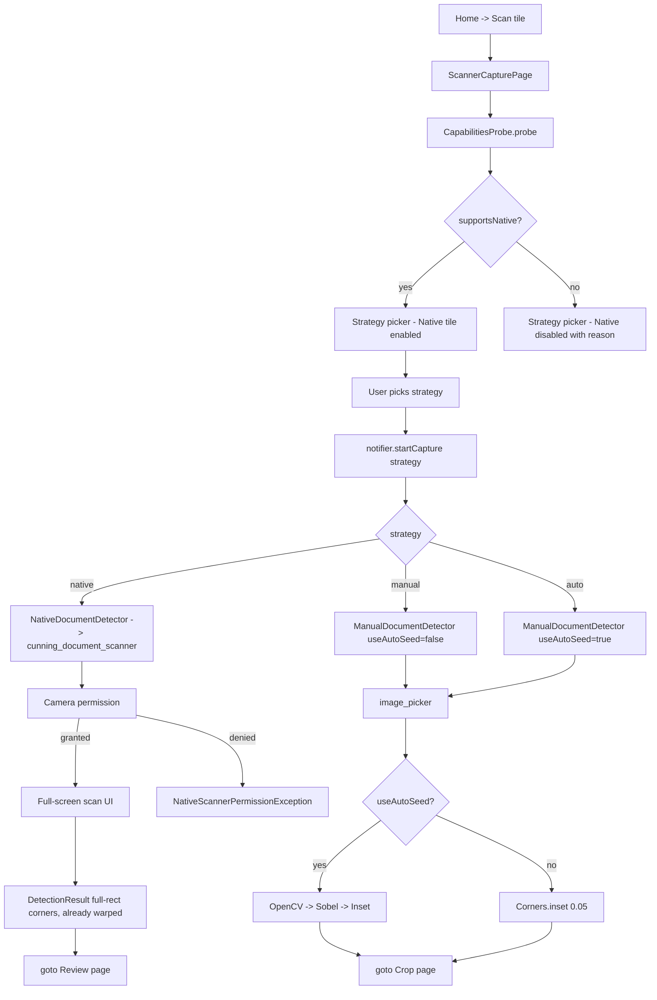
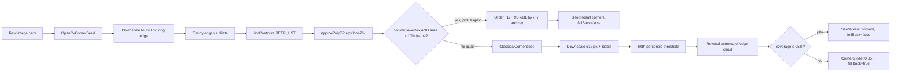

# 30 — Scanner Capture & Detection

## Purpose

The scanner's first page is a four-strategy picker: **Native** (ML Kit / VisionKit full-screen scanner), **Manual** (image picker + default inset corners), **Auto** (image picker + classical-CV corner guess), and **History** (resume a past session). This chapter covers:

- The capability probe that decides whether Native is offered at all.
- The three `DocumentDetector` implementations and what each produces.
- The `CornerSeeder` chain (OpenCV contour → Sobel → inset) that fills in corner starting points for the Auto strategy.
- The coaching banner that tells users when Auto bottomed out.

Pixel-level processing (warp, filters, classification) is covered in [31 — Scanner Processing & Filters](31-scanner-processing.md). Export flows in [32 — Scanner OCR & Export](32-scanner-export.md).

## Data model

| Type | File | Role |
|---|---|---|
| `DetectorStrategy` enum | [scan_models.dart:33](../../lib/features/scanner/domain/models/scan_models.dart:33) | `native / manual / auto`. User-visible labels + descriptions live on the extension. |
| `DocumentDetector` (abstract) | [document_detector.dart:40](../../lib/features/scanner/domain/document_detector.dart:40) | `capture({maxPages}) → DetectionResult`. One impl per strategy. |
| `DetectionResult` | [document_detector.dart:9](../../lib/features/scanner/domain/document_detector.dart:9) | `pages`, `strategyUsed`, `autoFellBackCount`. |
| `NativeDocumentDetector` | [native_document_detector.dart:25](../../lib/features/scanner/infrastructure/native_document_detector.dart:25) | Wraps `cunning_document_scanner` (ML Kit on Android, VisionKit on iOS). Handles camera permission pre-check. |
| `ManualDocumentDetector` | [manual_document_detector.dart:18](../../lib/features/scanner/infrastructure/manual_document_detector.dart:18) | Image picker + optional auto-seed. Serves both `manual` and `auto` strategies by toggling `useAutoSeed`. |
| `ImagePickerCapture` | [image_picker_capture.dart](../../lib/features/scanner/infrastructure/image_picker_capture.dart) | Thin wrapper over `image_picker` — `pickFromCamera` / `pickFromGallery(multi)`. |
| `Corners` | [scan_models.dart:69](../../lib/features/scanner/domain/models/scan_models.dart:69) | Four `Point2` in normalized 0..1 space, clockwise from TL. `Corners.inset(0.05)` and `Corners.full()` factories. |
| `CornerSeeder` (abstract) | [classical_corner_seed.dart:26](../../lib/features/scanner/infrastructure/classical_corner_seed.dart:26) | `seed(imagePath) → SeedResult`. |
| `SeedResult` | [classical_corner_seed.dart:15](../../lib/features/scanner/infrastructure/classical_corner_seed.dart:15) | `corners` + `fellBack: bool`. The latter drives the coaching banner. |
| `OpenCvCornerSeed` | [opencv_corner_seed.dart:31](../../lib/features/scanner/infrastructure/opencv_corner_seed.dart:31) | Primary seeder. Canny + `findContours` + `approxPolyDP`. Chains to `ClassicalCornerSeed` on no-quad. |
| `ClassicalCornerSeed` | [classical_corner_seed.dart:46](../../lib/features/scanner/infrastructure/classical_corner_seed.dart:46) | Pure-Dart Sobel + edge-cloud bounding box. Returns `fellBack: true` when the edges span >95% of the frame (= "no page detected"). |
| `CapabilitiesProbe` | [capabilities_probe.dart:51](../../lib/features/scanner/infrastructure/capabilities_probe.dart:51) | Platform probe. Android → Play Services availability via method channel. |
| `ScannerCapabilities` | [capabilities_probe.dart:18](../../lib/features/scanner/infrastructure/capabilities_probe.dart:18) | `supportsNative`, `supportsOcr`, `nativeUnavailableReason`, `recommended`. |
| `ScannerNotifier` | [scanner_notifier.dart:85](../../lib/features/scanner/application/scanner_notifier.dart:85) | Central Riverpod StateNotifier; the UI reads state + calls `startCapture`. |
| `ScannerState` | [scanner_notifier.dart:27](../../lib/features/scanner/application/scanner_notifier.dart:27) | Session + capabilities + isBusy + error + notice + `permissionBlockedRequiresSettings`. |

## Flow



### Capability probe

`CapabilitiesProbe.probe()` at [capabilities_probe.dart:57](../../lib/features/scanner/infrastructure/capabilities_probe.dart:57):

1. Default: `supportsNative = isAndroid || isIOS`, `supportsOcr = same`.
2. On Android, invoke `com.imageeditor/play_services` method channel → `checkAvailability` returning a `GoogleApiAvailability` result code. Timeout 800 ms.
   - `0` = success (no change).
   - Non-zero (1/2/3/9/18/…) → `supportsNative = false`, `nativeUnavailableReason = <human message>`.
   - `MissingPluginException` → **fail open**: keep `supportsNative = true`. The comment at [capabilities_probe.dart:17](../../lib/features/scanner/infrastructure/capabilities_probe.dart:17) explains: "if the platform side isn't wired up we keep the optimistic `supportsNative = true` and rely on `ScannerUnavailableException` from the first capture call to flip the user into manual mode."
3. `recommended` → `native` when supported, else `auto`.

The native-side method channel lives in the Android host `MainActivity` (not in Dart). Called out in CLAUDE.md: `com.imageeditor/play_services` handled there.

### Strategy picker

`StrategyPicker` widget reads `state.capabilities` and renders three tiles:

- **Native** — shown disabled with a badge + `nativeUnavailableReason` when the probe flagged unsupported. The disabled-reason text replaces the normal description so the user learns *why*. Keeps the tile visible (not hidden) so the feature is discoverable even when unavailable today.
- **Manual** — always enabled.
- **Auto** — always enabled; labelled "experimental" in the description.

A fourth tile opens the history page (past sessions). Not part of capture per se but co-located in the picker.

### Native detection

[native_document_detector.dart:32](../../lib/features/scanner/infrastructure/native_document_detector.dart:32). Order:

1. `_ensureCameraPermission()` — calls `Permission.camera.request()`. Both iOS and Android short-circuit on already-granted so the dialog only shows once per lifetime. Comment at [:78](../../lib/features/scanner/infrastructure/native_document_detector.dart:78) explains why `.status` isn't used: "permission_handler bug where `.status` kept returning a stale `permanentlyDenied` after the user enabled Camera in Settings without restarting the app."
2. On permission denied → throw `NativeScannerPermissionException(status)`. The notifier catches this and sets `permissionBlockedRequiresSettings` if `status.isPermanentlyDenied || isRestricted`, flipping the UI into "Open Settings" mode.
3. `CunningDocumentScanner.getPictures(noOfPages: maxPages, isGalleryImportAllowed: true)` — the native scanner handles corner detection, warp, multi-page capture, and its own filters.
4. Returned paths already point at warped + filtered JPEGs. Each `ScanPage` gets `corners: Corners.full()` and `processedImagePath == rawImagePath` — the in-app pipeline is effectively bypassed ([native_document_detector.dart:54](../../lib/features/scanner/infrastructure/native_document_detector.dart:54)). The notifier detects this via `strategyUsed == native` and skips the Crop page ([scanner_notifier.dart:169](../../lib/features/scanner/application/scanner_notifier.dart:169)).
5. User cancellation bubbles as `ScannerCancelledException`; anything else rethrows as `ScannerUnavailableException(err)` so the notifier can fall back to a manual suggestion.

### Manual / Auto detection

[manual_document_detector.dart:18](../../lib/features/scanner/infrastructure/manual_document_detector.dart:18). One class serves both strategies — the only difference is `useAutoSeed`. The constructor takes a `CornerSeeder` (injected by the notifier; today it's `OpenCvCornerSeed` chained to `ClassicalCornerSeed`).

```dart
for (final path in paths.take(maxPages)) {
  Corners corners;
  if (useAutoSeed) {
    final result = await seeder.seed(path);
    corners = result.corners;
    if (result.fellBack) fellBackCount++;
  } else {
    corners = Corners.inset();
  }
  pages.add(ScanPage(id: uuid.v4(), rawImagePath: path, corners: corners));
}
```

`pickSource` drives whether `pickFromCamera` or `pickFromGallery(multi: true)` is used — the capture page asks the user first (camera vs gallery) so the detector gets a concrete source.

### `_detectorFor` dispatch

Source: [scanner_notifier.dart:217](../../lib/features/scanner/application/scanner_notifier.dart:217). The notifier builds a fresh detector per capture:

```dart
switch (strategy) {
  case DetectorStrategy.native:
    return const NativeDocumentDetector();
  case DetectorStrategy.manual:
    return ManualDocumentDetector(picker: picker, seeder: cornerSeed,
        useAutoSeed: false, pickSource: pickSource);
  case DetectorStrategy.auto:
    return ManualDocumentDetector(picker: picker, seeder: cornerSeed,
        useAutoSeed: true, pickSource: pickSource);
}
```

The `cornerSeed` singleton is wired in `providers.dart` as `OpenCvCornerSeed()` (which internally instantiates `ClassicalCornerSeed` as its fallback).

## Corner seeder chain



### `OpenCvCornerSeed` — primary

Source: [opencv_corner_seed.dart:31](../../lib/features/scanner/infrastructure/opencv_corner_seed.dart:31). Pipeline:

1. Decode + downscale to ~720 px long edge ([:69](../../lib/features/scanner/infrastructure/opencv_corner_seed.dart:69)) — Canny + `findContours` scale with pixel count, so this is a 5–8× speedup over running on the source. Quad shape is unaffected.
2. Convert to grayscale, Gaussian blur 5×5 to suppress paper texture.
3. `cv.canny(blurred, 50, 150)` → `cv.dilate` 3×3 to close small breaks in the page border that would otherwise split a single contour.
4. `cv.findContours(RETR_LIST, CHAIN_APPROX_SIMPLE)`.
5. For each contour: filter by `area ≥ 10% of frame`, then `cv.approxPolyDP(perimeter * 0.02)` and keep contours that approximate to **exactly 4 points**. The 2% epsilon is the VSCO/Adobe empirical standard for document-quad approximation.
6. Pick the largest survivor; order its 4 points TL/TR/BR/BL by sum (TL = smallest x+y, BR = largest) and difference (TR = largest x-y from the mid pair, BL = smallest) ([opencv_corner_seed.dart:150](../../lib/features/scanner/infrastructure/opencv_corner_seed.dart:150)).
7. Normalize to `[0, 1]²`.

All `cv.Mat` and `cv.Vec*` allocations are released in a `finally` block at [opencv_corner_seed.dart:134](../../lib/features/scanner/infrastructure/opencv_corner_seed.dart:134) — FFI pointers aren't Dart-GC managed, so without explicit `.dispose()` each page seeds at the cost of 6-7 native allocations that leak until the isolate tears down.

On *any* exception (decode failure, native lib missing, pathological quad), the seed delegates to its `fallback` — the pure-Dart Sobel path.

### `ClassicalCornerSeed` — Sobel fallback

Source: [classical_corner_seed.dart:46](../../lib/features/scanner/infrastructure/classical_corner_seed.dart:46). No native deps — works in the Flutter test runner. Pipeline:

1. Decode + downscale to 512 px long edge.
2. Grayscale + Gaussian blur (radius 2).
3. 3×3 Sobel on `gray.r`, magnitude per pixel.
4. Threshold at the 60th-percentile of non-zero magnitudes — avoids a fixed threshold that fails on low-contrast scans.
5. Scan every pixel above threshold; track `minX / maxX / minY / maxY` of the edge cloud. Require ≥ 50 hits and a non-degenerate bounding box.
6. Inset by 0.5% to avoid clipping the detected page edge.
7. **Coverage check**: if `(xMax-xMin)*(yMax-yMin) > 95%`, set `fellBack: true`. The heuristic didn't find a page — the user photographed paper edge-to-edge or a textured background that picked up Sobel hits everywhere. Returning `inset(0.05)` as a starting point would be equivalent, so the `fellBack` flag triggers the coaching banner.

Every failure mode (decode fail, sparse edges, full-coverage cloud) returns `Corners.inset()` with `fellBack: true`. The signal up the chain is consistent.

## Coaching banner

`DetectionResult.autoFellBackCount` carries the number of pages where the seeder hit the fallback. The notifier folds this into `ScannerState.notice` via `coachingNoticeFor(result)` ([scanner_notifier.dart:153](../../lib/features/scanner/application/scanner_notifier.dart:153)). The crop page's `_CoachingBanner` widget reads `state.notice` and surfaces a plain message like "Auto detection couldn't find page edges on 2 of 3 pages — drag the corners to fit your pages." No user action blocks on the banner; it dismisses when the user touches any corner.

The comment at [scanner_notifier.dart:150](../../lib/features/scanner/application/scanner_notifier.dart:150) is the UX rationale: *"keeps the user from staring at a full-frame quad wondering what went wrong."* This is the whole reason `SeedResult.fellBack` is a separate signal from "heuristic returned `Corners.inset()`" — the banner needs to distinguish "the user picked Manual, which always returns inset" from "Auto tried and fell back."

## `ScannerNotifier.startCapture` — error handling

`startCapture` at [scanner_notifier.dart:137](../../lib/features/scanner/application/scanner_notifier.dart:137) funnels all capture errors through typed exceptions:

- `ScannerCancelledException` → no error, no notice, `CaptureOutcome.cancelled`.
- `NativeScannerPermissionException` → sets `permissionBlockedRequiresSettings` iff `status.isPermanentlyDenied || isRestricted`; trims the "Try Auto…" suffix when the user must go to Settings (that UI surfaces a dedicated button instead). Returns `failed`.
- `ScannerUnavailableException` → uses the probe's specific reason over the generic detector message (so "Google Play Services disabled" beats "Native scanner unavailable"), and always nudges the user toward Auto/Manual. Returns `failed`.
- Anything else → generic "Capture failed: $e" plus logged stack trace. Returns `failed`.

The strategy picker watches `state.capabilities` live, so if a probe refresh (on resume) flips `supportsNative` to false, the tile disables *without* requiring a retry of the capture itself.

## Key code paths

- [capabilities_probe.dart:57 `probe`](../../lib/features/scanner/infrastructure/capabilities_probe.dart:57) — the fail-open Play Services check. Worth reading for the 800 ms timeout + `MissingPluginException` handling.
- [native_document_detector.dart:83 `_ensureCameraPermission`](../../lib/features/scanner/infrastructure/native_document_detector.dart:83) — why we call `.request()` instead of `.status`. Field-tested.
- [manual_document_detector.dart:36 `capture`](../../lib/features/scanner/infrastructure/manual_document_detector.dart:36) — the shared manual/auto loop. `useAutoSeed` is the only branch.
- [opencv_corner_seed.dart:85 `_detectQuad`](../../lib/features/scanner/infrastructure/opencv_corner_seed.dart:85) — full OpenCV quad detection. The finally-block pattern for FFI cleanup is the kind of detail every OpenCV caller in the app follows.
- [opencv_corner_seed.dart:150 `_normalisedCornersFromQuad`](../../lib/features/scanner/infrastructure/opencv_corner_seed.dart:150) — TL/TR/BR/BL ordering via sum+diff of coords. Robust against the arbitrary order `findContours` returns.
- [classical_corner_seed.dart:141](../../lib/features/scanner/infrastructure/classical_corner_seed.dart:141) — the 95%-coverage → `fellBack` heuristic. Read to understand why "seemingly successful heuristic" still flags itself as fallback.
- [scanner_notifier.dart:137 `startCapture`](../../lib/features/scanner/application/scanner_notifier.dart:137) — the exception-to-state translation.

## Tests

- `test/features/scanner/opencv_corner_seed_test.dart` — happy path on synthetic frames with a white quad on black; fallback path when OpenCV throws; TL/TR/BR/BL ordering.
- `test/features/scanner/classical_corner_seed_test.dart` — Sobel on synthetic pages; sparse-edges → inset; full-coverage → `fellBack`.
- `test/features/scanner/strategy_picker_test.dart` — disabled native tile when `nativeUnavailableReason` is non-null; inline reason text.
- `test/features/scanner/scanner_notifier_coaching_test.dart` — `autoFellBackCount > 0` → `state.notice` populated; single-page fell-back wording vs multi-page.
- `test/features/scanner/scanner_smoke_test.dart` — the full pipeline: detect → seed → warp → filter → classify → orient. Integration-style; runs end-to-end on a fixture.
- **Gap**: no test for `NativeDocumentDetector` — `cunning_document_scanner` isn't easily mocked, and the permission path requires `permission_handler` stubs. The 2026-Q1 scanner overhaul notes "six phases" but NDD specifically has no unit coverage.

## Known limits & improvement candidates

- **`[correctness]` Capability probe fails open on `MissingPluginException`.** If the Android host-side channel implementation is missing or broken (a fresh clone before `gradle sync`, a rare plugin regression), the probe silently keeps `supportsNative = true` and the user hits `ScannerUnavailableException` on first tap instead. Better UX would be an exponential-backoff retry with a clear "couldn't check Play Services" banner on persistent failures.
- **`[perf]` Seeder runs serially across pages.** `ManualDocumentDetector.capture` awaits `seeder.seed(path)` one page at a time ([manual_document_detector.dart:46](../../lib/features/scanner/infrastructure/manual_document_detector.dart:46)). On an 8-page gallery import, that's 8 × ~200 ms = 1.6 s before the crop page opens. `Future.wait` over independent seeders would halve wall time on any multi-page flow.
- **`[correctness]` `OpenCvCornerSeed`'s 10% area floor excludes small-but-valid documents.** A business card photographed from a distance may cover <10% of the frame. The seeder returns "no quad found" and the Sobel fallback may or may not pick it up. A sliding area floor (5% on high-aspect, 10% on square) would be a small behaviour change worth considering.
- **`[correctness]` `approxPolyDP` epsilon is fixed at 2%.** The comment calls this the "empirical standard" but low-contrast or heavily shadowed pages can produce quads that polygonize to 5–6 points. A fallback to 3% → 4% on no-quad would recover many edge cases without degrading clean shots.
- **`[ux]` Coaching banner says how many pages fell back but not which.** "2 of 3 pages" doesn't point the user at page 2 (vs 1 or 3). The crop page's pagination strip already knows which is current; tying the coaching message to "page 2 needs attention" is a UX nicety.
- **`[correctness]` `ClassicalCornerSeed` `fellBack` is a single threshold.** Coverage >95% = fallback; 94% = "success" even though the quad is effectively full-frame. A smoothed distribution (e.g. coverage > 85% with a small hit-count-per-area ratio) would catch the near-boundary cases.
- **`[test-gap]` No test for the "gallery pick selects a file the OS can't decode" path.** `image.decodeImage` returns null, `OpenCvCornerSeed` delegates to Sobel which also returns null, and `ClassicalCornerSeed` returns `inset + fellBack`. That chain works but no test pins it end-to-end — a corrupted file could regress this into a throw.
- **`[maintainability]` Two corner taxonomies co-exist.** The `SeedResult.fellBack` bool is functionally equivalent to `corners == Corners.inset()` but the two can drift (a future seeder could return inset and forget to set `fellBack`). Making `fellBack` a computed property from the corners themselves would remove the risk.
- **`[ux]` Native-path bypasses the crop page entirely.** Users who want to re-crop after a native scan have no entry point. The Review page could expose "Re-crop this page" that drops them back into the Crop page with `Corners.inset()` — currently impossible once `Corners.full()` is committed.
- **`[correctness]` Permission pre-check only covers Native.** Manual + Auto pick from image_picker, which has its own permission path; on permanent denial that surfaces as a generic `PlatformException` that falls through to the generic "Capture failed: $e" case at [scanner_notifier.dart:206](../../lib/features/scanner/application/scanner_notifier.dart:206). Parity with `NativeScannerPermissionException` would let the same "Open Settings" CTA apply to gallery picks.
- **`[perf]` OpenCV seeder reloads the OpenCV shared lib per page.** Each `seed()` call goes through `opencv_dart`'s FFI boundary; the lib itself stays loaded but every Mat allocation is a fresh FFI round-trip. Batching multi-page seed calls into a single isolate that keeps the Mat buffers warm would save per-page overhead.
- **`[test-gap]` No test for the `permanentlyDenied` → `requiresSettings` flag path.** The notifier branches on this and the UI renders a different CTA. A unit test that constructs a `NativeScannerPermissionException(PermissionStatus.permanentlyDenied)` and asserts `state.permissionBlockedRequiresSettings` would pin the contract.
