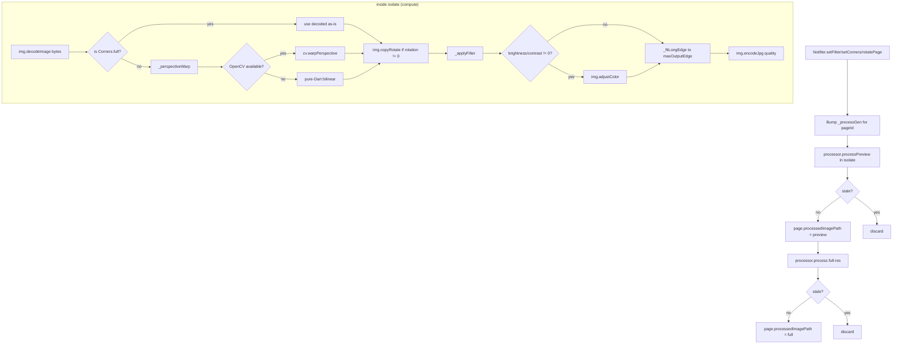

# 31 — Scanner Processing & Filters

## Purpose

Everything between "user confirmed the corners" and "a filtered JPEG lands on disk" happens in `ScanImageProcessor` — perspective warp, rotation, filter application, and per-page fine-tune. This chapter also covers the two classifiers that drive UX defaults: `estimateRotationDegrees` (0° vs 90° auto-rotate), `estimateDeskewDegrees` (fine angle), and `DocumentClassifier` (receipt / invoice / ID / handwritten / photo).

Capture, detectors, and corner seeding are in [30 — Scanner Capture & Detection](30-scanner-capture.md). OCR and export are in [32 — Scanner OCR & Export](32-scanner-export.md).

## Data model

| Type | File | Role |
|---|---|---|
| `ScanImageProcessor` | [image_processor.dart:32](../../lib/features/scanner/data/image_processor.dart:32) | Two render paths: `process` (full-res ≤2400 px) and `processPreview` (1024 px). Both run in an isolate via `compute`. |
| `_ProcessPayload` | [image_processor.dart:114](../../lib/features/scanner/data/image_processor.dart:114) | Isolate-marshalled message: bytes, corners, rotation, filter, output edge, JPEG quality, per-page tune (brightness, contrast, thresholdOffset). |
| `ScanFilter` | [scan_models.dart:4](../../lib/features/scanner/domain/models/scan_models.dart:4) | `auto / color / grayscale / bw / magicColor`. |
| `estimateRotationDegrees` | [auto_rotate.dart:29](../../lib/features/scanner/data/auto_rotate.dart:29) | Canny+Hough → 0° or 90° classifier. 180° is explicitly out of scope. |
| `estimateDeskewDegrees` | [image_processor.dart:663](../../lib/features/scanner/data/image_processor.dart:663) | Canny+Hough → fine skew angle (median of long-line angles in [-45°, +45°]). |
| `DocumentClassifier` | [document_classifier.dart:62](../../lib/features/scanner/domain/document_classifier.dart:62) | Pure-Dart heuristic over `ImageStats` + optional `OcrResult` → `DocumentType`. |
| `DocumentType` | [document_classifier.dart:10](../../lib/features/scanner/domain/document_classifier.dart:10) | `receipt / invoiceOrLetter / idCard / handwritten / photo / unknown`. Each has a `suggestedFilter`. |
| `ImageStats` | [document_classifier.dart:137](../../lib/features/scanner/domain/document_classifier.dart:137) | `width`, `height`, `colorRichness` (hue stddev, [0,1]). |
| `computeImageStats` | [image_stats_extractor.dart:10](../../lib/features/scanner/data/image_stats_extractor.dart:10) | Downscales to 256 px long edge, computes chroma magnitude per pixel. |
| `ScanPage.brightness / contrast / thresholdOffset` | [scan_models.dart:196](../../lib/features/scanner/domain/models/scan_models.dart:196) | Per-page fine-tune applied AFTER the filter pipeline. |
| `PageTunePanel` | [page_tune_panel.dart](../../lib/features/scanner/presentation/widgets/page_tune_panel.dart) | Review-page sliders for the three tune values. |

## Flow



### Two render paths

`process` produces a full-resolution JPEG with long edge capped at 2400 px (default), quality 88. Typically 3-7 s on a 12 MP capture. `processPreview` is the same pipeline capped at 1024 px, quality 80 — usually 200-700 ms. Source: [image_processor.dart:45](../../lib/features/scanner/data/image_processor.dart:45).

Both paths go through `_runOnce`, differing only in `edge`, `quality`, and a debug `label`. The full-res is the export target; the preview is what the thumbnail and review page display while the full version is still rendering.

The notifier's render driver ([scanner_notifier.dart:324 `_processAllPages`](../../lib/features/scanner/application/scanner_notifier.dart:324)) issues a preview immediately on any edit (filter change, corner edit, rotate) and chains the full-res render in the background. The user always sees *something* within half a second.

### `compute()` with main-thread fallback

Source: [image_processor.dart:77](../../lib/features/scanner/data/image_processor.dart:77):

```dart
Uint8List jpeg;
try {
  jpeg = await compute(_processInIsolate, payload);
} catch (e, st) {
  _log.e('isolate failed, running on main', error: e, stackTrace: st);
  jpeg = _processInIsolate(payload);
}
```

Isolate spawn can fail on specific Android / OEM builds (legacy restrictions, sandbox limits) — rather than crash the scanner, the processor retries on the main thread. UI will jank for a couple of seconds but the scan still completes. The top-level `_processInIsolate` is a free function (required for `compute`).

### Stale-result guard

The notifier holds `Map<String, int> _processGen` — a per-page generation counter. Every user action (`setFilter`, `setCorners`, `rotatePage`) bumps the page's counter; the async renderer captures the id at dispatch and only commits its result when the id is still current. Source: [scanner_notifier.dart:104](../../lib/features/scanner/application/scanner_notifier.dart:104):

> Drops stale results when the user taps filters faster than a `process()` call completes (a real bug seen in field logs where `filter=magicColor` results were overwriting freshly-selected `filter=grayscale` previews).

Without this guard, a slow preview render would silently overwrite a newer filter selection. The pattern is the same idea as the bake-race guard in `_bakeCurveLut` ([03 — Rendering Chain](03-rendering-chain.md)) but applied at a coarser granularity.

## Perspective warp

### Detecting the full-rect no-op

`_isFullRect(corners)` ([image_processor.dart:181](../../lib/features/scanner/data/image_processor.dart:181)) tests whether each corner is within 0.01 of the canonical `Corners.full()` position. If yes, the processor skips warp entirely and feeds `decoded` straight into the filter step. This matters for the native-scanner path, where the document is already warped by VisionKit / ML Kit.

### OpenCV path

`_perspectiveWarpOpenCv` at [image_processor.dart:210](../../lib/features/scanner/data/image_processor.dart:210):

1. Compute source quad pixel coords from normalized `Corners` × source dims.
2. Compute output dims via `_outputDimsFor(pts)` ([image_processor.dart:265](../../lib/features/scanner/data/image_processor.dart:265)) — averages top/bottom edge lengths for width and left/right edge lengths for height, clamps to `[64, 8000]`.
3. Build source BGR Mat directly from `img.Image.getBytes(order: bgr)` (no cvtColor needed).
4. `cv.getPerspectiveTransform(srcQuad, dstQuad)` → 3×3 matrix.
5. `cv.warpPerspective(srcMat, mTransform, (outW, outH))` — native, multi-threaded inside libopencv_imgproc.
6. Copy the warped Mat's bytes *out* before disposing (`Mat.data` is a view on FFI memory, not Dart-owned).
7. Construct a new `img.Image` from those bytes so the rest of the filter chain operates on `img.Image`.

All 5 Mats (srcMat, srcQuad, dstQuad, mTransform, warped) dispose in a `finally`. Same FFI-leak pattern as the OpenCV corner seeder.

### Pure-Dart fallback

`_perspectiveWarpDart` at [image_processor.dart:285](../../lib/features/scanner/data/image_processor.dart:285) is a straight bilinear warp — for each output pixel, bilinearly interpolate between the two vertical "edge rails" of the quad. Visually identical to the OpenCV path within rounding noise, slower by ~5-15×.

Kept as a fallback because:
- Flutter's test runner can't load `opencv_dart` on many CI configurations.
- An unsupported platform (linux headless, Windows desktop builds) would otherwise crash the warp.
- A native-asset build hiccup (wrong ABI, missing .so) degrades gracefully instead of failing the whole scan.

The outer `_perspectiveWarp` at [image_processor.dart:202](../../lib/features/scanner/data/image_processor.dart:202) is the try/catch wrapper — try OpenCV, fall back on any throw.

## Filters

`_applyFilter` at [image_processor.dart:338](../../lib/features/scanner/data/image_processor.dart:338) dispatches by `ScanFilter`:

| Filter | Pipeline |
|---|---|
| `auto` | `img.adjustColor(contrast: 1.08, saturation: 1.03)` |
| `color` | `img.adjustColor(contrast: 1.15, saturation: 1.15)` |
| `grayscale` | `img.adjustColor(contrast: 1.1)` → `img.grayscale` |
| `bw` | `binarizeWithOpenCv(src, cOffset: thresholdOffset)` OR pure-Dart `_adaptiveThreshold(img.grayscale(src))` |
| `magicColor` | `magicColorWithOpenCv(src)` OR pure-Dart `_magicColor(src)` |

### B&W — adaptive threshold

`binarizeWithOpenCv` ([image_processor.dart:376](../../lib/features/scanner/data/image_processor.dart:376)) pipeline:

1. `cv.cvtColor(src, BGR2GRAY)`.
2. **Unsharp pre-pass**: `cv.gaussianBlur(gray, 5×5)` → `cv.addWeighted(gray, 1.6, blur, -0.6, 0)` = `gray * 1.6 - blur * 0.6`. Equivalent to `gray + 1.0 × (gray - blur)`. Recovers thin strokes that the threshold's local-mean window would otherwise smear into the background.
3. `cv.adaptiveThreshold(sharp, 255, GAUSSIAN_C, BINARY, blockSize=31, C = 8 + thresholdOffset)`. The C-value is the "bias" the user tunes per-page via the slider: negative makes thin strokes darker, positive drops faint marks.

`thresholdOffset` is clamped to `±30` so the slider can't produce a fully-white or fully-black page.

Pure-Dart fallback `_adaptiveThreshold` ([image_processor.dart:595](../../lib/features/scanner/data/image_processor.dart:595)) uses a 2D integral image for O(1) per-pixel local-mean lookup, which is how it stays feasible without native SIMD. Window size = `max(9, w/40) | 1` (odd), C = 8. No unsharp pre-pass (the integral-image path is fallback-only, so we keep it simple).

### Magic Color — multi-scale Retinex

`magicColorWithOpenCv` ([image_processor.dart:445](../../lib/features/scanner/data/image_processor.dart:445)) — multi-scale Retinex (MSR):

1. Three Gaussian blurs at kernel sizes proportional to image long edge: `L/4`, `L/8`, `L/16` (all forced odd, min 31). Each blur is a different *scale* of estimated illumination.
2. `src / blur_k` per scale (`cv.divide` with `scale: 220` — the scaled 8-bit output so typical page backgrounds lift toward white without clipping).
3. Average the three reflectance images: `R = (R1 + R2 + R3) / 3`.
4. Convert back to 8UC3 and apply `img.adjustColor(contrast: 1.15, saturation: 1.15, brightness: 1.02)` for the finishing pop.

The multi-scale part matters: a single-scale divide leaks scene-level colour variations into the result (a photo with a sunset has everything lifted toward orange). Averaging three scales washes out the low-frequency colour cast while keeping local detail.

Pure-Dart fallback `_magicColor` ([image_processor.dart:524](../../lib/features/scanner/data/image_processor.dart:524)) is single-scale:

1. Gray-world white balance — per-channel gain to equalize R/G/B means.
2. Blur-on-downscaled illumination normalization (downscale 320 px → radius-6 gaussian blur → upscale → divide). 10-30× faster than a full-res blur at visually identical output.
3. `adjustColor(contrast: 1.2, saturation: 1.2, brightness: 1.02)`.

### Per-page fine-tune

`ScanPage.brightness / contrast / thresholdOffset` at [scan_models.dart:196](../../lib/features/scanner/domain/models/scan_models.dart:196). All three default to 0 (identity). The review page's `PageTunePanel` exposes sliders so users can fix a too-dark B&W or a warm-cast magic-color without leaving the scanner.

Applied at [image_processor.dart:166](../../lib/features/scanner/data/image_processor.dart:166):

```dart
if (payload.brightness != 0 ||
    (payload.contrast != 0 && payload.filter != ScanFilter.bw)) {
  out = img.adjustColor(
    out,
    brightness: 1.0 + payload.brightness * 0.5,
    contrast: payload.filter == ScanFilter.bw ? null : 1.0 + payload.contrast * 0.6,
  );
}
```

Brightness applies to every filter; contrast is skipped for `bw` because adaptive threshold has already collapsed the image to `{0, 255}` and a contrast stretch would just saturate the same pixels. `thresholdOffset` doesn't go through this block — it's baked into the adaptive-threshold C-value upstream.

## Auto-rotate

`estimateRotationDegrees` at [auto_rotate.dart:29](../../lib/features/scanner/data/auto_rotate.dart:29). Problem: a user photographs a document sideways; the scanner should auto-orient it.

Algorithm:
1. Downscale to 640 px long edge.
2. `cv.canny(gray, 50, 150)`.
3. `cv.HoughLinesP(edges, 1, π/180, 80, minLineLength = max(20, longEdge*0.15), maxLineGap = 12)`.
4. For each line, classify as horizontal (`dx > dy*2.5`), vertical (`dy > dx*2.5`), or ambiguous diagonal (ignored). The `2.5×` threshold ignores lines within ±20° of either axis so italics / tables don't skew the decision.
5. Decision ([auto_rotate.dart:79](../../lib/features/scanner/data/auto_rotate.dart:79)):
   - Fewer than 10 confident lines → return null (inconclusive).
   - `vertical ≥ horizontal × 3.0` AND `horizontal ≤ 12` → **90°** (sideways).
   - `horizontal ≥ vertical × 1.5` → **0°** (upright).
   - Otherwise null.

**180° is out of scope.** The comment at [auto_rotate.dart:26](../../lib/features/scanner/data/auto_rotate.dart:26) is explicit: distinguishing top-vs-bottom requires an OCR orientation model. The scanner surfaces a "Rotate page" button so the user can finish the job manually.

The "sidewaysRatio = 3.0 + sidewaysMaxHorizontal = 12" heuristic tuning at [:91](../../lib/features/scanner/data/auto_rotate.dart:91) came from a field-logged false positive: a page with vertical table dividers + barcode strips had 26 horizontal and 277 vertical Hough lines — the old 1.5× ratio rotated it 90° by mistake. The tightened thresholds suppress that case without missing genuinely sideways captures (which typically have < 5 horizontal text-line edges).

## Deskew

`estimateDeskewDegrees` at [image_processor.dart:663](../../lib/features/scanner/data/image_processor.dart:663). Fine-grained skew angle (unlike auto-rotate's 0°/90° classifier).

Algorithm:
1. Grayscale + downscale to 640 px long edge.
2. Canny 50/150.
3. `HoughLinesP` with `minLineLength = max(20, longEdge * 0.2)` (longer than auto-rotate's 0.15 — deskew needs genuinely long edges).
4. For each line compute `atan2(dy, dx)` in degrees, then fold into `[-45°, +45°]` so both horizontal text lines and vertical table rules contribute to the same axis.
5. Need ≥ 8 survivors; else return null.
6. Return the **median** angle (robust against outliers). `|median| < 0.2°` → return exactly 0 (already straight).

Deskew and auto-rotate share the Canny+Hough stem but produce different outputs. The session composes them: first auto-rotate to fix 0°/90°, then deskew for the ±5° residual.

CLAUDE.md notes a fallback: "falls back to the OCR-block-baseline heuristic when Hough yields fewer than 8 lines." That path isn't in `image_processor.dart` — it's elsewhere in the scanner notifier and runs only after OCR has been computed.

## Document classifier

### `ImageStats` + `computeImageStats`

`computeImageStats` ([image_stats_extractor.dart:10](../../lib/features/scanner/data/image_stats_extractor.dart:10)) downscales to 256 px long edge, then computes *chroma magnitude* per pixel: `(max(r,g,b) - min(r,g,b)) / 255`. The stddev of chroma is `colorRichness`, clamped `[0, 1]`. Documents print on a near-white background and skew toward 0; photos with rich subjects skew toward 1.

The extractor deliberately doesn't compute actual HSV — the comment at [:23](../../lib/features/scanner/data/image_stats_extractor.dart:23) explains: "the length of the mean chroma vector + the per-pixel variance gives a number that's stable against grey backgrounds without needing a real HSV conversion." Cheaper and fit for purpose.

### `DocumentClassifier.classify`

Source: [document_classifier.dart:65](../../lib/features/scanner/domain/document_classifier.dart:65). Branch order matters:

1. **Receipt**: `aspect < 0.55 && (density > 0.05 || hasMoneyMarker)`. Tall + narrow + numeric OCR blocks + currency / "total" / "subtotal" / "change due".
2. **Photo**: `colorRichness > 0.5 && density < 0.01`. Checked *before* ID card so a saturated landscape doesn't get mistaken for a laminated card.
3. **ID card**: `aspect ∈ (1.4, 1.95) && colorRichness ∈ (0.25, 0.5)`. Credit-card shape, moderate saturation (not wild).
4. **Handwritten**: OCR present, has blocks, density < 0.02, and `text.replaceAll([^A-Za-z], '').length < 30`. ML Kit's confidence drops sharply on cursive — a short-text + few-blocks signature is the proxy.
5. **Letter / invoice**: `aspect ∈ (0.65, 0.85) && density > 0.02`.
6. **Unknown**: fallthrough.

`_textDensity(ocr, stats)` at [document_classifier.dart:111](../../lib/features/scanner/domain/document_classifier.dart:111) is `sum(block.w × block.h) / (page.w × page.h)` — ratio of OCR-block coverage to page area.

Each type maps to a `suggestedFilter`:

| Type | Filter |
|---|---|
| receipt | bw |
| invoiceOrLetter | magicColor |
| idCard | color |
| handwritten | grayscale |
| photo | color |
| unknown | auto |

The review page's "Smart filter" button reads this and applies the suggestion. Users can override from the filter chip row.

### Why heuristic vs. ML model

The comment at [document_classifier.dart:9](../../lib/features/scanner/domain/document_classifier.dart:9) is explicit: "Five buckets are enough to cover ~95 % of consumer scans without pretending to be a real ML classifier (that lands in S5 v2 with a MobileNetV3-Small head trained on RVL-CDIP-mobile)." The heuristic is intentionally small + dependency-free so it runs in any test runner and provides a clean swap point for the future model.

## Key code paths

- [image_processor.dart:57 `_runOnce`](../../lib/features/scanner/data/image_processor.dart:57) — the shared driver for both render paths. Read this to see the `compute` + main-thread fallback pattern.
- [image_processor.dart:144 `_processInIsolate`](../../lib/features/scanner/data/image_processor.dart:144) — the top-level isolate entry. Must be top-level for `compute`; shows the full pipeline in one function.
- [image_processor.dart:202 `_perspectiveWarp`](../../lib/features/scanner/data/image_processor.dart:202) — OpenCV-preferred with pure-Dart fallback on any throw.
- [image_processor.dart:376 `binarizeWithOpenCv`](../../lib/features/scanner/data/image_processor.dart:376) — B&W with unsharp pre-pass.
- [image_processor.dart:445 `magicColorWithOpenCv`](../../lib/features/scanner/data/image_processor.dart:445) — MSR pipeline. Study for the FFI-finally disposal pattern applied to 13 Mats.
- [auto_rotate.dart:91](../../lib/features/scanner/data/auto_rotate.dart:91) — the field-tested 3.0× ratio + horizontal ≤ 12 floor. Worth reading to understand why the thresholds aren't round numbers.
- [document_classifier.dart:75](../../lib/features/scanner/domain/document_classifier.dart:75) — the classification branch order. Order matters; photos are checked before ID cards on purpose.
- [scanner_notifier.dart:104](../../lib/features/scanner/application/scanner_notifier.dart:104) — the `_processGen` stale-result guard docstring. The pattern applies to any async result commit.

## Tests

- `test/features/scanner/image_processor_filters_test.dart` — every filter; identity inputs; B&W threshold offset monotonicity; magic-color gray-world white-balance; per-page tune.
- `test/features/scanner/image_processor_opencv_test.dart` — OpenCV path specifically; asserts the fallback fires when native lib isn't available.
- `test/features/scanner/scan_page_adjustments_test.dart` — per-page fine-tune fields serialization + identity-omission.
- `test/features/scanner/auto_rotate_test.dart` — synthetic horizontal/vertical line images; confidence floor; the "vertical tables" false-positive fix.
- `test/features/scanner/document_classifier_test.dart` — each document type gets at least one fixture; branch order invariants.
- `test/features/scanner/scanner_smoke_test.dart` — end-to-end: detect → warp → every filter → classify → orient. The most important scanner test.
- **Gap**: no test for `estimateDeskewDegrees` specifically (it's exercised by the smoke test indirectly). A small fixture with a known skewed page would be valuable.
- **Gap**: no test exercises the isolate-spawn failure → main-thread fallback path.

## Known limits & improvement candidates

- **`[perf]` Full-res process runs 3-7 s on a 12 MP capture.** That's long enough for users to suspect a crash. A per-page progress indicator (or at least "Processing page 2 of 3…") would lower perceived latency. The notifier already has `busyLabel` for capture but not for per-page processing.
- **`[correctness]` `compute()` failure fallback runs on the UI thread.** [image_processor.dart:81](../../lib/features/scanner/data/image_processor.dart:81). On a 12 MP scan with five ops in the pipeline, that's 3-7 seconds of frozen UI. A background `Isolate.run` that bypasses `compute` would avoid the freeze at the cost of slightly more boilerplate.
- **`[perf]` Per-page full-res render is not cancellable.** The `_processGen` guard drops stale results but the isolate keeps running the discarded work. Cancellation would require restructuring around `Isolate.run` with a kill signal.
- **`[correctness]` B&W threshold offset is `[-30, +30]` but UI slider is `[-1, +1]`.** The notifier's `setThresholdOffset` scales the slider into the C-value range. Worth confirming the scale factor is consistent — a silent 10× mismatch would make the slider appear to do very little or very much.
- **`[ux]` Magic Color's `scale: 220` bias is hardcoded.** A higher bias pushes the background whiter but risks blowing out highlights. Currently there's no per-page control over this. A "Magic Color intensity" slider (scale 180 → 240) would give users control without another filter bucket.
- **`[correctness]` `estimateRotationDegrees` can't detect 180°.** Called out explicitly in comments as "out of scope." Users who photograph a page upside-down get a rotated-90°-wrong result that looks intentional. At minimum, surfacing this in the review page with "Looks sideways? Rotate" CTA would help.
- **`[correctness]` `DocumentClassifier` doesn't consider image blur.** A blurry photo can have high chroma + low OCR density and classify as `photo` when it's actually a failed document capture. A sharpness metric (Laplacian variance) in `ImageStats` would let the classifier route low-sharpness high-chroma to `unknown`.
- **`[test-gap]` No end-to-end test for the `_processGen` stale-result guard.** The field-log case that motivated it (rapid filter taps) isn't regression-tested.
- **`[perf]` `_perspectiveWarpDart` is called only on FFI failure but still compiled in every build.** Saves ~150 lines of code that are dead on every end-user device. Worth a `@visibleForTesting` annotation + `kReleaseMode` guard or a compile-time `flutter_opencv_dart` check.
- **`[correctness]` `_isFullRect`'s 0.01 tolerance is frame-independent.** Valid for normalized corners but a rectangle inset by 0.005 on one side (a drag that felt like "no change") would trigger the warp path unnecessarily. Tightening to 0.005 or making the check content-aware (all four sides ≤ eps from their canonical values) is cheap.
- **`[ux]` Filter chips show labels but not previews.** Users who don't know what "Magic Color" does have to tap through filters to see. Rendering each filter's output on a tiny thumbnail (similar to `PresetThumbnailCache` in the editor) would make the strip self-documenting.
- **`[correctness]` `DocumentClassifier.classify` silently falls through to `unknown`.** The fallthrough is reasonable but a test that a photographed receipt with `aspect = 0.56` (just above the receipt threshold) doesn't misclassify as "unknown" would pin the threshold sensitivity.
- **`[maintainability]` Filter chain has implicit ordering.** Warp → rotate → filter → tune → fitEdge — changing order would silently alter output. A declarative `List<FilterStep>` with each step stamping its identity would make the order reviewable and enable targeted tests per step.
