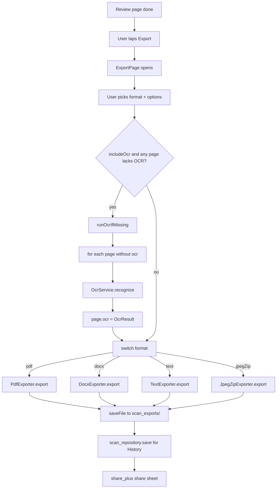

# 32 — Scanner OCR & Export

## Purpose

Once a scan session has corner-edited, filtered pages, the last steps are OCR and export. OCR is an optional pass that attaches an `OcrResult` (full text + per-block bounding boxes) to each page; the PDF and DOCX exporters use the block geometry to embed searchable text. This chapter covers:

- The `OcrEngine` interface + the ML Kit implementation.
- The four exporters (PDF, DOCX, text, JPEG-ZIP) and what each produces.
- Session persistence via `ScanRepository` — how past scans survive app restarts.
- Multi-page extension via `addMorePages` — appending new pages to an existing session without losing the original strategy.
- Undo/redo in the scanner — separate from the editor's `HistoryBloc`, 30-deep snapshot stack.

Capture and detection are in [30 — Scanner Capture & Detection](30-scanner-capture.md). Warp/filter/classify in [31 — Scanner Processing & Filters](31-scanner-processing.md).

## Data model

| Type | File | Role |
|---|---|---|
| `OcrEngine` (abstract) | [ocr_engine.dart:10](../../lib/features/scanner/domain/ocr_engine.dart:10) | `recognize(imagePath) → OcrResult`, `dispose()`. Must not throw. |
| `OcrService` | [ocr_service.dart:17](../../lib/features/scanner/data/ocr_service.dart:17) | ML Kit (Latin) implementation. Lazy-inits the `TextRecognizer`. |
| `OcrResult` / `OcrBlock` | [scan_models.dart:128](../../lib/features/scanner/domain/models/scan_models.dart:128) | `fullText` + `List<OcrBlock>` (text + bbox in source-image pixels). |
| `ExportOptions` | [scan_models.dart:337](../../lib/features/scanner/domain/models/scan_models.dart:337) | `format`, `pageSize`, `jpegQuality`, `includeOcr`, optional `password`. |
| `ExportFormat` | [scan_models.dart:369](../../lib/features/scanner/domain/models/scan_models.dart:369) | `pdf / docx / text / jpegZip`. |
| `PageSize` | [scan_models.dart:371](../../lib/features/scanner/domain/models/scan_models.dart:371) | `auto / a4 / letter / legal`. `auto` fits each page to its image aspect. |
| `PdfExporter` | [pdf_exporter.dart:18](../../lib/features/scanner/data/pdf_exporter.dart:18) | Builds a searchable PDF with the OCR text as invisible overlay. |
| `DocxExporter` | [docx_exporter.dart:30](../../lib/features/scanner/data/docx_exporter.dart:30) | Hand-rolls minimal OOXML inside a ZIP. OCR text as visible paragraphs. |
| `TextExporter` | [text_exporter.dart:14](../../lib/features/scanner/data/text_exporter.dart:14) | Plain-text concatenation of OCR `fullText` with `--- Page N ---` separators. |
| `JpegZipExporter` | [jpeg_zip_exporter.dart:16](../../lib/features/scanner/data/jpeg_zip_exporter.dart:16) | ZIP of every page's processed JPEG. |
| `ScanRepository` | [scan_repository.dart:16](../../lib/features/scanner/data/scan_repository.dart:16) | Flat-file JSON persistence under `<docs>/scans/<sessionId>.json` + copied JPEGs. |
| `addMorePages` | [scanner_notifier.dart:513](../../lib/features/scanner/application/scanner_notifier.dart:513) | Replays the session's strategy and appends new pages. |
| Undo/redo stacks | [scanner_notifier.dart:118](../../lib/features/scanner/application/scanner_notifier.dart:118) | `List<ScanSession>` snapshots, 30 deep each. |

## Flow — OCR + export



## OCR — `OcrService`

### Interface

[ocr_engine.dart:10](../../lib/features/scanner/domain/ocr_engine.dart:10):

```dart
abstract class OcrEngine {
  /// Recognise text in the image at [imagePath]. Must not throw —
  /// return an empty [OcrResult] when recognition fails.
  Future<OcrResult> recognize(String imagePath);
  Future<void> dispose();
}
```

The "must not throw" contract is important. Callers (notifier, exporters) treat OCR as best-effort — a failure turns into "no text" rather than a scanner-wide error. ML Kit can fail on very large images, on images without discernible text, or if the on-device model hasn't finished installing.

### ML Kit implementation

[ocr_service.dart:17](../../lib/features/scanner/data/ocr_service.dart:17). Latin-script only today:

```dart
TextRecognizer _ensure() {
  return _recognizer ??= TextRecognizer(script: TextRecognitionScript.latin);
}

@override
Future<OcrResult> recognize(String imagePath) async {
  final recognizer = _ensure();
  try {
    final input = InputImage.fromFilePath(imagePath);
    final result = await recognizer.processImage(input);
    final blocks = <OcrBlock>[
      for (final b in result.blocks)
        OcrBlock(
          text: b.text,
          left: b.boundingBox.left,
          top: b.boundingBox.top,
          width: b.boundingBox.width,
          height: b.boundingBox.height,
        ),
    ];
    return OcrResult(fullText: result.text, blocks: blocks);
  } catch (e) {
    return const OcrResult(fullText: '', blocks: []);
  }
}
```

Block bounding boxes are in **source-image pixels**, not normalized — consumers (the PDF exporter especially) have to scale them to the output coordinate space.

### Why an interface

The comment at [ocr_engine.dart:4](../../lib/features/scanner/domain/ocr_engine.dart:4) flags the future upgrade:

> Lets the notifier swap between Google ML Kit (current default — works on both platforms) and Apple Vision (future iOS upgrade for higher accuracy on printed and handwritten text) without changing call sites.

An Apple Vision engine would live under `data/` alongside `ocr_service.dart`; the interface stays in `domain/` so the dependency arrow is `data → domain`, not the reverse. The notifier, classifier, and exporters all speak `OcrEngine` today.

### OCR invocation

`ScannerNotifier.runOcrIfMissing` at [scanner_notifier.dart:761](../../lib/features/scanner/application/scanner_notifier.dart:761) iterates pages, skipping those with `ocr != null` or no `processedImagePath`. Runs sequentially — one page at a time. Sets `state.busyLabel = 'Recognising text…'` so the UI shows a progress state.

The notifier also runs OCR lazily from `autoDeskewPage` as the fallback when Hough yields too few lines ([scanner_notifier.dart:614](../../lib/features/scanner/application/scanner_notifier.dart:614)) — the OCR-block-baseline heuristic operates on the recognized blocks.

## Exporters

### `PdfExporter`

Source: [pdf_exporter.dart:18](../../lib/features/scanner/data/pdf_exporter.dart:18). Uses the `pdf` package to build a `pw.Document`. Per page:

1. Pick a `PdfPageFormat` via `_pageFormatFor(options.pageSize, image)`.
   - `PageSize.auto`: fit the page to the image aspect so nothing gets letterboxed. Uses A4 width as the reference long edge; for landscape images sets `width = A4.width, height = A4.width/aspect`; for portrait sets `width = A4.height*aspect, height = A4.height`.
   - `a4 / letter / legal`: fixed PDF page format; image is `BoxFit.contain`-ed.
2. Stack:
   - `Positioned.fill(Image(memoryImage, fit: BoxFit.contain))` — the page JPEG.
   - If `options.includeOcr && page.ocr != null`, `_ocrOverlay(ocr, pageFormat, image)` — a list of `Positioned(Opacity(opacity: 0, Text(block.text)))`. Invisible, but selectable + searchable.

### OCR overlay geometry

Source: [pdf_exporter.dart:113](../../lib/features/scanner/data/pdf_exporter.dart:113). OCR blocks are in source-image pixels; the image is drawn with `BoxFit.contain`, which letterboxes when the page aspect doesn't match the image aspect. The overlay has to account for both the scale AND the offset:

```dart
final scale = math.min(pageW / imgW, pageH / imgH);
final drawnW = imgW * scale;
final drawnH = imgH * scale;
final offsetX = (pageW - drawnW) / 2;
final offsetY = (pageH - drawnH) / 2;
// ...
Positioned(
  left: offsetX + b.left * scale,
  top: offsetY + b.top * scale,
  child: Opacity(opacity: 0, child: Text(b.text, style: TextStyle(
    fontSize: (b.height * scale).clamp(4, 72).toDouble(),
  ))),
)
```

Font size is scaled from block height so selecting text in Adobe Reader highlights the right area. Clamped `[4, 72]` so degenerate bounding boxes don't explode the font size.

### Password — explicitly deferred

The CLAUDE.md status snapshot calls out "PDF password is a TODO." Source: [pdf_exporter.dart:37](../../lib/features/scanner/data/pdf_exporter.dart:37):

```dart
// TODO(phase 10c+): password-protected PDFs. The `pdf` package's
// PdfEncryption API has shifted between versions; wire this up once
// we pin a version where the constructor surface is stable. For
// now we log if the user requested a password so they know why it
// wasn't applied.
if (options.password != null && options.password!.isNotEmpty) {
  _log.w('password requested but not yet implemented', ...);
}
```

The export sheet offers a password field; entering one is silently ignored. The only signal today is a log line. Worth noting for users with confidentiality assumptions.

### `DocxExporter` — hand-rolled OOXML

Source: [docx_exporter.dart:30](../../lib/features/scanner/data/docx_exporter.dart:30). A `.docx` is a ZIP of OOXML parts. Rather than pulling in a heavy `docx` dependency, this exporter writes the minimum Word will accept:

```
[Content_Types].xml        — declares part content types
_rels/.rels                — root relationships
word/document.xml          — the document body
word/_rels/document.xml.rels — image relationships
word/media/image{N}.jpeg   — one per page
```

Per page:
1. Re-encode the page as JPEG if not already (`_ensureJpeg` at [:157](../../lib/features/scanner/data/docx_exporter.dart:157) sniffs the `0xFFD8` SOI marker).
2. Embed as an inline image at ~6 inches wide (`maxWidthEmu = 5486400`, EMU = English Metric Unit, 914400 per inch). Height scales by aspect ratio.
3. If `includeOcr`, append the full OCR text as one paragraph per line. **Visible**, unlike the PDF's invisible overlay — the DOCX doc comment at [:27](../../lib/features/scanner/data/docx_exporter.dart:27) explains the choice: *"keeps the user's document searchable AND editable in Word without requiring a true PDF-style hidden text layer."*
4. Page break between pages (not after the last).

Title becomes a bold paragraph at the top; page dimensions fixed to Letter (12240×15840 twips = 8.5×11 inches).

This is a real-but-minimal OOXML — no styles.xml, no numbering.xml, no fontTable.xml. Word opens it cleanly; LibreOffice + Pages do too. More sophisticated features (images-after-OCR with word-wrap, heading styles) would require a fuller implementation.

### `TextExporter` — plain OCR concatenation

Source: [text_exporter.dart:14](../../lib/features/scanner/data/text_exporter.dart:14). Walks pages, appends `--- Page N ---` header + `page.ocr!.fullText`, skips pages with no OCR. If *no* page has OCR, emits a user-facing "No text was recognised…" message instead of an empty file.

No attempt at layout preservation — the output is the running full-text stream per page.

### `JpegZipExporter`

[jpeg_zip_exporter.dart:16](../../lib/features/scanner/data/jpeg_zip_exporter.dart:16). Zips `page_001.jpg`, `page_002.jpg`, … — the processed (warped + filtered) pages. Useful when the user wants the raw scans for archival alongside the searchable PDF.

Uses the `archive` package's `ZipEncoder`. No compression level tuning — JPEG bytes are already compressed.

### File saving

All four exporters save to `<docs>/scan_exports/`. Filename is `session.title` (sanitized via `RegExp('[^A-Za-z0-9._ -]') → '_'`) plus extension. Untitled sessions get `Scan_YYYYMMDD_HHMMSS`.

There's no "open after save" built into the exporters — the review page's share flow uses `share_plus` (`Share.shareXFiles([XFile(file.path)], text: ...)`, per CLAUDE.md's note on the 10.x API).

## Persistence — `ScanRepository`

Source: [scan_repository.dart:16](../../lib/features/scanner/data/scan_repository.dart:16). One JSON per session.

### Save

`save(session)` at [:29](../../lib/features/scanner/data/scan_repository.dart:29):

1. Create `<docs>/scans/<sessionId>/` directory.
2. For each page, copy `processedImagePath ?? rawImagePath` into the session dir as `<pageId>.jpg`. Rewrite the page's `processedImagePath` to the durable path.
3. Serialize the (now-durable) session to `<docs>/scans/<sessionId>.json`.

The copy matters: `processedImagePath` during an active session points at `<tempDir>/scans/page_*.jpg`, and iOS/Android can evict the temp dir whenever they feel like it. Persistent storage moves the JPEGs to `<docs>/` where they survive app kills, backup/restore, and OS memory pressure.

### Load

`loadAll()` at [:54](../../lib/features/scanner/data/scan_repository.dart:54) walks the scans dir, decodes each `.json`, sorts newest-first by `createdAt`. Bad files are silently skipped with a warning log.

### Delete

Deletes both the `.json` file and the matching `<sessionId>/` directory. No confirmation dialog in the repo itself — the History page wraps it with a "Delete scan?" prompt.

### No schema versioning

`ScanRepository` doesn't carry a schema version. Compare to `ProjectStore` ([05 — Persistence & Memory](05-persistence-and-memory.md)), which does. A `ScanPage` JSON format change would silently drop old sessions on the floor (the `ScanPage.fromJson` constructor tolerates missing optional fields but not schema-breaking ones). Worth noting given the per-page `brightness` / `contrast` / `thresholdOffset` fields were added mid-project.

## `addMorePages` — extending a session

Source: [scanner_notifier.dart:513](../../lib/features/scanner/application/scanner_notifier.dart:513). Users on the review page can tap "+ Add page" to capture more pages into the current session without abandoning filters / OCR already applied to the existing pages.

Order:
1. Require an existing session (else log + return `failed`).
2. Replay the session's `strategy` — if the user started with Native, new pages also go through VisionKit/ML Kit; if Auto, new pages are seeded.
3. `_snapshotForUndo()` runs AFTER the picker returns — cancellation shouldn't push an undoable snapshot.
4. Append `result.pages` onto `s.pages` and update state.
5. Native result → immediately run `_processAllPages()` + go to review. Manual/Auto → crop page (which advances to the first unprocessed page so the user isn't re-cropping existing pages).

The crop page's "jump to first un-processed" logic is elsewhere (in the crop page widget), driven by `page.processedImagePath != null` as the "already cropped" signal.

## Undo / redo in the scanner

Separate from the editor's Bloc-based history. The scanner uses two `List<ScanSession>` stacks with a depth cap:

```dart
final List<ScanSession> _undoStack = <ScanSession>[];
final List<ScanSession> _redoStack = <ScanSession>[];
static const int _historyDepth = 30;
```

Every undoable mutation (`setFilter`, `setCorners`, `rotatePage`, `removePage`, `reorderPage`, `addMorePages`) calls `_snapshotForUndo()` at [scanner_notifier.dart:809](../../lib/features/scanner/application/scanner_notifier.dart:809) which pushes the pre-mutation session onto `_undoStack` (capped at 30) and clears `_redoStack` so the forward branch is dropped.

`undo()` pops the latest snapshot, pushes the current session onto `_redoStack`, restores. `redo()` reverses. The user can flip-flop freely.

Why not `HistoryBloc`? The editor's history tracks individual ops (`ExecuteEdit`, `AppendEdit`, `ApplyPipelineEvent`) and is tightly coupled to `EditPipeline`. The scanner's state is a small tree (`ScanSession → List<ScanPage>`); full-tree snapshots are cheap enough that a Bloc-grade event model would be over-engineering. Keeping the scanner's undo lightweight also means it can survive a session-load from History without reconstructing event history.

## Key code paths

- [ocr_service.dart:27 `recognize`](../../lib/features/scanner/data/ocr_service.dart:27) — the "must not throw" contract; empty result on any failure.
- [pdf_exporter.dart:113 `_ocrOverlay`](../../lib/features/scanner/data/pdf_exporter.dart:113) — letterbox-aware coordinate transform. Miss this and the searchable text lands in the wrong place.
- [pdf_exporter.dart:87 `_pageFormatFor`](../../lib/features/scanner/data/pdf_exporter.dart:87) — `PageSize.auto`'s aspect-preserving logic.
- [docx_exporter.dart:74](../../lib/features/scanner/data/docx_exporter.dart:74) — the per-page loop that writes images + relationships + body in parallel.
- [docx_exporter.dart:157 `_ensureJpeg`](../../lib/features/scanner/data/docx_exporter.dart:157) — SOI-marker sniff before re-encoding.
- [scan_repository.dart:29 `save`](../../lib/features/scanner/data/scan_repository.dart:29) — durability copy from `tempDir` to `docs`. The reason sessions survive app restarts.
- [scanner_notifier.dart:761 `runOcrIfMissing`](../../lib/features/scanner/application/scanner_notifier.dart:761) — serial OCR pass; skips pages with `ocr != null`.
- [scanner_notifier.dart:513 `addMorePages`](../../lib/features/scanner/application/scanner_notifier.dart:513) — strategy replay + post-picker undo snapshot.
- [scanner_notifier.dart:805](../../lib/features/scanner/application/scanner_notifier.dart:805) — `_snapshotForUndo` docstring explaining when it fires.

## Tests

- `test/features/scanner/scanner_smoke_test.dart` — end-to-end through export (not full file writing, but exercises the flow).
- **Gap**: no direct test for `PdfExporter`, `DocxExporter`, `TextExporter`, `JpegZipExporter`. The `pdf` and `archive` packages are tested separately; the app's glue (OCR overlay geometry, DOCX rel wiring) isn't.
- **Gap**: no test for `OcrService` (ML Kit isn't easily stub-able without platform channels). An `OcrEngine` fake in tests would let the exporters be tested with deterministic OCR results.
- **Gap**: no test for `ScanRepository` round-trip after a schema change (no schema version exists — see Known Limits).
- **Gap**: no test asserts the 30-deep undo cap works (a 31st mutation drops the oldest).

## Known limits & improvement candidates

- **`[correctness]` PDF password is silently ignored.** The export sheet accepts one, the PDF exporter logs a warning, and the output file is unprotected. Users expecting confidentiality get a false sense of security. At minimum, the export sheet should disable the password field or warn inline until the feature ships.
- **`[correctness]` `ScanRepository` has no schema versioning.** A change to `ScanPage.toJson` / `fromJson` (the per-page tune fields were added mid-project) can silently break older sessions. Parallel to `ProjectStore`'s `_kProjectSchemaVersion` check — worth adopting the same pattern.
- **`[perf]` `runOcrIfMissing` runs pages serially.** ML Kit's recognizer is stateful but the work per image is independent — `Future.wait` over pages would cut wall time roughly in half on multi-page sessions. The busy-label becomes stale (no per-page progress), but a "Recognising 3 of 5…" counter would fix that.
- **`[ux]` DOCX OCR text is visible (unlike PDF's invisible overlay).** Design intent is "editable in Word." For users who want the image-only output, there's no toggle to suppress the text. A "Include OCR as editable paragraphs" option in the export sheet would surface the choice.
- **`[correctness]` `OcrService` uses Latin script only.** Users scanning non-Latin documents get an empty `OcrResult`. ML Kit supports Chinese, Japanese, Korean, Devanagari recognizers via separate instances. Auto-detecting the likely script (or offering a picker) would broaden scanner utility significantly.
- **`[perf]` `DocxExporter` re-decodes each JPEG to read dimensions.** `_ensureJpeg` may decode → encode → the width/height read decodes again. One decode that keeps the `img.Image` around for both checks would halve the work on a 10-page DOCX export.
- **`[test-gap]` Exporters are untested.** A fixture `ScanSession` with 2 pages + fake OCR, running through each exporter and checking file sizes + structural validity (e.g. unzipping DOCX and asserting required parts exist), would pin core regressions.
- **`[ux]` No "Save to Files" / "Save to Photos" shortcut.** After export, the user has to tap Share and select a target. On iOS specifically, users expect "Save to Files" in one tap. Adding a `share_plus`-adjacent "Open in Files" action is cheap.
- **`[correctness]` `_snapshotForUndo` snapshots the *mutable* `ScanSession`.** `ScanSession` and `ScanPage` are mutable classes (not Freezed); `copyWith` produces new objects, but the snapshot stack holds references. If code mutates the stored session in-place (a slip-up, not current code), the undo stack silently corrupts. Making the classes immutable would harden this.
- **`[correctness]` `PdfExporter._ocrOverlay` assumes bounds in source-image pixel space.** If ML Kit ever returned logical (density-independent) pixels, the overlay would be mis-scaled. The current behaviour is correct for ML Kit today; there's no defensive check on the units.
- **`[correctness]` Exporters never fail gracefully for missing images.** If `page.processedImagePath` points at a deleted file (tempDir evicted between save + export), `File.readAsBytes()` throws and the whole export fails. A per-page fallback to `rawImagePath` (as the PDF exporter already does via `??`) should be uniform across exporters.
- **`[maintainability]` Four separate `_saveBytes` / `_timestampName` implementations.** Each exporter re-implements the "save to `scan_exports/` with sanitized title" logic. A shared `ExportFileSink` would remove ~60 lines of duplication and keep filename sanitization consistent.
- **`[ux]` Undo/redo stacks are in-memory only.** Closing and reopening a session from History loses the undo history — even if the user had 10 reversible steps buffered. Serializing the undo stack alongside the session (or a truncated last-N) would let users truly resume.
