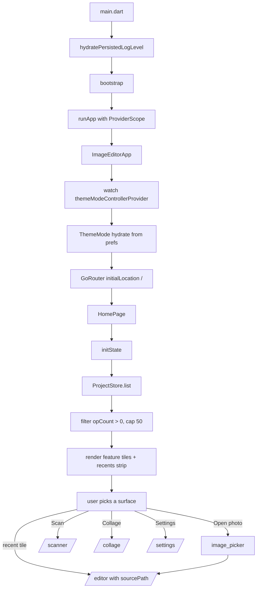

# 40 — Collage, Home & Settings

## Purpose

Three smaller surfaces that sit around the editor and scanner: the **Collage** composer (pick images, drop them into a layout, export PNG), the **Home** page (feature picker + recent edits strip), and **Settings** (theme, log level, AI Model Manager, Perf HUD, Recent exports, About). This is the last content chapter — the collage, home, and settings modules are each small enough that separate chapters would be wasteful.

Also covered: the cross-cutting surfaces that pop up across multiple features — `ThemeModeController`, `FirstRunFlag`, and the debug-only `PerfHud`.

## Data model

| Type | File | Role |
|---|---|---|
| `CollageTemplate` | [collage_template.dart:5](../../lib/features/collage/domain/collage_template.dart:5) | Named list of `CollageCellRect`s in normalized 0..1 coords. |
| `CollageTemplates.all` | [collage_template.dart:52](../../lib/features/collage/domain/collage_template.dart:52) | 18 built-in templates across 3 categories (grid / magazine / freestyle). |
| `CollageCategory` | [collage_template.dart:32](../../lib/features/collage/domain/collage_template.dart:32) | `grid / magazine / freestyle`. |
| `CollageState` | [collage_state.dart:51](../../lib/features/collage/domain/collage_state.dart:51) | Template + cells + aspect + inner border + outer margin + corner radius + background color. |
| `CollageCell` | [collage_state.dart:32](../../lib/features/collage/domain/collage_state.dart:32) | Per-cell `rect` + optional `imagePath`. |
| `CollageAspect` | [collage_state.dart:7](../../lib/features/collage/domain/collage_state.dart:7) | `square / portrait / landscape / portraitTall / landscapeWide / story`. 6 ratios. |
| `CollageNotifier` | [collage_notifier.dart:12](../../lib/features/collage/application/collage_notifier.dart:12) | Riverpod StateNotifier, `autoDispose`. |
| `CollageCanvas` | [collage_canvas.dart:10](../../lib/features/collage/presentation/widgets/collage_canvas.dart:10) | The live Stack-of-Positioned that renders each cell. Wrap in `RepaintBoundary` to export. |
| `CollageExporter` | [collage_exporter.dart:16](../../lib/features/collage/data/collage_exporter.dart:16) | `boundary.toImage` → PNG. |
| `HomePage` | [home_page.dart:21](../../lib/features/home/presentation/pages/home_page.dart:21) | Recents strip + CTAs + feature tiles. 943 lines — the biggest UI file outside the editor. |
| `SettingsPage` | [settings_page.dart:72](../../lib/features/settings/presentation/pages/settings_page.dart:72) | Consolidated settings scaffold. |
| `perfHudEnabledProvider` | [settings_page.dart:26](../../lib/features/settings/presentation/pages/settings_page.dart:26) | Persisted bool toggle for the dev overlay. |
| `exportHistoryProvider` | [settings_page.dart:35](../../lib/features/settings/presentation/pages/settings_page.dart:35) | `FutureProvider<List<ExportHistoryEntry>>` for the Recent Exports section. |
| `ModelManagerSheet` | [model_manager_sheet.dart:32](../../lib/features/settings/presentation/widgets/model_manager_sheet.dart:32) | Modal sheet over the manifest + cache; download / delete / retry. |
| `ThemeModeController` | [theme_mode_controller.dart:14](../../lib/core/theme/theme_mode_controller.dart:14) | Persisted `ThemeMode` (dark default). Hydrated from SharedPreferences on construct. |
| `AppTheme` | [app_theme.dart:9](../../lib/core/theme/app_theme.dart:9) | Material 3 theme with a `#3E8EDE` seed + slider/chip/appbar overrides. |
| `PerfHud` | [perf_hud.dart:21](../../lib/features/editor/presentation/widgets/perf_hud.dart:21) | Floating dev-only frame-time overlay, `kReleaseMode`-suppressed. |
| `FrameTimer` | [frame_timer.dart](../../lib/engine/telemetry/frame_timer.dart) | Rolling-window avg / p95 raster-frame durations. |
| `FirstRunFlag` | [first_run_flag.dart:14](../../lib/core/preferences/first_run_flag.dart:14) | One-shot onboarding-shown flags keyed by string. |

## Collage

### Templates and state

A `CollageTemplate` is a declarative list of normalized rectangles. Cells don't carry content — that lives in `CollageState.cells[i].imagePath`. Templates adapt to any canvas size because the cells are defined in `[0, 1]` space.

18 templates ship today, grouped as:
- **Grid** — 1×2, 2×1, 2×2, 2×3, 3×2, 3×3 (regular tilings).
- **Magazine** — curated asymmetric layouts (hero + column, split hero, trio + hero, etc.).
- **Freestyle** — overlapping / off-grid compositions.

### `CollageNotifier`

Source: [collage_notifier.dart:12](../../lib/features/collage/application/collage_notifier.dart:12). One session at a time, `autoDispose` so exiting the collage route wipes state.

- `setTemplate(t)` — switches templates while **preserving images by cell index** ([:20](../../lib/features/collage/application/collage_notifier.dart:20)). A 2×2 collage with 4 images → switching to 2×3 keeps the 4 images in the first 4 slots; the 2 new slots start empty. Switching back to 2×2 keeps them.
- `setCellImage(index, path)` / `swapCellImages(a, b)` — cell mutations. Swap is used by drag-and-drop reordering inside the canvas.
- `setAspect / setInnerBorder / setOuterMargin / setCornerRadius / setBackgroundColor` — layout knobs.

### Canvas

Source: [collage_canvas.dart:10](../../lib/features/collage/presentation/widgets/collage_canvas.dart:10). A single `AspectRatio` widget with `state.aspect.ratio` → `Container` with background color + outer margin padding → `LayoutBuilder` → `Stack` of positioned cells.

Each cell is a `Positioned` with `pad = state.innerBorder / 2` subtracted from each side. The halving is deliberate — two adjacent cells each give up `half`, so the gap between them sums to the full `innerBorder` (comment at [:49](../../lib/features/collage/presentation/widgets/collage_canvas.dart:49)).

Cells render either `Image.file(...)` with `BoxFit.cover + gaplessPlayback: true` or an empty-slot placeholder that says "Tap to add". Image-decode errors render a broken-image placeholder so a deleted / moved file doesn't crash the canvas.

### Exporter

Source: [collage_exporter.dart:16](../../lib/features/collage/data/collage_exporter.dart:16). No separate rendering pipeline — the exporter uses the live widget tree:

```dart
Future<File> export({
  required RenderRepaintBoundary boundary,
  required double pixelRatio,
  String? title,
}) async {
  final image = await boundary.toImage(pixelRatio: pixelRatio);
  final w = image.width; final h = image.height;
  final data = await image.toByteData(format: ui.ImageByteFormat.png);
  image.dispose();
  return _saveBytes(bytes, title);
}
```

The collage page wraps its `CollageCanvas` in a `RepaintBoundary` and passes the boundary's `RenderObject` to the exporter. `pixelRatio` controls resolution — the page uses `3.0` by default for a 3× upscale of the logical layout so the PNG is export-quality.

Saves to `<docs>/collage_exports/`. Filename sanitized identically to the scanner exporters (same `[^A-Za-z0-9._ -]` regex).

### What collage doesn't do

- **No layers, no filters, no AI.** The collage is layout-only; if the user wants to edit an image, they do it in the editor first, then bring the result into a collage cell.
- **No zoom/pan per cell.** `BoxFit.cover` is the only fit mode; there's no "position the image within the cell" control.
- **No persistence.** Collage state lives only while the user is on the route. Closing the collage page discards the session — no `ScanRepository`-equivalent. Exported PNGs are the only durable artefact.

## Home page

Source: [home_page.dart:21](../../lib/features/home/presentation/pages/home_page.dart:21). 943 lines — the biggest UI file outside the editor. Packs:

- Greeting header + current-date row.
- Recent-projects strip (the scrollable horizontal list of prior editor sessions).
- Search field (shown once the user has > 5 saved sessions).
- Feature tiles: **Open photo** (gallery), **Take photo** (camera), **Scan** (→ scanner), **Collage** (→ collage), optionally **Continue** (→ most recent project).
- Settings gear in the app bar.

### Recent-projects strip

Loaded via `ProjectStore.list()` on init and after every return from `/editor`. Filter: only projects with `opCount > 0` are shown — untouched opens don't pollute the strip ([home_page.dart:77](../../lib/features/home/presentation/pages/home_page.dart:77)). Cap at 50 entries; the search field handles larger sets.

**Missing-source handling** ([home_page.dart:105](../../lib/features/home/presentation/pages/home_page.dart:105)): tapping a recent project `File(p.sourcePath).existsSync` is checked first. If the source image was moved / deleted, the project entry is dropped and a snackbar explains. Better than opening a broken editor.

**Rename and forget** via long-press → bottom-sheet menu ([home_page.dart:125](../../lib/features/home/presentation/pages/home_page.dart:125)). Rename writes `customTitle` via `ProjectStore.save(sourcePath, pipeline, customTitle: ...)` — but the home page needs the *pipeline* to save. Today it loads the stored one, roundtrips, and re-saves with the new title. Worth flagging in Known Limits.

### Picking images

Home uses `image_picker` directly (not through `ImagePickerCapture` — that lives under scanner). The `_picking` bool guards against a double-tap queueing two dialogs:

> The picker plugin's behaviour on rapid double-tap is platform-specific — safer to gate at the UI layer. Also drives the CTA tiles' busy styling so the user sees the tap registered.

([home_page.dart:30](../../lib/features/home/presentation/pages/home_page.dart:30)).

After a successful pick, `context.push('/editor', extra: sourcePath)` — the `GoRouter` config at [app_router.dart:24](../../lib/core/routing/app_router.dart:24) reads `state.extra` and passes it to `EditorPage`.

## Settings page

Source: [settings_page.dart:72](../../lib/features/settings/presentation/pages/settings_page.dart:72). One `ListView` of sectioned tiles. Sections:

| Section | Tiles |
|---|---|
| Appearance | Theme (light/system/dark segmented button) |
| AI | Manage AI models → `ModelManagerSheet.show(context)` |
| Diagnostics | Performance HUD toggle · Log level dropdown (debug/info/warning/error) |
| Recent exports | `_RecentExportsSection` — per-export row with share + delete |
| About | App name, version, License page link |

### Preferences mechanism

Two persisted prefs here use a generic `_BoolPrefController` pattern ([settings_page.dart:39](../../lib/features/settings/presentation/pages/settings_page.dart:39)):

```dart
class _BoolPrefController extends StateNotifier<bool> {
  _BoolPrefController({required this.prefKey, required this.fallback})
      : super(fallback) {
    _hydrate();
  }
  Future<void> _hydrate() async { /* shared_preferences read */ }
  Future<void> set(bool v) async { state = v; /* write */ }
}
```

One controller per pref. A fuller Settings page with 10+ toggles would motivate a shared `PrefsController<T>` generic — today two instances (PerfHUD + one other) is fine.

### Log-level hydration

`hydratePersistedLogLevel()` at [settings_page.dart:221](../../lib/features/settings/presentation/pages/settings_page.dart:221) is called from `main()` **before** `runApp`:

```dart
Future<void> hydratePersistedLogLevel() async {
  final prefs = await SharedPreferences.getInstance();
  final raw = prefs.getString(_kLogLevelPref);
  for (final lvl in Level.values) {
    if (lvl.name == raw) { AppLogger.level = lvl; return; }
  }
}
```

Ensures bootstrap's own logs respect the user's saved preference, not the kDebugMode default. Subtle but important — without it, the user's saved "warning" setting would be ignored during the 100 ms before any Settings listener ran.

### Recent exports

`exportHistoryProvider` is a `FutureProvider<List<ExportHistoryEntry>>` backed by `ExportHistory().list()` (under `lib/features/editor/data/export_history.dart`). Each successful export (PDF / DOCX / PNG / JPEG / collage) records metadata (format, dimensions, size, path, timestamp) so the user can re-share or clean up without rummaging through the Files app.

Missing-file handling: if the exported file has been swept by the OS (temp dir eviction), the row renders with a "missing" badge and the share action is disabled — the entry can still be deleted from history.

## Model Manager Sheet

Source: [model_manager_sheet.dart:32](../../lib/features/settings/presentation/widgets/model_manager_sheet.dart:32). The UI surface over `ModelManifest + ModelCache + ModelDownloader` (covered in [20 — AI Runtime & Models](20-ai-runtime-and-models.md)).

States per model row:

- **Bundled** — ships inside the app, always ready. No action.
- **Downloaded** — resolved from the sqflite cache. Shows size + downloaded-at date. Action: Delete.
- **Downloadable** — manifest entry exists, no cache row. Action: Download.
- **Downloading** — in-flight fetch with progress bar. Action: Cancel.
- **Failed** — most recent attempt errored. Shows stage (queued / fileSystem / network / checksum). Action: Retry.

Implementation details:

- `_load()` reads the manifest + queries the cache for every downloadable entry ([:86](../../lib/features/settings/presentation/widgets/model_manager_sheet.dart:86)).
- Progress subscriptions are tracked in `Map<String, StreamSubscription<DownloadProgress>> _subs` so the sheet can cancel them all on dispose.
- `dispose` captures `_downloader` in `initState` (not `ref.read` at dispose time — that throws after unmount):

```dart
for (final modelId in _subs.keys.toList()) {
  _downloader?.cancel(modelId);
}
for (final sub in _subs.values) { sub.cancel(); }
```

Cancels both the stream subscription AND the underlying HTTP request via `ModelDownloader.cancel(modelId)` so the fetch genuinely stops instead of continuing in the background.

The sheet also handles the case where a manifest entry has a `PLACEHOLDER_FILL_WHEN_PINNED` URL / sha256 — those entries are shown but flagged as "not yet available" since kicking off a download would fail. See [20 — AI Runtime & Models](20-ai-runtime-and-models.md) for why placeholder entries exist.

## Theme system

### `AppTheme`

Source: [app_theme.dart:9](../../lib/core/theme/app_theme.dart:9). Material 3 with seed color `#3E8EDE` (blue-leaning). Light + dark variants built from the same seed via `ColorScheme.fromSeed`.

Customisations beyond the generated scheme:
- **Slider** — thicker track (4), larger thumb (radius 9), tonal value-indicator. Matches the editor's drag ergonomics.
- **Icons** — default size 22 (vs Material's 24) so touch targets sit comfortably above 48 dp without shrinking chip padding.
- **App bar** — flat (no elevation, `scrolledUnderElevation: 0`), left-aligned title.
- **Chip** — used heavily for `ToolDock` category switching; theme sets the `selected` color to `colorScheme.primary`.
- **Card / Dialog** — `surfaceContainerHigh` for consistent tonal elevation with the rest of the chrome.
- **Snackbar** — floating, rounded, tonal background.

### `ThemeModeController`

Source: [theme_mode_controller.dart:14](../../lib/core/theme/theme_mode_controller.dart:14). StateNotifier over `ThemeMode`, persisted to SharedPreferences under `theme_mode_v1`. Defaults to `ThemeMode.dark` to match the historical editor chrome.

Hydration is async (`_hydrate` after construction), so the first frame renders with `ThemeMode.dark` even for users who chose `light`. Once the hydrate completes, a state update triggers a rebuild. In practice this flicker is imperceptible (< 100 ms on most devices); if it became an issue, the hydrate could move to `main()` alongside `hydratePersistedLogLevel()`.

`cycle()` ([:47](../../lib/core/theme/theme_mode_controller.dart:47)) rotates dark → light → system → dark — used by a quick-toggle icon if any surface needs one-tap theming. Not bound today; the Settings page uses the segmented button.

## `PerfHud` — debug-only overlay

Source: [perf_hud.dart:21](../../lib/features/editor/presentation/widgets/perf_hud.dart:21). Floating bottom-right overlay shown in debug builds only. Reads a shared `FrameTimer` and renders a compact readout:

```
R 4.2  P95 8.1  drop 0.3%
```

Tap to expand into a four-line breakdown (raster avg / raster p95 / drop rate vs blueprint target / sample count).

Guards:
- `kReleaseMode` check in both `initState` and `build` — the HUD is completely inert in release.
- `enabled` flag (wired to `perfHudEnabledProvider`) for per-user debug-build suppression — useful for screenshots.
- 0.5 Hz ticker rebuild (not per-frame) so the HUD doesn't contribute to frame time.
- Shared `FrameTimer` singleton → mounting multiple HUDs doesn't pay the timing-callback cost twice.
- Text color flips to red when `drop > 1.5%` (blueprint target) so regressions are visible at a glance.

The `FrameTimer` itself lives in `lib/engine/telemetry/` — rolling window over raster duration samples, computing avg / p95 / drop rate. Only started on first HUD construction so production users never pay for it.

## `FirstRunFlag` — one-shot onboarding

Source: [first_run_flag.dart:14](../../lib/core/preferences/first_run_flag.dart:14). Stringly-keyed persistent bool flags for onboarding surfaces:

- `FirstRunFlag.shouldShow('editor_onboarding_v1')` — true if the user has never dismissed the editor's intro dialog.
- `FirstRunFlag.markSeen('editor_onboarding_v1')` — marks it dismissed.
- `FirstRunFlag.resetAllForTests()` — wipes every `first_run.*` key (tests only).

Keys are versioned by convention (`_v1` suffix) so bumping the suffix lets you re-show the tip to existing users after a meaningful UX change.

Fail-open: on read failure, `shouldShow` returns `false` — a broken `SharedPreferences` shouldn't nag the user with onboarding every launch.

## Flow — an app launch



## Key code paths

- [collage_notifier.dart:20 `setTemplate`](../../lib/features/collage/application/collage_notifier.dart:20) — template-switch image preservation by cell index.
- [collage_canvas.dart:46 `_positionedCell`](../../lib/features/collage/presentation/widgets/collage_canvas.dart:46) — the halved-inner-border math for gapless adjacency.
- [collage_exporter.dart:19 `export`](../../lib/features/collage/data/collage_exporter.dart:19) — `RepaintBoundary.toImage` → PNG. Study for how to export a live widget tree.
- [home_page.dart:105 `_openRecent`](../../lib/features/home/presentation/pages/home_page.dart:105) — missing-source handling. Dead entries don't stay in the strip.
- [home_page.dart:69 `_refreshRecents`](../../lib/features/home/presentation/pages/home_page.dart:69) — filter `opCount > 0`, cap 50. Prevents every-photo-ever-opened pollution.
- [settings_page.dart:221 `hydratePersistedLogLevel`](../../lib/features/settings/presentation/pages/settings_page.dart:221) — pre-bootstrap hydration. Called from `main()` before `bootstrap()`.
- [model_manager_sheet.dart:67 `dispose`](../../lib/features/settings/presentation/widgets/model_manager_sheet.dart:67) — stream + HTTP cancellation with `_downloader` captured in `initState` to avoid `ref.read` after unmount.
- [theme_mode_controller.dart:19 `_hydrate`](../../lib/core/theme/theme_mode_controller.dart:19) — SharedPreferences round-trip; silent fallback on error.
- [perf_hud.dart:50](../../lib/features/editor/presentation/widgets/perf_hud.dart:50) — the `kReleaseMode || !widget.enabled` early return in `initState`. Ensures production never starts the `FrameTimer`.
- [first_run_flag.dart:25 `shouldShow`](../../lib/core/preferences/first_run_flag.dart:25) — fail-open + log-once pattern.

## Tests

- **Collage**: no dedicated test file. The notifier's `setTemplate` preservation logic and `swapCellImages` behaviour are uncovered. Canvas layout is visually verified by eye. This is the most untested module in the app.
- **Home**: no widget tests. The recents strip, search, missing-source handling all rely on manual testing.
- **Settings**: no widget tests. `_BoolPrefController` and `hydratePersistedLogLevel` could be tested headlessly.
- **ModelManagerSheet**: no direct tests. Covered indirectly through `ModelDownloader` + `ModelCache` tests.
- **ThemeModeController**: no tests. Simple enough that round-trip is trivial to verify but nothing pins it.
- **FirstRunFlag**: no tests. `resetAllForTests` helper exists specifically for tests that haven't been written.
- **PerfHud**: no tests. `FrameTimer` is tested in isolation; the UI wrapper isn't.

Coverage here is **thinner than anywhere else in the codebase**. The editor + scanner + engine have deep test suites; this phase's surfaces have almost none. Most are low-risk (small, mostly-UI), but the `setTemplate` image-preservation is a real behaviour with a real regression risk.

## Known limits & improvement candidates

- **`[correctness]` Collage has no persistence.** Closing the route drops all work. A user who builds a 3×3 collage with 9 carefully-picked images, then accidentally navigates away, loses everything. Parallel to `ProjectStore` for the editor: even a session-scoped auto-save to `<docs>/collages/latest.json` would rescue the common mistake.
- **`[correctness]` Collage `setTemplate` drops images when switching to a smaller template.** 9 images in a 3×3 → switching to 2×2 keeps only the first 4; the other 5 silently vanish from state. Switching back doesn't restore them. A warning dialog (or at least keeping the hidden paths in state for a session) would prevent accidental loss.
- **`[ux]` No per-cell zoom/pan/crop in the collage canvas.** `BoxFit.cover` is the only fit mode; a portrait image in a landscape cell crops the top and bottom with no user control. Per-cell transform gesture handling is ~100 lines of code and would be the single most useful improvement to the collage module.
- **`[test-gap]` Collage has zero test coverage.** `CollageNotifier.setTemplate` image-preservation logic, `swapCellImages` index bounds, `CollageCanvas` layout math — all uncovered. Three table-driven tests would close the worst gaps for ~50 lines.
- **`[correctness]` Home page's "Rename session" does a load → save round-trip.** [home_page.dart](../../lib/features/home/presentation/pages/home_page.dart) rename handler reads `ProjectStore.load(sourcePath)` → writes back with the new title. A crash between load and save loses the pipeline. `ProjectStore.setTitle(sourcePath, title)` that only touches the title field would be safer and cheaper.
- **`[perf]` `_refreshRecents` walks every project file on every return to home.** `ProjectStore.list` reads + parses every JSON; with 50 projects that's 50 file reads on every home visit. The strip doesn't need the full pipeline, so a sidecar `recents.json` index (written on every `save`) would turn a 50-read operation into one. See also the [05 — Persistence & Memory](05-persistence-and-memory.md) improvement candidate on the same subject.
- **`[correctness]` Theme hydration runs async after first frame.** Users whose preference is `light` or `system` see one frame of `dark` on launch. Moving `ThemeModeController._hydrate` to `main()` alongside `hydratePersistedLogLevel` would remove the flicker.
- **`[maintainability]` Multiple separate `_BoolPrefController` instances.** Each persisted toggle is its own notifier class instance. Two today (Perf HUD + log level as-a-string, which uses a different pattern). A generic `PrefController<T>(key, fromString, toString)` would consolidate future toggles — but not worth refactoring for two.
- **`[ux]` Model Manager sheet cancels downloads but doesn't delete the partial file.** `ModelDownloader.cancel` is wired; what remains on disk after a cancel is the partial bytes, which a future download call will attempt to resume. Correct for resumption, but means a user who cancels twice in a row pays partial disk IO without clear indication. A "cancel & delete" action would be clearer when the user actually wants to bail.
- **`[correctness]` `ExportHistoryEntry` missing-file handling leaves the row un-actionable beyond "delete."** If the file was swept by the OS, the user can't re-export (no way back), can't re-share (gone), only forget. Linking the entry back to the session that produced it (editor pipeline or scan session) would enable "re-export from this project" when the source still exists.
- **`[ux]` `FirstRunFlag` is keyed off versioned strings.** Bumping `editor_onboarding_v1` → `v2` re-shows the tip, but every call site has to update in lockstep. A central registry (`OnboardingKeys.editor`) would let the version live in one place.
- **`[test-gap]` `PerfHud`'s `kReleaseMode` guard is untested.** Nothing asserts the HUD doesn't start the `FrameTimer` in release mode. A `debugDefaultTargetPlatformOverride` test would catch a regression that accidentally enables the overlay in a production build.
- **`[correctness]` `CollageExporter` uses a fixed `pixelRatio` (3.0) at the call site.** A user who wants a 4K+ export has no knob. The exporter supports it (`pixelRatio` is a parameter); the UI doesn't expose it. A "resolution" picker in the collage export sheet (matching the scanner's `PageSize`) would unlock high-quality output.
- **`[correctness]` No `CollageRepository` parallels `ScanRepository`.** Reusing / editing past collages isn't supported. For users who want "the same layout with different photos next week," starting over is the only path.
- **`[maintainability]` Collage, scanner, and (editor export) all have separate file-save helpers.** Three copies of the "sanitize title → write to `<docs>/<folder>/<name>.<ext>`" logic. Consolidating into one `ExportFileSink` would remove duplicates and ensure filename sanitization stays consistent across every export surface.
